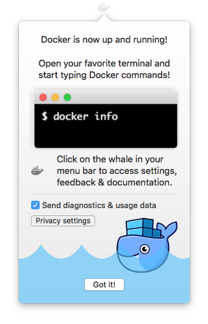
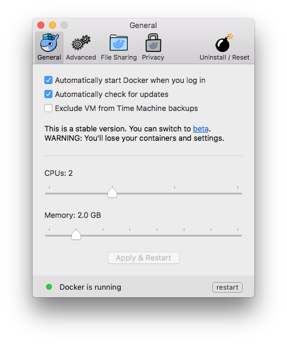
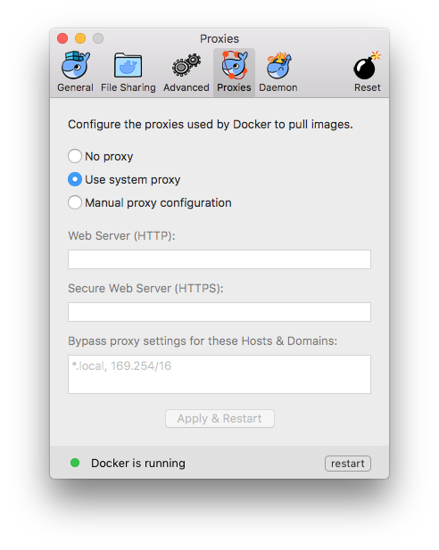
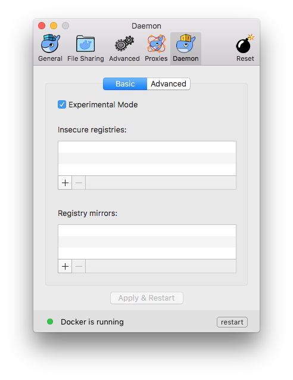
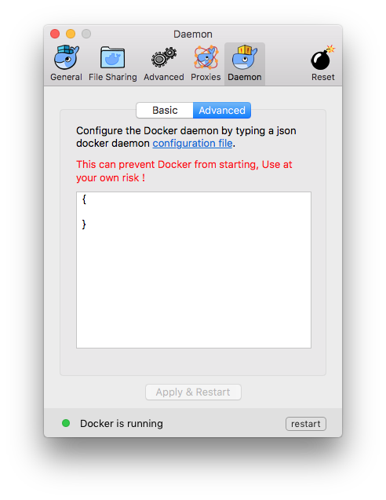
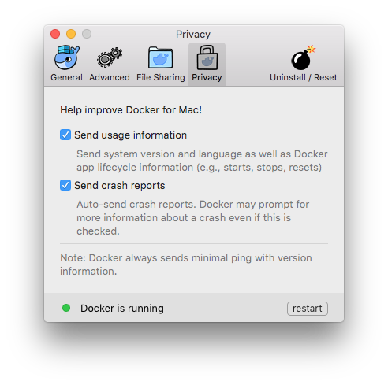
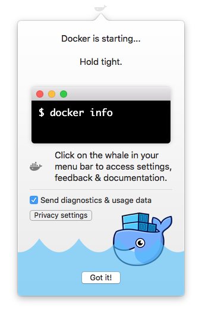

Welcome to Docker for Mac!

Docker is a full development platform for creating containerized apps, and
Docker for Mac is the best way to get started with Docker on a Mac.

>**Already have Docker for Mac?** If you already have Docker for Mac installed, and are ready to get started, skip down to [Step 2. Check versions of Docker
Engine, Compose, and
Machine](#step-2-check-versions-of-docker-engine-compose-and-machine) to work
through the rest of the Docker for Mac tour, or jump over to the standard
[Getting Started with Docker](/engine/getstarted/index.md) tutorial.

## Download Docker for Mac

If you have not already done so, please install Docker for Mac. You can download
installers from the stable or beta channel. For more about stable and beta
channels, see the [FAQs](faqs.md#stable-and-beta-channels).

<table style="width:100%">
  <tr>
    <th style="font-size: x-large; font-family: arial">Stable channel</th>
    <th style="font-size: x-large; font-family: arial">Beta channel</th>
  </tr>
  <tr valign="top">
    <td width="50%">This installer is fully baked and tested, and comes with the latest GA version of Docker Engine. <br><br>This is the best channel to use if you want a reliable platform to work with. <br><br>These releases follow a version schedule with a longer lead time than the betas, synched with Docker Engine releases and hotfixes.<br><br>On the stable channel, you can select whether to send usage statistics and other data.
    </td>
    <td width="50%">This installer offers cutting edge features and comes with the experimental version of Docker Engine, described in the <a href="https://github.com/docker/docker/tree/master/experimental">Docker Experimental Features README</a> on GitHub.<br><br>This is the best channel to use if you want to experiment with features under development, and can weather some instability and bugs. This channel is a continuation of the beta program, where you can provide feedback as the apps evolve. Releases are typically more frequent than for stable, often one or more per month. <br><br>We collect usage data on betas across the board.</td>
  </tr>
  <tr valign="top">
  <td width="50%">
  <a class="button darkblue-btn" href="https://download.docker.com/mac/stable/Docker.dmg">Get Docker for Mac (stable)</a><br><br>
  <a href="https://download.docker.com/mac/stable/Docker.dmg.sha256sum"><font color="#BDBDBD" size="-1">Download checksum: Docker.dmg SHA256</font></a>
  </td>
  <td width="50%">
  <a class="button darkblue-btn" href="https://download.docker.com/mac/beta/Docker.dmg">Get Docker for Mac (beta)</a><br><br>
  <a href="https://download.docker.com/mac/beta/Docker.dmg.sha256sum"><font color="#BDBDBD" size="-1">Download checksum: Docker.dmg SHA256</font></a>
  </td>
  </tr>
</table>

>**Important Notes**:
>
>- Docker for Mac requires OS X El Capitan 10.11 or newer macOS release running on a 2010 or
>    newer Mac, with Intel's  hardware support for MMU virtualization. The app will run on 10.10.3 Yosemite, but with limited support. Please see
>    [What to know before you install](index.md#what-to-know-before-you-install)
>    for a full explanation and list of prerequisites.
>
>- You can switch between beta and stable versions, but you must have only one
>    app installed at a time. Also, you will need to save images and export
>    containers you want to keep before uninstalling the current version before
>    installing another. For more about this, see the
>    [FAQs about beta and stable channels](faqs.md#stable-and-beta-channels).

##  What to know before you install

* **README FIRST for Docker Toolbox and Docker Machine users**: If you are already running Docker on your machine, first read [Docker for Mac vs. Docker Toolbox](docker-toolbox.md) to understand the impact of this installation on your existing setup, how to set your environment for Docker for Mac, and how the two products can coexist.
<p />
*  **Relationship to Docker Machine**: Installing Docker for Mac does not affect machines you created with Docker Machine. You'll get the option to copy containers and images from your local `default` machine (if one exists) to the new Docker for Mac <a href="https://github.com/docker/HyperKit/" target="_blank">HyperKit</a> VM. When you are running Docker for Mac, you do not need Docker Machine nodes running at all locally (or anywhere else). With Docker for Mac, you have a new, native virtualization system running (HyperKit) which takes the place of the VirtualBox system. To learn more, see [Docker for Mac vs. Docker Toolbox](docker-toolbox.md).
<p />
* **System Requirements**: Docker for Mac will launch only if all of these requirements are met.

	- Mac must be a 2010 or newer model, with Intel's hardware support for memory management unit (MMU) virtualization; i.e., Extended Page Tables (EPT) and Unrestricted Mode.

  - OS X El Capitan 10.11 and newer macOS releases are supported. At a minimum, Docker for Mac requires macOS Yosemite 10.10.3 or newer, with the caveat that going forward 10.10.x is a use-at-your-own risk proposition.

  - Starting with Docker for Mac stable release 1.13 (upcoming), and concurrent Beta releases, we will no longer address issues specific to OS X Yosemite 10.10. In future releases, Docker for Mac could stop working on OS X Yosemite 10.10 due to the deprecated status of this OS X version. We recommend upgrading to the latest version of macOS.

  - At least 4GB of RAM

  - VirtualBox prior to version 4.3.30 must NOT be installed (it is incompatible with Docker for Mac)

  >**Note**: If your system does not satisfy these requirements, you can install [Docker Toolbox](/toolbox/overview.md), which uses Oracle Virtual Box instead of HyperKit.

<p />
* **What the install includes**: The installation provides [Docker Engine](/engine/userguide/intro/), Docker CLI client, [Docker Compose](/compose/overview/), and [Docker Machine](/machine/overview/).

## Step 1. Install and Run Docker for Mac

1. Double-click `Docker.dmg` to open the installer, then drag Moby the whale to the Applications folder.

	

	You will be asked to authorize `Docker.app` with your system password during the install process. Privileged access is needed to install  networking components and links to the Docker apps.

2. Double-click `Docker.app` to start Docker.

	

	The whale in the top status bar indicates that Docker is running, and accessible from a terminal.

	

	If you just installed the app, you also get a success message with suggested next steps and a link to this documentation. Click the whale () in the status bar to dismiss this popup.

	

3. Click the whale () to get Preferences, and other options.

	

4. Select **About Docker** to verify that you have the latest version.

	Congratulations! You are up and running with Docker for Mac.

## Step 2. Check versions of Docker Engine, Compose, and Machine

Run these commands to test if your versions of `docker`, `docker-compose`, and `docker-machine` are up-to-date and compatible with `Docker.app`.

```shell
$ docker --version
Docker version 1.13.0-rc3, build 4d92237

$ docker-compose --version
docker-compose version 1.9.0, build 2585387

$ docker-machine --version
docker-machine version 0.9.0-rc2, build 7b19591
```

>**Note**: The above is an example. Your output will differ if you are running different (e.g., newer) versions.

## Step 3. Explore the application and run examples

1. Open a command-line terminal, and run some Docker commands to verify that Docker is working as expected.

	Some good commands to try are `docker version` to check that you have the latest release installed, and `docker ps` and `docker run hello-world` to verify that Docker is running.

2.  For something more adventurous, start a Dockerized web server.

    ```
    docker run -d -p 80:80 --name webserver nginx
    ```

    If the image is not found locally, Docker will pull it from Docker Hub.

    In a web browser, go to `http://localhost/` to bring up the home page. (Since you specified the default HTTP port, it isn't necessary to append `:80` at the end of the URL.)

    

    >**Note:** Early beta releases used `docker` as the hostname to build the URL.  Now, ports are exposed on the private IP addresses of the VM and   forwarded to `localhost` with no other host name set. See also, [Release Notes](release-notes.md) for Beta 9.

3. Run `docker ps` while your web server is running to see details on the webserver container.

			CONTAINER ID        IMAGE                COMMAND                  CREATED              STATUS              PORTS                              NAMES
			56f433965490        nginx                "nginx -g 'daemon off"   About a minute ago   Up About a minute   0.0.0.0:80->80/tcp, 443/tcp   webserver

4. Stop or remove containers and images.

    The `nginx` webserver will continue to run in the container on that port
    until you stop and/or remove the container. If you want to stop the
    webserver, type: `docker stop webserver` and start it again with `docker
    start webserver`. A stopped container will not show up with `docker ps`; for
    that, you need to run `docker ps -a`.

    To stop and remove the running container with a single command, type:
    `docker rm -f webserver`. This will remove the container, but not the
    `nginx` image. You can list local images with `docker images`. You might
    want to keep some images around so that you don't have to pull them again
    from Docker Hub. To remove an image you no longer need, use `docker rmi` followed by an image ID or image name. For example, `docker rmi nginx`.

**Want more example applications?** - For more example walkthroughs that include setting up  services and databases in Docker Compose, see [Example Applications](examples.md).

## Preferences

Choose  --> **Preferences** from the menu bar. You
can set the following runtime options.

### General



#### Auto-start, update, and backups

* Docker for Mac is set to **automatically start** when you log in. Uncheck the login autostart option if you don't want Docker to start when you open your
session.

* Docker for Mac is set to **check for updates** automatically and notify you when an update is available. If an update is found, click **OK** to accept and
install it (or cancel to keep the current version). If you disable the check for
updates, you can still find out about updates manually by choosing  -> **Check for Updates**

* Check **Exclude VM from Time Machine backups** to prevent Time Machine from backing up the Docker for Mac virtual machine.

  >**Tip: Beta dialogs** &mdash;  Starting with Beta 31, an option to auto-send
  usage data is also on the General dialog. In Stable releases, the option is
  still on the Privacy tab. For now, both Stable and Beta users can read more
  about usage data settings in the [Privacy](#Privacy) topic.

#### CPUs

By default, Docker for Mac is set to use 2 processors. You can increase
processing power for the app by setting this to a higher number, or lower it to
have Docker for Mac use fewer computing resources.

#### Memory

By default, Docker for Mac is set to use `2` GB runtime memory, allocated from
the total available memory on your Mac. You can increase the RAM on the app to
get faster performance by setting this number higher (for example to `3`) or
lower (to `1`) if you want Docker for Mac to use less memory.

>**Tip: Beta dialogs** &mdash; Starting with Beta 31, **CPUs** and **Memory** settings
are on the Advanced dialog. Starting with Beta 33, you can specify the **storage location** of the Linux volume; i.e., where containers and images are stored. These settings are shown below.
>
>

### Advanced


#### Custom registries

As an alternative to using [Docker Hub](https://hub.docker.com/) to store your
public or private images or [Docker Trusted
Registry](/datacenter/dtr/2.1/guides/index.md), you can use Docker to set up your
own insecure [registry](/registry/introduction/). Add URLs for insecure
registries and registry mirrors on which to host your images. (See also, [How do
I add custom CA certificates?](faqs.md#how-do-i-add-custom-ca-certificates) in
the FAQs.)

>**Tip: Beta dialogs** &mdash;  Starting with Beta 31, options to set up your
own registries are available as part of a new daemon tab. See [Docker
daemon](#docker-daemon-beta-feature)).

#### HTTP proxy settings

Docker for Mac will detect HTTP/HTTPS Proxy Settings and automatically propagate
these to Docker and to your containers. For example, if you set your proxy
settings to `http://proxy.example.com`, Docker will use this proxy when pulling
containers.

>**Tip: Beta dialogs** &mdash;  Starting with Beta 31, HTTP proxy settings are provided on a dedicated dialog, as shown below.
>
>

### Docker Daemon (Beta feature)

Starting with Beta 31, configuration options on the Docker daemon move to their
own **Daemon** tab, including basic and advanced options.

#### Daemon Basic (experimental mode and registries)

By default, Docker for Mac Beta releases use the experimental version of Docker
Engine, described in the [Docker Experimental Features README](https://github.com/docker/docker/tree/master/experimental) on GitHub. Starting with
Beta 31, you can toggle **experimental mode** on and off. If you toggle it off,
Docker for Mac Beta uses the current generally available release of Docker
Engine, the same as Stable Docker for Mac versions uses.

You can check whether you are running experimental mode or not by typing `docker
version` on the command line. Experimental mode is listed under `Server` data.
If `Experimental` is `true`, then Docker is running in experimental mode, as
shown here. (If `false`, Experimental mode is off.)

```bash
$ docker version
Client:
 Version:      1.13.0-rc3
 API version:  1.25
 Go version:   go1.7.3
 Git commit:   4d92237
 Built:        Tue Dec  6 01:15:44 2016
 OS/Arch:      darwin/amd64

Server:
 Version:      1.13.0-rc3
 API version:  1.25 (minimum version 1.12)
 Go version:   go1.7.3
 Git commit:   4d92237
 Built:        Tue Dec  6 01:15:44 2016
 OS/Arch:      linux/amd64
 Experimental: true
```

You can use Docker to set up your own
[registries](/registry/introduction/). For details on this, see [Custom
Registries](#custom-registries).



#### Daemon Advanced (JSON configuration file)

On the **Daemon -> Advanced dialog**, you can directly configure the daemon from
the JSON file, and determine entirely how your containers will run. For a full
list of options on the Docker daemon, see <a
href="/engine/reference/commandline/dockerd/"
target="_blank">daemon</a> in the Docker Engine command line reference.

After editing the daemon configuration , click **Apply & Restart** to save it
and reboot Docker. Or, to cancel changes, click another preference tab, then
choose to discard or not apply changes when asked.



### File sharing

You can decide which directories on your Mac to share with containers.

* **Add a Directory** - Click `+` and navigate to the directory you want to add.

	

* Click **Apply & Restart** to make the directory available to
  containers using Docker's bind mount (`-v`) feature.

There are some limitations on the directories that can be shared:

* They cannot be a subdirectory of an already shared directory.

* They cannot already exist inside of Docker.

See [Namespaces](osxfs.md#namespaces) in the topic on [osxfs file system sharing](osxfs.md) for more information.

>**Tip:** File sharing is required for volume mounting if the project lives
outside of the `/Users` directory. In that case, share the drive where the
Dockerfile and volume are located. Otherwise, you will get file not found or
cannot start service errors at runtime. (See also [Volume mounting requires file sharing for any project directories outside of `/Users`](troubleshoot.md#volume-mounting-requires-file-sharing-for-any-project-directories-outside-of-users).)

### Privacy

You can set Docker for Mac to auto-send diagnostics, crash reports, and usage data. This information can help Docker improve the application and get more context for troubleshooting problems.

Uncheck any of the options to opt out and prevent auto-send of data. Docker may prompt for more information in some cases, even with auto-send enabled.



>**Tip: Beta dialogs** &mdash;  Starting with Beta 31, options to enable or disable auto-send of usage data are on the [General](#general) dialog.

Also, you can enable or disable these auto-reporting settings with one click on the information popup when you first start Docker.



## Uninstall or reset
Choose  --> **Preferences** from the menu bar, then click **Uninstall / Reset** on the Preferences dialog.


* **Uninstall** - Choose this option to remove Docker for Mac from your system.

* **Reset to factory defaults** - Choose this option to reset all options on Docker for Mac to its initial state, the same as when it was first installed.

You can uninstall Docker for Mac from the command line with this command: `<DockerforMacPath> --uninstall`. If Docker is installed in the default location, the following command will provide a clean uninstall.

```shell
$ /Applications/Docker.app/Contents/MacOS/Docker --uninstall
Docker is running, exiting...
Docker uninstalled successfully. You can move the Docker application to the trash.
```

You might want to use the command-line uninstall if, for example, you find that the app is non-functional, and you cannot uninstall it from the menu.

## Installing bash completion

If you are using [bash completion](https://www.debian-administration.org/article/316/An_introduction_to_bash_completion_part_1), such as [homebrew bash-completion on Mac](http://davidalger.com/development/bash-completion-on-os-x-with-brew/), bash completion scripts for
- docker
- docker-machine
- docker-compose
may be found inside Docker.app, in the Contents/Resources/etc folder.

To activate bash completion, these files need to be copied or symlinked to
your bash_completion.d directory. For example, if you use <a href="http://brew.sh/" target="_blank">Homebrew</a>:

```
ln -s /Applications/Docker.app/Contents/Resources/etc/docker.bash-completion /usr/local/etc/bash_completion.d/docker
ln -s /Applications/Docker.app/Contents/Resources/etc/docker-machine.bash-completion /usr/local/etc/bash_completion.d/docker-machine
ln -s /Applications/Docker.app/Contents/Resources/etc/docker-compose.bash-completion /usr/local/etc/bash_completion.d/docker-compose
```

## Giving feedback and getting help

To get help from the community, review current user topics, join or start a
discussion, log on to our [Docker for Mac
forum](https://forums.docker.com/c/docker-for-mac).

To report bugs or problems, log on to [Docker for Mac issues on
GitHub](https://github.com/docker/for-mac/issues), where you can review
community reported issues, and file new ones. See [Diagnose problems, send
feedback, and create GitHub
issues](troubleshoot.md#diagnose-problems-send-feedback-and-create-github-issues).
As a part of reporting issues on GitHub, we can help you troubleshoot the log
data.

To give us feedback on the documentation or update it yourself, use the Feedback
options at the bottom of each docs page.

## Where to go next

* Try out the [Getting Started with Docker](/engine/getstarted/index.md) tutorial.

* Dig in deeper with [learn by example](/engine/tutorials/index.md) tutorials on
  building images, running containers, networking, managing data, and storing
  images on Docker Hub.

* See [Example Applications](examples.md) for example applications that include setting up services and databases in Docker Compose.

* Interested in trying out the new [swarm mode](/engine/swarm/index.md) on Docker Engine v1.12?

    See [Get started with swarm mode](/engine/swarm/swarm-tutorial/index.md), a tutorial which includes specifics on how to leverage your Docker for Mac installation to run single and multi-node swarms.

    Also, try out the Swarm examples in [docker labs](https://github.com/docker/labs/tree/master/swarm-mode/beginner-tutorial). Run the `bash script` and follow the accompanying [Docker Swarm Tutorial](https://github.com/docker/labs/blob/master/swarm-mode/beginner-tutorial/README.md). The script uses Docker Machine to create a multi-node swarm, then walks you through various Swarm tasks and commands.

* For a summary of Docker command line interface (CLI) commands, see [Docker CLI Reference Guide](/engine/reference/index.md).

* Check out the <a href="https://blog.docker.com/2016/06/docker-mac-windows-public-beta/">blog posts</a> on Docker for Mac and Docker for Windows public betas, and <a href="https://blog.docker.com/2016/03/docker-for-mac-windows-beta/">earlier posts</a> on the initial private beta.

* Please give feedback on your experience with the app and report bugs and problems by logging into our [Docker for Mac forum](https://forums.docker.com/c/docker-for-mac).
