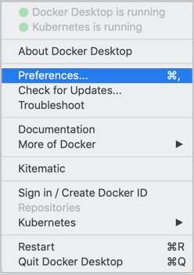
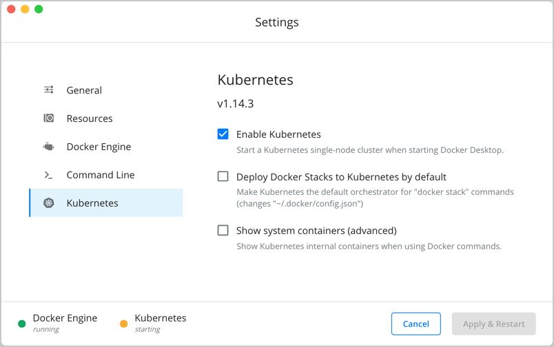
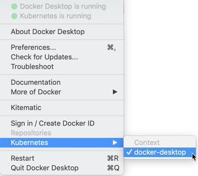

Welcome to Docker Desktop!

The _Docker Desktop for Mac_ section contains information about the Docker Desktop Community Stable release. For information about features available in Edge releases, see the [Edge release notes](edge-release-notes/). For information about Docker Desktop Enterprise (DDE) releases, see [Docker Desktop Enterprise](/desktop/enterprise/).

Docker is a full development platform to build, run, and share containerized applications. Docker Desktop is the best way to get started with Docker on Mac.

See [Install Docker Desktop](install.md){: target="_blank" class="_"} for download information, system requirements, and installation instructions.

## Check versions

Ensure your versions of `docker` and `docker-compose` are
up-to-date and compatible with `Docker.app`. Your output may differ if you are
running different versions.

```shell
$ docker --version
Docker version {{ site.docker_ce_version }}, build c97c6d6
```

## Explore the application

1.  Open a command-line terminal and test that your installation works by
    running the simple Docker image,
    [hello-world](https://hub.docker.com/_/hello-world/){: target="_blank"
    class="_"}:

    ```shell
    $ docker run hello-world

    Unable to find image 'hello-world:latest' locally
    latest: Pulling from library/hello-world
    ca4f61b1923c: Pull complete
    Digest: sha256:ca0eeb6fb05351dfc8759c20733c91def84cb8007aa89a5bf606bc8b315b9fc7
    Status: Downloaded newer image for hello-world:latest

    Hello from Docker!
    This message shows that your installation appears to be working correctly.
    ...
    ```

2.  Start a Dockerized web server. Like the `hello-world` image above, if the
    image is not found locally, Docker pulls it from Docker Hub.

    ```bash
    $ docker run --detach --publish=80:80 --name=webserver nginx
    ```

3.  In a web browser, go to `http://localhost/` to view the nginx homepage.
    Because we specified the default HTTP port, it isn't necessary to append
    `:80` at the end of the URL.

    {:width="500px"}

    > Early beta releases used `docker` as the hostname to build the URL. Now,
    > ports are exposed on the private IP addresses of the VM and forwarded to
    > `localhost` with no other host name set.

4.  View the details on the container while your web server is running (with
    `docker container ls` or `docker ps`):

    ```none
    $ docker container ls
    CONTAINER ID   IMAGE   COMMAND                  CREATED              STATUS              PORTS                         NAMES
    56f433965490   nginx   "nginx -g 'daemon off"   About a minute ago   Up About a minute   0.0.0.0:80->80/tcp, 443/tcp   webserver
    ```

5.  Stop and remove containers and images with the following commands. Use the
    "all" flag (`--all` or `-a`) to view stopped containers.

    ```shell
    $ docker container ls
    $ docker container stop webserver
    $ docker container ls -a
    $ docker container rm webserver
    $ docker image ls
    $ docker image rm nginx
    ```

## Preferences

Choose the Docker menu {: .inline} > **Preferences** from the
menu bar and configure the runtime options described below.

{:width="250px"}

### General

{:width="750px"}

On the **General** tab, you can configure when to start and update Docker:

- **Start Docker Desktop when you log in**: Automatically starts Docker Desktop when you open your session.

- **Automatically check for updates**: By default, Docker Desktop automatically checks for updates and notifies you when an update is available. You can manually check for updates anytime by choosing **Check for Updates** from the main Docker menu.

- **Include VM in Time Machine backups**: Select this option to back up the Docker Desktop virtual machine. This option is disabled by default.

- **Securely store Docker logins in macOS keychain**: Docker Desktop stores your Docker login credentials in macOS keychain by default.

- **Send usage statistics**: Docker Desktop sends diagnostics, crash reports, and usage data. This information helps Docker improve and troubleshoot the application. Clear the check box to opt out.

  Click **Switch to the Edge version** to learn more about Docker Desktop Edge releases.

### Resources

The **Resources** tab allows you to configure CPU, memory, disk, proxies, network, and other resources.

#### Advanced

On the Advanced tab, you can limit resources available to Docker.

{:width="750px"}

Advanced settings are:

**CPUs**: By default, Docker Desktop is set to use half the number of processors
available on the host machine. To increase processing power, set this to a
higher number; to decrease, lower the number.

**Memory**: By default, Docker Desktop is set to use `2` GB runtime memory,
allocated from the total available memory on your Mac. To increase the RAM, set this to a higher number. To decrease it, lower the number.

**Swap**: Configure swap file size as needed. The default is 1 GB.

**Disk image size**: Specify the size of the disk image.

**Disk image location**: Specify the location of the Linux volume where containers and images are stored.

You can also move the disk image to a different location. If you attempt to move a disk image to a location that already has one, you get a prompt asking if you want to use the existing image or replace it.

#### File sharing

Use File sharing to allow local directories on the Mac to be shared with Linux containers.
This is especially useful for
editing source code in an IDE on the host while running and testing the code in a container.
By default the `/Users`, `/Volume`, `/private`, `/tmp` and `/var/folders` directory are shared. If your project is outside this directory then it must be added
to the list. Otherwise you may get `Mounts denied` or `cannot start service` errors at runtime.

File share settings are:

- **Add a Directory**: Click `+` and navigate to the directory you want to add.

- **Apply & Restart** makes the directory available to containers using Docker's
  bind mount (`-v`) feature.

  There are some limitations on the directories that can be shared:

  - The directory must not exist inside of Docker.

For more information, see:

- [Namespaces](osxfs.md#namespaces){: target="_blank" class="_"} in the topic on
  [osxfs file system sharing](osxfs.md).
- [Volume mounting requires file sharing for any project directories outside of `/Users`](troubleshoot.md#volume-mounting-requires-file-sharing-for-any-project-directories-outside-of-users).)

#### Proxies

Docker Desktop detects HTTP/HTTPS Proxy Settings from macOS and automatically
propagates these to Docker. For example, if you set your
proxy settings to `http://proxy.example.com`, Docker uses this proxy when
pulling containers.

Your proxy settings, however, will not be propagated into the containers you start.
If you wish to set the proxy settings for your containers, you need to define
environment variables for them, just like you would do on Linux, for example:

```
$ docker run -e HTTP_PROXY=http://proxy.example.com:3128 alpine env

PATH=/usr/local/sbin:/usr/local/bin:/usr/sbin:/usr/bin:/sbin:/bin
HOSTNAME=b7edf988b2b5
TERM=xterm
HOME=/root
HTTP_PROXY=http://proxy.example.com:3128
```

For more information on setting environment variables for running containers,
see [Set environment variables](/engine/reference/commandline/run/#set-environment-variables--e---env---env-file).

#### Network

You can configure Docker Desktop networking to work on a virtual private network (VPN). Specify a network address translation (NAT) prefix and subnet mask to enable Internet connectivity.

### Docker Engine

The Docker Engine page allows you to configure the Docker daemon to determine how your containers run.

Type a JSON configuration file in the box to configure the daemon settings. For a full list of options, see the Docker Engine
[dockerd commandline reference](/engine/reference/commandline/dockerd/){:target="_blank"
class="_"}.

Click **Apply & Restart** to save your settings and restart Docker Desktop.

### Command Line

On the Command Line page, you can specify whether or not to enable experimental features.



On both Docker Desktop Edge and Stable releases, you can toggle the experimental features on and off. If you toggle the experimental features off, Docker Desktop uses the current generally available release of Docker Engine.

You can see whether you are running experimental mode at the command line. If
`Experimental` is `true`, then Docker is running in experimental mode, as shown
here. (If `false`, Experimental mode is off.)

```bash
> docker version

Client: Docker Engine - Community
 Version:           19.03.1
 API version:       1.40
 Go version:        go1.12.5
 Git commit:        74b1e89
 Built:             Thu Jul 25 21:18:17 2019
 OS/Arch:           darwin/amd64
 Experimental:      true

Server: Docker Engine - Community
 Engine:
  Version:          19.03.1
  API version:      1.40 (minimum version 1.12)
  Go version:       go1.12.5
  Git commit:       74b1e89
  Built:            Thu Jul 25 21:17:52 2019
  OS/Arch:          linux/amd64
  Experimental:     true
 containerd:
  Version:          v1.2.6
  GitCommit:        894b81a4b802e4eb2a91d1ce216b8817763c29fb
 runc:
  Version:          1.0.0-rc8
  GitCommit:        425e105d5a03fabd737a126ad93d62a9eeede87f
 docker-init:
  Version:          0.18.0
  GitCommit:        fec3683
```

### Kubernetes

Docker Desktop includes a standalone Kubernetes server that runs on your Mac, so
that you can test deploying your Docker workloads on Kubernetes.

The Kubernetes client command, `kubectl`, is included and configured to connect
to the local Kubernetes server. If you have `kubectl` already installed and
pointing to some other environment, such as `minikube` or a GKE cluster, be sure
to change context so that `kubectl` is pointing to `docker-desktop`:

```bash
$ kubectl config get-contexts
$ kubectl config use-context docker-desktop
```

If you installed `kubectl` with Homebrew, or by some other method, and
experience conflicts, remove `/usr/local/bin/kubectl`.

- To enable Kubernetes support and install a standalone instance of Kubernetes
  running as a Docker container, select **Enable Kubernetes**. To set Kubernetes as the
  [default orchestrator](kubernetes.md#override-the-default-orchestrator), select **Deploy Docker Stacks to Kubernetes by default**.

   Click **Apply & Restart** to save the settings. This instantiates images required to run the Kubernetes server as containers, and installs the
  `/usr/local/bin/kubectl` command on your Mac.

  {:width="750px"}

  When Kubernetes is enabled and running, an additional status bar item displays
  at the bottom right of the Docker Desktop Settings dialog.

  The status of Kubernetes shows in the Docker menu and the context points to
  `docker-desktop`.

  {: .with-border
  width="400px"}

- By default, Kubernetes containers are hidden from commands like `docker
  service ls`, because managing them manually is not supported. To make them
  visible, select **Show system containers (advanced)** and click **Apply and
  Restart**. Most users do not need this option.

- To disable Kubernetes support at any time, clear the **Enable Kubernetes** check box. The
  Kubernetes containers are stopped and removed, and the
  `/usr/local/bin/kubectl` command is removed.

  For more about using the Kubernetes integration with Docker Desktop, see
  [Deploy on Kubernetes](kubernetes.md){:target="_blank" class="_"}.

### Reset

> Reset and Restart options
>
> On Docker Desktop Mac, the **Restart Docker Desktop**, **Reset to factory defaults**, and other reset options are available from the **Troubleshoot** menu.

For information about the reset options, see [Logs and Troubleshooting](troubleshoot.md).

## Dashboard

The Docker Desktop Dashboard enables you to interact with containers and applications and manage the lifecycle of your applications directly from your machine. The Dashboard UI shows all running, stopped, and started containers with their state. It provides an intuitive interface to perform common actions to inspect and manage containers and existing Docker Compose applications. For more information, see [Docker Desktop Dashboard](../desktop/dashboard.md).

## Add TLS certificates

You can add trusted Certificate Authorities (CAs) (used to verify registry
server certificates) and client certificates (used to authenticate to
registries) to your Docker daemon.

### Add custom CA certificates (server side)

All trusted CAs (root or intermediate) are supported. Docker Desktop creates a
certificate bundle of all user-trusted CAs based on the Mac Keychain, and
appends it to Moby trusted certificates. So if an enterprise SSL certificate is
trusted by the user on the host, it is trusted by Docker Desktop.

To manually add a custom, self-signed certificate, start by adding the
certificate to the macOS keychain, which is picked up by Docker Desktop. Here is
an example:

```bash
$ sudo security add-trusted-cert -d -r trustRoot -k /Library/Keychains/System.keychain ca.crt
```

Or, if you prefer to add the certificate to your own local keychain only (rather
than for all users), run this command instead:

```
$ security add-trusted-cert -d -r trustRoot -k ~/Library/Keychains/login.keychain ca.crt
```

See also, [Directory structures for
certificates](#directory-structures-for-certificates).

> **Note**: You need to restart Docker Desktop after making any changes to the
> keychain or to the `~/.docker/certs.d` directory in order for the changes to
> take effect.

For a complete explanation of how to do this, see the blog post [Adding
Self-signed Registry Certs to Docker & Docker Desktop for
Mac](http://container-solutions.com/adding-self-signed-registry-certs-docker-mac/){:target="_blank"
class="_"}.

### Add client certificates

You can put your client certificates in
`~/.docker/certs.d/<MyRegistry>:<Port>/client.cert` and
`~/.docker/certs.d/<MyRegistry>:<Port>/client.key`.

When the Docker Desktop application starts, it copies the `~/.docker/certs.d`
folder on your Mac to the `/etc/docker/certs.d` directory on Moby (the Docker
Desktop `xhyve` virtual machine).

> * You need to restart Docker Desktop after making any changes to the keychain
>   or to the `~/.docker/certs.d` directory in order for the changes to take
>   effect.
>
> * The registry cannot be listed as an _insecure registry_ (see [Docker
>   Engine](#docker-engine). Docker Desktop ignores certificates listed
>   under insecure registries, and does not send client certificates. Commands
>   like `docker run` that attempt to pull from the registry produce error
>   messages on the command line, as well as on the registry.

### Directory structures for certificates

If you have this directory structure, you do not need to manually add the CA
certificate to your Mac OS system login:

```
/Users/<user>/.docker/certs.d/
└── <MyRegistry>:<Port>
   ├── ca.crt
   ├── client.cert
   └── client.key
```

The following further illustrates and explains a configuration with custom
certificates:

```
/etc/docker/certs.d/        <-- Certificate directory
└── localhost:5000          <-- Hostname:port
   ├── client.cert          <-- Client certificate
   ├── client.key           <-- Client key
   └── ca.crt               <-- Certificate authority that signed
                                the registry certificate
```

You can also have this directory structure, as long as the CA certificate is
also in your keychain.

```
/Users/<user>/.docker/certs.d/
└── <MyRegistry>:<Port>
    ├── client.cert
    └── client.key
```

To learn more about how to install a CA root certificate for the registry and
how to set the client TLS certificate for verification, see
[Verify repository client with certificates](../engine/security/certificates.md)
in the Docker Engine topics.

## Install shell completion

Docker Desktop comes with scripts to enable completion for the `docker` and `docker-compose` commands. The completion scripts may be
found inside `Docker.app`, in the `Contents/Resources/etc/` directory and can be
installed both in Bash and Zsh.

### Bash

Bash has [built-in support for
completion](https://www.debian-administration.org/article/316/An_introduction_to_bash_completion_part_1){:target="_blank"
class="_"} To activate completion for Docker commands, these files need to be
copied or symlinked to your `bash_completion.d/` directory. For example, if you
installed bash via [Homebrew](http://brew.sh/):

```bash
etc=/Applications/Docker.app/Contents/Resources/etc
ln -s $etc/docker.bash-completion $(brew --prefix)/etc/bash_completion.d/docker
ln -s $etc/docker-compose.bash-completion $(brew --prefix)/etc/bash_completion.d/docker-compose
```

Add the following to your `~/.bash_profile`:

```shell
[ -f /usr/local/etc/bash_completion ] && . /usr/local/etc/bash_completion
```

OR

```shell
if [ -f $(brew --prefix)/etc/bash_completion ]; then
. $(brew --prefix)/etc/bash_completion
fi
```

### Zsh

In Zsh, the [completion
system](http://zsh.sourceforge.net/Doc/Release/Completion-System.html){:target="_blank"
class="_"} takes care of things. To activate completion for Docker commands,
these files need to be copied or symlinked to your Zsh `site-functions/`
directory. For example, if you installed Zsh via [Homebrew](http://brew.sh/):

```bash
etc=/Applications/Docker.app/Contents/Resources/etc
ln -s $etc/docker.zsh-completion /usr/local/share/zsh/site-functions/_docker
ln -s $etc/docker-compose.zsh-completion /usr/local/share/zsh/site-functions/_docker-compose
```

### Fish-Shell

Fish-shell also supports tab completion [completion
system](https://fishshell.com/docs/current/#tab-completion){:target="_blank"
class="_"}. To activate completion for Docker commands,
these files need to be copied or symlinked to your Fish-shell `completions/`
directory.

Create the `completions` directory:

```bash
mkdir -p ~/.config/fish/completions
```

Now add fish completions from docker.

```bash
ln -shi /Applications/Docker.app/Contents/Resources/etc/docker.fish-completion ~/.config/fish/completions/docker.fish
ln -shi /Applications/Docker.app/Contents/Resources/etc/docker-compose.fish-completion ~/.config/fish/completions/docker-compose.fish
```

## Give feedback and get help

To get help from the community, review current user topics, join or start a
discussion, log on to our [Docker Desktop for Mac
forum](https://forums.docker.com/c/docker-for-mac){:target="_blank" class="_"}.

To report bugs or problems, log on to Docker Desktop [for Mac issues on
GitHub](https://github.com/docker/for-mac/issues){:target="_blank" class="_"},
where you can review community reported issues, and file new ones.  See
[Logs and Troubleshooting](troubleshoot.md) for more details.

For information about providing feedback on the documentation or update it yourself, see [Contribute to documentation](/opensource/).

## Docker Hub

Select **Sign in /Create Docker ID** from the Docker Desktop menu to access your [Docker Hub](https://hub.docker.com/){: target="_blank" class="_" } account. Once logged in, you can access your Docker Hub repositories and organizations directly from the Docker Desktop menu.

For more information, refer to the following [Docker Hub topics](../docker-hub/index.md){:target="_blank"
class="_"}:

* [Organizations and Teams in Docker Hub](../docker-hub/orgs.md){:target="_blank" class="_"}
* [Builds](../docker-hub/builds/index.md){:target="_blank" class="_"}

### Two-factor authentication

Docker Desktop enables you to sign into Docker Hub using two-factor authentication. Two-factor authentication provides an extra layer of security when accessing your Docker Hub account.

You must enable two-factor authentication in Docker Hub before signing into your Docker Hub account through Docker Desktop. For instructions, see [Enable two-factor authentication for Docker Hub](/docker-hub/2fa/).

After you have enabled two-factor authentication:

1. Go to the Docker Desktop menu and then select **Sign in / Create Docker ID**.

2. Enter your Docker ID and password and click **Sign in**.

3. After you have successfully signed in, Docker Desktop prompts you to enter the authentication code. Enter the six-digit code from your phone and then click **Verify**.

{:width="500px"}

After you have successfully authenticated, you can access your organizations and repositories directly from the Docker Desktop menu.

## Where to go next

* Try out the walkthrough at [Get Started](/get-started/){: target="_blank"
  class="_"}.

* Dig in deeper with [Docker Labs](https://github.com/docker/labs/) example
  walkthroughs and source code.

* For a summary of Docker command line interface (CLI) commands, see
  [Docker CLI Reference Guide](../engine/api/index.md){: target="_blank" class="_"}.

* Check out the blog post, [What’s New in Docker 17.06 Community Edition
  (CE)](https://blog.docker.com/2017/07/whats-new-docker-17-06-community-edition-ce/){:
  target="_blank" class="_"}.
