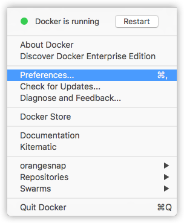
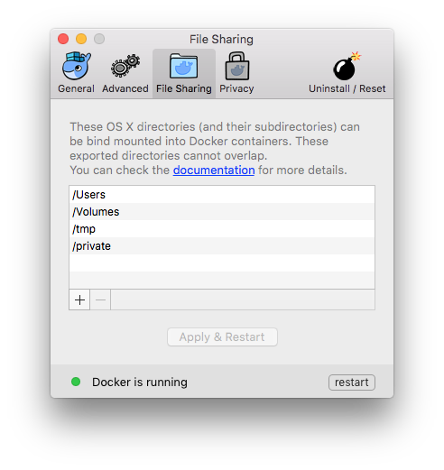
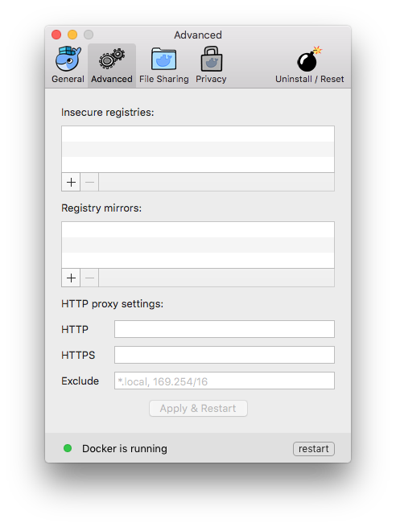
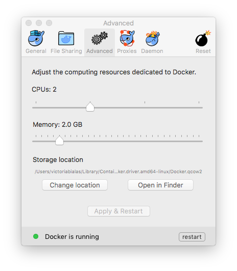
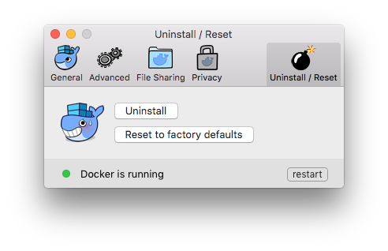
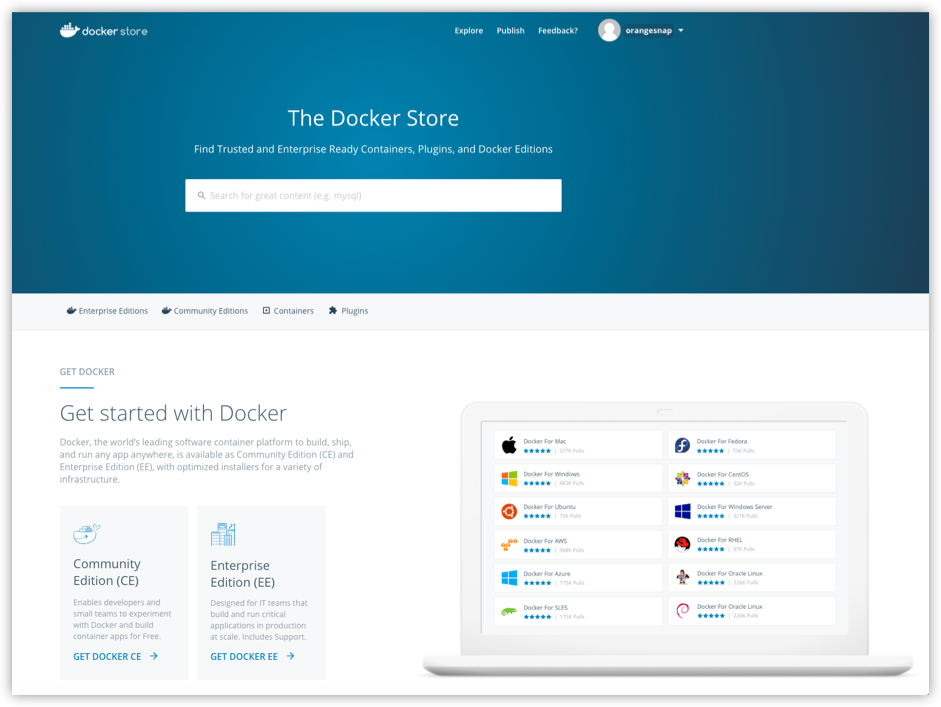

Welcome to Docker for Mac!

Docker is a full development platform for creating containerized apps, and
Docker for Mac is the best way to get started with Docker on a Mac.

> **Got Docker for Mac?** If you have not yet installed Docker for Mac, please see [Install Docker for Mac](install.md) for an explanation of stable and edge
channels, system requirements, and download/install information.

>**Looking for system requirements?** Check out
[What to know before you install](install.md#what-to-know-before-you-install), which has moved to the new install topic.
{: id="what-to-know-before-you-install" }

## Check versions of Docker Engine, Compose, and Machine

Run these commands to test if your versions of `docker`, `docker-compose`, and
`docker-machine` are up-to-date and compatible with `Docker.app`.

```shell
$ docker --version
Docker version 17.03.0-ce, build 60ccb22

$ docker-compose --version
docker-compose version 1.11.2, build dfed245

$ docker-machine --version
docker-machine version 0.10.0, build 76ed2a6
```

> **Note**: The above is an example. Your output will differ if you are running
> different (e.g., newer) versions.

## Explore the application and run examples

1.  Open a command-line terminal, and run some Docker commands to verify that
    Docker is working as expected.

	  Some good commands to try are `docker version` to check that you have the
    latest release installed, and `docker ps` and `docker run hello-world` to
    verify that Docker is running.

2.  For something more adventurous, start a Dockerized web server.

    ```bash
    docker run -d -p 80:80 --name webserver nginx
    ```

    If the image is not found locally, Docker will pull it from Docker Hub.

    In a web browser, go to `http://localhost/` to bring up the home page.
    (Since you specified the default HTTP port, it isn't necessary to append
    `:80` at the end of the URL.)

    

    > **Note**: Early beta releases used `docker` as the hostname to build the
    > URL. Now, ports are exposed on the private IP addresses of the VM and
    > forwarded to `localhost` with no other host name set. See also,
    > [Release Notes](release-notes.md) for Beta 9.

3.  Run `docker ps` while your web server is running to see details on the
    webserver container.

    ```none
		CONTAINER ID        IMAGE                COMMAND                  CREATED              STATUS              PORTS                              NAMES
		56f433965490        nginx                "nginx -g 'daemon off"   About a minute ago   Up About a minute   0.0.0.0:80->80/tcp, 443/tcp   webserver
    ```
4.  Stop or remove containers and images.

    The `nginx` webserver will continue to run in the container on that port
    until you stop and/or remove the container. If you want to stop the
    webserver, type: `docker stop webserver` and start it again with `docker
    start webserver`. A stopped container will not show up with `docker ps`; for
    that, you need to run `docker ps -a`.

    To stop and remove the running container with a single command, type:
    `docker rm -f webserver`. This will remove the container, but not the
    `nginx` image. You can list local images with `docker images`. You might
    want to keep some images around so that you don't have to pull them again
    from Docker Hub. To remove an image you no longer need, use `docker rmi` followed by an image ID or image name. For example, `docker rmi nginx`.

**Want more example applications?** [Get Started](/get-started/) and [Samples](/samples/) are great places to start.

## Preferences

Choose {: .inline} ->
**Preferences** from the menu bar.



You can set the following runtime options.

>**Note:** The above example shows a user signed in for integrated
Docker Cloud access. To learn more about the feature,
see [Docker Cloud](#docker-cloud).

### General


#### Auto-start, update, backups, usage data

* Docker for Mac is set to automatically **start Docker when you log in**.
  Uncheck this option if you don't want Docker to start when you
  open your session.

* Docker for Mac is set to **automatically check for updates**  and notify
  you when an update is available. If an update is found, click **OK** to accept
and install it (or cancel to keep the current version). If you disable the check
for updates, you can still find out about updates manually by choosing {: .inline} -> **Check for Updates**

* Check **Include VM in Time Machine backups** to back up the Docker for Mac virtual machine. (By default, this is unchecked.)

* You have the option to **Securely store Docker logins in MacOS keychain**,
  enabled by default. To "opt out" of storing your Docker login credentials,
  uncheck this option.

* **Send usage statistics** &mdash; You can set Docker for Mac to auto-send
  diagnostics, crash reports, and usage data. This information can help Docker
  improve the application and get more context for troubleshooting problems.
  Uncheck this to opt out and prevent auto-send of data. Docker may prompt for
  more information in some cases, even with auto-send enabled.

### File sharing

You can decide which directories on your Mac to share with containers.

* **Add a Directory** - Click `+` and navigate to the directory you
want to add.

	

* Click **Apply & Restart** to make the directory available to
  containers using Docker's bind mount (`-v`) feature.

  There are some limitations on the directories that can be shared:

  * They cannot be a subdirectory of an already shared directory.

  * They cannot already exist inside of Docker.

See [Namespaces](osxfs.md#namespaces) in the topic on
[osxfs file system sharing](osxfs.md) for more information.

> **Tip**: File sharing is required for volume mounting if the project lives
> outside of the `/Users` directory. In that case, share the drive where the
> Dockerfile and volume are located. Otherwise, you will get file not found or
> cannot start service errors at runtime. (See also
> [Volume mounting requires file sharing for any project directories outside of `/Users`](troubleshoot.md#volume-mounting-requires-file-sharing-for-any-project-directories-outside-of-users).)


### Advanced




#### CPUs

By default, Docker for Mac is set to use half the number of processors available on the host machine. You can increase
processing power for the app by setting this to a higher number, or lower it to
have Docker for Mac use fewer computing resources.

#### Memory

By default, Docker for Mac is set to use `2` GB runtime memory, allocated from
the total available memory on your Mac. You can increase the RAM on the app to
get faster performance by setting this number higher (for example to `3`) or
lower (to `1`) if you want Docker for Mac to use less memory.

#### Disk image location (storage)

You can specify the **Disk image location** of the Linux volume; i.e., where
containers and images are stored.

You can move the disk image location.

If you attempt to move the disk image to a location that
already has one, you will get a prompt asking if you want to use the existing
image or replace it.



### HTTP proxy settings

Docker for Mac will detect HTTP/HTTPS Proxy Settings and automatically propagate
these to Docker and to your containers. For example, if you set your proxy
settings to `http://proxy.example.com`, Docker will use this proxy when pulling
containers.


<p id="daemon-experimental-mode" />
### Docker Daemon

You can configure options on the Docker daemon that determine how your
containers will run. You can configure some **Basic** options on the daemon with
interactive settings, or switch to **Advanced** to edit the JSON directly.

The settings offered on **Basic** dialog can be
configured directly in the JSON as well. This version just surfaces
some of the common settings to make it easier to configure them.

* [Experimental mode](#experimental-mode)
* [Custom registries](#custom-registries)
* [Edit the daemon configuration file](#edit-the-daemon-configuration-file)


#### Experimental mode

Both Docker for Mac Stable and Edge releases have experimental features enabled
on Docker Engine, as described in the [Docker Experimental Features
README](https://github.com/moby/moby/blob/master/experimental/README.md) on
GitHub.

Experimental features are not appropriate for production environments or
workloads. They are meant to be sandbox experiments for new ideas. Some
experimental features may become incorporated into upcoming stable releases, but
others may be modified or pulled from subsequent Edge releases, and never
released on Stable.

On both Edge and Stable releases, you can toggle **experimental mode** on and
off. If you toggle it off, Docker for Mac uses the current generally available
release of Docker Engine.

You can check whether you are running experimental mode or not by typing `docker
version` on the command line. Experimental mode is listed under `Server` data.
If `Experimental` is `true`, then Docker is running in experimental mode, as
shown here. (If `false`, Experimental mode is off.)

```bash
$ docker version
Client:
 Version:      1.13.0-rc3
 API version:  1.25
 Go version:   go1.7.3
 Git commit:   4d92237
 Built:        Tue Dec  6 01:15:44 2016
 OS/Arch:      darwin/amd64

Server:
 Version:      1.13.0-rc3
 API version:  1.25 (minimum version 1.12)
 Go version:   go1.7.3
 Git commit:   4d92237
 Built:        Tue Dec  6 01:15:44 2016
 OS/Arch:      linux/amd64
 Experimental: true
```

#### Custom registries

As an alternative to using [Docker Hub](https://hub.docker.com/) to store your
public or private images or [Docker Trusted
Registry](/datacenter/dtr/2.1/guides/index.md), you can use Docker to set up
your own insecure [registry](/registry/introduction.md). Add URLs for insecure
registries and registry mirrors on which to host your images.

See also, [How do I add custom CA
certificates?](/docker-for-mac/faqs.md#how-do-i-add-custom-ca-certificates) and
[How do I add client
certificates](/docker-for-mac/faqs.md#how-do-i-client-certificates) in the FAQs.

#### Edit the daemon configuration file

On the **Daemon -> Advanced dialog**, you can directly configure the daemon from
the JSON file, and determine entirely how your containers will run. For a full
list of options on the Docker daemon, see
[daemon](/engine/reference/commandline/dockerd.md) in the Docker Engine
command line reference.

After editing the daemon configuration , click **Apply & Restart** to save it
and reboot Docker. Or, to cancel changes, click another preference tab, then
choose to discard or not apply changes when asked.


## Uninstall or reset
Choose {: .inline} ->
**Preferences** from the menu bar, then click **Uninstall / Reset** on the
Preferences dialog.



* **Remove all data** - This option removes/resets all Docker data _without_
a reset to factory defaults (which would cause you to lose settings).

* **Uninstall** - Choose this option to remove Docker for Mac from your system.

* **Reset to factory defaults** - Choose this option to reset all options on
  Docker for Mac to its initial state, the same as when it was first installed.


### Uninstall from the command line

Alternatively, you can uninstall Docker for Mac from the command line with this
command: `<DockerforMacPath> --uninstall`. If Docker is installed in the default
location, the following command will provide a clean uninstall.

```shell
$ /Applications/Docker.app/Contents/MacOS/Docker --uninstall
Docker is running, exiting...
Docker uninstalled successfully. You can move the Docker application to the trash.
```

You might want to use the command-line uninstall if, for example, you find that
the app is non-functional, and you cannot uninstall it from the menu.

## Adding TLS certificates

You can add trusted Certificate Authorities (CAs) (used to verify registry
server certificates) and client certificates (used to authenticate to
registries) to your Docker daemon.

### Adding custom CA certificates (server side)

All trusted CAs (root or intermediate) are supported.
Docker for Mac creates a certificate bundle of all user-trusted CAs based on the
Mac Keychain, and appends it to Moby trusted certificates. So if an enterprise
SSL certificate is trusted by the user on the host, it will be trusted by Docker
for Mac.

To manually add a custom, self-signed certificate, start by adding
the certificate to the Mac’s keychain, which will be picked up by Docker for
Mac. Here is an example.

```bash
sudo security add-trusted-cert -d -r trustRoot -k /Library/Keychains/System.keychain ca.crt
```

Or, if you prefer to add the certificate to your own local keychain only (rather
than for all users), run this command instead:

```
security add-trusted-cert -d -r trustRoot -k ~/Library/Keychains/login.keychain ca.crt
```

See also, [Directory structures for
certificates](#directory-structures-for-certificates).

> **Note:** You need to restart Docker for Mac after making any changes to
the keychain or to the `~/.docker/certs.d` directory in order for
the changes to take effect.

For a complete explanation of how to do this, see the blog post [Adding
Self-signed Registry Certs to Docker & Docker for
Mac](http://container-solutions.com/adding-self-signed-registry-certs-docker-mac/).

### Adding client certificates

You can put your client certificates in
`~/.docker/certs.d/<MyRegistry>:<Port>/client.cert` and
`~/.docker/certs.d/<MyRegistry>:<Port>/client.key`.

When the Docker for Mac application starts up, it copies the `~/.docker/certs.d`
folder on your Mac to the `/etc/docker/certs.d` directory on Moby (the Docker
for Mac `xhyve` virtual machine).

> * You need to restart Docker for Mac after making any changes to
 the keychain or to the `~/.docker/certs.d` directory in order for
 the changes to take effect.
>
> * The registry cannot be listed as an _insecure registry_ (see [Docker
Daemon](/docker-for-mac/index.md#docker-daemon)). Docker for Mac will ignore
certificates listed under insecure registries, and will not send client
certificates. Commands like `docker run` that attempt to pull from
the registry will produce error messages on the command line, as well as on the
registry.

### Directory structures for certificates

If you have this directory structure, you do not need to manually add the CA
certificate to your Mac OS system login:

```
/Users/<user>/.docker/certs.d/
└── <MyRegistry>:<Port>
   ├── ca.crt
   ├── client.cert
   └── client.key
```

The following further illustrates and explains a configuration with custom
certificates:

```
/etc/docker/certs.d/        <-- Certificate directory
└── localhost:5000          <-- Hostname:port
   ├── client.cert          <-- Client certificate
   ├── client.key           <-- Client key
   └── ca.crt               <-- Certificate authority that signed
                                the registry certificate
```

You can also have this directory structure, as long as the CA certificate is
also in your keychain.

```
/Users/<user>/.docker/certs.d/
└── <MyRegistry>:<Port>
    ├── client.cert
    └── client.key
```

To learn more about how to install a CA root certificate for the registry and
how to set the client TLS certificate for verification, see [Verify repository
client with certificates](/engine/security/certificates.md) in the Docker Engine
topics.

## Installing bash completion

If you are using [bash
completion](https://www.debian-administration.org/article/316/An_introduction_to_bash_completion_part_1),
such as [homebrew bash-completion on
Mac](http://davidalger.com/development/bash-completion-on-os-x-with-brew/) bash
completion scripts for the following commands may be found inside `Docker.app`,
in the `Contents/Resources/etc/` directory:

- docker
- docker-machine
- docker-compose

To activate bash completion, these files need to be copied or symlinked to your
`bash_completion.d/` directory. For example, if you use
[Homebrew](http://brew.sh/):

```bash
ln -s /Applications/Docker.app/Contents/Resources/etc/docker.bash-completion /usr/local/etc/bash_completion.d/docker
ln -s /Applications/Docker.app/Contents/Resources/etc/docker-machine.bash-completion /usr/local/etc/bash_completion.d/docker-machine
ln -s /Applications/Docker.app/Contents/Resources/etc/docker-compose.bash-completion /usr/local/etc/bash_completion.d/docker-compose
```

## Giving feedback and getting help

To get help from the community, review current user topics, join or start a
discussion, log on to our [Docker for Mac
forum](https://forums.docker.com/c/docker-for-mac).

To report bugs or problems, log on to [Docker for Mac issues on
GitHub](https://github.com/docker/for-mac/issues), where you can review
community reported issues, and file new ones. See [Diagnose problems, send
feedback, and create GitHub
issues](troubleshoot.md#diagnose-problems-send-feedback-and-create-github-issues). As a part of reporting issues on GitHub, we can help you troubleshoot
the log
data.

To give us feedback on the documentation or update it yourself, use the Feedback
options at the bottom of each docs page.

## Docker Store

Choose **Docker Store** from the Docker for Mac menu to get to the Docker app
downloads site. [Docker store](https://store.docker.com/) is a component of the
next-generation Docker Hub, and the best place to find compliant, trusted
commercial and free software distributed as Docker Images.



## Docker Cloud

You can access your [Docker Cloud](/docker-cloud/index.md) account from within
Docker for Mac.


From the Docker for Mac menu, sign in to Docker Cloud with your Docker ID, or
create one.


Then use the Docker for Mac menu to create, view, or navigate directly to your
Cloud resources, including **organizations**, **repositories**, and **swarms**.

Check out these [Docker Cloud topics](/docker-cloud/index.md) to learn more:

* [Organizations and Teams in Docker Cloud](/docker-cloud/orgs/index.md)
* [Builds and Images](/docker-cloud/builds/index.md)
* [Swarms in Docker Cloud](/docker-cloud/cloud-swarm/index.md)

Need a direct link to Cloud? [Take me to Docker
Cloud](https://cloud.docker.com/){: target="_blank" class="_" }.

## Where to go next

* Try out the walkthrough at [Get Started](/get-started/).

* Dig in deeper with [Docker Labs](https://github.com/docker/labs/) example
  walkthroughs and source code.

* For a summary of Docker command line interface (CLI) commands, see
  [Docker CLI Reference Guide](/engine/api.md).

* Check out the blog post
  [Introducing Docker 1.13.0](https://blog.docker.com/2017/01/whats-new-in-docker-1-13/).
