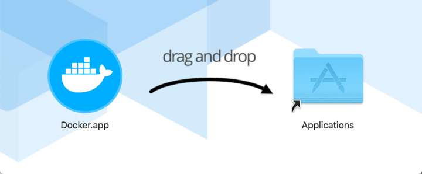
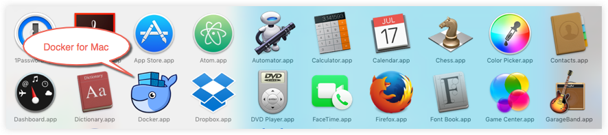
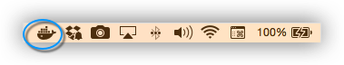

Docker Desktop for Mac is the [Community](https://www.docker.com/community-edition) version of Docker for Mac.
You can download Docker Desktop for Mac from Docker Hub.

[Download from Docker Hub](https://hub.docker.com/editions/community/docker-ce-desktop-mac/){: .button .outline-btn}

By downloading Docker Desktop, you agree to the terms of the [Docker Software End User License Agreement](https://www.docker.com/legal/docker-software-end-user-license-agreement){: target="_blank" class="_"} and the [Docker Data Processing Agreement](https://www.docker.com/legal/data-processing-agreement){: target="_blank" class="_"}.

## What to know before you install

> README FIRST for Docker Toolbox and Docker Machine users
>
>If you are already running Docker on your machine, first read
[Docker Desktop for Mac vs. Docker Toolbox](docker-toolbox.md) to understand the
impact of this installation on your existing setup, how to set your environment
for Docker Desktop on Mac, and how the two products can coexist.

**Relationship to Docker Machine**: Installing Docker Desktop on Mac does not affect machines you created with Docker Machine. You have the option to copy containers and images from your local `default` machine (if one exists) to the Docker Desktop [HyperKit](https://github.com/docker/HyperKit/) VM. When
you are running Docker Desktop, you do not need Docker Machine nodes running locally (or anywhere else). With Docker Desktop, you have a new, native
virtualization system running (HyperKit) which takes the place of the
VirtualBox system. To learn more, see [Docker Desktop for Mac vs. Docker Toolbox](docker-toolbox.md).

## System requirements

Your Mac must meet the following requirements to successfully install Docker Desktop:

- **Mac hardware must be a 2010 or a newer model**, with Intel’s hardware support for memory management unit (MMU) virtualization, including Extended Page Tables (EPT) and Unrestricted Mode. You can check to see if your machine has this support by running the following command in a terminal: `sysctl kern.hv_support`

  If your Mac supports the Hypervisor framework, the command prints `kern.hv_support: 1`.

- **macOS must be version 10.13 or newer**. That is, Catalina, Mojave, or High Sierra. We recommend upgrading to the latest version of macOS.

  If you experience any issues after upgrading your macOS to version 10.15, you must install the latest version of Docker Desktop to be compatible with this version of macOS.

  **Note:** Docker supports Docker Desktop on the most recent versions of macOS. That is, the current release of macOS and the previous two releases. Docker Desktop currently supports macOS Catalina, macOS Mojave, and macOS High Sierra.

    As new major versions of macOS are made generally available, Docker stops supporting the oldest version and support the newest version of macOS (in addition to the previous two releases).

- At least 4 GB of RAM.

- VirtualBox prior to version 4.3.30 must not be installed as it is not compatible with Docker Desktop.

## What's included in the installer

The Docker Desktop installation includes
  [Docker Engine](../engine/index.md), Docker CLI client,
  [Docker Compose](../compose/index.md), [Notary](../notary/getting_started.md), [Kubernetes](https://github.com/kubernetes/kubernetes/), and [Credential Helper](https://github.com/docker/docker-credential-helpers/).

## Install and run Docker Desktop on Mac

1. Double-click `Docker.dmg` to open the installer, then drag the Docker icon to
    the Applications folder.

      

2. Double-click `Docker.app` in the Applications folder to start Docker. (In the example below, the Applications folder is in "grid" view mode.)

    

    The Docker menu in the top status bar indicates that Docker Desktop is running, and accessible from a terminal.

      

    If you've just installed the app, Docker Desktop launches the onboarding tutorial. The tutorial includes a simple exercise to build an example Docker image, run it as a container, push and save the image to Docker Hub.

    

3. Click the Docker menu ({: .inline}) to see
**Preferences** and other options.

4. Select **About Docker** to verify that you have the latest version.

Congratulations! You are now successfully running Docker Desktop.

If you would like to rerun the tutorial, go to the Docker Desktop menu 
and select **Learn**.

## Uninstall Docker Desktop

To unistall Docker Desktop from your Mac:

1. From the Docker menu, select **Troubleshoot** and then select **Uninstall**.
2. Click **Uninstall** to confirm your selection.

> **Note:** Uninstalling Docker Desktop will destroy Docker containers and images local to the machine and remove the files generated by the application.

## Switch between Stable and Edge versions

Docker Desktop allows you to switch between Stable and Edge releases. However, **you can only have one version of Docker Desktop installed at a time**. Switching between Stable and Edge versions can destabilize your development environment, particularly in cases where you switch from a newer (Edge) channel to an older (Stable) channel.

For example, containers created with a newer Edge version of Docker Desktop may
not work after you switch back to Stable because they may have been created
using Edge features that aren't in Stable yet. Keep this in mind as
you create and work with Edge containers, perhaps in the spirit of a playground
space where you are prepared to troubleshoot or start over.

Experimental features are turned on by default on Edge releases. However, when you switch from a Stable to an Edge release, you must turn on the experimental features flag to access experimental features. From the Docker Desktop menu, click **Preferences** > **Command Line** and then turn on the **Enable experimental features** toggle. Click **Apply & Restart** for the changes to take effect.

To safely switch between Edge and Stable versions, ensure you save images and export the containers you need, then uninstall the current version before installing another. For more information, see the section **Save and Restore data** below.

### Save and restore data

You can use the following procedure to save and restore images and container data. For example, if you want to switch between Edge and Stable, or to reset your VM disk:

1. Use `docker save -o images.tar image1 [image2 ...]` to save any images you
    want to keep. See [save](/engine/reference/commandline/save) in the Docker
    Engine command line reference.

2. Use `docker export -o myContainner1.tar container1` to export containers you
    want to keep. See [export](/engine/reference/commandline/export) in the
    Docker Engine command line reference.

3. Uninstall the current version of Docker Desktop and install a different version (Stable or Edge), or reset your VM disk.

4. Use `docker load -i images.tar` to reload previously saved images. See
    [load](/engine/reference/commandline/load) in the Docker Engine.

5. Use `docker import -i myContainer1.tar` to create a filesystem image
    corresponding to the previously exported containers. See
    [import](/engine/reference/commandline/import) in the Docker Engine.

For information on how to back up and restore data volumes, see [Backup, restore, or migrate data volumes](/storage/volumes/#backup-restore-or-migrate-data-volumes).

## Where to go next

- [Getting started](index.md) provides an overview of Docker Desktop on Mac, basic Docker command examples, how to get help or give feedback, and links to other topics about Docker Desktop on Mac.
- [Troubleshooting](troubleshoot.md) describes common problems, workarounds, how
  to run and submit diagnostics, and submit issues.
- [FAQs](faqs.md) provide answers to frequently asked questions.
- [Release notes](release-notes.md) lists component updates, new features, and
  improvements associated with Stable releases. For information about Edge releases, see
  [Edge release notes](edge-release-notes.md).
- [Get started with Docker](/get-started/) provides a general Docker tutorial.
