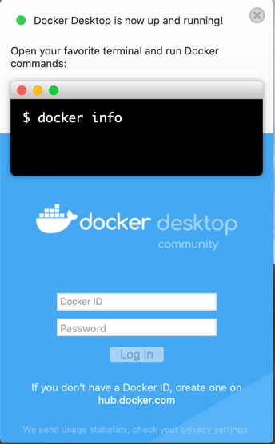

  To download Docker Desktop, go to Docker Hub and sign in with your Docker ID.

[Download from Docker Hub](https://hub.docker.com/?overlay=onboarding){: .button .outline-btn}

## What to know before you install

> README FIRST for Docker Toolbox and Docker Machine users
>
>If you are already running Docker on your machine, first read
[Docker Desktop for Mac vs. Docker Toolbox](docker-toolbox.md) to understand the
impact of this installation on your existing setup, how to set your environment
for Docker Desktop on Mac, and how the two products can coexist.

**Relationship to Docker Machine**: Installing Docker Desktop on Mac does not affect machines you created with Docker Machine. You have the option to copy containers and images from your local `default` machine (if one exists) to the Docker Desktop [HyperKit](https://github.com/docker/HyperKit/) VM. When
you are running Docker Desktop, you do not need Docker Machine nodes running locally (or anywhere else). With Docker Desktop, you have a new, native
virtualization system running (HyperKit) which takes the place of the
VirtualBox system. To learn more, see [Docker Desktop for Mac vs. Docker Toolbox](docker-toolbox.md).

## System requirements

Your Mac must meet the following requirements to successfully install Docker Desktop:

- Mac hardware must be a 2010 or newer model, with Intel’s hardware support for memory management unit (MMU) virtualization, including Extended Page Tables (EPT) and Unrestricted Mode. You can check to see if your machine has this support by running the following command in a terminal: `sysctl kern.hv_support`
kern.hv_support: 1

- macOS must be version 10.12 or newer. We recommend upgrading to the latest version of macOS.

  **Note:** Docker supports Docker Desktop on the most recent versions of macOS. That is, the current release of macOS and the previous two releases. As new major versions of macOS are made generally available, Docker will stop supporting the oldest version and support the newest version of macOS (in addition to the previous two releases).

- At least 4 GB of RAM.

- VirtualBox prior to version 4.3.30 must not be installed as it is not compatible with Docker Desktop.

**Note**: If your system does not satisfy these requirements, you can install [Docker Toolbox](/toolbox/overview.md), which uses Oracle VirtualBox instead of HyperKit.

## What's included in the installer

The Docker Desktop installation includes
  [Docker Engine](/engine/userguide/), Docker CLI client,
  [Docker Compose](/compose/), [Docker Machine](/machine/overview/), and [Kitematic](/kitematic/userguide.md).

## Install and run Docker Desktop on Mac

1. Double-click `Docker.dmg` to open the installer, then drag the Docker icon to
    the Applications folder.

      

2. Double-click `Docker.app` in the Applications folder to start Docker. (In the example below, the Applications folder is in "grid" view mode.)

    

    You are prompted to authorize `Docker.app` with your system password after you launch it.
    Privileged access is needed to install networking components and links to the Docker apps.

    The Docker menu in the top status bar indicates that Docker Desktop is running, and accessible from a terminal.

      

    If you just installed the app, you also get a message with suggested
    next steps and a link to the documentation. Click the Docker menu ({: .inline}) in the status bar to
    dismiss this pop-up notification.

      

3. Click the Docker menu ({: .inline}) to see
**Preferences** and other options.

4. Select **About Docker** to verify that you have the latest version.

Congratulations! You are now successfully running Docker Desktop.

## Where to go next

- [Getting started](index.md) provides an overview of Docker Desktop on Mac, basic Docker command examples, how to get help or give feedback, and links to other topics about Docker Desktop on Mac.
- [Troubleshooting](troubleshoot.md) describes common problems, workarounds, how
  to run and submit diagnostics, and submit issues.
- [FAQs](faqs.md) provide answers to frequently asked questions.
- [Release notes](release-notes.md) lists component updates, new features, and
  improvements associated with Stable releases. For information about Edge releases, see [Edge release
  notes](edge-release-notes.md).
- [Get started with Docker](/get-started/) provides a general Docker tutorial.
