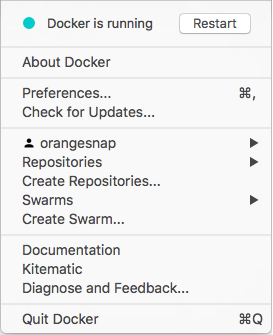

The Docker for Mac install package includes everything you need to run Docker on
a Mac. This topic describes pre-install considerations, and how to download and
install Docker for Mac.

> **Already have Docker for Mac?** If you already have Docker for Mac installed, and are ready to get started, skip to [Getting started](index.md) to
work through the rest of the Docker for Mac tour and information, or jump over
to the tutorials at [Learn Docker](/learn.md).

## Download Docker for Mac

If you have not already done so, please install Docker for Mac. You can download
installers from the stable or beta channel. For more about stable and beta
channels, see the [FAQs](/docker-for-mac/faqs.md#stable-and-beta-channels).

<table style="width:100%">
  <tr>
    <th style="font-size: x-large; font-family: arial">Stable channel</th>
    <th style="font-size: x-large; font-family: arial">Beta channel</th>
  </tr>
  <tr valign="top">
    <td width="50%">This installer is fully baked and tested, and comes
    with the latest GA version of Docker Engine along with <a
    href="https://github.com/docker/docker/blob/master/experimental/README.md"> experimental features in Docker Engine</a>, which are enabled by
    default and configurable on <a href="index#daemon-experimental-mode">Docker Daemon preferences for experimental mode</a>.   This is the
    best channel to use if you want a reliable platform to work with.
    (Be sure to disable experimental features for apps in production.)   These releases follow a version schedule with a longer lead
    time than the betas, synched with Docker Engine releases and
    hotfixes.  On the stable channel, you can select whether to send usage
    statistics and other data.
    </td>
    <td width="50%">This installer provides the latest Beta release of
    Docker for Mac, offers cutting edge features along with
    <a href="https://github.com/docker/docker/blob/master/experimental/README.md"> experimental features in Docker Engine</a>, which are enabled by
    default and configurable on <a href="index#daemon-experimental-mode">Docker Daemon preferences for experimental mode</a>.   This is the
    best channel to use if you want to experiment with features under development, and can weather some instability and bugs. This channel
    is a continuation of the beta program, where you can provide feedback
    as the apps evolve. Releases are typically more frequent than for
    stable, often one or more per month.   We collect all usage
    data on betas across the board.</td>
  </tr>
  <tr valign="top">
  <td width="50%">
  <a class="button darkblue-btn" href="https://download.docker.com/mac/stable/Docker.dmg">Get Docker for Mac (stable)</a>  
  <a href="https://download.docker.com/mac/stable/Docker.dmg.sha256sum">Download checksum: Docker.dmg SHA256</a>
  </td>
  <td width="50%">
  <a class="button darkblue-btn" href="https://download.docker.com/mac/beta/Docker.dmg">Get Docker for Mac (beta)</a>  
  <a href="https://download.docker.com/mac/beta/Docker.dmg.sha256sum">Download checksum: Docker.dmg SHA256</a>
  </td>
  </tr>
</table>

>**Important Notes**:
>
> - Docker for Mac requires OS X El Capitan 10.11 or newer macOS release running on a 2010 or
   newer Mac, with Intel's  hardware support for MMU virtualization. The app will run on 10.10.3 Yosemite, but with limited support. Please see
   [What to know before you install](#what-to-know-before-you-install)
   for a full explanation and list of prerequisites.
>
> - You can switch between beta and stable versions, but you must have only one
   app installed at a time. Also, you will need to save images and export
   containers you want to keep before uninstalling the current version before
   installing another. For more about this, see the
   [FAQs about beta and stable channels](faqs.md#stable-and-beta-channels).

##  What to know before you install

* **README FIRST for Docker Toolbox and Docker Machine users**: If you are
  already running Docker on your machine, first read
  [Docker for Mac vs. Docker Toolbox](docker-toolbox.md) to understand the
  impact of this installation on your existing setup, how to set your environment
  for Docker for Mac, and how the two products can coexist.

* **Relationship to Docker Machine**: Installing Docker for Mac does not affect
  machines you created with Docker Machine. You'll get the option to copy
  containers and images from your local `default` machine (if one exists) to the
  new Docker for Mac [HyperKit](https://github.com/docker/HyperKit/)" VM. When
  you are running Docker for Mac, you do not need Docker Machine nodes running
  at all locally (or anywhere else). With Docker for Mac, you have a new, native
  virtualization system running (HyperKit) which takes the place of the
  VirtualBox system. To learn more, see
  [Docker for Mac vs. Docker Toolbox](docker-toolbox.md).

* **System Requirements**: Docker for Mac will launch only if all of these
  requirements are met.
  

  - Mac must be a 2010 or newer model, with Intel's hardware support for memory
    management unit (MMU) virtualization; i.e., Extended Page Tables (EPT) and
    Unrestricted Mode.
  

  - OS X El Capitan 10.11 and newer macOS releases are supported. At a minimum,
    Docker for Mac requires macOS Yosemite 10.10.3 or newer, with the caveat
    that going forward 10.10.x is a use-at-your-own risk proposition.
  

  - Starting with Docker for Mac stable release 1.13 (upcoming), and concurrent
    Beta releases, we will no longer address issues specific to OS X Yosemite
    10.10. In future releases, Docker for Mac could stop working on OS X Yosemite
    10.10 due to the deprecated status of this OS X version. We recommend
    upgrading to the latest version of macOS.
  

  - At least 4GB of RAM
  

  - VirtualBox prior to version 4.3.30 must NOT be installed (it is incompatible
    with Docker for Mac)

  > **Note**: If your system does not satisfy these requirements, you can
  > install [Docker Toolbox](/toolbox/overview.md), which uses Oracle VirtualBox
  > instead of HyperKit.

* **What the install includes**: The installation provides
  [Docker Engine](/engine/userguide/intro/), Docker CLI client,
  [Docker Compose](/compose/overview/), and [Docker Machine](/machine/overview/).

## Install and Run Docker for Mac

1.  Double-click `Docker.dmg` to open the installer, then drag Moby the whale to
    the Applications folder.

	  

	  You will be asked to authorize `Docker.app` with your system password during
    the install process. Privileged access is needed to install  networking
    components and links to the Docker apps.

2.  Double-click `Docker.app` to start Docker.

	  

	  The whale in the top status bar indicates that Docker is running, and
    accessible from a terminal.

	  

	  If you just installed the app, you also get a success message with suggested
    next steps and a link to this documentation. Click the whale ()
    in the status bar to dismiss this popup.

	  

3.  Click the whale () to get Preferences and
    other options.

	  

4.  Select **About Docker** to verify that you have the latest version.

Congratulations! You are up and running with Docker for Mac.

## Where to go next

* [Getting started](index.md) provides an overview of Docker for Mac,
basic Docker command examples, how to get help or give feedback, and
links to all topics in the Docker for Mac guide.

* [Troubleshooting](troubleshoot.md) describes common problems,
workarounds, how to run and submit diagnostics, and submit issues.

* [FAQs](faqs.md) provides answers to frequently asked questions.

* [Release Notes](release-notes.md) lists component updates, new features, and improvements associated with Stable and Beta releases.

* [Learn Docker](/learn.md) provides general Docker tutorials.
