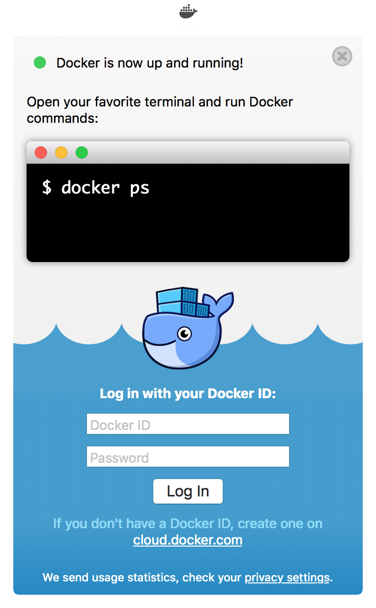

To download Docker Desktop for Mac, head to Docker Hub.

[Download from Docker Hub](https://hub.docker.com/editions/community/docker-ce-desktop-mac){: .button .outline-btn}

##  What to know before you install

> README FIRST for Docker Toolbox and Docker Machine users
>
>If you are already running Docker on your machine, first read
[Docker Desktop for Mac vs. Docker Toolbox](docker-toolbox.md) to understand the
impact of this installation on your existing setup, how to set your environment
for Docker Desktop for Mac, and how the two products can coexist.

* **Relationship to Docker Machine**: Installing Docker Desktop for Mac does not affect
  machines you created with Docker Machine. You have the option to copy
  containers and images from your local `default` machine (if one exists) to the
  new Docker Desktop for Mac [HyperKit](https://github.com/docker/HyperKit/) VM. When
  you are running Docker Desktop for Mac, you do not need Docker Machine nodes running
  at all locally (or anywhere else). With Docker Desktop for Mac, you have a new, native
  virtualization system running (HyperKit) which takes the place of the
  VirtualBox system. To learn more, see
  [Docker Desktop for Mac vs. Docker Toolbox](docker-toolbox.md).

* **System Requirements**: Docker Desktop for Mac launches only if all of these
  requirements are met.

  - Mac hardware must be a 2010 or newer model, with Intel's hardware support for memory
    management unit (MMU) virtualization, including Extended Page Tables (EPT) and
    Unrestricted Mode. You can check to see if your machine has this support by
    running the following command  in a terminal: `sysctl kern.hv_support`

  - macOS Sierra 10.12 and newer macOS releases are supported. We recommend
    upgrading to the latest version of macOS.

  - At least 4GB of RAM

  - VirtualBox prior to version 4.3.30 must NOT be installed (it is incompatible
    with Docker Desktop for Mac). If you have a newer version of VirtualBox installed, it's fine.

  > **Note**: If your system does not satisfy these requirements, you can
  > install [Docker Toolbox](/toolbox/overview.md), which uses Oracle VirtualBox
  > instead of HyperKit.

* **What the install includes**: The installation provides
  [Docker Engine](/engine/userguide/), Docker CLI client,
  [Docker Compose](/compose/overview/), [Docker Machine](/machine/overview/), and [Kitematic](/kitematic/userguide.md).

## Install and run Docker Desktop for Mac

1.  Double-click `Docker.dmg` to open the installer, then drag Moby the whale to
    the Applications folder.

      

2.  Double-click `Docker.app` in the Applications folder to start Docker. (In the example below, the Applications folder is in "grid" view mode.)

      

      You are prompted to authorize `Docker.app` with your system password after you launch it.
      Privileged access is needed to install networking components and links to the Docker apps.

      The whale in the top status bar indicates that Docker is running, and accessible from a terminal.

      

    If you just installed the app, you also get a success message with suggested
    next steps and a link to this documentation. Click the whale ({: .inline}) in the status bar to
    dismiss this popup.

      

3.  Click the whale ({: .inline}) to get
Preferences and other options.
4.  Select **About Docker** to verify that you have the latest version.

Congratulations! You are up and running with Docker Desktop for Mac.

## Where to go next

* [Getting started](index.md) provides an overview of Docker Desktop for Mac, basic
  Docker command examples, how to get help or give feedback, and links to all
  topics in the Docker Desktop for Mac guide.
* [Troubleshooting](troubleshoot.md) describes common problems, workarounds, how
  to run and submit diagnostics, and submit issues.
* [FAQs](faqs.md) provides answers to frequently asked questions.
* [Release Notes](release-notes.md) lists component updates, new features, and
  improvements associated with Stable releases (or [Edge Release
  Notes](edge-release-notes.md)).
* [Get Started with Docker](/get-started/) provides a general Docker tutorial.
