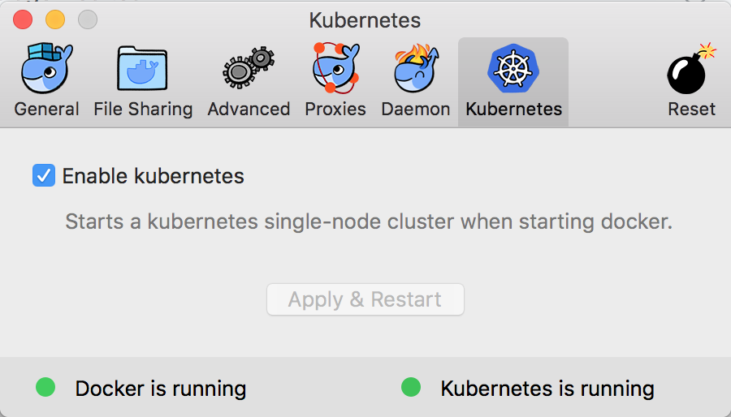

Docker for Mac has a beta program that includes a full Kubernetes cluster, starting from the Edge 17.12 release.
To be enrolled in the beta program, you can register [here](https://beta.docker.com/)

## Activating Kubernetes

If you have been enrolled in the beta program, once logged in with your dockerid, you will see a new "Kubernetes" tab in the preference pane : 



When activating Kubernets for the first time, it will download required kubernetes images (this might take some time). A single-node Kubernetes cluster is then setup and started.  

You can check the Kubernetes cluster is ready : 
``` 
$ kubectl get nodes
NAME                 STATUS    ROLES     AGE       VERSION
docker-for-desktop   Ready     master    23h       v1.8.2
```

## Starting containers on the kubernetes clustrer

Once the kubernetes cluster is started, you can start running usual docker commands to deploy services, they will get deployed in the Kubernetes cluster.

You can deploy services with `docker stack deploy --compose-file xxx`.  
- `kubectl get services` will show the services started.

With Kubernetes you can also use namespaces. If not specified, services get deployed in the default namespace in Kubernetes.
- In order to deploy your services in a custom namespace, first create the namespace : `kubectl create namespace myapp`. 
- Then deploy the services `docker stack deploy --namespace myapp --compose-file xxx`
- `kubectl get services -n myapp` will only list the services in the specified namespace. 
