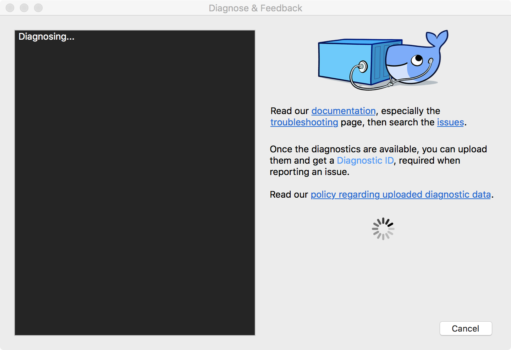

This page contains information on how to diagnose and troubleshoot Docker Desktop issues, send logs and communicate with the Docker Desktop team, use our forums and Success Center, browse and log issues on GitHub, and find workarounds for known problems.

## Troubleshoot

Choose {: .inline} > **Troubleshoot**
from the menu bar to see the troubleshoot options.

{:width="750px"}

The Troubleshoot page contains the following options:

* **Restart Docker Desktop**: Select to restart Docker Desktop.

* **Run Diagnostics**: Select this option to diagnose any issues on Docker Desktop. For detailed information about diagnostics, see [Diagnose problems, send feedback, and create GitHub issues](#diagnose-problems-send-feedback-and-create-github-issues).

* **Reset Kubernetes cluster**: Select this option to delete all stacks and Kubernetes resources. For more information, see [Kubernetes](/docker-for-mac/index/#kubernetes).

* **Reset disk image**: This option resets all Docker data _without_ a
reset to factory defaults. Selecting this option results in the loss of existing settings.

* **Reset to factory defaults**: Choose this option to reset all options on
Docker Desktop to their initial state, the same as when Docker Desktop was first installed.

* **Uninstall**: Choose this option to remove Docker Desktop from your
system.

> Uninstall Docker Desktop from the command line
>
>To uninstall Docker Desktop from a terminal, run: `<DockerforMacPath>
>--uninstall`. If your instance is installed in the default location, this
>command provides a clean uninstall:
>
>```shell
>$ /Applications/Docker.app/Contents/MacOS/Docker --uninstall
>Docker is running, exiting...
>Docker uninstalled successfully. You can move the Docker application to the trash.
>```
>You might want to use the command-line uninstall if, for example, you find that
>the app is non-functional, and you cannot uninstall it from the menu.

## Diagnose problems, send feedback, and create GitHub issues

### In-app diagnostics

If you encounter problems for which you do not find solutions in this
documentation, on [Docker Desktop issues on
GitHub](https://github.com/docker/for-mac/issues), or the [Docker Desktop forum](https://forums.docker.com/c/docker-for-mac), we can help you troubleshoot
the log data.

Choose {: .inline} > **Troubleshoot** > **Run Diagnostics**.

{:width="600px"}

Once the diagnostics are available, you can upload them and obtain a
**Diagnostic ID**, which must be provided when communicating with the Docker
team. For more information on our policy regarding personal data, see
[how is personal data handled in Docker Desktop](faqs.md#how-is-personal-data-handled-in-docker-desktop).

{:width="600px"}

If you click **Report an issue**, this opens Docker Desktop [for Mac](https://github.com/docker/for-mac/issues/) issues on GitHub in your web browser in a "New issue" template. Add the details before submitting the issue. Do not forget to copy/paste your diagnostic ID.

### Diagnosing from the terminal

In some cases, it is useful to run the diagnostics yourself, for instance, if
Docker Desktop cannot start.

First, locate the `com.docker.diagnose` tool.  If you have installed Docker Desktop in the Applications directory, then it is located at
`/Applications/Docker.app/Contents/MacOS/com.docker.diagnose`.

To create *and upload* diagnostics, run:

```sh
$ /Applications/Docker.app/Contents/MacOS/com.docker.diagnose gather -upload
```

After the diagnostics have finished, you should have the following output,
containing your diagnostics ID:

```sh
Diagnostics Bundle: /tmp/B8CF8400-47B3-4068-ADA4-3BBDCE3985D9/20190726143610.zip
Diagnostics ID:     B8CF8400-47B3-4068-ADA4-3BBDCE3985D9/20190726143610 (uploaded)
Diagnostics Bundle: /tmp/BE9AFAAF-F68B-41D0-9D12-84760E6B8740/20190905152051.zip
Diagnostics ID:     BE9AFAAF-F68B-41D0-9D12-84760E6B8740/20190905152051 (uploaded)
```

The diagnostics ID (here BE9AFAAF-F68B-41D0-9D12-84760E6B8740/20190905152051) is
composed of your user ID (BE9AFAAF-F68B-41D0-9D12-84760E6B8740) and a timestamp
(20190905152051). Ensure you provide the full diagnostics ID, and not just the user ID.

To view the contents of the diagnostic file, run:

```sh
$ open /tmp/BE9AFAAF-F68B-41D0-9D12-84760E6B8740/20190905152051.zip
```

<a name="logs"></a>
## Check the logs

In addition to using the diagnose and feedback option to submit logs, you can
browse the logs yourself.  The following documentation is about macOS 10.12
onwards; for older versions, see
[older documentation](https://github.com/docker/docker.github.io/blob/v17.12/docker-for-mac/troubleshoot.md#check-the-logs).

#### In a terminal

To watch the live flow of Docker Desktop logs in the command line, run the following script from your favorite shell.

```bash
$ pred='process matches ".*(ocker|vpnkit).*"
  || (process in {"taskgated-helper", "launchservicesd", "kernel"} && eventMessage contains[c] "docker")'
$ /usr/bin/log stream --style syslog --level=debug --color=always --predicate "$pred"
```

Alternatively, to collect the last day of logs (`1d`) in a file, run:

```
$ /usr/bin/log show --debug --info --style syslog --last 1d --predicate "$pred" >/tmp/logs.txt
```

#### In the Console app

Macs provide a built-in log viewer, named "Console", which you can use to check
Docker logs.

The Console lives in `/Applications/Utilities`; you can search for it with
Spotlight Search.

To read the Docker app log messages, type `docker` in the Console window search bar and press Enter. Then select `ANY` to expand the drop-down list next to your `docker` search entry, and select `Process`.


You can use the Console Log Query to search logs, filter the results in various
ways, and create reports.

<a name="troubleshoot"></a>
## Troubleshooting

### Make sure certificates are set up correctly

Docker Desktop ignores certificates listed under insecure registries, and does
not send client certificates to them. Commands like `docker run` that attempt to
pull from the registry produces error messages on the command line, for example:

```
Error response from daemon: Get http://192.168.203.139:5858/v2/: malformed HTTP response "\x15\x03\x01\x00\x02\x02"
```

As well as on the registry. For example:

```
2019/06/20 18:15:30 http: TLS handshake error from 192.168.203.139:52882: tls: client didn't provide a certificate
2019/06/20 18:15:30 http: TLS handshake error from 192.168.203.139:52883: tls: first record does not look like a TLS handshake
```

For more about using client and server side certificates, see
[Adding TLS certificates](index.md#add-tls-certificates) in the Getting Started topic.

### Docker Desktop does not start if Mac user account and home folder are renamed after installing the app

See
[Do I need to reinstall Docker Desktop if I change the name of my macOS account?](faqs.md#do-i-need-to-reinstall-docker-for-mac-if-i-change-the-name-of-my-macos-account)
in the FAQs.

### Volume mounting requires file sharing for any project directories outside of `/Users`

If you are using mounted volumes and get runtime errors indicating an
application file is not found, access to a volume mount is denied, or a service
cannot start, such as when using [Docker Compose](../compose/gettingstarted.md),
you might need to enable [file sharing](index.md#file-sharing).

Volume mounting requires shared drives for projects that live outside of the
`/Users` directory. Go to {: .inline} >
**Preferences** > **Resources** > **File sharing** and share the drive that contains the Dockerfile and volume.

### Incompatible CPU detected

Docker Desktop requires a processor (CPU) that supports virtualization and, more
specifically, the [Apple Hypervisor
framework](https://developer.apple.com/library/mac/documentation/DriversKernelHardware/Reference/Hypervisor/).
Docker Desktop is only compatible with Mac systems that have a CPU that supports the Hypervisor framework. Most Macs built in 2010 and later support it,as described in the Apple Hypervisor Framework documentation about supported hardware:

*Generally, machines with an Intel VT-x feature set that includes Extended Page
Tables (EPT) and Unrestricted Mode are supported.*

To check if your Mac supports the Hypervisor framework, run the following command in a terminal window.

```bash
sysctl kern.hv_support
```

If your Mac supports the Hypervisor Framework, the command prints
`kern.hv_support: 1`.

If not, the command prints `kern.hv_support: 0`.

See also, [Hypervisor Framework
Reference](https://developer.apple.com/library/mac/documentation/DriversKernelHardware/Reference/Hypervisor/)
in the Apple documentation, and Docker Desktop [Mac system requirements](install.md#system-requirements).

### Workarounds for common problems

* If Docker Desktop fails to install or start properly on Mac:

  * Make sure you quit Docker Desktop before installing a new version of the
    application ({: .inline} > **Quit Docker Desktop**). Otherwise, you get an "application in use" error when you try to
    copy the new app from the `.dmg` to `/Applications`.

  * Restart your Mac to stop / discard any vestige of the daemon running from
    the previously installed version.

  * Run the uninstall commands from the menu.

* If `docker` commands aren't working properly or as expected, you may need to
  unset some environment variables, to make sure you are not using the legacy
  Docker Machine environment in your shell or command window. Unset the
  `DOCKER_HOST` environment variable and related variables.

  * If you use bash, use the following command: `unset ${!DOCKER_*}`

  * For other shells, unset each environment variable individually as described
    in [Setting up to run Docker Desktop on Mac](docker-toolbox.md#setting-up-to-run-docker-desktop-on-mac)
    in [Docker Desktop on Mac vs. Docker Toolbox](docker-toolbox.md).

* Network connections fail if the macOS Firewall is set to "Block all incoming
  connections". You can enable the firewall, but `bootpd` must be allowed
  incoming connections so that the VM can get an IP address.

* For the `hello-world-nginx` example, Docker Desktop must be running to get to
  the web server on `http://localhost/`. Make sure that the Docker icon is
  displayed on the menu bar, and that you run the Docker commands in a shell that is connected to the Docker Desktop Engine (not Engine from Toolbox).
  Otherwise, you might start the webserver container but get a "web page not
  available" error when you go to `localhost`. For more information on distinguishing between the two environments, see [Docker Desktop on Mac vs. Docker Toolbox](docker-toolbox.md).

* If you see errors like `Bind for 0.0.0.0:8080 failed: port is already
  allocated` or `listen tcp:0.0.0.0:8080: bind: address is already in use`:

  * These errors are often caused by some other software on the Mac using those
    ports.

  * Run `lsof -i tcp:8080` to discover the name and pid of the other process and
    decide whether to shut the other process down, or to use a different port in
    your docker app.

## Known issues

* IPv6 is not (yet) supported on Docker Desktop.

* You might encounter errors when using `docker-compose up` with Docker Desktop
  (`ValueError: Extra Data`). We've identified this is likely related to data
  and/or events being passed all at once rather than one by one, so sometimes
  the data comes back as 2+ objects concatenated and causes an error.

* Force-ejecting the `.dmg` after running `Docker.app` from it can cause the
  whale icon to become unresponsive, Docker tasks to show as not responding in
  the Activity Monitor, and for some processes to consume a large amount of CPU
  resources. Reboot and restart Docker to resolve these issues.

* Docker does not auto-start on login even when it is enabled in
  {: .inline} > **Preferences**. This is related to a
  set of issues with Docker helper, registration, and versioning.

* Docker Desktop uses the `HyperKit` hypervisor
  (https://github.com/docker/hyperkit) in macOS 10.10 Yosemite and higher. If
  you are developing with tools that have conflicts with `HyperKit`, such as
  [Intel Hardware Accelerated Execution Manager
  (HAXM)](https://software.intel.com/en-us/android/articles/intel-hardware-accelerated-execution-manager/),
  the current workaround is not to run them at the same time. You can pause
  `HyperKit` by quitting Docker Desktop temporarily while you work with HAXM.
  This allows you to continue work with the other tools and prevent `HyperKit`
  from interfering.

* If you are working with applications like [Apache
  Maven](https://maven.apache.org/) that expect settings for `DOCKER_HOST` and
  `DOCKER_CERT_PATH` environment variables, specify these to connect to Docker
  instances through Unix sockets. For example:

  ```bash
  export DOCKER_HOST=unix:///var/run/docker.sock
  ```

* `docker-compose` 1.7.1 performs DNS unnecessary lookups for
  `localunixsocket.local` which can take 5s to timeout on some networks. If
  `docker-compose` commands seem very slow but seem to speed up when the network
  is disabled, try appending `127.0.0.1 localunixsocket.local` to the file
  `/etc/hosts`.  Alternatively you could create a plain-text TCP proxy on
  localhost:1234 using:

  ```
  docker run -d -v /var/run/docker.sock:/var/run/docker.sock -p 127.0.0.1:1234:1234 bobrik/socat TCP-LISTEN:1234,fork UNIX-CONNECT:/var/run/docker.sock
  ```

  and then `export DOCKER_HOST=tcp://localhost:1234`.

<a name="bind-mounted-dirs"></a>

* There are a number of issues with the performance of directories bind-mounted
  with `osxfs`. In particular, writes of small blocks, and traversals of large
  directories are currently slow. Additionally, containers that perform large
  numbers of directory operations, such as repeated scans of large directory
  trees, may suffer from poor performance. Applications that behave in this way
  include:

  - `rake`
  - `ember build`
  - Symfony
  - Magento
  - Zend Framework
  - PHP applications that use [Composer](https://getcomposer.org) to install
    dependencies in a ```vendor``` folder<br><br>

  As a work-around for this behavior, you can put vendor or third-party library
  directories in Docker volumes, perform temporary file system operations
  outside of `osxfs` mounts, and use third-party tools like Unison or `rsync` to
  synchronize between container directories and bind-mounted directories. We are
  actively working on `osxfs` performance using a number of different
  techniques.  To learn more, see the topic on
  [Performance issues, solutions, and roadmap](osxfs.md#performance-issues-solutions-and-roadmap).

* If your system does not have access to an NTP server, then after a hibernate
  the time seen by Docker Desktop may be considerably out of sync with the host.
  Furthermore, the time may slowly drift out of sync during use. To manually
  reset the time after hibernation, run:

  ```bash
  docker run --rm --privileged alpine hwclock -s
  ```

  Or, to resolve both issues, you can add the local clock as a low-priority
  (high stratum) fallback NTP time source for the host. To do this, edit the
  host's `/etc/ntp-restrict.conf` to add:

  ```
  server 127.127.1.1              # LCL, local clock
  fudge  127.127.1.1 stratum 12   # increase stratum
  ```

  Then restart the NTP service with:

  ```bash
  sudo launchctl unload /System/Library/LaunchDaemons/org.ntp.ntpd.plist
  sudo launchctl load /System/Library/LaunchDaemons/org.ntp.ntpd.plist
  ```
