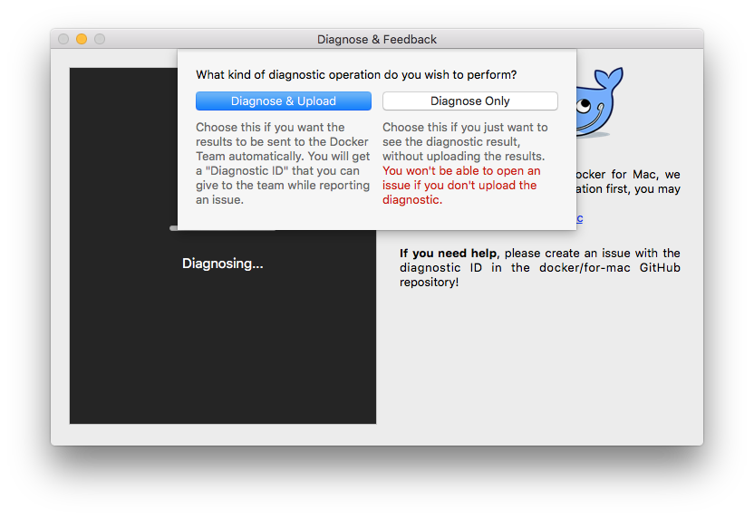
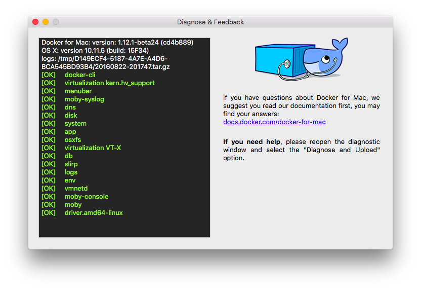
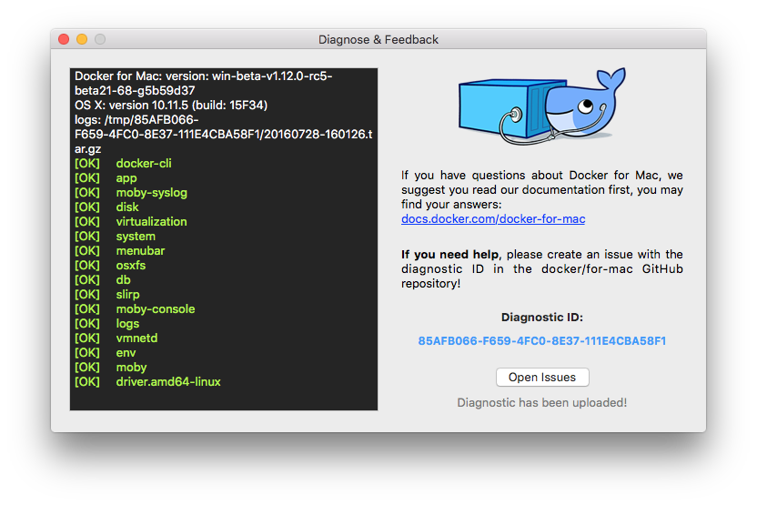
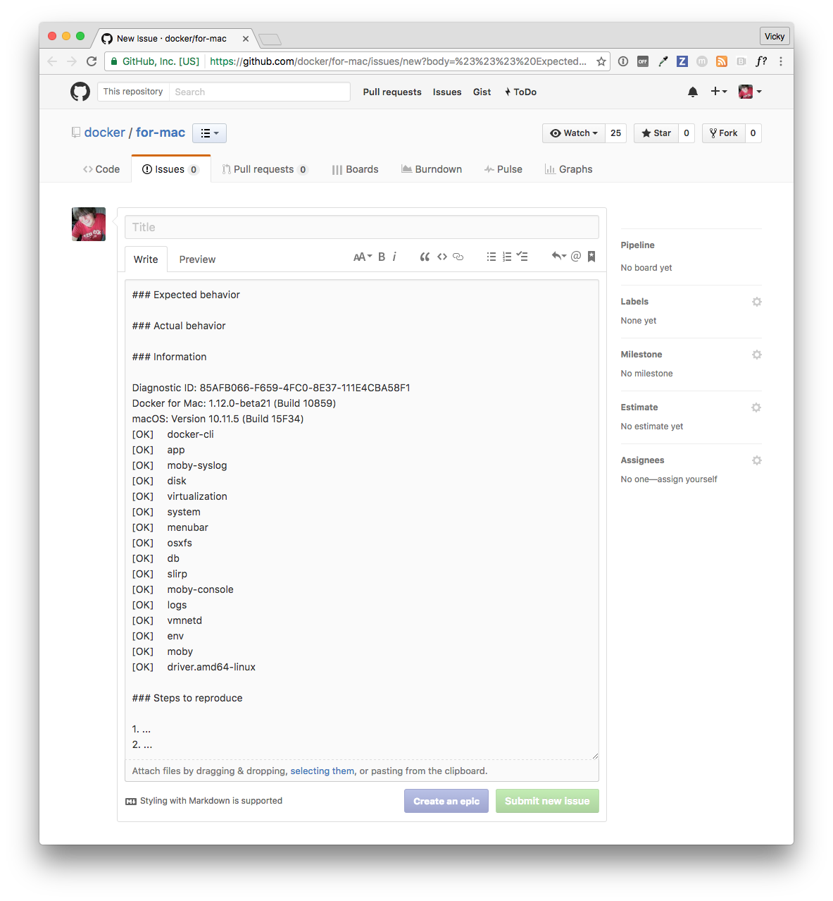
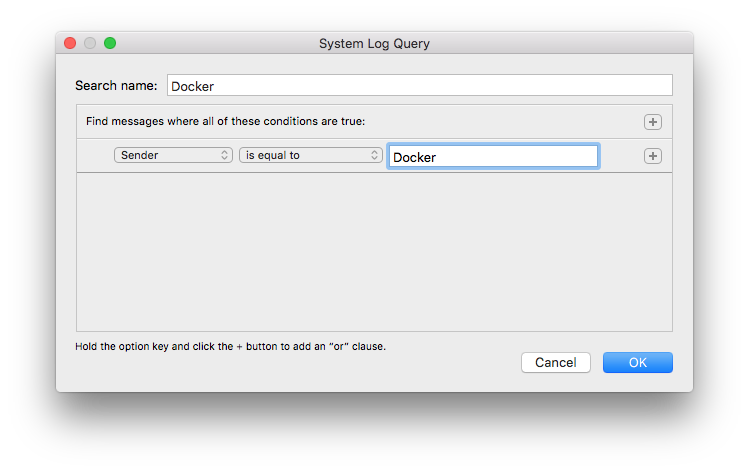
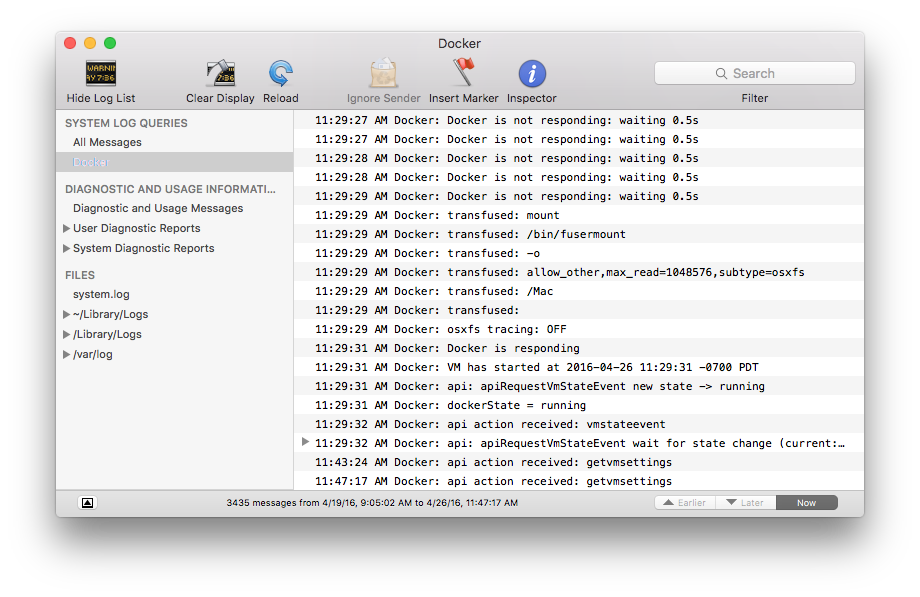

Here is information about how to diagnose and troubleshoot problems, send logs
and communicate with the Docker for Mac team, use our forums and Knowledge Hub,
browse and log issues on GitHub, and find workarounds for known problems.

## Docker Knowledge Hub

**Looking for help with Docker for Mac?** Check out the [Docker Knowledge Hub](http://success.docker.com/) for knowledge base articles, FAQs, and technical support for various subscription levels.

## Diagnose problems, send feedback, and create GitHub issues

If you encounter problems for which you do not find solutions in this
documentation, [Docker for Mac issues on
GitHub](https://github.com/docker/for-mac/issues) already filed by other users,
or on the [Docker for Mac forum](https://forums.docker.com/c/docker-for-mac), we
can help you troubleshoot the log data.

Choose {: .inline} -->
**Diagnose & Feedback** from the menu bar.



You can choose to run diagnostics only, or diagnose and send the results to the
Docker Team:

* **Diagnose Only** - Runs diagnostics, and shows results locally. (Results are not sent to Docker, and no ID is generated.)



* **Diagnose & Upload** - Runs diagnostics, shows results, and auto-uploads the
diagnostic results to Docker. A diagnostic ID is auto-generated. You can refer
to this ID when communicating with the Docker Team. Optionally, you can open
an issue on GitHub using the uploaded results and ID as a basis.



If you click **Open Issues**, this opens [Docker for Mac issues on
GitHub](https://github.com/docker/for-mac/issues/) in your web browser in a
“create new issue” template prepopulated with the following:

* ID and summary of the diagnostic you just ran

* System and version details

* Sections where you can fill in a description of expected and actual behavior, and steps to reproduce the issue



You can also create a new issue directly on GitHub at
[https://github.com/docker/for-mac/issues](https://github.com/docker/for-mac/issues).
(The README for the repository is [here](https://github.com/docker/for-mac).)

Click [New Issue](https://github.com/docker/for-mac/issues/new) on that page (or
right here &#9786;) to get a "create new issue" template prepopulated with
sections for the ID and summary of your diagnostics, system and version details,
description of expected and actual behavior, and steps to reproduce the issue.


<a name="logs"></a>

## Check the logs

In addition to using the diagnose and feedback option to submit logs, you can
browse the logs yourself.

#### Use the command line to view logs

To view Docker for Mac logs at the command line, type this command in a terminal
window or your favorite shell.

    $ syslog -k Sender Docker

Alternatively, you can send the output of this command to a file. The following
command redirects the log output to a file called `my_docker_logs.txt`.

    $ syslog -k Sender Docker > ~/Desktop/my_docker_logs.txt

#### Use the Mac Console for log queries

Macs provide a built-in log viewer. You can use the Mac Console System Log Query
to check Docker app logs.

The Console lives on your Mac hard drive in `Applications` > `Utilities`. You
can bring it up quickly by just searching for it with Spotlight Search.

To find all Docker app log messages, do the following.

1. From the Console menu, choose **File** > **New System Log Query...**

    

    * Name your search (for example `Docker`)
    * Set the **Sender** to **Docker**

2. Click **OK** to run the log query.

  

You can use the Console Log Query to search logs, filter the results in various
ways, and create reports.

For example, you could construct a search for log messages sent by Docker that
contain the word `hypervisor` then filter the results by time (earlier, later,
now).

The diagnostics and usage information to the left of the results provide
auto-generated reports on packages.

<a name="troubleshoot"></a>

## Troubleshooting

### Make sure certificates are set up correctly

Docker for Mac will ignore certificates listed under insecure registries, and
will not send client certificates to them. Commands like `docker run` that
attempt to pull from the registry will produce error messages on the command
line, like this:

```bash
Error response from daemon: Get http://192.168.203.139:5858/v2/: malformed HTTP response "\x15\x03\x01\x00\x02\x02"
```

As well as on the registry. For example:

```config
2017/06/20 18:15:30 http: TLS handshake error from 192.168.203.139:52882: tls: client didn't provide a certificate
2017/06/20 18:15:30 http: TLS handshake error from 192.168.203.139:52883: tls: first record does not look like a TLS handshake
```

For more about using client and server side certificates, see [Adding
TLS certificates](/docker-for-mac/index.md#adding-tls-certificates) in
the Getting Started topic.

### Docker for Mac will not start if Mac user account and home folder are renamed after installing the app

If, after installing Docker for Mac, you [change the name of your macOS user
account and home folder](https://support.apple.com/en-us/HT201548), Docker for
Mac will fail to start. To solve this problem, uninstall then reinstall Docker for Mac under the new user account.

See also, the discussion on the issue [docker/for-mac#1209](https://github.com/docker/for-mac/issues/1209) and [Do I need to reinstall Docker for Mac if I change the name of my macOS account?](faqs.md#do-i-need-to-reinstall-docker-for-mac-if-i-change-the-name-of-my-macos-account) in the FAQs.

### Volume mounting requires file sharing for any project directories outside of `/Users`

If you are using mounted volumes and get runtime errors indicating an
application file is not found, a volume mount is denied, or a service cannot
start (e.g., with [Docker Compose](/compose/gettingstarted.md)), you might
need to enable [file sharing](/docker-for-mac/index.md#file-sharing).

Volume mounting requires shared drives for projects that live outside of the
`/Users` directory. Go to {:
.inline} --> **Preferences** --> **File sharing** and share the drive that
contains the Dockerfile and volume.

### Recreate or update your containers after Beta 18 upgrade

Docker 1.12.0 RC3 release introduces a backward incompatible change from RC2 to
RC3. (For more information, see (For more information, see [moby/moby#24343 (comment)](https://github.com/moby/moby/issues/24343#issuecomment-230623542).)

You may get the following error when you try to start a container created with
pre-Beta 18 Docker for Mac applications.

			Error response from daemon: Unknown runtime specified default

You can fix this by either
[recreating](troubleshoot.md#recreate-your-containers) or
[updating](troubleshoot.md#update-your-containers) your containers.

If you get the error message shown above, we recommend recreating them.

#### Recreate your containers

To recreate your containers, use Docker Compose.

			docker-compose down && docker-compose up

#### Update your containers

To fix existing containers, follow these steps.

1. Run this command.

			$ docker run --rm -v /var/lib/docker:/docker cpuguy83/docker112rc3-runtimefix:rc3

			Unable to find image 'cpuguy83/docker112rc3-runtimefix:rc3' locally
			rc3: Pulling from cpuguy83/docker112rc3-runtimefix
			91e7f9981d55: Pull complete
			Digest: sha256:96abed3f7a7a574774400ff20c6808aac37d37d787d1164d332675392675005c
			Status: Downloaded newer image for cpuguy83/docker112rc3-runtimefix:rc3
			proccessed 1648f773f92e8a4aad508a45088ca9137c3103457b48be1afb3fd8b4369e5140
			skipping container '433ba7ead89ba645efe9b5fff578e674aabba95d6dcb3910c9ad7f1a5c6b4538': already fixed
			proccessed 43df7f2ac8fc912046dfc48cf5d599018af8f60fee50eb7b09c1e10147758f06
			proccessed 65204cfa00b1b6679536c6ac72cdde1dbb43049af208973030b6d91356166958
			proccessed 66a72622e306450fd07f2b3a833355379884b7a6165b7527c10390c36536d82d
			proccessed 9d196e78390eeb44d3b354d24e25225d045f33f1666243466b3ed42fe670245c
			proccessed b9a0ecfe2ed9d561463251aa90fd1442299bcd9ea191a17055b01c6a00533b05
			proccessed c129a775c3fa3b6337e13b50aea84e4977c1774994be1f50ff13cbe60de9ac76
			proccessed dea73dc21126434f14c58b83140bf6470aa67e622daa85603a13bc48af7f8b04
			proccessed dfa8f9278642ab0f3e82ee8e4ad029587aafef9571ff50190e83757c03b4216c
			proccessed ee5bf706b6600a46e5d26327b13c3c1c5f7b261313438d47318702ff6ed8b30b

2. Quit Docker.

3. Start Docker.

	> **Note**: Be sure to quit and then restart Docker for Mac before attempting to start containers.

4. Try to start the container again:

				$ docker start old-container
				old-container

### Incompatible CPU detected

Docker for Mac requires a processor (CPU) that supports virtualization and, more
specifically, the [Apple Hypervisor
framework](https://developer.apple.com/library/mac/documentation/DriversKernelHardware/Reference/Hypervisor/).
Docker for Mac is only compatible with Macs that have a CPU that supports the
Hypervisor framework. Most Macs built in 2010 and later support it, as described
in the Apple Hypervisor Framework documentation about supported hardware:

*Generally, machines with an Intel VT-x feature set that includes Extended Page Tables (EPT) and Unrestricted Mode are supported.*

To check if your Mac supports the Hypervisor framework, run this command in a
terminal window.

```bash
sysctl kern.hv_support
```

If your Mac supports the Hypervisor Framework,
the command will print `kern.hv_support: 1`.

If not, the command will print `kern.hv_support: 0`.

See also, [Hypervisor Framework
Reference](https://developer.apple.com/library/mac/documentation/DriversKernelHardware/Reference/Hypervisor/)
in the Apple documentation, and Docker for Mac system requirements in [What to
know before you install](install.md#what-to-know-before-you-install).


### Workarounds for common problems

* IPv6 workaround to auto-filter DNS addresses - IPv6 is not yet supported on Docker for Mac, which typically manifests as a network timeout when running `docker` commands that need access to external network servers (e.g., `docker pull busybox`).

        $ docker pull busybox
        Using default tag: latest
        Pulling repository docker.io/library/busybox
        Network timed out while trying to connect to https://index.docker.io/v1/repositories/library/busybox/images. You may want to check your internet connection or if you are behind a proxy.

    Starting with v1.12.1, 2016-09016 on the stable channel, and Beta 24 on the beta channel, a workaround is provided that auto-filters out the IPv6 addresses in DNS server lists and enables successful network accesss. For example, `2001:4860:4860::8888` would become `8.8.8.8`. So, the only workaround action needed for users is to [upgrade to Docker for Mac stable v1.12.1 or newer, or Beta 24 or newer](/docker-for-mac/install.md#download-docker-for-mac).

    On releases with the workaround included to filter out / truncate IPv6 addresses from the DNS list, the above command should run properly:


        $ docker pull busybox
        Using default tag: latest
        latest: Pulling from library/busybox
        Digest: sha256:a59906e33509d14c036c8678d687bd4eec81ed7c4b8ce907b888c607f6a1e0e6
        Status: Image is up to date for busy box:latest


    To learn more, see these issues on GitHub and Docker for Mac forums:

  * [Network timeout when top two DNS servers in /etc/resolv.conf are IPv6 addresses](https://github.com/docker/for-mac/issues/9)

  * [ERROR: Network timed out while trying to connect to index.docker.io](https://forums.docker.com/t/error-network-timed-out-while-trying-to-connect-to-index-docker-io/17206)

  <p></p>

* If Docker for Mac fails to install or start properly:

  * Make sure you quit Docker for Mac before installing a new version
  of the application ( {: .inline} --> **Quit Docker**). Otherwise, you will get an
  "application in use" error when you try to copy the new app
  from the `.dmg` to `/Applications`.

  * Restart your Mac to stop / discard any vestige of the daemon running from the previously installed version.

  * Run the uninstall commands from the menu.

  <p></p>

* If `docker` commands aren't working properly or as expected:

  * Make sure you are not using the legacy Docker Machine environment in your shell or command window. You do not need `DOCKER_HOST` set, so unset it as it
may be pointing at another Docker (e.g. VirtualBox). If you use bash, `unset
${!DOCKER_*}` will unset existing `DOCKER` environment variables you have set.

  * For other shells, unset each environment variable individually as described in [Setting up to run Docker for Mac](docker-toolbox.md#setting-up-to-run-docker-for-mac) in [Docker for Mac vs. Docker Toolbox](docker-toolbox.md).

<p></p>

* Note that network connections will fail if the macOS Firewall is set to
"Block all incoming connections". You can enable the firewall, but `bootpd` must be allowed incoming connections so that the VM can get an IP address.

<p></p>

* For the `hello-world-nginx` example, Docker for Mac must be running in order to get to the webserver on `http://localhost/`. Make sure that the Docker whale
is showing in the menu bar, and that you run the Docker commands in a shell that
is connected to the Docker for Mac Engine (not Engine from Toolbox). Otherwise,
you might start the webserver container but get a "web page not available" error
when you go to `localhost`. For more on distinguishing between the two
environments, see [Docker for Mac vs. Docker Toolbox](docker-toolbox.md).

<p></p>

* If you see errors like `Bind for 0.0.0.0:8080 failed: port is already allocated` or `listen tcp:0.0.0.0:8080: bind: address is already in use`:

  * These errors are often caused by some other software on the Mac using those
ports.

  * Run `lsof -i tcp:8080` to discover the name and pid of the other process and
decide whether to shut the other process down, or to use a different port in
your docker app.

## Known issues

* IPv6 is not yet supported on Docker for Mac. If you are using IPv6, and haven't upgraded to Beta 24 or v1.12.1 stable or newer, you will see a network
timeout when you run `docker` commands that need access to external network
servers. The aforementioned releases include a workaround for this because
Docker for Mac does not yet support IPv6. See "IPv6 workaround to auto-filter DNS addresses" in
[Workarounds for common problems](troubleshoot.md#workarounds-for-common-problems).

<p></p>

* You might encounter errors when using `docker-compose up` with Docker for Mac (`ValueError: Extra Data`). We've identified this is likely related to data and/or events being passed all at once rather than one by one, so sometimes the data comes back as 2+ objects concatenated and causes an error.

<p></p>

* Force-ejecting the `.dmg` after running `Docker.app` from it results in an unresponsive whale in the menu bar, Docker tasks "not responding" in activity monitor, helper processes running, and supporting technologies consuming large percentages of CPU. Please reboot, and then re-start Docker for Mac. If needed,`force quit` any Docker related applications as part of the reboot.

<p></p>

* Docker does not auto-start on login even when it is enabled in
{: .inline} --> **Preferences**. This is related to a set of issues with Docker
helper, registration, and versioning.

<p></p>

* Docker for Mac uses the `HyperKit` hypervisor (https://github.com/docker/hyperkit) in macOS 10.10 Yosemite and higher. If you
are developing with tools that have conflicts with `HyperKit`, such as [Intel
Hardware Accelerated Execution Manager
(HAXM)](https://software.intel.com/en-us/android/articles/intel-hardware-accelerated-execution-manager/),
the current workaround is not to run them at the same time. You can pause
`HyperKit` by quitting Docker for Mac temporarily while you work with HAXM. This
will allow you to continue work with the other tools and prevent `HyperKit` from
interfering.

<p></p>

*  If you are working with applications like [Apache Maven](https://maven.apache.org/) that expect settings for `DOCKER_HOST` and `DOCKER_CERT_PATH` environment variables, specify these to connect to Docker instances through Unix sockets. For example:

        export DOCKER_HOST=unix:///var/run/docker.sock

* `docker-compose` 1.7.1 performs DNS unnecessary lookups for `localunixsocket.local` which can take 5s to timeout on some networks. If `docker-compose` commands seem very slow but seem to speed up when the network is disabled (e.g. when disconnected from wifi), try appending `127.0.0.1 localunixsocket.local` to the file `/etc/hosts`.
Alternatively you could create a plain-text TCP proxy on localhost:1234 using:

        docker run -d -v /var/run/docker.sock:/var/run/docker.sock -p 127.0.0.1:1234:1234 bobrik/socat TCP-LISTEN:1234,fork UNIX-CONNECT:/var/run/docker.sock

  	and then `export DOCKER_HOST=tcp://localhost:1234`.

<p></p>

<a name="bind-mounted-dirs"></a>

* There are a number of issues with the performance of directories
  bind-mounted with `osxfs`. In particular, writes of small blocks, and
  traversals of large directories are currently slow. Additionally,
  containers that perform large numbers of directory operations, such as
  repeated scans of large directory trees, may suffer from poor
  performance. Applications that behave in this way include:

  - `rake`
  - `ember build`
  - Symfony
  - Magento
  - Zend Framework
  - PHP applications that use [Composer](https://getcomposer.org) to install dependencies in a ```vendor``` folder<br><br>

  As a work-around for this behavior, you can put vendor or third-party library
directories in Docker volumes, perform temporary file system operations outside
of `osxfs` mounts, and use third-party tools like Unison or `rsync` to
synchronize between container directories and bind-mounted directories. We are
actively working on `osxfs` performance using a number of different techniques.
To learn more, please see the topic on [Performance issues, solutions, and
roadmap](osxfs.md#performance-issues-solutions-and-roadmap).

<p></p>

* If your system does not have access to an NTP server, then after a hibernate the time seen by Docker for Mac may be considerably out of sync with the host. Furthermore, the time may slowly drift out of sync during use. To manually reset the time after hibernation, run:

        docker run --rm --privileged alpine hwclock -s

    Or, to resolve both issues, you can add the local clock as a low-priority (high stratum) fallback NTP time source for the host. To do this, edit the host's `/etc/ntp-restrict.conf` to add:

        server 127.127.1.1              # LCL, local clock
        fudge  127.127.1.1 stratum 12   # increase stratum

    Then restart the NTP service with:

        sudo launchctl unload /System/Library/LaunchDaemons/org.ntp.ntpd.plist
        sudo launchctl load /System/Library/LaunchDaemons/org.ntp.ntpd.plist
