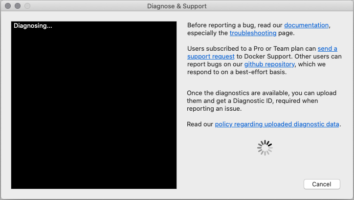



This page contains information on how to diagnose and troubleshoot Docker Desktop issues, request Docker Desktop support (Pro and Team plan users only), send logs and communicate with the Docker Desktop team, use our forums and Success Center, browse and log issues on GitHub, and find workarounds for known problems.

## Troubleshoot

Choose {: .inline} > **Troubleshoot**
from the menu bar to see the troubleshoot options.

{:width="600px"}

The Troubleshoot page contains the following options:

* **Restart Docker Desktop**: Select to restart Docker Desktop.

* **Support**:  Developers on Pro and Team plans can use this option to send a support request. Other users can use this option to diagnose any issues in Docker Desktop. For more information, see [Diagnose and feedback](#diagnose-and-feedback) and [Support](#support).

* **Reset Kubernetes cluster**: Select this option to delete all stacks and Kubernetes resources. For more information, see [Kubernetes](/docker-for-mac/index/#kubernetes).

* **Clean / Purge data**: This option resets all Docker data _without_ a
reset to factory defaults. Selecting this option results in the loss of existing settings.

* **Reset to factory defaults**: Choose this option to reset all options on
Docker Desktop to their initial state, the same as when Docker Desktop was first installed.

* **Uninstall**: Choose this option to remove Docker Desktop from your
system.

> Uninstall Docker Desktop from the command line
>
> To uninstall Docker Desktop from a terminal, run: `<DockerforMacPath>
> --uninstall`. If your instance is installed in the default location, this
> command provides a clean uninstall:
>
> ```console
> $ /Applications/Docker.app/Contents/MacOS/Docker --uninstall
> Docker is running, exiting...
> Docker uninstalled successfully. You can move the Docker application to the trash.
> ```
>
> You might want to use the command-line uninstall if, for example, you find that
> the app is non-functional, and you cannot uninstall it from the menu.

## Diagnose and feedback

### In-app diagnostics

If you encounter problems for which you do not find solutions in this
documentation, on [Docker Desktop issues on
GitHub](https://github.com/docker/for-mac/issues), or the [Docker Desktop forum](https://forums.docker.com/c/docker-for-mac), we can help you troubleshoot
the log data. Before reporting an issue, we recommend that you read the information provided on this page to fix some common known issues.

> **Note**
>
> Docker Desktop offers support for users subscribed to a Pro or a Team plan. If you are experiencing any issues with Docker Desktop, follow the instructions in this section to send a support request to Docker Support.

Before you get started, we recommend that you sign into your Docker Desktop application and your [Docker Hub](https://hub.docker.com/){:target="_blank" rel="noopener" class="_"} account.

1. Choose {: .inline} > **Troubleshoot**.
2. Sign into Docker Desktop. In addition, ensure you are signed into your [Docker account](https://hub.docker.com/){:target="_blank" rel="noopener" class="_"}.
3. Click **Get support**. This opens the in-app **Support** page and starts collecting the diagnostics.
    {:width="600px"}
4. When the diagnostics collection process is complete, click **Upload to get a Diagnostic ID**.
5. When the diagnostics have been uploaded, Docker Desktop prints a diagnostic ID. Copy this ID.
6. If you have subscribed to a Pro or a Team plan, click **Contact Support**. This opens the [Docker Desktop support](https://hub.docker.com/support/desktop/){:target="_blank" rel="noopener" class="_"} form. Fill in the information required and add the ID you copied earlier to the Diagnostics ID field. Click **Submit** to request Docker Desktop support.
   > **Note**
    >
    > You must be signed in to Docker Desktop using your Pro or Team plan credentials to access the support form. For information on what's covered as part of Docker Desktop support, see [Support](#support).
7. If you are not subscribed to a Pro or a team plan, you can click **Upgrade to benefit from Docker Support** to upgrade your existing account.
    Alternatively, click **Report a Bug** to open a new Docker Desktop issue on GitHub. This opens Docker Desktop [for Mac](https://github.com/docker/for-mac/issues/) on GitHub in your web browser in a 'New issue' template. Complete the information required and ensure you add the diagnostic ID you copied earlier. Click **submit new issue** to create a new issue.

### Diagnosing from the terminal

In some cases, it is useful to run the diagnostics yourself, for instance, if
Docker Desktop cannot start.

First, locate the `com.docker.diagnose` tool.  If you have installed Docker Desktop in the Applications directory, then it is located at
`/Applications/Docker.app/Contents/MacOS/com.docker.diagnose`.

To create *and upload* diagnostics, run:

```console
$ /Applications/Docker.app/Contents/MacOS/com.docker.diagnose gather -upload
```

After the diagnostics have finished, you should have the following output,
containing your diagnostics ID:

```sh
Diagnostics Bundle: /tmp/B8CF8400-47B3-4068-ADA4-3BBDCE3985D9/20190726143610.zip
Diagnostics ID:     B8CF8400-47B3-4068-ADA4-3BBDCE3985D9/20190726143610 (uploaded)
Diagnostics Bundle: /tmp/BE9AFAAF-F68B-41D0-9D12-84760E6B8740/20190905152051.zip
Diagnostics ID:     BE9AFAAF-F68B-41D0-9D12-84760E6B8740/20190905152051 (uploaded)
```

The diagnostics ID (here BE9AFAAF-F68B-41D0-9D12-84760E6B8740/20190905152051) is
composed of your user ID (BE9AFAAF-F68B-41D0-9D12-84760E6B8740) and a timestamp
(20190905152051). Ensure you provide the full diagnostics ID, and not just the user ID.

To view the contents of the diagnostic file, run:

```console
$ open /tmp/BE9AFAAF-F68B-41D0-9D12-84760E6B8740/20190905152051.zip
```

### Experimental self-diagnose tool

Docker Desktop 3.6.0 contains an experimental "self-diagnose" tool which helps identify some common
problems. To run it: first locate `com.docker.diagnose`. If you have installed Docker Desktop
in the Applications directory, then it is located at
`/Applications/Docker.app/Contents/MacOS/com.docker.diagnose`.

To run the self-diagnose tool:

```console
$ /Applications/Docker.app/Contents/MacOS/com.docker.diagnose check
```

The tool runs a suite of checks and displays **PASS** or **FAIL** next to each one. If there are any failures, it highlights the most relevant at the end.
it will try to highlight the most relevant at the end.

#### Note

The Self-diagnose tool is still experimental. Let us know your feedback by creating an issue in the [for-mac](https://github.com/docker/for-mac/issues) GitHub repository.

<a name="logs"></a>

## Check the logs

In addition to using the diagnose and feedback option to submit logs, you can
browse the logs yourself.

#### In a terminal

To watch the live flow of Docker Desktop logs in the command line, run the following script from your favorite shell.

```console
$ pred='process matches ".*(ocker|vpnkit).*"
  || (process in {"taskgated-helper", "launchservicesd", "kernel"} && eventMessage contains[c] "docker")'
$ /usr/bin/log stream --style syslog --level=debug --color=always --predicate "$pred"
```

Alternatively, to collect the last day of logs (`1d`) in a file, run:

```console
$ /usr/bin/log show --debug --info --style syslog --last 1d --predicate "$pred" >/tmp/logs.txt
```

#### In the Console app

Macs provide a built-in log viewer, named "Console", which you can use to check
Docker logs.

The Console lives in `/Applications/Utilities`; you can search for it with
Spotlight Search.

To read the Docker app log messages, type `docker` in the Console window search bar and press Enter. Then select `ANY` to expand the drop-down list next to your `docker` search entry, and select `Process`.


You can use the Console Log Query to search logs, filter the results in various
ways, and create reports.

#### View the Docker Daemon logs

Refer to the [read the logs](../config/daemon/index.md#read-the-logs) section
to learn how to view the Docker Daemon logs.

<a name="troubleshoot"></a>
## Troubleshooting

### Make sure certificates are set up correctly

Docker Desktop ignores certificates listed under insecure registries, and does
not send client certificates to them. Commands like `docker run` that attempt to
pull from the registry produces error messages on the command line, for example:

```
Error response from daemon: Get http://192.168.203.139:5858/v2/: malformed HTTP response "\x15\x03\x01\x00\x02\x02"
```

As well as on the registry. For example:

```
2019/06/20 18:15:30 http: TLS handshake error from 192.168.203.139:52882: tls: client didn't provide a certificate
2019/06/20 18:15:30 http: TLS handshake error from 192.168.203.139:52883: tls: first record does not look like a TLS handshake
```

For more about using client and server side certificates, see
[Adding TLS certificates](index.md#add-tls-certificates) in the Getting Started topic.

### Volume mounting requires file sharing for any project directories outside of `/Users`

If you are using mounted volumes and get runtime errors indicating an
application file is not found, access to a volume mount is denied, or a service
cannot start, such as when using [Docker Compose](../compose/gettingstarted.md),
you might need to enable [file sharing](index.md#file-sharing).

Volume mounting requires shared drives for projects that live outside of the
`/Users` directory. Go to {: .inline} >
**Preferences** > **Resources** > **File sharing** and share the drive that contains the Dockerfile and volume.

### Incompatible CPU detected

Docker Desktop requires a processor (CPU) that supports virtualization and, more
specifically, the [Apple Hypervisor
framework](https://developer.apple.com/library/mac/documentation/DriversKernelHardware/Reference/Hypervisor/).
Docker Desktop is only compatible with Mac systems that have a CPU that supports the Hypervisor framework. Most Macs built in 2010 and later support it,as described in the Apple Hypervisor Framework documentation about supported hardware:

*Generally, machines with an Intel VT-x feature set that includes Extended Page
Tables (EPT) and Unrestricted Mode are supported.*

To check if your Mac supports the Hypervisor framework, run the following command in a terminal window.

```console
$ sysctl kern.hv_support
```

If your Mac supports the Hypervisor Framework, the command prints
`kern.hv_support: 1`.

If not, the command prints `kern.hv_support: 0`.

See also, [Hypervisor Framework
Reference](https://developer.apple.com/library/mac/documentation/DriversKernelHardware/Reference/Hypervisor/)
in the Apple documentation, and Docker Desktop [Mac system requirements](install.md#system-requirements).

### Workarounds for common problems

* If Docker Desktop fails to install or start properly on Mac:

  * Make sure you quit Docker Desktop before installing a new version of the
    application ({: .inline} > **Quit Docker Desktop**). Otherwise, you get an "application in use" error when you try to
    copy the new app from the `.dmg` to `/Applications`.

  * Restart your Mac to stop / discard any vestige of the daemon running from
    the previously installed version.

  * Run the uninstall commands from the menu.

* If `docker` commands aren't working properly or as expected, you may need to
  unset some environment variables, to make sure you are not using the legacy
  Docker Machine environment in your shell or command window. Unset the
  `DOCKER_HOST` environment variable and related variables. If you use bash, use the following command: `unset ${!DOCKER_*}`

* For the `hello-world-nginx` example, Docker Desktop must be running to get to
  the web server on `http://localhost/`. Make sure that the Docker icon is
  displayed on the menu bar, and that you run the Docker commands in a shell that is connected to the Docker Desktop Engine.
  Otherwise, you might start the webserver container but get a "web page not
  available" error when you go to `localhost`.

* If you see errors like `Bind for 0.0.0.0:8080 failed: port is already
  allocated` or `listen tcp:0.0.0.0:8080: bind: address is already in use`:

  * These errors are often caused by some other software on the Mac using those
    ports.

  * Run `lsof -i tcp:8080` to discover the name and pid of the other process and
    decide whether to shut the other process down, or to use a different port in
    your docker app.

## Known issues

* The following issues are seen when using the `virtualization.framework` experimental feature:

  * Some VPN clients can prevent the VM running Docker from communicating with the host, preventing Docker Desktop starting correctly. See [docker/for-mac#5208](https://github.com/docker/for-mac/issues/5208).

    This is an interaction between `vmnet.framework` (as used by `virtualization.framework` in Big Sur) and the VPN clients.

  * Docker Desktop is incompatible with macOS Internet Sharing. See [docker/for-mac#5348](https://github.com/docker/for-mac/issues/5348).

    This is an interaction between `vmnet.framework` (as used by `virtualization.framework` in Big Sur) and macOS Internet Sharing. At the moment it is not possible to use Docker Desktop and macOS Internet Sharing at the same time.

  * Some container disk I/O is much slower than expected. See [docker/for-mac#5389](https://github.com/docker/for-mac/issues/5389). Disk flushes are particularly slow due to the need to guarantee data is written to stable storage on the host.

    This is an artifact of the new `virtualization.framework` in Big Sur.

  * TCP and UDP port 53 (DNS) are bound on the host when Docker Desktop starts. Therefore you cannot bind to port 53 on all interfaces with a command like `docker run -p 53:53`. See [docker/for-mac#5335](https://github.com/docker/for-mac/issues/5335).

    This is an artifact of the new `virtualization.framework` in Big Sur. A workaround is to bind to a specific IP address e.g. `docker run -p 127.0.0.1:53:53`.

  * The Linux Kernel may occasionally crash. Docker now detects this problem and pops up an error dialog offering the user the ability to quickly restart Linux.

    We are still gathering data and testing alternate kernel versions.

* IPv6 is not (yet) supported on Docker Desktop.

* You might encounter errors when using `docker-compose up` with Docker Desktop
  (`ValueError: Extra Data`). We've identified this is likely related to data
  and/or events being passed all at once rather than one by one, so sometimes
  the data comes back as 2+ objects concatenated and causes an error.

* Force-ejecting the `.dmg` after running `Docker.app` from it can cause the
  whale icon to become unresponsive, Docker tasks to show as not responding in
  the Activity Monitor, and for some processes to consume a large amount of CPU
  resources. Reboot and restart Docker to resolve these issues.

* Docker does not auto-start on login even when it is enabled in
  {: .inline} > **Preferences**. This is related to a
  set of issues with Docker helper, registration, and versioning.

* Docker Desktop uses the `HyperKit` hypervisor
  (https://github.com/docker/hyperkit) in macOS 10.10 Yosemite and higher. If
  you are developing with tools that have conflicts with `HyperKit`, such as
  [Intel Hardware Accelerated Execution Manager
  (HAXM)](https://software.intel.com/en-us/android/articles/intel-hardware-accelerated-execution-manager/),
  the current workaround is not to run them at the same time. You can pause
  `HyperKit` by quitting Docker Desktop temporarily while you work with HAXM.
  This allows you to continue work with the other tools and prevent `HyperKit`
  from interfering.

* If you are working with applications like [Apache
  Maven](https://maven.apache.org/) that expect settings for `DOCKER_HOST` and
  `DOCKER_CERT_PATH` environment variables, specify these to connect to Docker
  instances through Unix sockets. For example:

  ```console
  $ export DOCKER_HOST=unix:///var/run/docker.sock
  ```

* There are a number of issues with the performance of directories bind-mounted
  into containers. In particular, writes of small blocks, and traversals of large
  directories are currently slow. Additionally, containers that perform large
  numbers of directory operations, such as repeated scans of large directory
  trees, may suffer from poor performance. Applications that behave in this way
  include:

  - `rake`
  - `ember build`
  - Symfony
  - Magento
  - Zend Framework
  - PHP applications that use [Composer](https://getcomposer.org) to install
    dependencies in a ```vendor``` folder<br><br>

  As a workaround for this behavior, you can put vendor or third-party library
  directories in Docker volumes, perform temporary file system operations
  outside of bind mounts, and use third-party tools like Unison or `rsync` to
  synchronize between container directories and bind-mounted directories. We are
  actively working on performance improvements using a number of different
  techniques.  To learn more, see the [topic on our roadmap](https://github.com/docker/roadmap/issues/7){: target="_blank" rel="noopener" class="_" }.

## Support

This section contains instructions on how to get support, and covers the scope of Docker Desktop support.



### How do I get Docker Desktop support?

If you have subscribed to a Pro and Team account, please raise a ticket through [Docker Desktop support](https://hub.docker.com/support/desktop/){:target="_blank" rel="noopener" class="_"}.

Docker Community users can get support through our Github repos for-win and for-mac, where we respond on a best-effort basis.

### What support can I get?

If you are a Pro or a Team user, you can request for support on the following types of issues:

* Desktop upgrade issues
* Desktop installation issues
  * Installation crashes
  * Failure to launch Docker Desktop on first run
* Usage issues
  * Crash closing software
  * Docker Desktop not behaving as expected
* Configuration issues
* Basic product ‘how to’ questions

### What is not supported?

Docker Desktop excludes support for the following types of issues:

* Use on or in conjunction with hardware or software other than that specified in the applicable documentation
* Running on unsupported operating systems, including beta/preview versions of operating systems
* Running containers of a different architecture using emulation
* Support for the Docker engine, Docker CLI, or other bundled Linux components
* Support for Kubernetes
* Features labeled as experimental
* System/Server administration activities
* Supporting Desktop as a production runtime
* Scale deployment/multi-machine installation of Desktop
* Routine product maintenance (data backup, cleaning disk space and configuring log rotation)
* Third-party applications not provided by Docker
* Altered or modified Docker software
* Defects in the Docker software due to hardware malfunction, abuse, or improper use
* Any version of the Docker software other than the latest version
* Reimbursing and expenses spent for third-party services not provided by Docker
* Docker Support excludes training, customization, and integration

### What versions are supported?

We currently only offer support for the latest version of Docker Desktop. If you are running an older version, you may be asked to upgrade before we investigate your support request.

### How many machines can I get support for Docker Desktop on?

As a Pro user you can get support for Docker Desktop on a single machine.
As a Team, you can get support for Docker Desktop for the number of machines equal to the number of seats as part of your plan.

### What OS’s are supported?

Docker Desktop is available for Mac and Windows. The supported version information can be found on the following pages:

* [Mac system requirements](../docker-for-mac/install.md#system-requirements)
* [Windows system requirements](../docker-for-windows/install.md#system-requirements)

### Can I run Docker Desktop on Virtualized hardware?

No, currently this is unsupported and against the terms of use.
