Welcome to Docker for Windows!

Docker is a full development platform for creating containerized apps, and
Docker for Windows is the best way to get started with Docker on Windows
systems.

>**Already have Docker for Windows?** If you already have Docker for Windows installed, and are ready to get started, skip down to [Step 3. Check versions of
Docker Engine, Compose, and
Machine](#step-3-check-versions-of-docker-engine-compose-and-machine) to work
through the rest of the Docker for Windows tour, or jump over to the standard
[Getting Started with Docker](/engine/getstarted/index.md) tutorial.

## Download Docker for Windows

If you have not already done so, please install Docker for Windows. You can
download installers from the stable or beta channel.  For more about stable and
beta channels, see the [FAQs](faqs.md#questions-about-stable-and-beta-channels).

<table style="width:100%">
  <tr>
    <th style="font-size: x-large; font-family: arial">Stable channel</th>
    <th style="font-size: x-large; font-family: arial">Beta channel</th>
  </tr>
  <tr valign="top">
    <td width="50%">This installer is fully baked and tested, and comes with the latest GA version of Docker Engine. <br><br>This is the best channel to use if you want a reliable platform to work with. <br><br>These releases follow a version schedule with a longer lead time than the betas, synched with Docker Engine releases and hotfixes.<br><br>On the stable channel, you can select whether to send usage statistics and other data.
    </td>
    <td width="50%">This installer offers cutting edge features and comes with the experimental version of Docker Engine, which is described in the <a href="https://github.com/docker/docker/tree/master/experimental">Docker Experimental Features README</a> on GitHub.<br><br>This is the best channel to use if you want to experiment with features under development, and can weather some instability and bugs. This channel is a continuation of the beta program, where you can provide feedback as the apps evolve. Releases are typically more frequent than for stable, often one or more per month. <br><br>We collect all usage data on betas across the board.</td>
  </tr>
  <tr valign="top">
  <td width="50%">
  <a class="button darkblue-btn" href="https://download.docker.com/win/stable/InstallDocker.msi">Get Docker for Windows (stable)</a><br><br>
  <a href="https://download.docker.com/win/stable/InstallDocker.msi.sha256sum"><font color="#BDBDBD" size="-1">Download checksum: InstallDocker.msi SHA256</font></a>
  </td>
  <td width="50%">
  <a class="button darkblue-btn" href="https://download.docker.com/win/beta/InstallDocker.msi">Get Docker for Windows (beta)</a><br><br>
  <a href="https://download.docker.com/win/beta/InstallDocker.msi.sha256sum"><font color="#BDBDBD" size="-1">Download checksum: InstallDocker.msi SHA256</font></a>
  </td>
  </tr>
</table>

>**Important Notes:**
>
>- Docker for Windows requires 64bit Windows 10 Pro, Enterprise and Education
>  (1511 November update, Build 10586 or later) and Microsoft Hyper-V. Please
>  see [What to know before you install](index.md#what-to-know-before-you-install)
>  for a full list of prerequisites.
>
>- You can switch between beta and stable versions, but you must have only one
>   app installed at a time. Also, you will need to save images and export
>  containers you want to keep before uninstalling the current version before
>  installing another. For more about this, see the
>  [FAQs about beta and stable channels](faqs.md#questions-about-stable-and-beta-channels).

##  What to know before you install

* **README FIRST for Docker Toolbox and Docker Machine users**: Docker for Windows requires Microsoft Hyper-V to run. After Hyper-V is enabled,
VirtualBox will no longer work, but any VirtualBox VM images will remain.
VirtualBox VMs created with `docker-machine` (including the `default` one
typically created during Toolbox install) will no longer start. These VMs cannot
be used side-by-side with Docker for Windows. However, you can still use
`docker-machine` to manage remote VMs.
<p />
* The current version of Docker for Windows runs on 64bit Windows 10 Pro, Enterprise and Education (1511 November update, Build 10586 or later). In the future we will support more versions of Windows 10.
<p />
* Containers and images created with Docker for Windows are shared between all user accounts on machines where it is installed. This is because all
Windows accounts will use the same VM to build and run containers. In the
future, Docker for Windows will better isolate user content.
<p />
* The Hyper-V package must be enabled for Docker for Windows to work. The Docker for Windows installer will enable it for you, if needed. (This requires a
reboot). If your system does not satisfy these requirements, you can install
[Docker Toolbox](/toolbox/overview.md), which uses Oracle Virtual Box instead of
Hyper-V.
<p />
* Virtualization must be enabled. Typically, virtualization is enabled by default. (Note that this is different from having Hyper-V enabled.) For more
detail see [Virtualization must be
enabled](troubleshoot.md#virtualization-must-be-enabled) in Troubleshooting.
<p />
* Nested virtualization scenarios, such as running Docker for Windows on a VMWare or Parallels instance, might work, but come with no guarantees (i.e., not officially supported).
<p />
* **What the Docker for Windows install includes**: The installation provides [Docker Engine](/engine/userguide/intro.md), Docker CLI client, [Docker Compose](/compose/overview/), and [Docker Machine](/machine/overview.md).

### About Windows containers and Windows Server 2016

Looking for information on using Windows containers?

* [Getting Started with Windows Containers (Lab)](https://github.com/docker/labs/blob/master/windows/windows-containers/README.md)
provides a tutorial on how to set up and run Windows containers on Windows 10 or
with Windows Server 2016. It shows you how to use a MusicStore application with
Windows containers.
<p />
* [Setup - Windows Server 2016 (Lab)](https://github.com/docker/labs/blob/master/windows/windows-containers/Setup-Server2016.md) specifically describes environment setup.
<p />
* [Switch
between Windows and Linux containers (Beta
feature)](index.md#switch-between-windows-and-linux-containers-beta-feature) describes the Linux / Windows containers toggle in Docker for Windows and points you to the tutorial mentioned above.
<p />
* Docker Container Platform for Windows Server 2016 [articles and blog posts](https://www.docker.com/microsoft) on the Docker website

## Step 1. Install Docker for Windows

1. Double-click `InstallDocker.msi` to run the installer.

    If you haven't already downloaded the installer (`InstallDocker.msi`), you can get it [**here**](https://download.docker.com/win/stable/InstallDocker.msi). It typically downloads to your `Downloads folder`, or you can run it from the recent downloads bar at the bottom of your web browser.

2. Follow the install wizard to accept the license, authorize the installer, and proceed with the install.

    You will be asked to authorize `Docker.app` with your system password during the install process. Privileged access is needed to install networking components, links to the Docker apps, and manage the Hyper-V VMs.

3. Click **Finish** on the setup complete dialog to launch Docker.

    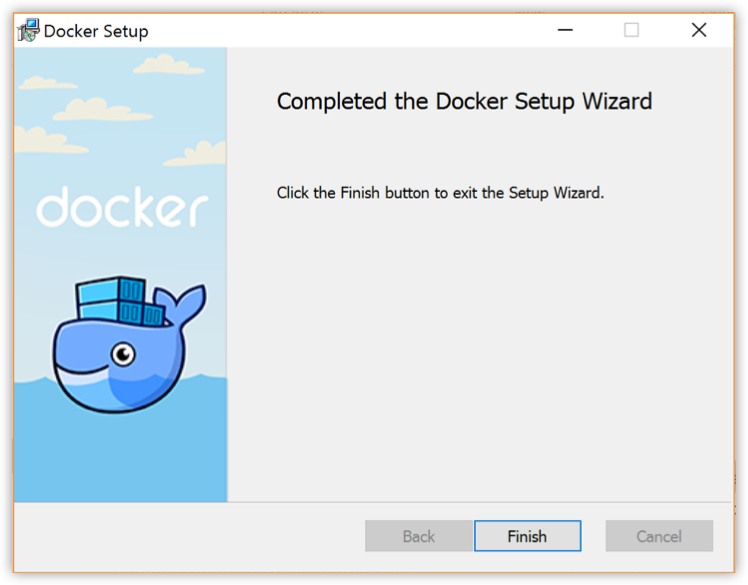

## Step 2. Start Docker for Windows

When the installation finishes, Docker starts automatically.

The whale in the status bar indicates that Docker is running, and accessible from a terminal.

If you just installed the app, you also get a popup success message with suggested next steps, and a link to this documentation.

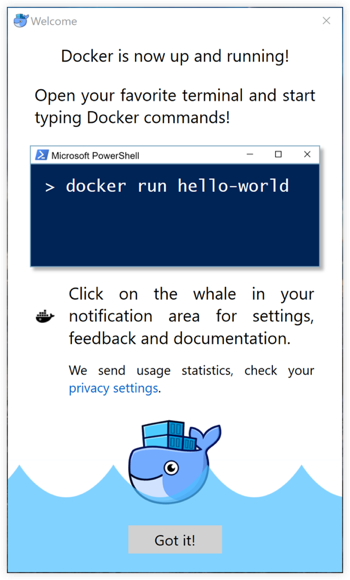

When initialization is complete, select **About Docker** from the notification area icon to verify that you have the latest version.

Congratulations! You are up and running with Docker for Windows.

## Step 3. Check versions of Docker Engine, Compose, and Machine

Start your favorite shell (`cmd.exe`, PowerShell, or other) to check your versions of `docker` and `docker-compose`, and verify the installation.

      PS C:\Users\jdoe> docker --version
      Docker version 1.12.0, build 8eab29e, experimental

      PS C:\Users\jdoe> docker-compose --version
      docker-compose version 1.8.0, build d988a55

      PS C:\Users\jdoe> docker-machine --version
      docker-machine version 0.8.0, build b85aac1

## Step 4. Explore the application and run examples

The next few steps take you through some examples. These are just suggestions for ways to experiment with Docker on your system, check version information, and make sure `docker` commands are working properly.

1. Open a shell (`cmd.exe`, PowerShell, or other).

2. Run some Docker commands, such as `docker ps`, `docker version`, and `docker info`.

    Here is the output of `docker ps` run in a powershell. (In this example, no containers are running yet.)


          PS C:\Users\jdoe> docker ps

          CONTAINER ID        IMAGE               COMMAND             CREATED             STATUS              PORTS               NAMES

    Here is an example of command output for  `docker version`.

          PS C:\Users\jdoe> docker version
          Client:
          Version:      1.13.0-rc3
          API version:  1.25
          Go version:   go1.7.3
          Git commit:   4d92237
          Built:        Tue Dec  6 01:15:44 2016
          OS/Arch:      windows/amd64

          Server:
          Version:      1.13.0-rc3
          API version:  1.25 (minimum version 1.12)
          Go version:   go1.7.3
          Git commit:   4d92237
          Built:        Tue Dec  6 01:15:44 2016
          OS/Arch:      linux/amd64
          Experimental: true

    Here is an example of command output for  `docker info`.

          PS C:\Users\jdoe> docker info
          Containers: 0
          Running: 0
          Paused: 0
          Stopped: 0
          Images: 0
          Server Version: 1.13.0-rc3
          Storage Driver: overlay2
            Backing Filesystem: extfs
            Supports d_type: true
            Native Overlay Diff: true
          Logging Driver: json-file
          Cgroup Driver: cgroupfs
          Plugins:
            Volume: local
            Network: bridge host macvlan null overlay
          Swarm: inactive
          Runtimes: runc
          Default Runtime: runc
          Init Binary: docker-init
          containerd version: 03e5862ec0d8d3b3f750e19fca3ee367e13c090e
          runc version: 51371867a01c467f08af739783b8beafc154c4d7
          init version: 949e6fa
          Security Options:
            seccomp
              Profile: default
          Kernel Version: 4.8.12-moby
          Operating System: Alpine Linux v3.4
          OSType: linux
          Architecture: x86_64
          CPUs: 2
          Total Memory: 1.934 GiB
          Name: moby
          ID: EODE:VBXI:Y4EL:JXRJ:STRS:HCAI:LDLF:P4KW:B5XU:QPNE:LKTM:RG32
          Docker Root Dir: /var/lib/docker
          Debug Mode (client): false
          Debug Mode (server): true
            File Descriptors: 13
            Goroutines: 21
            System Time: 2016-12-07T19:02:41.3287973Z
            EventsListeners: 0
          Registry: https://index.docker.io/v1/
          Experimental: true
          Insecure Registries:
            127.0.0.0/8
          Live Restore Enabled: false

    >**Note:** The outputs above are examples. Your output for commands like `docker version` and `docker info` will vary depending on your product versions (e.g., as you install newer versions).

3.  Run `docker run hello-world` to test pulling an image from Docker Hub and starting a container.

          PS C:\Users\jdoe> docker run hello-world

          Hello from Docker.
          This message shows that your installation appears to be working correctly.

          To generate this message, Docker took the following steps:
          1. The Docker client contacted the Docker daemon.
          2. The Docker daemon pulled the "hello-world" image from the Docker Hub.
          3. The Docker daemon created a new container from that image which runs the executable that produces the output you are currently reading.
          4. The Docker daemon streamed that output to the Docker client, which sent it to your terminal.

4. Try something more ambitious, and run an Ubuntu container with this command.

          docker run -it ubuntu bash

      This will download the `ubuntu` container image and start it. Here is the output of running this command in a powershell.

          PS C:\Users\jdoe> docker run -it ubuntu bash

          Unable to find image 'ubuntu:latest' locally
          latest: Pulling from library/ubuntu
          5a132a7e7af1: Pull complete
          fd2731e4c50c: Pull complete
          28a2f68d1120: Pull complete
          a3ed95caeb02: Pull complete
          Digest: sha256:4e85ebe01d056b43955250bbac22bdb8734271122e3c78d21e55ee235fc6802d
          Status: Downloaded newer image for ubuntu:latest

      Type `exit` to stop the container and close the powershell.

5. Start a Dockerized webserver with this command:

          docker run -d -p 80:80 --name webserver nginx

      This will download the `nginx` container image and start it. Here is the output of running this command in a powershell.

          PS C:\Users\jdoe> docker run -d -p 80:80 --name webserver nginx

          Unable to find image 'nginx:latest' locally
          latest: Pulling from library/nginx

          fdd5d7827f33: Pull complete
          a3ed95caeb02: Pull complete
          716f7a5f3082: Pull complete
          7b10f03a0309: Pull complete
          Digest: sha256:f6a001272d5d324c4c9f3f183e1b69e9e0ff12debeb7a092730d638c33e0de3e
          Status: Downloaded newer image for nginx:latest
          dfe13c68b3b86f01951af617df02be4897184cbf7a8b4d5caf1c3c5bd3fc267f

6.  Point your web browser at `http://localhost` to display the start page.

    (Since you specified the default HTTP port, it isn't necessary to append `:80` at the end of the URL.)

      

7.  Run `docker ps` while your webserver is running to see details on the container.

          PS C:\Users\jdoe> docker ps

          CONTAINER ID        IMAGE               COMMAND                  CREATED             STATUS              PORTS
          NAMES
          dfe13c68b3b8        nginx               "nginx -g 'daemon off"   3 days ago          Up 45 seconds       0.0.0.0:80->80/tcp, 443/tc
          p   webserver

8. Stop or remove containers and images.

    The `nginx` webserver will continue to run in the container on that port until you stop and/or remove the container. If you want to stop the webserver, type: `docker stop webserver` and start it again with `docker start webserver`.

    To stop and remove the running container with a single command, type: `docker rm -f webserver`. This will remove the container, but not the `nginx` image. You can list local images with `docker images`. You might want to keep some images around so that you don't have to pull them again from Docker Hub. To remove an image you no longer need, use `docker rmi <imageID>|<imageName>`. For example, `docker rmi nginx`.

**Want more example applications?** - For more example walkthroughs that include setting up services and databases with Docker Compose, see [Example Applications](examples.md).

## Set up tab completion in PowerShell

If you would like to have handy tab completion for Docker commands, you can install the <a href="https://github.com/samneirinck/posh-docker">posh-docker</a> PowerShell Module as follows.

1. Start an "elevated" PowerShell (i.e., run it as administrator).

    To do this, search for PowerShell, right-click, and choose **Run as administrator**.<br>

    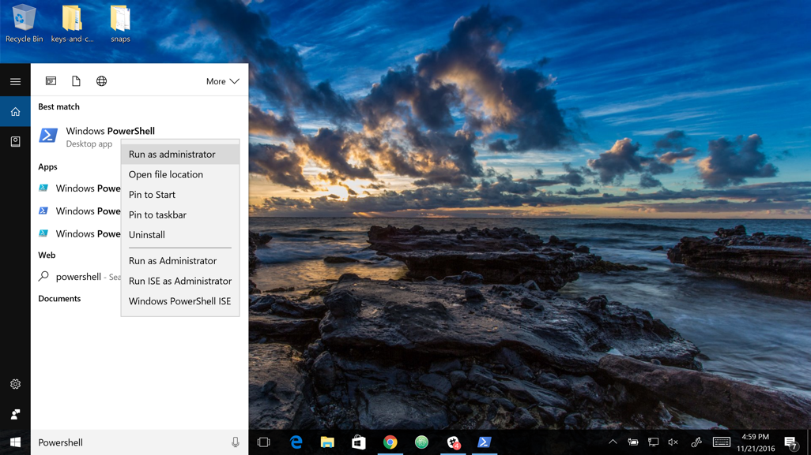
    <br><br>
    When asked if you want to allow this app to make changes to your device, click **Yes**.

2. Set the [script execution policy](https://msdn.microsoft.com/en-us/powershell/reference/5.1/microsoft.powershell.security/set-executionpolicy) to allow downloaded scripts signed by trusted publishers to run on your computer. To do so, type this at the PowerShell prompt.
    <br>
    `Set-ExecutionPolicy RemoteSigned`
    <br>
    To check that the policy is set properly, run `get-executionpolicy`, which should return `RemoteSigned`.
    <br>
3. To enable auto-completion of commands for the current PowerShell only, type:

    `Install-Module posh-docker`

4. To make tab completion persistent across all PowerShell sessions, add the command to a `$PROFILE` by typing these commands at the PowerShell prompt.

        Install-Module -Scope CurrentUser posh-docker -Force
        Add-Content $PROFILE "`nInstall-Module posh-docker"

    This creates a `$PROFILE` if one does not already exist, and adds this line into the file:

    `Install-Module posh-docker`

    <br>
    To check that the file was properly created, or simply edit it manually, type this in PowerShell:

    `Notepad $PROFILE`

Now, when you press tab after typing the first few letters, Docker commands such
as `start`, `stop`, `run`, and their options, along with container and image
names should now auto-complete.

## Docker Settings

When Docker is running, the Docker whale is displayed. By default, the Docker
whale icon is placed in the Notifications area. If it is hidden, click the up
arrow on the taskbar to show it.

>**Tip:** You can pin the whale outside of the notification box so that it is
always visible on the taskbar. To do this, drag-and-drop the whale icon. Or,
right-click an empty porition of the taskbar, select Settings, and choose
display options through taskbar settings for notifications.
>


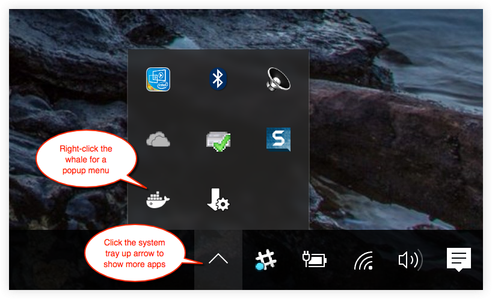

To get a popup menu with application options, right-click the whale:

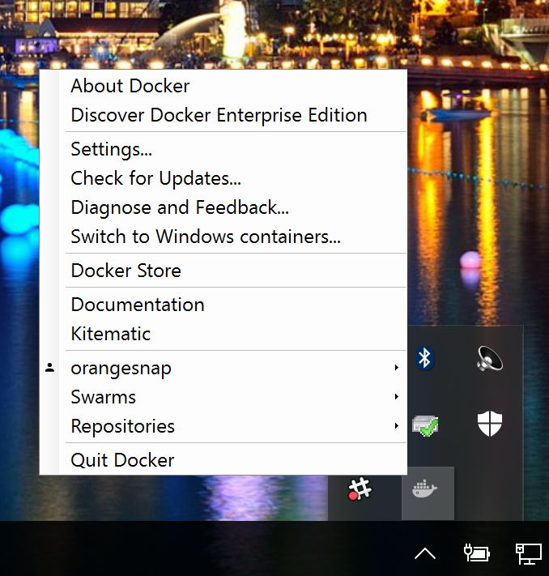

The **Settings** dialogs provide options to allow Docker auto-start,
automatically check for updates, share local drives with Docker containers,
enable VPN compatibility, manage CPUs and memory Docker uses, restart Docker, or
perform a factory reset.

**Beta 26 and newer** include an option to switch between Windows and Linux
**conatiners. See [Switch between Windows and Linux containers (Beta
**feature)](index.md#switch-between-windows-and-linux-containers-beta-feature).
**This is not yet available on stable builds.

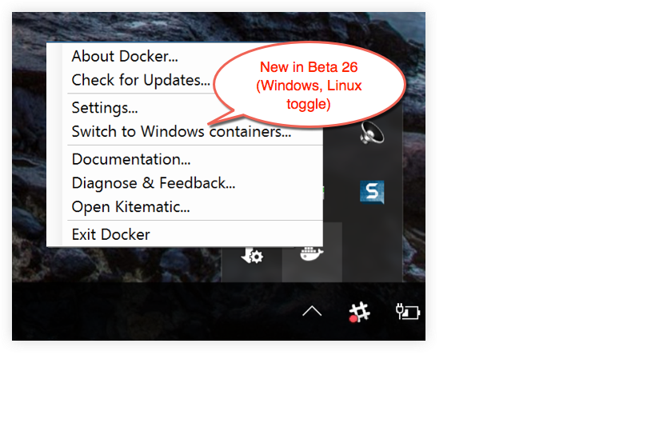

### General


* **Start Docker when you log in** - Automatically start the Docker for Windows application upon Windows system login.

* **Check for updates when the application starts** - Docker for Windows is set to automatically check for updates and notify you when an update is available.
If an update is found, click **OK** to accept and install it (or cancel to keep
the current version). Uncheck this option if you do not want notifications of
version upgrades. You can still find out about updates manually by choosing
**Check for Updates** from the menu.

* **Send usage statistics** - You can set Docker for Windows to auto-send diagnostics, crash reports, and usage data. This information can help Docker improve the application and get more context for troubleshooting problems.

    Uncheck any of the options to opt out and prevent auto-send of data. Docker may prompt for more information in some cases, even with auto-send enabled. Also, you can enable or disable these auto-reporting settings with one click on the information popup when you first start Docker.

    

### Shared Drives

Share your local drives (volumes) with Docker for Windows, so that they are available to your containers.


You will be asked to provide your Windows system username and password (domain
user) to apply shared drives. You can select an option to have Docker store the
credentials so that you don't have to re-enter them every time.

Permissions to access shared drives are tied to the credentials you provide
here. If you run `docker` commands and tasks under a different username than the
one used here to set up sharing, your containers will not have permissions to
access the mounted volumes.

>**Tip:** Shared drives are only required for volume mounting [Linux
containers](#switch-between-windows-and-linux-containers-beta-feature), and not
for Windows containers. For Linux containers, you need to share the drive where your project is located (i.e., where the Dockerfile and
volume are located). Runtime errors such as file not found or cannot start
service may indicate shared drives are needed. (See also [Volume mounting
requires shared drives for Linux containers](troubleshoot.md#volume-mounting-requires-shared-drives-for-linux-containers).)

See also [Verify domain user has permissions for shared
drives](troubleshoot.md#verify-domain-user-has-permissions-for-shared-drives-volumes)
in Troubleshooting.

>**Note:** You can share local drives with your _containers_ but not with Docker
Machine nodes. See [Can I share local drives and filesystem with my
Docker Machine
VMs?](faqs.md#can-i-share-local-drives-and-filesystem-with-my-docker-machine-vms) in
the FAQs.

#### Firewall rules for shared drives

Shared drives require port 445 to be open between the host machine and the virtual
machine that runs Linux containers.

>**Note**: In Docker for Windows Beta 29 and higher,
Docker detects if port 445 is closed and shows the following message when you
try to add a shared drive: 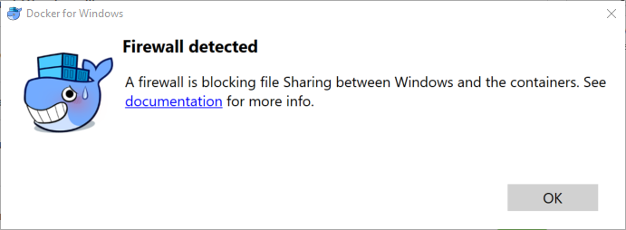


To share the drive, allow connections between the Windows host machine and the
virtual machine in Windows Firewall or your third party firewall software. You
do not need to open port 445 on any other network. By default, allow connections
to 10.0.75.1 port 445 (the Windows host) from 10.0.75.2 (the virtual machine).

### Advanced

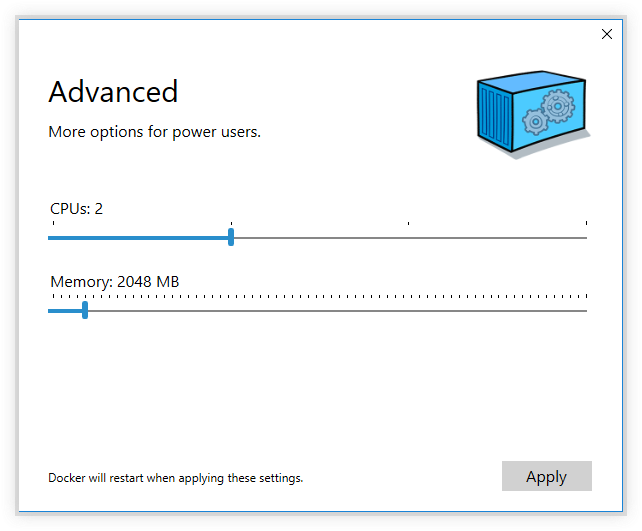

* **CPUs** - Change the number of processors assigned to the Linux VM.

* **Memory** - Change the amount of memory the Docker for Windows Linux VM uses.

Please note, updating these settings requires a reconfiguration and reboot of the Linux VM. This will take a few seconds.

### Network

You can configure Docker for Windows networking to work on a virtual private network (VPN).

* **Internal Virtual Switch** - You can specify a network address translation (NAT) prefix and subnet mask to enable internet connectivity.

* **DNS Server** - You can configure the DNS server to use dynamic or static IP addressing.

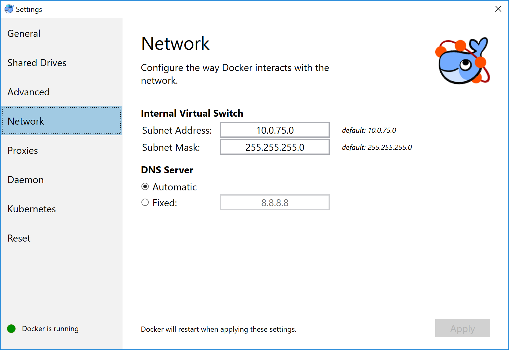

>**Note:** Some users reported problems connecting to Docker Hub on Docker for Windows stable version. This would manifest as an error when trying to run `docker` commands that pull images from Docker Hub that are not already downloaded, such as a first time run of `docker run hello-world`. If you encounter this, reset the DNS server to use the Google DNS fixed address: `8.8.8.8`. For more information, see [Networking issues](troubleshoot.md#networking-issues) in Troubleshooting.

Note that updating these settings requires a reconfiguration and reboot of the Linux VM.

### Proxies

Docker for Windows lets you configure HTTP/HTTPS Proxy Settings and automatically propagate these to Docker and to your containers.
For example, if you set your proxy settings to `http://proxy.example.com`, Docker will use this proxy when pulling containers.

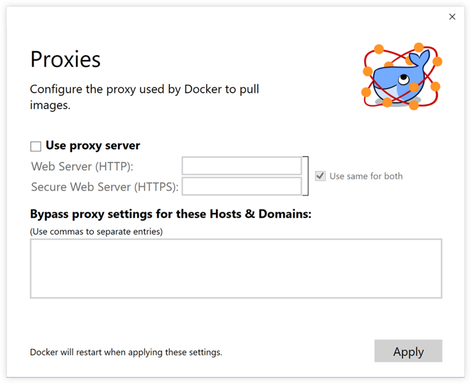

When you start a container, you will see that your proxy settings propagate into the containers. For example:

```powershell
PS C:\Users\jdoe> docker run -it alpine env
PATH=/usr/local/sbin:/usr/local/bin:/usr/sbin:/usr/bin:/sbin:/bin
HOSTNAME=b7edf988b2b5
TERM=xterm
HOME=/root
HTTP_PROXY=http://proxy.example.com:3128
http_proxy=http://proxy.example.com:3128
no_proxy=*.local, 169.254/16
```

You can see from the above output that the `HTTP_PROXY`, `http_proxy` and `no_proxy` environment variables are set.
When your proxy configuration changes, Docker restarts automatically to pick up the new settings.
If you have containers that you wish to keep running across restarts, you should consider using [restart policies](/engine/reference/run/#restart-policies-restart)

### Docker daemon
You can configure options on the Docker daemon in the given JSON configuration file, and determine how your containers will run.

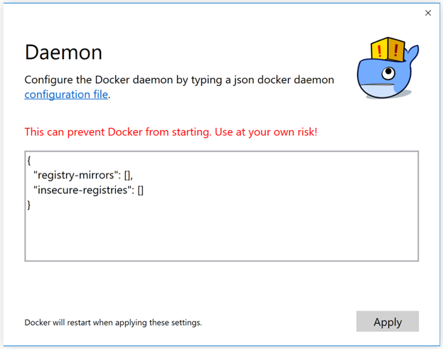

For a full list of options on the Docker daemon, see [daemon](/engine/reference/commandline/dockerd/){:target="_blank"} in the Docker Engine command line reference.

In that topic, see also:

* [Daemon configuration file](/engine/reference/commandline/dockerd/#/daemon-configuration-file)

* [Linux configuration file](/engine/reference/commandline/dockerd/#/linux-configuration-file)

* [Windows configuration file](/engine/reference/commandline/dockerd/#/windows-configuration-file)

Note that updating these settings requires a reconfiguration and reboot of the Linux VM.

#### Docker daemon basic and advanced (Beta features)

Starting with Beta 34, you can configure some **Basic** options on the daemon
with interactive settings, or switch to **Advanced** to edit the JSON directly.

Note that the settings offered on **Basic** dialog can be configured directly in
the JSON. This version just surfaces some of the commmon settings to make it
easier to configure them.

* [Experimental mode](#experimental-mode)
* [Custom registries](#custom-registries)
* [Edit the daemon configuration file](#edit-the-daemon-configuration-file)

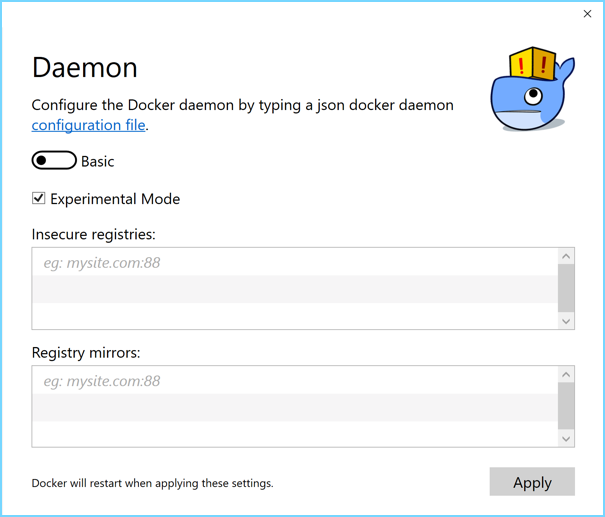

##### Experimental mode

By default, Docker for Windows Beta releases use the experimental version of
Docker Engine, described in the [Docker Experimental Features
README](https://github.com/docker/docker/tree/master/experimental) on GitHub.
Starting with Beta 34, you can toggle **experimental mode** on and off via the
**Basic** Daemon settings. If you toggle it off, Docker for Windows Beta uses the
current generally available release of Docker Engine, the same as Stable Docker
for Windows versions uses.

You can check whether you are running experimental mode or not by typing `docker
version` in a PowerShell. Experimental mode is listed under `Server` data.
If `Experimental` is `true`, then Docker is running in experimental mode, as
shown here. (If `false`, Experimental mode is off.)

```bash
PS C:\Users\Vicky> docker version
Client:
 Version:      1.13.0-rc4
 API version:  1.25
 Go version:   go1.7.3
 Git commit:   88862e7
 Built:        Sat Dec 17 01:34:17 2016
 OS/Arch:      windows/amd64

Server:
 Version:      1.13.0-rc4
 API version:  1.25 (minimum version 1.12)
 Go version:   go1.7.3
 Git commit:   88862e7
 Built:        Sat Dec 17 01:34:17 2016
 OS/Arch:      linux/amd64
 Experimental: true
```

##### Custom registries

Also starting with with Beta 34, you can set up your own
[registries](/registry/introduction.md) on the **Basic** Daemon settings.

As an alternative to using [Docker Hub](https://hub.docker.com/) to store your
public or private images or [Docker Trusted
Registry](/datacenter/dtr/2.1/guides/index.md), you can use Docker to set up your
own insecure [registry](/registry/introduction/). Add URLs for insecure
registries and registry mirrors on which to host your images. (See also, [How do
I add custom CA certificates?](faqs.md#how-do-i-add-custom-ca-certificates) in
the FAQs.)

##### Edit the daemon configuration file

The **Advanced** daemon settings provide the original option to directly edit
the JSON configuration file for the <a
href="/engine/reference/commandline/dockerd/"
target="_blank">daemon</a>. (This is the only option currently available on stable releases, as described in [Docker daemon](#docker-daemon).)

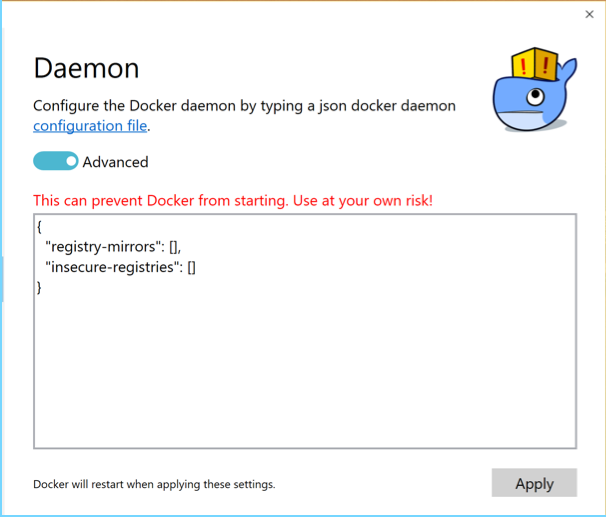

Note that updating these settings requires a reconfiguration and reboot of the
Linux VM.

### Switch between Windows and Linux containers (Beta feature)

Starting with Beta 26, you can select which daemon (Linux or Windows) the Docker
CLI talks to. Select **Switch to Windows containers** to toggle to Windows
containers. Select **Switch to Linux containers**.

Microsoft Developer Network has preliminary/draft information on Windows
containers
[here](https://msdn.microsoft.com/en-us/virtualization/windowscontainers/about/about_overview).

This feature is not yet available on stable builds.

#### Getting started with Windows containers

If you are interested in working with Windows containers, here are some guides to help you get started.

* [Build and Run Your First Windows Server Container (Blog Post)](https://blog.docker.com/2016/09/build-your-first-docker-windows-server-container/) gives a quick tour of how to build and run native Docker Windows containers on Windows 10 and Windows Server 2016 evaluation releases.

* [Getting Started with Windows Containers (Lab)](https://github.com/docker/labs/blob/master/windows/windows-containers/README.md)
shows you how to use the
[MusicStore](https://github.com/aspnet/MusicStore/blob/dev/README.md)
application with Windows containers. The MusicStore is a standard .NET
application and, [forked here to use
containers](https://github.com/friism/MusicStore), is a good example of a
multi-container application.

  >**Disclaimer:** This lab is still in work, and is based off of the blog, but you can test and leverage the example walkthroughs now, if you want to start experimenting. Please checking back as the lab evolves.

#### About the Docker Windows containers specific dialogs

When you switch to Windows containers, the Settings panel updates to show only
those [dialogs](#docker-settings) that are active and apply to your Windows
containers:

  * [General](#general)
  * [Proxies](#proxies)
  * [Docker daemon](#docker-daemon)
  * [Diagnose and Feedback](#diagnose-and-feedback)
  * [Reset](#reset)

(Per the release notes, these dialogs are newly implemented for Windows
containers mode in [Beta
32](release-notes.md#beta-32-release-notes-2016-12-07-1130-rc3-beta32)).

Keep in mind that if you set proxies or daemon configuration in Windows
containers mode, these apply only on Windows containers. If you switch back to
Linux containers, proxies and daemon configurations return to what you had set
for Linux containers. Your Windows container settings are retained and become
available again when you switch back.

The following settings are **_not available in Windows containers mode_**,
because they do not apply to Windows containers:

  * [Shared Drives](#shared-drives)
  * [Network](#network)
  * [Advanced (CPU and Memory configuration)](#advanced)


### Giving feedback and getting help

To get help from the community, review current user topics, join or start a
discussion, log on to our [Docker for Windows
forum](https://forums.docker.com/c/docker-for-windows).

To report bugs or problems, log on to [Docker for Windows issues on
GitHub](https://github.com/docker/for-win/issues), where you can review
community reported issues, and file new ones. As a part of reporting issues on
GitHub, we can help you troubleshoot the log data. See the [Diagnose and
Feedback](#diagnose-and-feedback) topic below.

To give feedback on the documentation or update it yourself, use the Feedback
options at the bottom of each docs page.

### Diagnose and Feedback

If you encounter problems for which you do not find solutions in this documentation, searching [Docker for Windows issues on GitHub](https://github.com/docker/for-win/issues) already filed by other users, or on the [Docker for Windows forum](https://forums.docker.com/c/docker-for-windows), we can help you troubleshoot the log data.

Select **Upload a diagnostic**.

This uploads (sends) the logs to Docker.

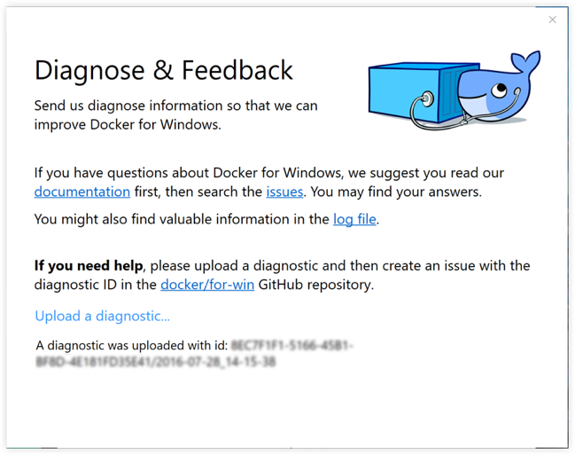

To create a new issue directly on GitHub, open [Docker for Windows issues on GitHub](https://github.com/docker/for-win/issues) in your web browser and follow the instructions in the README. Click [New Issue](https://github.com/docker/for-win/issues/new) on that page to get a "create new issue" template prepopulated with sections for the ID and summary of your diagnostics, system and version details, description of expected and actual behavior, and steps to reproduce the issue.


### Reset


* **Restart Docker** - Shuts down and restarts the Docker application.

* **Reset to Toolbox default machine content** - Imports containers and images from the existing Docker Toolbox machine named `default`. (This option is enabled only if you have Toolbox installed.) The VirtualBox VM will not be removed.

* **Reset to factory defaults** - Resets Docker to factory defaults. This is useful in cases where Docker stops working or becomes unresponsive.

<!-- ### Going back to Toolbox

If you want to go back to using Docker Toolbox, you have to disable the Hyper-V Windows feature. To do this, go to the Windows **Control Panel -> Programs and Features -> Turn Windows Features on or off**, uncheck Hyper-V, and click **OK**. You can then use `docker-machine` and VirtualBox to run Docker containers.

[These instructions](https://msdn.microsoft.com/en-us/virtualization/hyperv_on_windows/quick_start/walkthrough_install), which explain how to *enable* Hyper-V, show you how to get to the on/off controls for the Hyper-V feature. -->

## Where to go next

* Try out the [Getting Started with Docker](/engine/getstarted/index.md) tutorial.

* Dig in deeper with [learn by example](/engine/tutorials/index.md) tutorials on building images, running containers, networking, managing data, and storing images on Docker Hub.

* See [Example Applications](examples.md) for example applications that include setting up services and databases in Docker Compose.

* Interested in trying out the new [swarm mode](/engine/swarm/index.md) on Docker Engine v1.12?

    See [Get started with swarm mode](/engine/swarm/swarm-tutorial/index.md), a tutorial which includes specifics on how to leverage your Docker for Windows installation to run single and multi-node swarms.

    Also, try out the Swarm examples in [docker labs](https://github.com/docker/labs/tree/master/swarm-mode/beginner-tutorial). Run the `bash script` and follow the accompanying [Docker Swarm Tutorial](https://github.com/docker/labs/blob/master/swarm-mode/beginner-tutorial/README.md). The script uses Docker Machine to create a multi-node swarm, then walks you through various Swarm tasks and commands.

* For a summary of Docker command line interface (CLI) commands, see [Docker CLI Reference Guide](/engine/reference/index.md).

* Check out the <a href="https://blog.docker.com/2016/06/docker-mac-windows-public-beta/">blog posts</a> on Docker for Mac and Docker for Windows public betas, and <a href="https://blog.docker.com/2016/03/docker-for-mac-windows-beta/">earlier posts</a> on the initial private beta.

* Please give feedback on your experience with the app and report bugs and problems by logging into our [Docker for Windows forum](https://forums.docker.com/c/docker-for-windows).
