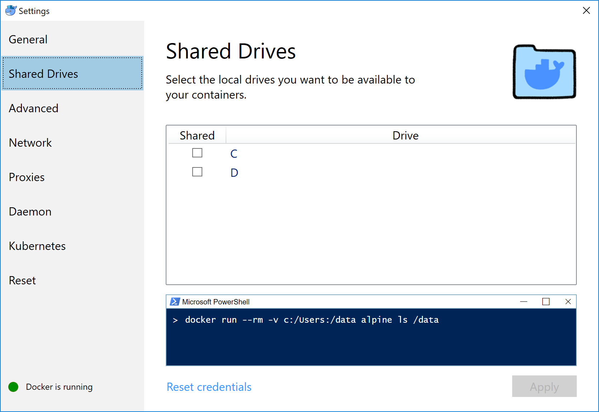
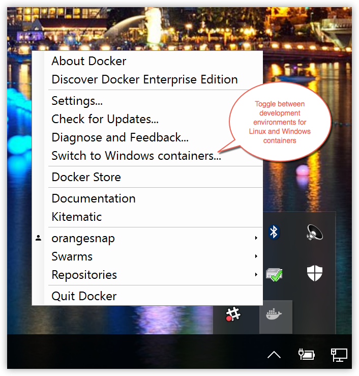
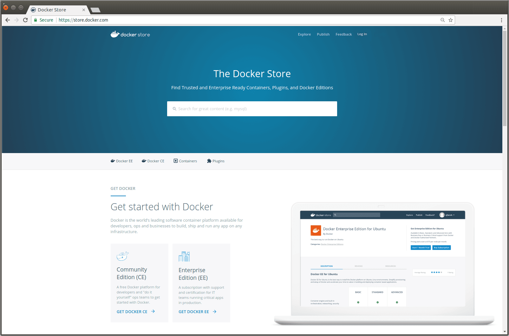
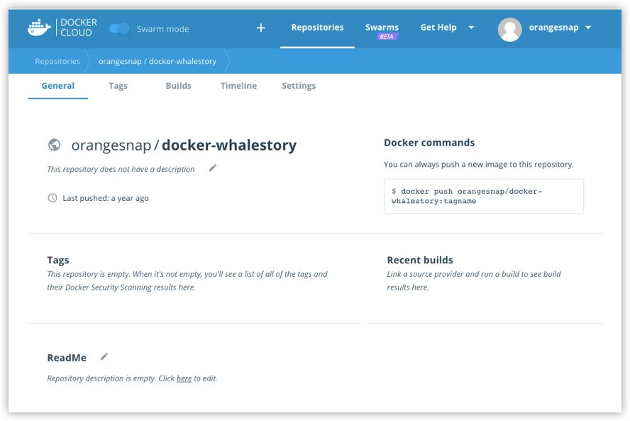
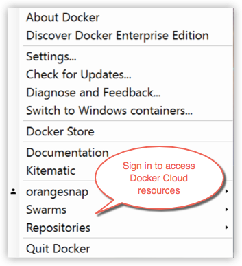

Welcome to Docker for Windows!

Docker is a full development platform for creating containerized apps, and
Docker for Windows is the best way to get started with Docker on Windows
systems.

> **Got Docker for Windows?** If you have not yet installed Docker for Windows, please see [Install Docker for Windows](install.md) for an explanation of stable
and edge channels, system requirements, and download/install information.

>**Looking for system requirements?** Check out
[What to know before you install](install.md#what-to-know-before-you-install), which has moved to the new install topic.
{: id="what-to-know-before-you-install" }

## Check versions of Docker Engine, Compose, and Machine

Start your favorite shell (`cmd.exe`, PowerShell, or other) to check your versions of `docker` and `docker-compose`, and verify the installation.

```none
PS C:\Users\Docker> docker --version
Docker version 17.03.0-ce, build 60ccb22

PS C:\Users\Docker> docker-compose --version
docker-compose version 1.11.2, build dfed245

PS C:\Users\Docker> docker-machine --version
docker-machine version 0.10.0, build 76ed2a6
```

## Explore the application and run examples

The next few steps take you through some examples. These are just suggestions for ways to experiment with Docker on your system, check version information, and make sure `docker` commands are working properly.

1.  Open a shell (`cmd.exe`, PowerShell, or other).

2.  Run some Docker commands, such as `docker ps`, `docker version`, and `docker info`.

    Here is the output of `docker ps` run in a powershell. (In this example, no containers are running yet.)

    ```none
    PS C:\Users\jdoe> docker ps

    CONTAINER ID        IMAGE               COMMAND             CREATED             STATUS              PORTS               NAMES
    ```

    Here is an example of command output for `docker version`.

    ```none
    PS C:\Users\Docker> docker version
    Client:
    Version:      17.03.0-ce
    API version:  1.26
    Go version:   go1.7.5
    Git commit:   60ccb22
    Built:        Thu Feb 23 10:40:59 2017
    OS/Arch:      windows/amd64

    Server:
    Version:      17.03.0-ce
    API version:  1.26 (minimum version 1.12)
    Go version:   go1.7.5
    Git commit:   3a232c8
    Built:        Tue Feb 28 07:52:04 2017
    OS/Arch:      linux/amd64
    Experimental: true
    ```

    Here is an example of command output for `docker info`.

    ```none
    PS C:\Users\Docker> docker info
    Containers: 0
     Running: 0
     Paused: 0
     Stopped: 0
    Images: 0
    Server Version: 17.03.0-ce
    Storage Driver: overlay2
     Backing Filesystem: extfs
     Supports d_type: true
     Native Overlay Diff: true
    Logging Driver: json-file
    Cgroup Driver: cgroupfs
    Plugins:
     Volume: local
     Network: bridge host ipvlan macvlan null overlay
    Swarm: inactive
    Runtimes: runc
    Default Runtime: runc
    Init Binary: docker-init
    containerd version: 977c511eda0925a723debdc94d09459af49d082a
    runc version: a01dafd48bc1c7cc12bdb01206f9fea7dd6feb70
    init version: 949e6fa
    Security Options:
     seccomp
      Profile: default
    Kernel Version: 4.9.12-moby
    Operating System: Alpine Linux v3.5
    OSType: linux
    Architecture: x86_64
    CPUs: 2
    Total Memory: 1.934 GiB
    Name: moby
    ID: BM4O:645U:LUS6:OGMD:O6WH:JINS:K7VF:OVDZ:7NE4:ZVJT:PSMQ:5UA6
    Docker Root Dir: /var/lib/docker
    Debug Mode (client): false
    Debug Mode (server): true
     File Descriptors: 13
     Goroutines: 21
     System Time: 2017-03-02T16:59:13.417299Z
     EventsListeners: 0
    Registry: https://index.docker.io/v1/
    Experimental: true
    Insecure Registries:
     127.0.0.0/8
    Live Restore Enabled: false
    ```

    >**Note**: The outputs above are examples. Your output for commands like
    > `docker version` and `docker info` will vary depending on your product
    > versions (e.g., as you install newer versions).

3.  Run `docker run hello-world` to test pulling an image from Docker Hub and starting a container.

    ```none
    PS C:\Users\jdoe> docker run hello-world

    Hello from Docker.
    This message shows that your installation appears to be working correctly.

    To generate this message, Docker took the following steps:
    1. The Docker client contacted the Docker daemon.
    2. The Docker daemon pulled the "hello-world" image from the Docker Hub.
    3. The Docker daemon created a new container from that image which runs the executable that produces the output you are currently reading.
    4. The Docker daemon streamed that output to the Docker client, which sent it to your terminal.
    ```

4.  Try something more ambitious, and run an Ubuntu container with this command.

    ```none
    PS C:\Users\jdoe> docker run -it ubuntu bash
    ```

    This will download the `ubuntu` container image and start it. Here is the output of running this command in a powershell.

    ```none
    PS C:\Users\jdoe> docker run -it ubuntu bash

    Unable to find image 'ubuntu:latest' locally
    latest: Pulling from library/ubuntu
    5a132a7e7af1: Pull complete
    fd2731e4c50c: Pull complete
    28a2f68d1120: Pull complete
    a3ed95caeb02: Pull complete
    Digest: sha256:4e85ebe01d056b43955250bbac22bdb8734271122e3c78d21e55ee235fc6802d
    Status: Downloaded newer image for ubuntu:latest
    ```

    Type `exit` to stop the container and close the powershell.

5.  Start a Dockerized webserver with this command:

    ```none
    PS C:\Users\jdoe> docker run -d -p 80:80 --name webserver nginx
    ```

    This will download the `nginx` container image and start it. Here is the
    output of running this command in a powershell.

    ```none
    PS C:\Users\jdoe> docker run -d -p 80:80 --name webserver nginx

    Unable to find image 'nginx:latest' locally
    latest: Pulling from library/nginx

    fdd5d7827f33: Pull complete
    a3ed95caeb02: Pull complete
    716f7a5f3082: Pull complete
    7b10f03a0309: Pull complete
    Digest: sha256:f6a001272d5d324c4c9f3f183e1b69e9e0ff12debeb7a092730d638c33e0de3e
    Status: Downloaded newer image for nginx:latest
    dfe13c68b3b86f01951af617df02be4897184cbf7a8b4d5caf1c3c5bd3fc267f
    ```

6.  Point your web browser at `http://localhost` to display the start page.

    (Since you specified the default HTTP port, it isn't necessary to append
    `:80` at the end of the URL.)

    

7.  Run `docker ps` while your webserver is running to see details on the
    container.

    ```none
    PS C:\Users\jdoe> docker ps

    CONTAINER ID        IMAGE               COMMAND                  CREATED             STATUS              PORTS
    NAMES
    dfe13c68b3b8        nginx               "nginx -g 'daemon off"   3 days ago          Up 45 seconds       0.0.0.0:80->80/tcp, 443/tc
    p   webserver
    ```

8.  Stop or remove containers and images.

    The `nginx` webserver will continue to run in the container on that port
    until you stop and/or remove the container. If you want to stop the
    webserver, type: `docker stop webserver` and start it again with `docker
    start webserver`.

    To stop and remove the running container with a single command, type:
    `docker rm -f webserver`. This will remove the container, but not the
    `nginx` image. You can list local images with `docker images`. You might
    want to keep some images around so that you don't have to pull them again
    from Docker Hub. To remove an image you no longer need, use `docker rmi` followed by an image ID or image name. For example, `docker rmi nginx`.

**Want more example applications?** [Get Started](/get-started/) and [Samples](/samples) are great places to start.

## Set up tab completion in PowerShell

If you would like to have handy tab completion for Docker commands, you can
install the [`posh-docker`](https://github.com/samneirinck/posh-docker)
PowerShell Module as follows.

> Prerequisite Notes
>
> * Depending on your setup, you might need the [NuGet package manager](https://www.nuget.org/){: target="_blank" class="_" } so you might get a prompt to install it.
>
> * Make sure you have administrator permissions to run an elevated PowerShell.

1.  Start an "elevated" PowerShell (i.e., run it as administrator).

    To do this, search for PowerShell, right-click, and choose **Run as administrator**.

    

    When asked if you want to allow this app to make changes to your device,
    click **Yes**.

2.  Set the
    [script execution policy](https://msdn.microsoft.com/en-us/powershell/reference/5.1/microsoft.powershell.security/set-executionpolicy)
    to allow downloaded scripts signed by trusted publishers to run on your
    computer. To do so, type this at the PowerShell prompt.

    ```ps
    Set-ExecutionPolicy RemoteSigned
    ```

    To check that the policy is set properly, run `get-executionpolicy`, which
    should return `RemoteSigned`.

3.  To install the `posh-docker` PowerShell module for auto-completion of Docker commands, type:

    ```ps
    Install-Module posh-docker
    ```

    Or, to install the module for the current user only, type:

    ```ps
    Install-Module -Scope CurrentUser posh-docker
    ```

4.  After installation to enable autocompletion for the current PowerShell only, type:

    ```ps
    Import-Module posh-docker
    ```

5.  To make tab completion persistent across all PowerShell sessions, add the
    command to a `$PROFILE` by typing these commands at the PowerShell prompt.

    ```ps
    if (-Not (Test-Path $PROFILE)) {
        New-Item $PROFILE –Type File –Force
    }

    Add-Content $PROFILE "`nImport-Module posh-docker"
    ```

    This creates a `$PROFILE` if one does not already exist, and adds this line
    into the file:

    ```ps
    Import-Module posh-docker
    ```

    To check that the file was properly created, or simply edit it manually,
    type this in PowerShell:

    ```ps
    Notepad $PROFILE
    ```

Open a new PowerShell session. Now, when you press tab after typing the first
few letters, Docker commands such as `start`, `stop`, `run`, and their options,
along with container and image names should now auto-complete.

## Docker Settings

When Docker is running, the Docker whale is displayed. By default, the Docker
whale icon is placed in the Notifications area. If it is hidden, click the up
arrow on the taskbar to show it.

> You can dock the whale on the taskbar so it is always visible
>
> You can pin the whale outside of the notification box so that it is
  always visible on the taskbar. To do this, drag-and-drop the whale icon. Or,
  right-click an empty portion of the taskbar, select Settings, and choose
  display options through taskbar settings for notifications.
>
> 


To get a popup menu with application options, right-click the whale:


>**Note:** The above example shows a user signed in for integrated
Docker Cloud access. To learn more about the feature, see
[Docker Cloud](#docker-cloud).

The **Settings** dialogs provide options to allow Docker auto-start,
automatically check for updates, share local drives with Docker containers,
enable VPN compatibility, manage CPUs and memory Docker uses, restart Docker, or
perform a factory reset.

### General


* **Start Docker when you log in** - Automatically start the Docker for Windows
  application upon Windows system login.

* **Check for updates when the application starts** - Docker for Windows is set
  to automatically check for updates and notify you when an update is available.
  If an update is found, click **OK** to accept and install it (or cancel to keep
  the current version). Uncheck this option if you do not want notifications of
  version upgrades. You can still find out about updates manually by choosing
  **Check for Updates** from the menu.

* **Send usage statistics** - You can set Docker for Windows to auto-send
  diagnostics, crash reports, and usage data. This information can help Docker
  improve the application and get more context for troubleshooting problems.

  Uncheck any of the options to opt out and prevent auto-send of
  data. Docker may prompt for more information in some cases,
  even with auto-send enabled.

### Shared Drives

Share your local drives (volumes) with Docker for Windows, so that they are
available to your containers.



You will be asked to provide your Windows system username and password (domain
user) to apply shared drives. You can select an option to have Docker store the
credentials so that you don't have to re-enter them every time.

Permissions to access shared drives are tied to the credentials you provide
here. If you run `docker` commands and tasks under a different username than the
one used here to set up sharing, your containers will not have permissions to
access the mounted volumes.

> Tips on shared drives, permissions, and volume mounts
>
 * Shared drives are only required for volume mounting
 [Linux containers](#switch-between-windows-and-linux-containers), not for
 Windows containers. For Linux containers, you need to share the drive where
 your project is located (i.e., where the Dockerfile and volume are located).
 Runtime errors such as file not found or cannot start service may indicate
 shared drives are needed. (See also
 [Volume mounting requires shared drives for Linux containers](troubleshoot.md#volume-mounting-requires-shared-drives-for-linux-containers).)
>
* If possible, avoid volume mounts from the Windows host, and instead  mount on
the MobyVM, or use a [data
volume](https://docs.docker.com/engine/tutorials/dockervolumes.md#data-volumes)
(named volume) or [data
container](/engine/tutorials/dockervolumes.md#creating-and-mounting-a-data-volume-container).
There are a number of issues with using host-mounted volumes and network paths
for database files. Please see the troubleshooting topic on [Volume mounts from
host paths use a nobrl option to override database
locking](/docker-for-windows/troubleshoot.md#volume-mounts-from-host-paths-use-a-nobrl-option-to-override-database-locking).
>
 * You cannot control (`chmod`) permissions on shared volumes for
deployed containers. Docker for Windows sets permissions to a default value of
[0755](http://permissions-calculator.org/decode/0755/) (`read`, `write`,
`execute` permissions for `user`, `read` and `execute` for `group`). This is not
configurable. See the troubleshooting topic [Permissions errors on data
directories for shared
volumes](troubleshoot.md#permissions-errors-on-data-directories-for-shared-volumes) for workarounds and more detail.
>
 * Make sure that the domain user has permissions to shared drives,
 as described in the troubleshooting topic ([Verify domain user has permissions for shared drives](troubleshoot.md#verify-domain-user-has-permissions-for-shared-drives-volumes)).
>
 * You can share local drives with your _containers_ but not with Docker Machine
nodes. See [Can I share local drives and filesystem with my Docker Machine
VMs?](faqs.md#can-i-share-local-drives-and-filesystem-with-my-docker-machine-vms) in the FAQs.
>

#### Firewall rules for shared drives

Shared drives require port 445 to be open between the host machine and the virtual
machine that runs Linux containers.

> **Note**: Docker detects if port 445 is closed and shows
the following message when you try to add a shared drive: 

To share the drive, allow connections between the Windows host machine and the
virtual machine in Windows Firewall or your third party firewall software. You
do not need to open port 445 on any other network. By default, allow connections
to 10.0.75.1 port 445 (the Windows host) from 10.0.75.2 (the virtual machine).
If the firewall rules appear to be open, consider [reinstalling the File and
Print Sharing service on the virtual network
adapter.](http://stackoverflow.com/questions/42203488/settings-to-windows-firewall-to-allow-docker-for-windows-to-share-drive/43904051#43904051)

#### Shared drives on demand

You can share a drive "on demand" the first time a particular mount is
requested.

If you run a Docker command from a shell with a volume mount (as shown in the
example below) or kick off a Compose file that includes volume mounts, you get a
popup asking if you want to share the specified drive.

You can select to **Share it**, in which case it is added your Docker for
Windows [Shared Drives list](/docker-for-windows/index.md#shared-drives) and
available to containers. Alternatively, you can opt not to share it by hitting
Cancel.


### Advanced


* **CPUs** - Change the number of processors assigned to the Linux VM.

* **Memory** - Change the amount of memory the Docker for Windows Linux VM uses.

Please note, updating these settings requires a reconfiguration and reboot of the Linux VM. This will take a few seconds.

### Network

You can configure Docker for Windows networking to work on a virtual private network (VPN).

* **Internal Virtual Switch** - You can specify a network address translation (NAT) prefix and subnet mask to enable internet connectivity.

* **DNS Server** - You can configure the DNS server to use dynamic or static IP addressing.


> **Note**: Some users reported problems connecting to Docker Hub on Docker for
> Windows stable version. This would manifest as an error when trying to run
> `docker` commands that pull images from Docker Hub that are not already
> downloaded, such as a first time run of `docker run hello-world`. If you
> encounter this, reset the DNS server to use the Google DNS fixed address:
> `8.8.8.8`. For more information, see
> [Networking issues](troubleshoot.md#networking-issues) in Troubleshooting.

Note that updating these settings requires a reconfiguration and reboot of the Linux VM.

### Proxies

Docker for Windows lets you configure HTTP/HTTPS Proxy Settings and automatically propagate these to Docker and to your containers.
For example, if you set your proxy settings to `http://proxy.example.com`, Docker will use this proxy when pulling containers.


When you start a container, you will see that your proxy settings propagate into the containers. For example:

```ps
PS C:\Users\jdoe> docker run alpine env
PATH=/usr/local/sbin:/usr/local/bin:/usr/sbin:/usr/bin:/sbin:/bin
HOSTNAME=b7edf988b2b5
TERM=xterm
HOME=/root
HTTP_PROXY=http://proxy.example.com:3128
http_proxy=http://proxy.example.com:3128
no_proxy=*.local, 169.254/16
```

You can see from the above output that the `HTTP_PROXY`, `http_proxy`, and `no_proxy` environment variables are set.
When your proxy configuration changes, Docker restarts automatically to pick up the new settings.
If you have containers that you wish to keep running across restarts, you should consider using [restart policies](/engine/reference/run/#restart-policies-restart).

<p id="daemon-experimental-mode" />
### Docker daemon

You can configure options on the Docker daemon that determine how your
containers will run. You can configure some **Basic** options on the daemon with interactive settings, or switch to **Advanced** to edit the JSON directly.

The settings offered on **Basic** dialog can be
configured directly in the JSON as well. This version just surfaces
some of the common settings to make it easier to configure them.

* [Experimental mode](#experimental-mode)
* [Custom registries](#custom-registries)
* [Edit the daemon configuration file](#edit-the-daemon-configuration-file)


#### Experimental mode

Both Docker for Windows Stable and Edge releases have the experimental version
of Docker Engine enabled, described in the [Docker Experimental Features
README](https://github.com/docker/cli/blob/master/experimental/README.md) on
GitHub.

Experimental features are not appropriate for production environments or
workloads. They are meant to be sandbox experiments for new ideas. Some
experimental features may become incorporated into upcoming stable releases, but
others may be modified or pulled from subsequent Edge releases, and never
released on Stable.

On both Edge and Stable releases, you can toggle **experimental mode** on and
off. If you toggle it off, Docker for Windows uses the current generally
available release of Docker Engine.

You can check whether you are running experimental mode or not by typing `docker
version` in a PowerShell. Experimental mode is listed under `Server` data.
If `Experimental` is `true`, then Docker is running in experimental mode, as
shown here. (If `false`, Experimental mode is off.)

```bash
PS C:\Users\Vicky> docker version
Client:
 Version:      1.13.0-rc4
 API version:  1.25
 Go version:   go1.7.3
 Git commit:   88862e7
 Built:        Sat Dec 17 01:34:17 2016
 OS/Arch:      windows/amd64

Server:
 Version:      1.13.0-rc4
 API version:  1.25 (minimum version 1.12)
 Go version:   go1.7.3
 Git commit:   88862e7
 Built:        Sat Dec 17 01:34:17 2016
 OS/Arch:      linux/amd64
 Experimental: true
```

#### Custom registries

You can set up your own [registries](/registry/introduction.md) on the **Basic**
Daemon settings.

As an alternative to using [Docker Hub](https://hub.docker.com/) to store your
public or private images or [Docker Trusted
Registry](/datacenter/dtr/2.1/guides/index.md), you can use Docker to set up
your own insecure [registry](/registry/introduction.md). Add URLs for insecure
registries and registry mirrors on which to host your images. (See also, [How do
I add custom CA certificates?](faqs.md#how-do-i-add-custom-ca-certificates) and [How do I add client certificates?](faqs.md#how-do-i-add-client-certificates) in
the FAQs.)

#### Edit the daemon configuration file

The **Advanced** daemon settings provide the original option to directly edit
the JSON configuration file for the [daemon](/engine/reference/commandline/dockerd.md).


For a full list of options on the Docker daemon, see
[daemon](/engine/reference/commandline/dockerd.md) in the Docker Engine command
line reference.

In that topic, see also:

* [Daemon configuration file](/engine/reference/commandline/dockerd.md#daemon-configuration-file)

* [Linux configuration file](/engine/reference/commandline/dockerd.md#linux-configuration-file)

* [Windows configuration file](/engine/reference/commandline/dockerd.md#windows-configuration-file)

Note that updating these settings requires a reconfiguration and reboot of the
Linux VM.

### Switch between Windows and Linux containers

You can select which daemon (Linux or Windows) the Docker
CLI talks to. Select **Switch to Windows containers** to toggle to Windows
containers. Select **Switch to Linux containers** to toggle back to the default, Linux containers.



Microsoft Developer Network has preliminary/draft information on Windows
containers
[here](https://msdn.microsoft.com/en-us/virtualization/windowscontainers/about/about_overview).

For a full list of options on the Docker daemon, see [daemon](/engine/reference/commandline/dockerd.md) in the Docker Engine command line reference.

In that topic, see also:

* [Daemon configuration file](/engine/reference/commandline/dockerd.md#daemon-configuration-file)

* [Linux configuration file](/engine/reference/commandline/dockerd.md#linux-configuration-file)

* [Windows configuration file](/engine/reference/commandline/dockerd.md#windows-configuration-file)

#### Getting started with Windows containers

If you are interested in working with Windows containers, here are some guides to help you get started.

* [Build and Run Your First Windows Server Container (Blog Post)](https://blog.docker.com/2016/09/build-your-first-docker-windows-server-container/)
  gives a quick tour of how to build and run native Docker Windows containers on
  Windows 10 and Windows Server 2016 evaluation releases.

* [Getting Started with Windows Containers (Lab)](https://github.com/docker/labs/blob/master/windows/windows-containers/README.md)
  shows you how to use the
  [MusicStore](https://github.com/aspnet/MusicStore/blob/dev/README.md)
  application with Windows containers. The MusicStore is a standard .NET
  application and,
  [forked here to use containers](https://github.com/friism/MusicStore), is a
  good example of a multi-container application.

  > **Disclaimer:** This lab is still in work, and is based off of the blog, but
  > you can test and leverage the example walkthroughs now, if you want to start
  > experimenting. Please check back as the lab evolves.

* This troubleshooting issue is useful for understanding how to connect to Windows containers from the local host:
[Limitations of Windows containers for `localhost` and published ports](troubleshoot.md#limitations-of-windows-containers-for-localhost-and-published-ports)

#### About the Docker Windows containers specific dialogs

When you switch to Windows containers, the Settings panel updates to show only
those [dialogs](#docker-settings) that are active and apply to your Windows
containers:

  * [General](#general)
  * [Proxies](#proxies)
  * [Docker daemon](#docker-daemon)
  * [Diagnose and Feedback](#diagnose-and-feedback)
  * [Reset](#reset)

Keep in mind that if you set proxies or daemon configuration in Windows
containers mode, these apply only on Windows containers. If you switch back to
Linux containers, proxies and daemon configurations return to what you had set
for Linux containers. Your Windows container settings are retained and become
available again when you switch back.

The following settings are **_not available in Windows containers mode_**,
because they do not apply to Windows containers:

  * [Shared Drives](#shared-drives)
  * [Network](#network)
  * [Advanced (CPU and Memory configuration)](#advanced)

### Docker Store

Choose **Docker Store** from the Docker for Windows menu to get to the Docker
app downloads site. [Docker store](https://store.docker.com/) is a component of
the next-generation Docker Hub, and the best place to find compliant, trusted
commercial and free software distributed as Docker Images.



### Docker Cloud

You can access your [Docker Cloud](/docker-cloud/index.md) account from
within Docker for Windows.



From the Docker for Windows menu, sign in to Docker Cloud with your Docker ID,
or create one.



Then use the Docker for Windows menu to create, view, or navigate directly to
your Cloud resources, including **organizations**, **repositories**, and
**swarms**.

Check out these [Docker Cloud topics](/docker-cloud/index.md) to learn more:

* [Organizations and Teams in Docker Cloud](/docker-cloud/orgs/index.md)
* [Builds and Images](/docker-cloud/builds/index.md)
* [Swarms in Docker Cloud](/docker-cloud/cloud-swarm/index.md)

Need a direct link to Cloud? [Take me to Docker
Cloud](https://cloud.docker.com/){: target="_blank" class="_" }.

### Giving feedback and getting help

To get help from the community, review current user topics, join or start a
discussion, log on to our [Docker for Windows
forum](https://forums.docker.com/c/docker-for-windows).

To report bugs or problems, log on to [Docker for Windows issues on
GitHub](https://github.com/docker/for-win/issues), where you can review
community reported issues, and file new ones. As a part of reporting issues on
GitHub, we can help you troubleshoot the log data. See the
[Diagnose and Feedback](#diagnose-and-feedback) topic below.

To give feedback on the documentation or update it yourself, use the Feedback
options at the bottom of each docs page.

### Diagnose and Feedback

If you encounter problems for which you do not find solutions in this
documentation, searching [Docker for Windows issues on
GitHub](https://github.com/docker/for-win/issues) already filed by other users,
or on the [Docker for Windows
forum](https://forums.docker.com/c/docker-for-windows), we can help you
troubleshoot the log data.

Select **Upload a diagnostic**.

This uploads (sends) the logs to Docker.


To create a new issue directly on GitHub, open
[Docker for Windows issues on GitHub](https://github.com/docker/for-win/issues)
in your web browser and follow the instructions in the README. Click
[New Issue](https://github.com/docker/for-win/issues/new) on that page to get a
"create new issue" template prepopulated with sections for the ID and summary of
your diagnostics, system and version details, description of expected and actual
behavior, and steps to reproduce the issue.


### Reset


* **Restart Docker** - Shuts down and restarts the Docker application.

* **Reset to Toolbox default machine content** - Imports containers and images
  from the existing Docker Toolbox machine named `default`. (This option is
  enabled only if you have Toolbox installed.) The VirtualBox VM will not be
  removed.

* **Reset to factory defaults** - Resets Docker to factory defaults. This is
  useful in cases where Docker stops working or becomes unresponsive.

## Adding TLS certificates

You can add trusted Certificate Authorities (CAs) (used to verify registry
server certificates) and client certificates (used to authenticate to
registries) to your Docker daemon.

To learn more, see [How do I add custom CA
certificates?](/docker-for-windows/faqs.md#how-do-i-add-custom-ca-certificates)
and [How do I add client
certificates?](/docker-for-windows/faqs.md#how-do-i-add-client-certificates) in
the FAQs.

## Where to go next

* Try out the walkthrough at [Get Started](/get-started/).

* Dig in deeper with [Docker Labs](https://github.com/docker/labs/) example walkthroughs and source code.

* For a summary of Docker command line interface (CLI) commands,
see the [Docker CLI Reference Guide](/engine/reference/commandline/docker.md).

* Check out the blog post
  [Introducing Docker 1.13.0](https://blog.docker.com/2017/01/whats-new-in-docker-1-13/).
