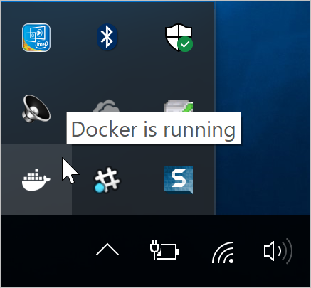
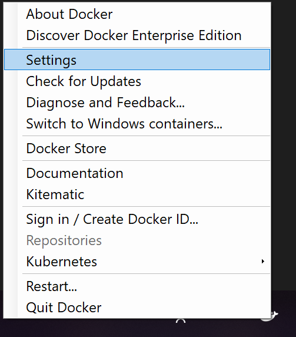
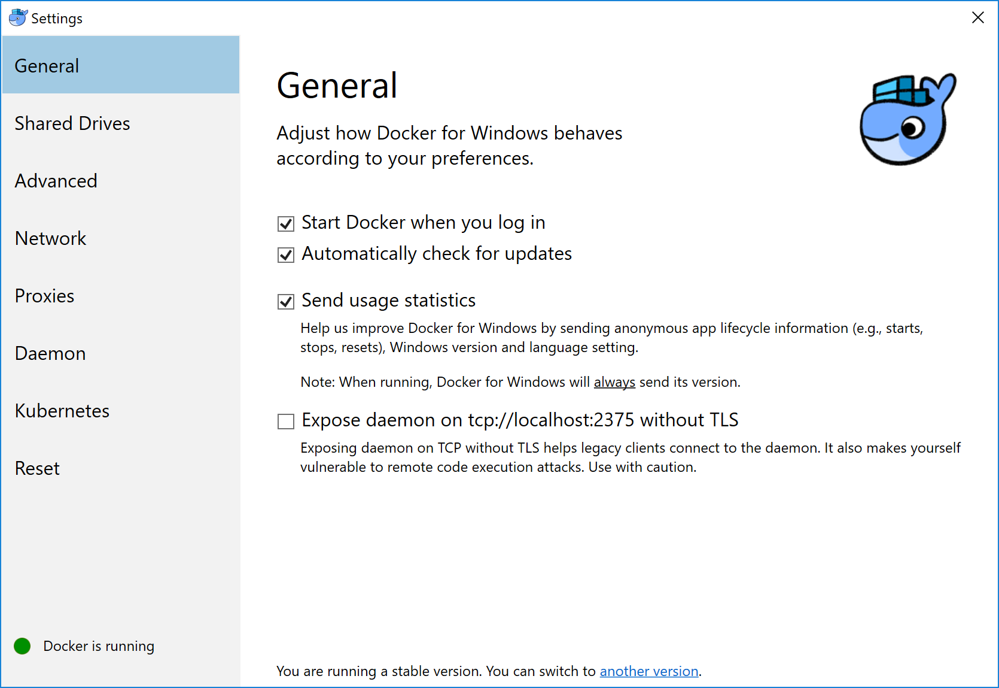
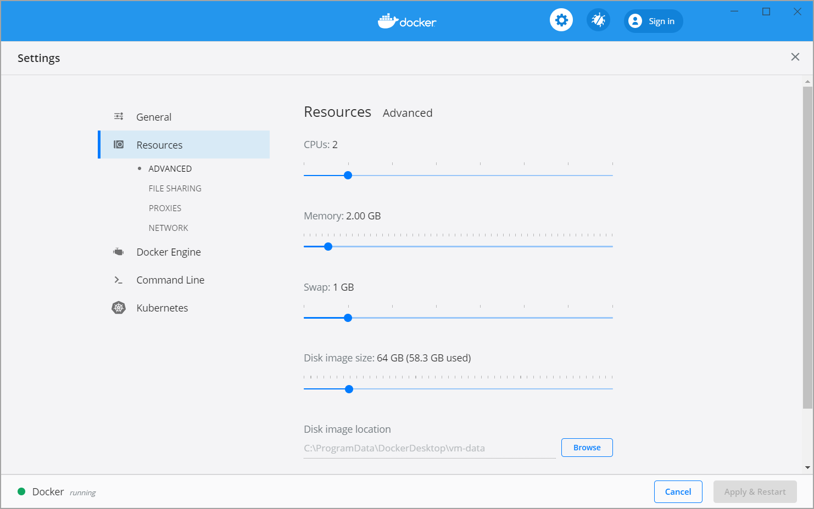
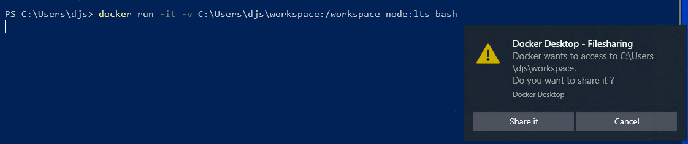
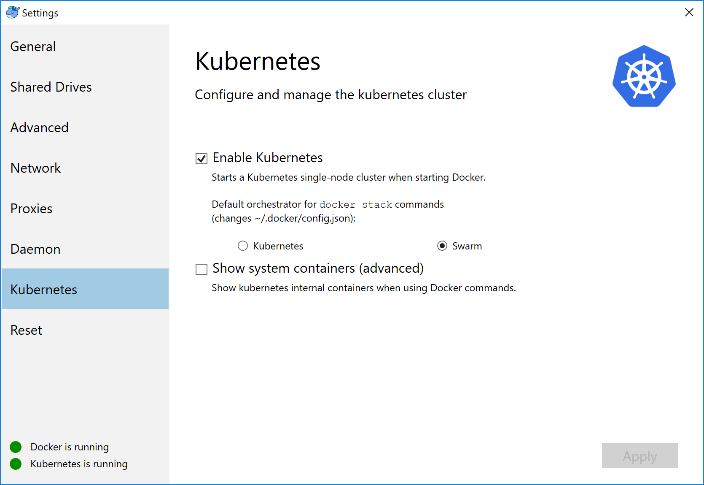

Welcome to Docker Desktop!

The _Docker Desktop for Windows_ section contains information about the Docker Desktop Community Stable release. For information about features available in Edge releases, see the [Edge release notes](edge-release-notes.md). For information about Docker Desktop Enterprise (DDE) releases, see [Docker Desktop Enterprise](/desktop/enterprise/).

Docker is a full development platform to build, run, and share containerized applications. Docker Desktop is the best way to get started with Docker _on Windows_.

See [Install Docker Desktop](install.md){: target="_blank" class="_"} for download information, system requirements, and installation instructions.

## Test your installation

1.  Open a terminal window (Command Prompt or PowerShell, _but not_ PowerShell ISE).

2.  Run `docker --version` to ensure that you have a supported version of Docker:

    ```shell
    > docker --version

    Docker version 19.03.1
    ```

3.  Pull the [hello-world image](https://hub.docker.com/r/library/hello-world/) from Docker Hub and run a container:

    ```shell
    > docker run hello-world

    docker : Unable to find image 'hello-world:latest' locally
    latest: Pulling from library/hello-world
    1b930d010525: Pull complete
    Digest: sha256:c3b4ada4687bbaa170745b3e4dd8ac3f194ca95b2d0518b417fb47e5879d9b5f
    Status: Downloaded newer image for hello-world:latest

    Hello from Docker!
    This message shows that your installation appears to be working correctly.
    ...

    ```

4.  List the `hello-world` _image_ that was downloaded from Docker Hub:

    ```shell
    > docker image ls
    ```

5.  List the `hello-world` _container_ (that exited after displaying "Hello from Docker!"):

    ```shell
    > docker container ls --all
    ```

6.  Explore the Docker help pages by running some help commands:

    ```shell
    > docker --help
    > docker container --help
    > docker container ls --help
    > docker run --help
    ```

## Explore the application

In this section, we demonstrate the ease and power of Dockerized applications by
running something more complex, such as an OS and a webserver.

1. Pull an image of the [Ubuntu OS](https://hub.docker.com/r/_/ubuntu/) and run an interactive terminal inside the spawned container:

    ```shell
    > docker run --interactive --tty ubuntu bash

    docker : Unable to find image 'ubuntu:latest' locally
    latest: Pulling from library/ubuntu
    22e816666fd6: Pull complete
    079b6d2a1e53: Pull complete
    11048ebae908: Pull complete
    c58094023a2e: Pull complete
    Digest: sha256:a7b8b7b33e44b123d7f997bd4d3d0a59fafc63e203d17efedf09ff3f6f516152
    Status: Downloaded newer image for ubuntu:latest
    ```

    > Do not use PowerShell ISE
    >
    > Interactive terminals do not work in PowerShell ISE (but they do in PowerShell). See [docker/for-win/issues/223](https://github.com/docker/for-win/issues/223).

2. You are in the container. At the root `#` prompt, check the `hostname` of the container:

    ```shell
    root@8aea0acb7423:/# hostname
    8aea0acb7423
    ```

    Notice that the hostname is assigned as the container ID (and is also used in the prompt).

3. Exit the shell with the `exit` command (which also stops the container):

    ```shell
    root@8aea0acb7423:/# exit
    >
    ```

4. List containers with the `--all` option (because no containers are running).

    The `hello-world` container (randomly named, `relaxed_sammet`) stopped after displaying its message. The `ubuntu` container (randomly named, `laughing_kowalevski`) stopped when you exited the container.

    ```shell
    > docker container ls --all

    CONTAINER ID    IMAGE          COMMAND     CREATED          STATUS                      PORTS    NAMES
    8aea0acb7423    ubuntu         "bash"      2 minutes ago    Exited (0) 2 minutes ago             laughing_kowalevski
    45f77eb48e78    hello-world    "/hello"    3 minutes ago    Exited (0) 3 minutes ago             relaxed_sammet
    ```

5. Pull and run a Dockerized [nginx](https://hub.docker.com/_/nginx/) web server that we name, `webserver`:

    ```shell
    > docker run --detach --publish 80:80 --name webserver nginx

    Unable to find image 'nginx:latest' locally
    latest: Pulling from library/nginx

    fdd5d7827f33: Pull complete
    a3ed95caeb02: Pull complete
    716f7a5f3082: Pull complete
    7b10f03a0309: Pull complete
    Digest: sha256:f6a001272d5d324c4c9f3f183e1b69e9e0ff12debeb7a092730d638c33e0de3e
    Status: Downloaded newer image for nginx:latest
    dfe13c68b3b86f01951af617df02be4897184cbf7a8b4d5caf1c3c5bd3fc267f
    ```

6. Point your web browser at `http://localhost` to display the nginx start page. (You don't need to append `:80` because you specified the default HTTP port in the `docker` command.)

    

7. List only your _running_ containers:

    ```shell
    > docker container ls

    CONTAINER ID    IMAGE    COMMAND                   CREATED          STATUS          PORTS                 NAMES
    0e788d8e4dfd    nginx    "nginx -g 'daemon of…"    2 minutes ago    Up 2 minutes    0.0.0.0:80->80/tcp    webserver
    ```

8. Stop the running nginx container by the name we assigned it, `webserver`:

    ```shell
    >  docker container stop webserver
    ```

9. Remove all three containers by their names -- the latter two names will differ for you:

    ```shell
    > docker container rm webserver laughing_kowalevski relaxed_sammet
    ```

## Docker Settings dialog

The **Docker Desktop** menu allows you to configure your Docker settings such as installation, updates, version channels, Docker Hub login,
and more.

This section explains the configuration options accessible from the **Settings** dialog.

1. Open the Docker Desktop menu by clicking the Docker icon in the Notifications area (or System tray):

    {:width="250px"}

2. Select **Settings** to open the Settings dialog:

    {:width="300px"}

### General

On the **General** tab of the Settings dialog, you can configure when to start and update Docker.

{:width="750px"}

* **Start Docker when you log in** - Automatically start Docker Desktop upon Windows system login.

* **Automatically check for updates** - By default, Docker Desktop automatically checks for updates and notifies you when an update is available.
Click **OK** to accept and install updates (or cancel to keep the current
version). You can manually update by choosing **Check for Updates** from the
main Docker menu.

* **Expose daemon on tcp://localhost:2375 without TLS** - Click this option to enable legacy clients to connect to the Docker daemon. You must use this option with caution as exposing the daemon without TLS can result in remote code execution attacks.

* **Send usage statistics** - By default, Docker Desktop sends diagnostics,
crash reports, and usage data. This information helps Docker improve and
troubleshoot the application. Clear the check box to opt out. Docker may periodically prompt you for more information.

  Click **Switch to the Edge version** to learn more about Docker Desktop Edge releases.

### Resources

The **Resources** tab allows you to configure CPU, memory, disk, proxies, 
network, and other resources. Different settings are available for 
configuration depending on whether you are using Linux containers in WSL 2 
mode, Linux containers in Hyper-V mode, or Windows containers.

{:width="750px"}

#### Advanced

> **Note**
>
> The Advanced tab is only available in Hyper-V mode, because in WSL 2 mode and 
> Windows container mode these resources are managed by Windows. In WSL 2 
> mode, you can configure limits on the memory, CPU, and swap size allocated
> to the [WSL 2 utility VM](https://docs.microsoft.com/en-us/windows/wsl/release-notes#build-18945).

Use the **Advanced** tab to limit resources available to Docker.

**CPUs**: By default, Docker Desktop is set to use half the number of processors
available on the host machine. To increase processing power, set this to a
higher number; to decrease, lower the number.

**Memory**: By default, Docker Desktop is set to use `2` GB runtime memory,
allocated from the total available memory on your machine. To increase the RAM, set this to a higher number. To decrease it, lower the number.

**Swap**: Configure swap file size as needed. The default is 1 GB.

**Disk image size**: Specify the size of the disk image.

**Disk image location**: Specify the location of the Linux volume where containers and images are stored.

You can also move the disk image to a different location. If you attempt to move a disk image to a location that already has one, you get a prompt asking if you want to use the existing image or replace it.

#### File sharing

> **Note**
>
> The File sharing tab is only available in Hyper-V mode, because in WSL 2 mode 
> and Windows container mode all files are automatically shared by Windows.

Use File sharing to allow local directories on Windows to be shared with Linux containers.
This is especially useful for
editing source code in an IDE on the host while running and testing the code in a container.
Note that configuring file sharing is not necessary for Windows containers, only [Linux containers](#switch-between-windows-and-linux-containers).
 If a directory is not shared with a Linux container you may get `file not found` or `cannot start service` errors at runtime. See [Volume mounting requires shared folders for Linux containers](troubleshoot.md#volume-mounting-requires-shared-folders-for-linux-containers).

File share settings are:

- **Add a Directory**: Click `+` and navigate to the directory you want to add.

- **Apply & Restart** makes the directory available to containers using Docker's
  bind mount (`-v`) feature.

> Tips on shared folders, permissions, and volume mounts
>
 * Shared folders are designed to allow application code to be edited on the host while being executed in containers. For non-code items
 such as cache directories or databases, the performance will be much better if they are stored in
 the Linux VM, using a [data volume](../storage/volumes.md)
 (named volume) or [data container](../storage/volumes.md).
>
 * Docker Desktop sets permissions to read/write/execute for users, groups and others [0777 or a+rwx](http://permissions-calculator.org/decode/0777/).
   This is not configurable. See [Permissions errors on data directories for shared volumes](troubleshoot.md#permissions-errors-on-data-directories-for-shared-volumes).
>
 * Windows presents a case-insensitive view of the filesystem to applications while Linux is case-sensitive. On Linux it is possible to create 2 separate files: `test` and `Test`, while on Windows these filenames would actually refer to the same underlying file. This can lead to problems where an app works correctly on a developer Windows machine (where the file contents are shared) but fails when run in Linux in production (where the file contents are distinct). To avoid this, Docker Desktop insists that all shared files are accessed as their original case. Therefore if a file is created called `test`, it must be opened as `test`. Attempts to open `Test` will fail with "No such file or directory". Similarly once a file called `test` is created, attempts to create a second file called `Test` will fail.

#### Shared folders on demand

You can share a folder "on demand" the first time a particular folder is used by a container.

If you run a Docker command from a shell with a volume mount (as shown in the
example below) or kick off a Compose file that includes volume mounts, you get a
popup asking if you want to share the specified folder.

You can select to **Share it**, in which case it is added your Docker Desktop Shared Folders list and available to
containers. Alternatively, you can opt not to share it by selecting **Cancel**.

{:width="600px"}

#### Proxies

Docker Desktop lets you configure HTTP/HTTPS Proxy Settings and
automatically propagates these to Docker. For example, if you set your proxy
settings to `http://proxy.example.com`, Docker uses this proxy when pulling containers.

Your proxy settings, however, will not be propagated into the containers you start.
If you wish to set the proxy settings for your containers, you need to define
environment variables for them, just like you would do on Linux, for example:

```ps
> docker run -e HTTP_PROXY=http://proxy.example.com:3128 alpine env

PATH=/usr/local/sbin:/usr/local/bin:/usr/sbin:/usr/bin:/sbin:/bin
HOSTNAME=b7edf988b2b5
TERM=xterm
HOME=/root
HTTP_PROXY=http://proxy.example.com:3128
```

For more information on setting environment variables for running containers,
see [Set environment variables](/engine/reference/commandline/run/#set-environment-variables--e---env---env-file).

#### Network

> **Note**
>
> The Network tab is not available in Windows container mode because networking is 
> managed by Windows.

You can configure Docker Desktop networking to work on a virtual private network (VPN). Specify a network address translation (NAT) prefix and subnet mask to enable Internet connectivity.

**DNS Server**: You can configure the DNS server to use dynamic or static IP addressing.

> **Note**: Some users reported problems connecting to Docker Hub on Docker Desktop Stable version. This would manifest as an error when trying to run
> `docker` commands that pull images from Docker Hub that are not already
> downloaded, such as a first time run of `docker run hello-world`. If you
> encounter this, reset the DNS server to use the Google DNS fixed address:
> `8.8.8.8`. For more information, see
> [Networking issues](troubleshoot.md#networking-issues) in Troubleshooting.

Updating these settings requires a reconfiguration and reboot of the Linux VM.

#### WSL Integration

In WSL 2 mode, you can configure which WSL 2 distributions will have the Docker 
WSL integration.

By default, the integration will be enabled on your default WSL distribution. 
To change your default WSL distro, run `wsl --set-default <distro name>`. (For example, 
to set Ubuntu as your default WSL distro, run `wsl --set-default ubuntu`).

You can also select any additional distributions you would like to enable the WSL 2 
integration on.

For more details on configuring Docker Desktop to use WSL 2, see 
[Docker Desktop WSL 2 backend](wsl.md).

### Docker Engine

The Docker Engine page allows you to configure the Docker daemon to determine how your containers run.

Type a JSON configuration file in the box to configure the daemon settings. For a full list of options, see the Docker Engine
[dockerd commandline reference](/engine/reference/commandline/dockerd/){:target="_blank"
class="_"}.

Click **Apply & Restart** to save your settings and restart Docker Desktop.

### Command Line

On the Command Line page, you can specify whether or not to enable experimental features.

On both Docker Desktop Edge and Stable releases, you can toggle the experimental features on and off. If you toggle the experimental features off, Docker Desktop uses the current generally available release of Docker Engine.

#### Experimental features

Docker Desktop Edge releases have the experimental version
of Docker Engine enabled by default, described in the [Docker Experimental Features README](https://github.com/docker/cli/blob/master/experimental/README.md) on GitHub.



Run `docker version` to verify whether you have enabled experimental features. Experimental mode
is listed under `Server` data. If `Experimental` is `true`, then Docker is
running in experimental mode, as shown here:

```shell
> docker version

Client: Docker Engine - Community
 Version:           19.03.1
 API version:       1.40
 Go version:        go1.12.5
 Git commit:        74b1e89
 Built:             Thu Jul 25 21:17:08 2019
 OS/Arch:           windows/amd64
 Experimental:      true

Server: Docker Engine - Community
 Engine:
  Version:          19.03.1
  API version:      1.40 (minimum version 1.12)
  Go version:       go1.12.5
  Git commit:       74b1e89
  Built:            Thu Jul 25 21:17:52 2019
  OS/Arch:          linux/amd64
  Experimental:     true
 containerd:
  Version:          v1.2.6
  GitCommit:        894b81a4b802e4eb2a91d1ce216b8817763c29fb
 runc:
  Version:          1.0.0-rc8
  GitCommit:        425e105d5a03fabd737a126ad93d62a9eeede87f
 docker-init:
  Version:          0.18.0
  GitCommit:        fec3683
```

### Kubernetes

> **Note**
>
> The Kubernetes tab is not available in Windows container mode.

Docker Desktop includes a standalone Kubernetes server that runs on your Windows host, so that you can test deploying your Docker workloads on Kubernetes.

{:width="750px"}

The Kubernetes client command, `kubectl`, is included and configured to connect
to the local Kubernetes server. If you have `kubectl` already installed and
pointing to some other environment, such as `minikube` or a GKE cluster, be sure
to change context so that `kubectl` is pointing to `docker-desktop`:

```bash
> kubectl config get-contexts
> kubectl config use-context docker-desktop
```

 To enable Kubernetes support and install a standalone instance of Kubernetes
  running as a Docker container, select **Enable Kubernetes**.

To set Kubernetes as the
  [default orchestrator](/docker-for-mac/kubernetes/#override-the-default-orchestrator), select **Deploy Docker Stacks to Kubernetes by default**.

By default, Kubernetes containers are hidden from commands like `docker
service ls`, because managing them manually is not supported. To make them
visible, select **Show system containers (advanced)**. Most users do not need this option.

Click **Apply & Restart** to save the settings. This instantiates images required to run the Kubernetes server as containers, and installs the `kubectl.exe` command in the path.

- When Kubernetes is enabled and running, an additional status bar item displays
at the bottom right of the Docker Desktop Settings dialog. The status of Kubernetes shows in the Docker menu and the context points to
  `docker-desktop`.

- To disable Kubernetes support at any time, clear the **Enable Kubernetes** check box.
  The Kubernetes containers are stopped and removed, and the
  `/usr/local/bin/kubectl` command is removed.

- To delete all stacks and Kubernetes resources, select **Reset Kubernetes Cluster**.

- If you installed `kubectl` by another method, and
experience conflicts, remove it.

  For more information on using the Kubernetes integration with Docker Desktop, see [Deploy on Kubernetes](kubernetes.md).

### Reset

The **Restart Docker Desktop** and **Reset to factory defaults** options are now available on the **Troubleshoot** menu. For information, see [Logs and Troubleshooting](troubleshoot.md).

### Troubleshoot

Visit our [Logs and Troubleshooting](troubleshoot.md) guide for more details.

Log on to our [Docker Desktop for Windows forum](https://forums.docker.com/c/docker-for-windows) to get help from the community, review current user topics, or join a discussion.

Log on to [Docker Desktop for Windows issues on GitHub](https://github.com/docker/for-win/issues) to report bugs or problems and review community reported issues.

For information about providing feedback on the documentation or update it yourself, see [Contribute to documentation](/opensource/).

## Switch between Windows and Linux containers

From the Docker Desktop menu, you can toggle which daemon (Linux or Windows)
the Docker CLI talks to. Select **Switch to Windows containers** to use Windows
containers, or select **Switch to Linux containers** to use Linux containers
(the default).

For more information on Windows containers, refer to the following documentation:

- Microsoft documentation on [Windows containers](https://docs.microsoft.com/en-us/virtualization/windowscontainers/about/index).

- [Build and Run Your First Windows Server Container (Blog Post)](https://blog.docker.com/2016/09/build-your-first-docker-windows-server-container/)
  gives a quick tour of how to build and run native Docker Windows containers on Windows 10 and Windows Server 2016 evaluation releases.

- [Getting Started with Windows Containers (Lab)](https://github.com/docker/labs/blob/master/windows/windows-containers/README.md)
  shows you how to use the [MusicStore](https://github.com/aspnet/MusicStore/blob/dev/README.md)
  application with Windows containers. The MusicStore is a standard .NET application and,
  [forked here to use containers](https://github.com/friism/MusicStore), is a good example of a multi-container application.

- To understand how to connect to Windows containers from the local host, see
  [Limitations of Windows containers for `localhost` and published ports](troubleshoot.md#limitations-of-windows-containers-for-localhost-and-published-ports)

> Settings dialog changes with Windows containers
>
> When you switch to Windows containers, the Settings dialog only shows those tabs that are active and apply to your Windows containers:
>

  * [General](#general)
  * [Proxies](#proxies)
  * [Daemon](#docker-daemon)
  * [Reset](#reset)

If you set proxies or daemon configuration in Windows containers mode, these
apply only on Windows containers. If you switch back to Linux containers,
proxies and daemon configurations return to what you had set for Linux
containers. Your Windows container settings are retained and become available
again when you switch back.

## Dashboard

The Docker Desktop Dashboard enables you to interact with containers and applications and manage the lifecycle of your applications directly from your machine. The Dashboard UI shows all running, stopped, and started containers with their state. It provides an intuitive interface to perform common actions to inspect and manage containers and Docker Compose applications. For more information, see [Docker Desktop Dashboard](../desktop/dashboard.md).

## Docker Hub

Select **Sign in /Create Docker ID** from the Docker Desktop menu to access your [Docker Hub](https://hub.docker.com/){: target="_blank" class="_" } account. Once logged in, you can access your Docker Hub repositories directly from the Docker Desktop menu.

For more information, refer to the following [Docker Hub topics](../docker-hub/index.md){: target="_blank" class="_" }:

* [Organizations and Teams in Docker Hub](../docker-hub/orgs.md){: target="_blank" class="_" }
* [Builds and Images](../docker-hub/builds/index.md){: target="_blank" class="_" }

### Two-factor authentication

Docker Desktop enables you to sign into Docker Hub using two-factor authentication. Two-factor authentication provides an extra layer of security when accessing your Docker Hub account.

You must enable two-factor authentication in Docker Hub before signing into your Docker Hub account through Docker Desktop. For instructions, see [Enable two-factor authentication for Docker Hub](/docker-hub/2fa/).

After you have enabled two-factor authentication:

1. Go to the Docker Desktop menu and then select **Sign in / Create Docker ID**.

2. Enter your Docker ID and password and click **Sign in**.

3. After you have successfully signed in, Docker Desktop prompts you to enter the authentication code. Enter the six-digit code from your phone and then click **Verify**.

{:width="500px"}

After you have successfully authenticated, you can access your organizations and repositories directly from the Docker Desktop menu.

## Adding TLS certificates

You can add trusted **Certificate Authorities (CAs)** to your Docker daemon to verify registry server
certificates, and **client certificates**, to authenticate to registries. For more information, see [How do I add custom CA certificates?](faqs.md#how-do-i-add-custom-ca-certificates)
and [How do I add client certificates?](faqs.md#how-do-i-add-client-certificates)
in the FAQs.

### How do I add custom CA certificates?

Docker Desktop supports all trusted Certificate Authorities (CAs) (root or
intermediate). Docker recognizes certs stored under Trust Root
Certification Authorities or Intermediate Certification Authorities.

Docker Desktop creates a certificate bundle of all user-trusted CAs based on
the Windows certificate store, and appends it to Moby trusted certificates. Therefore, if an enterprise SSL certificate is trusted by the user on the host, it is trusted by Docker Desktop.

To learn more about how to install a CA root certificate for the registry, see
[Verify repository client with certificates](../engine/security/certificates.md)
in the Docker Engine topics.

### How do I add client certificates?

You can add your client certificates
in `~/.docker/certs.d/<MyRegistry>:<Port>/client.cert` and
`~/.docker/certs.d/<MyRegistry>:<Port>/client.key`. You do not need to push your certificates with `git` commands.

When the Docker Desktop application starts, it copies the
`~/.docker/certs.d` folder on your Windows system to the `/etc/docker/certs.d`
directory on Moby (the Docker Desktop virtual machine running on Hyper-V).

You need to restart Docker Desktop after making any changes to the keychain
or to the `~/.docker/certs.d` directory in order for the changes to take effect.

The registry cannot be listed as an _insecure registry_ (see
[Docker Daemon](#docker-engine)). Docker Desktop ignores
certificates listed under insecure registries, and does not send client
certificates. Commands like `docker run` that attempt to pull from the registry
produce error messages on the command line, as well as on the registry.

To learn more about how to set the client TLS certificate for verification, see
[Verify repository client with certificates](../engine/security/certificates.md)
in the Docker Engine topics.

## Where to go next

* Try out the walkthrough at [Get Started](../get-started/index.md){: target="_blank" class="_"}.

* Dig in deeper with [Docker Labs](https://github.com/docker/labs/) example walkthroughs and source code.

* Refer to the [Docker CLI Reference Guide](/engine/reference/commandline/cli/){: target="_blank" class="_"}.
