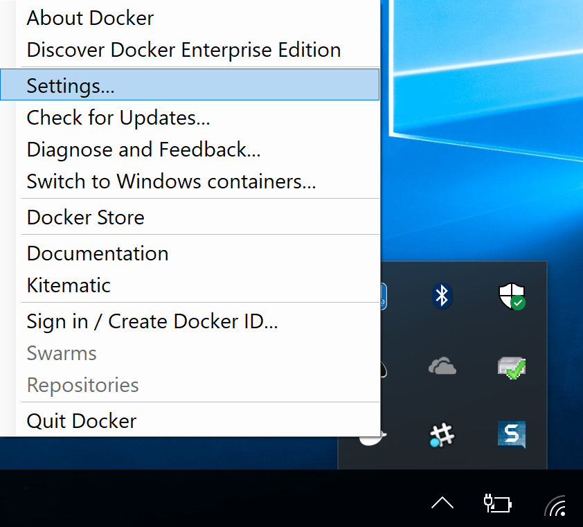
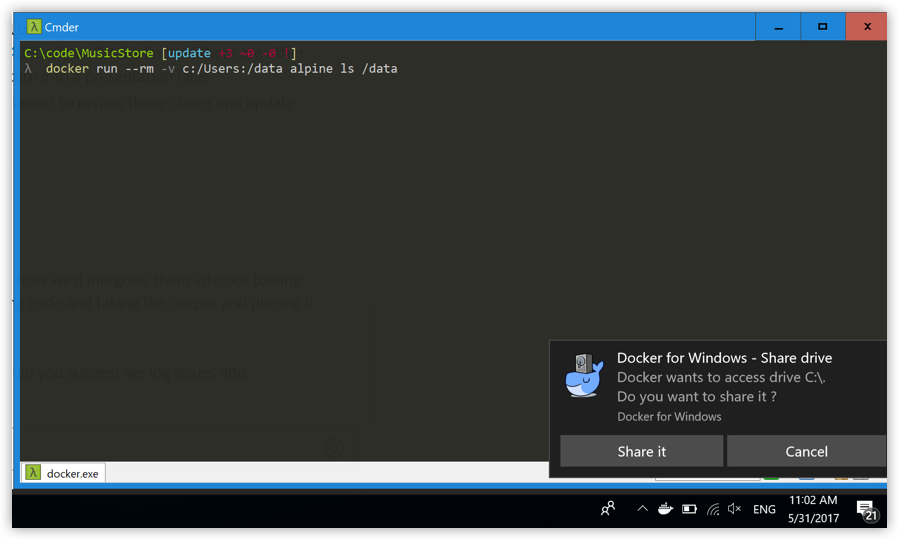
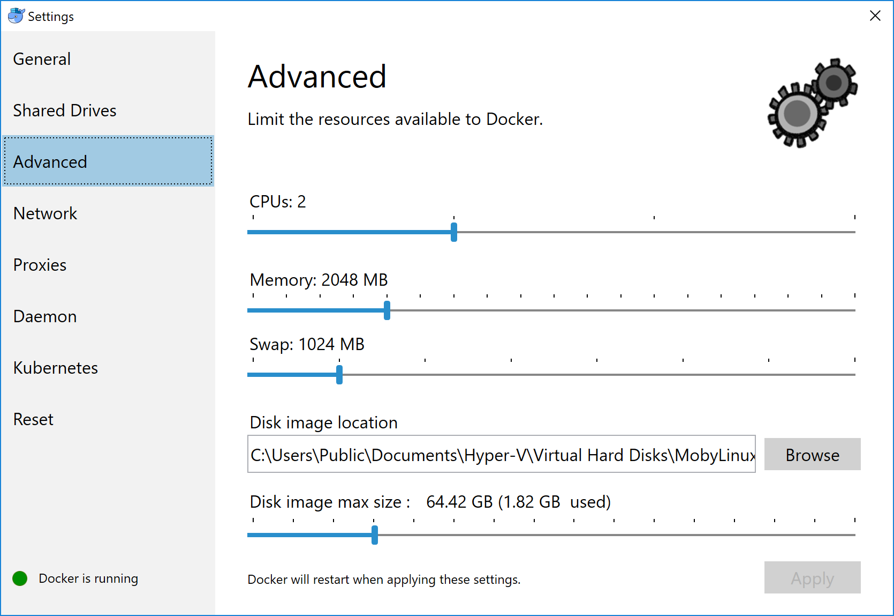
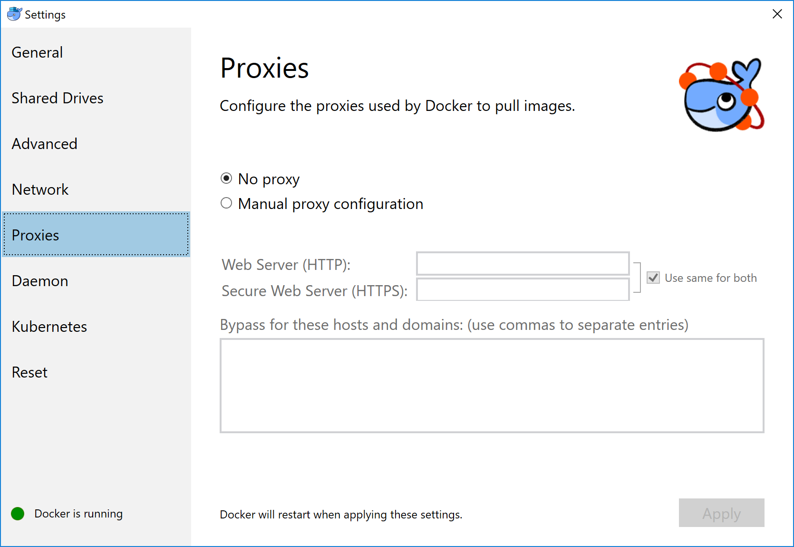
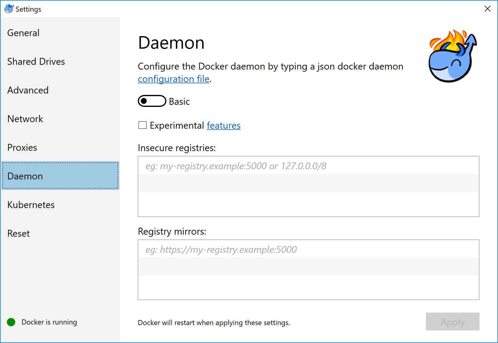
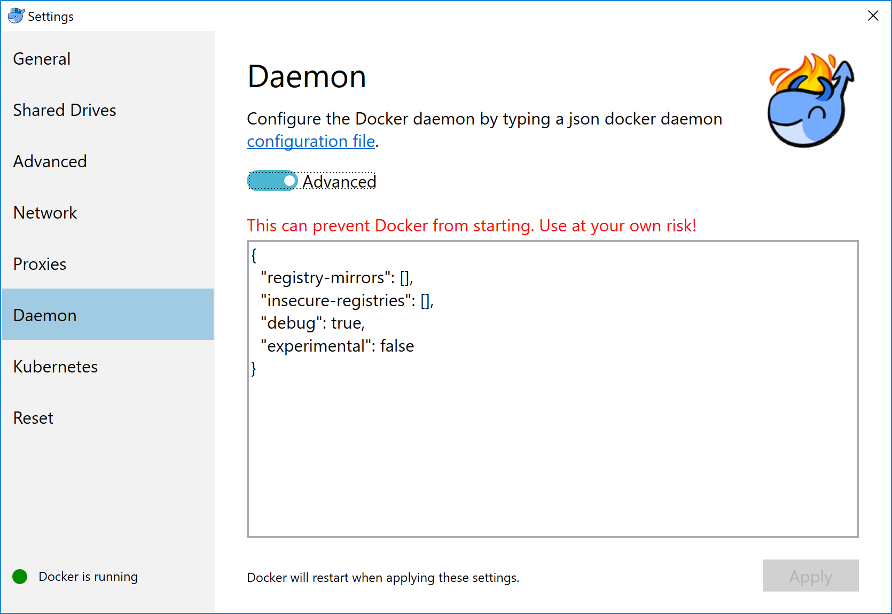
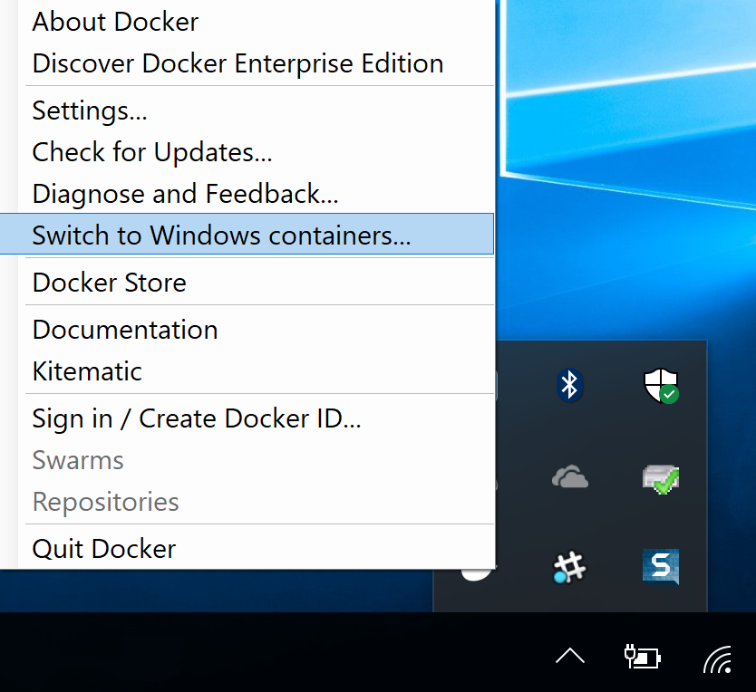

Welcome to Docker for Windows! Docker is a full development platform for
creating containerized apps, and Docker for Windows is the best way to get
started with Docker _on Windows_ systems.

> See [Install Docker for Windows](install.md){: target="_blank" class="_"} for information on system requirements and stable & edge channels.

## Check versions

Start your favorite shell (`cmd.exe`, PowerShell, or other) and ensure your
versions of `docker`, `docker-compose`, and `docker-machine` are up-to-date and
compatible with `Docker.app`. Your output may differ if you are running
different versions.

```none
PS C:\Users\Gordon> docker --version
Docker version 17.12.0-ce, build c97c6d6

PS C:\Users\Gordon> docker-compose --version
docker-compose version 1.18.0, build 8dd22a96

PS C:\Users\Gordon> docker-machine --version
docker-machine.exe version 0.13.0, build 9ba6da9
```

## Explore the application

The next few steps take you through some examples. These are just suggestions
for ways to experiment with Docker on your system, check version information,
and make sure `docker` commands are working properly.

> Quote syntax
>
> Use double quotes (") when specifying docker command parameters in PowerShell.
{: .important}

1.  Open a shell (`cmd.exe`, PowerShell, or other).

2.  Run `docker run hello-world` to test pulling an image from Docker Hub and starting a container.

    ```none
    PS C:\Users\Gordon> docker run hello-world

    docker : Unable to find image 'hello-world:latest' locally
    ...

    latest:
    Pulling from library/hello-world
    ca4f61b1923c:
    Pulling fs layer
    ca4f61b1923c:
    Download complete
    ca4f61b1923c:
    Pull complete
    Digest: sha256:97ce6fa4b6cdc0790cda65fe7290b74cfebd9fa0c9b8c38e979330d547d22ce1
    Status: Downloaded newer image for hello-world:latest

    Hello from Docker!
    This message shows that your installation appears to be working correctly.
    ...
    ```
3.  List the hello-world image:

    ```none
    docker image ls
    ```

4.  Run an image of the Ubuntu OS:

    ```none
    PS C:\Users\Gordon> docker run -it ubuntu bash

    docker : Unable to find image 'ubuntu:latest' locally
    ...

    latest:
    Pulling from library/ubuntu
    22dc81ace0ea:
    Pulling fs layer
    1a8b3c87dba3:
    Pulling fs layer
    91390a1c435a:
    Pulling fs layer
    ...
    Digest: sha256:e348fbbea0e0a0e73ab0370de151e7800684445c509d46195aef73e090a49bd6
    Status: Downloaded newer image for ubuntu:latest
    ```

5.  Open a second PowerShell tab and list all the containers.

    The hello-world container exited after displaying its message. The Ubuntu container is still running:

    ```none
    PS C:\Users\Gordon> docker container ls --all
    CONTAINER ID      IMAGE            COMMAND       CREATED            STATUS                        PORTS      NAMES
    64b5205999ed      ubuntu           "bash"        2 minutes ago      Up 2 minutes                             laughing_kowalevski
    45f77eb48e78      hello-world      "/hello"      3 minutes ago      Exited (0) 3 minutes ago                 relaxed_sammet
    ```

6.  In the first PowerShell tab, press `Ctrl+c` to stop the Ubuntu conatiner.

7.  Now start a Dockerized  `nginx` webserver:

    ```none
    PS C:\Users\Gordon> docker run -d -p 80:80 --name webserver nginx

    Unable to find image 'nginx:latest' locally
    latest: Pulling from library/nginx

    fdd5d7827f33: Pull complete
    a3ed95caeb02: Pull complete
    716f7a5f3082: Pull complete
    7b10f03a0309: Pull complete
    Digest: sha256:f6a001272d5d324c4c9f3f183e1b69e9e0ff12debeb7a092730d638c33e0de3e
    Status: Downloaded newer image for nginx:latest
    dfe13c68b3b86f01951af617df02be4897184cbf7a8b4d5caf1c3c5bd3fc267f
    ```

8.  Point your web browser at `http://localhost` to display the start page. Because you specified the default HTTP port, it isn't necessary to append `:80` at the end of the URL.

    

9.  Stop and remove your containers:

    ```none
    docker container ls
    docker container stop webserver
    docker container start webserver
    docker container stop $(docker container ls -aq)
    ```

## Docker Settings

When Docker is running, the whale icon displays in the Notifications area (or
System tray). Right-click to access the **Settings** dialog.

{:width="300px"}

The Settings dialog provides options to allow Docker auto-start, automatically
check for updates, share local drives with Docker containers, enable VPN
compatibility, manage CPUs and memory Docker uses, restart Docker, or perform a
factory reset.

{:width="500px"}

### General

{:width="600px"}

* **Start Docker when you log in** - Automatically start the Docker for Windows
  application upon Windows system login.

* **Automatically check for updates** - By default, Docker for Windows
automatically checks for updates and notifies you when an update is available.
Click **OK** to accept and install updates (or cancel to keep the current
version). You can manually update by choosing **Check for Updates** from the
main menu.

* **Send usage statistics** - By default, Docker for Windows auto-sends
  diagnostics, crash reports, and usage data. This information helps Docker
  improve the application and get more context for troubleshooting problems.
  Uncheck to opt out. Docker may prompt for more information in some cases, even
  with auto-send enabled.

### Shared Drives

Share your local drives (volumes) with Docker for Windows, so that they are
available to your containers.

{:width="600px"}

You are prompted for your Windows system username and password (domain
user) to apply shared drives. You can select an option to have Docker store the
credentials so that you don't need to re-enter them every time.

Permissions to access shared drives are tied to the credentials you provide
here. If you run `docker` commands and tasks under a different username than the
one used here to set up sharing, your containers do not have permissions to
access the mounted volumes.

> Tips on shared drives, permissions, and volume mounts
>
 * Shared drives are only required for mounting volumes in [Linux containers](#switch-between-windows-and-linux-containers),
 not for Windows containers. For Linux containers, you need to share the drive
 where the Dockerfile and volume are located. If you get errors such as `file not found`
 or `cannot start service` you may need to enable shared drives. See [Volume mounting requires shared drives for Linux containers](troubleshoot.md#volume-mounting-requires-shared-drives-for-linux-containers).)
>
 * If possible, avoid volume mounts from the Windows host, and instead mount on
 the MobyVM, or use a [data volume](/engine/tutorials/dockervolumes.md#data-volumes)
 (named volume) or [data container](/engine/tutorials/dockervolumes.md#creating-and-mounting-a-data-volume-container).
 There are a number of issues with using host-mounted volumes and network paths
 for database files. See [Volume mounts from host paths use a nobrl option to override database locking](troubleshoot.md#volume-mounts-from-host-paths-use-a-nobrl-option-to-override-database-locking).
>
 * Docker for Windows sets permissions to read/write/execute for users and
   read/execute for groups and others [0755 or u+rwx,go+rx](http://permissions-calculator.org/decode/0755/).
   This is not configurable. See [Permissions errors on data directories for shared volumes](troubleshoot.md#permissions-errors-on-data-directories-for-shared-volumes).
>
 * Ensure the domain user has access to shared drives, as described in [Verify domain user has permissions for shared drives](troubleshoot.md#verify-domain-user-has-permissions-for-shared-drives-volumes).
>
 * You can share local drives with your _containers_ but not with Docker Machine
nodes. See the FAQ, [Can I share local drives and filesystem with my Docker Machine VMs?](faqs.md#can-i-share-local-drives-and-filesystem-with-my-docker-machine-vms).
>

#### Firewall rules for shared drives

Shared drives require port 445 to be open between the host machine and the virtual
machine that runs Linux containers.

> Docker detects if port 445 is closed and shows the following message when you
> try to add a shared drive: 

To share the drive, allow connections between the Windows host machine and the
virtual machine in Windows Firewall or your third party firewall software. You
do not need to open port 445 on any other network. By default, allow connections
to `10.0.75.1` port 445 (the Windows host) from `10.0.75.2` (the virtual machine).
If the firewall rules appear to be open, consider [reinstalling the File and Print Sharing service on the virtual network adapter](http://stackoverflow.com/questions/42203488/settings-to-windows-firewall-to-allow-docker-for-windows-to-share-drive/43904051#43904051).

#### Shared drives on demand

You can share a drive "on demand" the first time a particular mount is requested.

If you run a Docker command from a shell with a volume mount (as shown in the
example below) or kick off a Compose file that includes volume mounts, you get a
popup asking if you want to share the specified drive.

You can select to **Share it**, in which case it is added your Docker for
Windows [Shared Drives list](index.md#shared-drives) and available to
containers. Alternatively, you can opt not to share it by hitting Cancel.



### Advanced

{:width="600px"}

* **CPUs** - Change the number of processors assigned to the Linux VM.

* **Memory** - Change the amount of memory the Docker for Windows Linux VM uses.

After you change these settings, the Linux VM restarts. This takes a few seconds.

### Network

You can configure Docker for Windows networking to work on a virtual private network (VPN).

* **Internal Virtual Switch** - You can specify a network address translation (NAT) prefix and subnet mask to enable internet connectivity.

* **DNS Server** - You can configure the DNS server to use dynamic or static IP addressing.

{:width="600px"}

> **Note**: Some users reported problems connecting to Docker Hub on Docker for
> Windows stable version. This would manifest as an error when trying to run
> `docker` commands that pull images from Docker Hub that are not already
> downloaded, such as a first time run of `docker run hello-world`. If you
> encounter this, reset the DNS server to use the Google DNS fixed address:
> `8.8.8.8`. For more information, see
> [Networking issues](troubleshoot.md#networking-issues) in Troubleshooting.

Updating these settings requires a reconfiguration and reboot of the Linux VM.

### Proxies

Docker for Windows lets you configure HTTP/HTTPS Proxy Settings and
automatically propagates these to Docker and to your containers.  For example,
if you set your proxy settings to `http://proxy.example.com`, Docker uses this
proxy when pulling containers.

{:width="600px"}

When you start a container, your proxy settings propagate into the containers. For example:

```ps
PS C:\Users\Gordon> docker run alpine env
PATH=/usr/local/sbin:/usr/local/bin:/usr/sbin:/usr/bin:/sbin:/bin
HOSTNAME=b7edf988b2b5
TERM=xterm
HOME=/root
HTTP_PROXY=http://proxy.example.com:3128
http_proxy=http://proxy.example.com:3128
no_proxy=*.local, 169.254/16
```

In the output above, the `HTTP_PROXY`, `http_proxy`, and `no_proxy` environment
variables are set. When your proxy configuration changes, Docker restarts
automatically to pick up the new settings. If you have containers that you wish
to keep running across restarts, you should consider using
[restart policies](/engine/reference/run/#restart-policies-restart).

<p id="daemon-experimental-mode" />
### Daemon

You can configure options on the Docker daemon that determine how your
containers run. You can configure some **Basic** options on the daemon with
interactive settings, or switch to **Advanced** to edit the JSON directly.

The settings offered on **Basic** dialog can be
configured directly in the JSON as well. This version just surfaces
some of the common settings to make it easier to configure them.

* [Experimental mode](#experimental-mode)
* [Custom registries](#custom-registries)
* [Daemon configuration file](#daemon-configuration-file)

{:width="600px"}

#### Experimental mode

Both Docker for Windows Stable and Edge releases have the experimental version
of Docker Engine enabled, described in the [Docker Experimental Features README](https://github.com/docker/cli/blob/master/experimental/README.md) on
GitHub.

Experimental features are not appropriate for production environments or
workloads. They are meant to be sandbox experiments for new ideas. Some
experimental features may become incorporated into upcoming stable releases, but
others may be modified or pulled from subsequent Edge releases, and never
released on Stable.

On both Edge and Stable releases, you can toggle **experimental mode** on and
off. If you toggle it off, Docker for Windows uses the current generally
available release of Docker Engine.

You can check whether you are running experimental mode or not by typing `docker
version` in a PowerShell. Experimental mode is listed under `Server` data.
If `Experimental` is `true`, then Docker is running in experimental mode, as
shown here. (If `false`, Experimental mode is off.)

```bash
PS C:\Users\Gordon> docker version

Client:
 Version:    17.12.0-ce
 API version:    1.35
 Go version:    go1.9.2
 Git commit:    c97c6d6
 Built:    Wed Dec 27 20:05:22 2017
 OS/Arch:    windows/amd64

Server:
 Engine:
  Version:    17.12.0-ce
  API version:    1.35 (minimum version 1.12)
  Go version:    go1.9.2
  Git commit:    c97c6d6
  Built:    Wed Dec 27 20:12:29 2017
  OS/Arch:    linux/amd64
  Experimental:    true
```

#### Custom registries

You can set up your own [registries](/registry/introduction.md) on the **Basic**
Daemon settings.

As an alternative to using [Docker Hub](https://hub.docker.com/) to store your
public or private images or [Docker Trusted Registry](/datacenter/dtr/2.1/guides/index.md),
you can use Docker to set up your own insecure [registry](/registry/introduction.md).
Add URLs for insecure registries and registry mirrors on which to host your images.
See [How do I add custom CA certificates?](faqs.md#how-do-i-add-custom-ca-certificates)
and [How do I add client certificates?](faqs.md#how-do-i-add-client-certificates) in the FAQs.

#### Daemon configuration file

The **Advanced** daemon settings provide the original option to directly edit
the JSON configuration file for the [daemon](/engine/reference/commandline/dockerd.md).

{:width="600px"}

For a full list of options on the Docker daemon, see
[daemon](/engine/reference/commandline/dockerd.md) in the Docker Engine command line reference.

In that topic, see also:

* [Daemon configuration file](/engine/reference/commandline/dockerd.md#daemon-configuration-file)

* [Linux configuration file](/engine/reference/commandline/dockerd.md#linux-configuration-file)

* [Windows configuration file](/engine/reference/commandline/dockerd.md#windows-configuration-file)

Updating these settings requires a reconfiguration and reboot of the Linux VM.

### Switch between Windows and Linux containers

You can select which daemon (Linux or Windows) the Docker
CLI talks to. Select **Switch to Windows containers** to toggle to Windows
containers. Select **Switch to Linux containers** to toggle back to the default, Linux containers.

{:width="500px"}

Microsoft Developer Network has preliminary/draft information on Windows
containers
[here](https://msdn.microsoft.com/en-us/virtualization/windowscontainers/about/about_overview).

For a full list of options on the Docker daemon, see [daemon](/engine/reference/commandline/dockerd.md) in the Docker Engine command line reference.

In that topic, see also:

* [Daemon configuration file](/engine/reference/commandline/dockerd.md#daemon-configuration-file)

* [Linux configuration file](/engine/reference/commandline/dockerd.md#linux-configuration-file)

* [Windows configuration file](/engine/reference/commandline/dockerd.md#windows-configuration-file)

#### Getting started with Windows containers

If you are interested in working with Windows containers, here are some guides to help you get started.

* [Build and Run Your First Windows Server Container (Blog Post)](https://blog.docker.com/2016/09/build-your-first-docker-windows-server-container/)
  gives a quick tour of how to build and run native Docker Windows containers on
  Windows 10 and Windows Server 2016 evaluation releases.

* [Getting Started with Windows Containers (Lab)](https://github.com/docker/labs/blob/master/windows/windows-containers/README.md)
  shows you how to use the
  [MusicStore](https://github.com/aspnet/MusicStore/blob/dev/README.md)
  application with Windows containers. The MusicStore is a standard .NET
  application and,
  [forked here to use containers](https://github.com/friism/MusicStore), is a
  good example of a multi-container application.

  > **Disclaimer:** This lab is still under development, and is adapted from a
  > blog post. Check back as the lab evolves.

* This troubleshooting issue is useful for understanding how to connect to Windows containers from the local host:
[Limitations of Windows containers for `localhost` and published ports](troubleshoot.md#limitations-of-windows-containers-for-localhost-and-published-ports)

#### About the Docker Windows containers specific dialogs

When you switch to Windows containers, the Settings panel updates to show only
those [dialogs](#docker-settings) that are active and apply to your Windows
containers:

  * [General](#general)
  * [Proxies](#proxies)
  * [Docker daemon](#docker-daemon)
  * [Diagnose and Feedback](#diagnose-and-feedback)
  * [Reset](#reset)

Keep in mind that if you set proxies or daemon configuration in Windows
containers mode, these apply only on Windows containers. If you switch back to
Linux containers, proxies and daemon configurations return to what you had set
for Linux containers. Your Windows container settings are retained and become
available again when you switch back.

The following settings are **_not available in Windows containers mode_**,
because they do not apply to Windows containers:

  * [Shared Drives](#shared-drives)
  * [Network](#network)
  * [Advanced (CPU and Memory configuration)](#advanced)

### Kubernetes

[Kubernetes on Docker for Windows](/docker-for-windows/kubernetes/){: target="_blank" class="_"}
is available in
[18.02 Edge (win50)](/docker-for-windows/edge-release-notes/#docker-community-edition-18020-ce-rc1-win50-2018-01-26){: target="_blank" class="_"} and higher.

Docker for Windows 18.02 CE Edge includes a standalone Kubernetes server that runs
on your Windows host, so that you can test deploying your Docker workloads on Kubernetes.

The Kubernetes client command, `kubectl`, is included and configured to connect
to the local Kubernetes server. If you have `kubectl` already installed and
pointing to some other environment, such as `minikube` or a GKE cluster, be sure
to change context so that `kubectl` is pointing to `docker-for-desktop`:

```bash
kubectl config get-contexts
kubectl config use-context docker-for-desktop
```

If you installed `kubectl` by another method, and
experience conflicts, remove it.

- To enable Kubernetes support and install a standalone instance of Kubernetes
  running as a Docker container, select **Enable Kubernetes** and click the
  **Apply and restart** button.

  {:width="600px"}

  An internet connection is required. Images required to run the Kubernetes
  server are downloaded and instantiated as containers, and the
  `C:\>Program Files\Docker\Docker\Resources\bin\kubectl.exe` command is installed.

- By default, Kubernetes containers are hidden from commands like `docker
  service ls`, because managing them manually is not supported. To make them
  visible, select **Show system containers (advanced)** and click **Apply and restart**.
  Most users do not need this option.

- To disable Kubernetes support at any time, deselect **Enable Kubernetes**.
  The Kubernetes containers are stopped and removed, and the
  `/usr/local/bin/kubectl` command is removed.

  For more about using the Kubernetes integration with Docker for Windows,
  see [Deploy to Kubernetes](kubernetes.md).

### Reset

{:width="600px"}

* **Restart Docker** - Shuts down and restarts the Docker application.

* **Reset to Toolbox default machine content** - Imports containers and images
  from the existing Docker Toolbox machine named `default`. (This option is
  enabled only if you have Toolbox installed.) The VirtualBox VM is not
  removed.

* **Reset to factory defaults** - Resets Docker to factory defaults. This is
  useful in cases where Docker stops working or becomes unresponsive.

## Adding TLS certificates

You can add trusted Certificate Authorities (CAs) (used to verify registry
server certificates) and client certificates (used to authenticate to
registries) to your Docker daemon.

To learn more, see [How do I add custom CA certificates?](faqs.md#how-do-i-add-custom-ca-certificates)
and [How do I add client certificates?](faqs.md#how-do-i-add-client-certificates) in
the FAQs.

## Set up tab completion in PowerShell

If you would like to have handy tab completion for Docker commands, you can
install the [`posh-docker`](https://github.com/samneirinck/posh-docker)
PowerShell Module as follows.

> Prerequisite Notes
>
> * Depending on your setup, you might need the [NuGet package manager](https://www.nuget.org/){: target="_blank" class="_" } so you might get a prompt to install it.
>
> * Make sure you have administrator permissions to run an elevated PowerShell.

1.  Start an "elevated" PowerShell, running as an administrator.

    To do this, search for PowerShell, right-click, and choose **Run as administrator**.

    

    When asked if you want to allow this app to make changes to your device,
    click **Yes**.

2.  Set the
    [script execution policy](https://msdn.microsoft.com/en-us/powershell/reference/5.1/microsoft.powershell.security/set-executionpolicy)
    to allow downloaded scripts signed by trusted publishers to run on your
    computer. To do so, type this at the PowerShell prompt.

    ```ps
    Set-ExecutionPolicy RemoteSigned
    ```

    To check that the policy is set properly, run `get-executionpolicy`, which
    should return `RemoteSigned`.

3.  To install the `posh-docker` PowerShell module for auto-completion of Docker commands, type:

    ```ps
    Install-Module posh-docker
    ```

    Or, to install the module for the current user only, type:

    ```ps
    Install-Module -Scope CurrentUser posh-docker
    ```

4.  After installation to enable autocompletion for the current PowerShell only, type:

    ```ps
    Import-Module posh-docker
    ```

5.  To make tab completion persistent across all PowerShell sessions, add the
    command to a `$PROFILE` by typing these commands at the PowerShell prompt.

    ```ps
    if (-Not (Test-Path $PROFILE)) {
        New-Item $PROFILE –Type File –Force
    }

    Add-Content $PROFILE "`nImport-Module posh-docker"
    ```

    This creates a `$PROFILE` if one does not already exist, and adds this line
    into the file:

    ```ps
    Import-Module posh-docker
    ```

    To check that the file was properly created, or simply edit it manually,
    type this in PowerShell:

    ```ps
    Notepad $PROFILE
    ```

Open a new PowerShell session. Now, when you press tab after typing the first
few letters, Docker commands such as `start`, `stop`, `run`, and their options,
along with container and image names should now auto-complete.

## Give feedback and get help

To get help from the community, review current user topics, join or start a
discussion, log on to our [Docker for Windows
forum](https://forums.docker.com/c/docker-for-windows).

To report bugs or problems, log on to [Docker for Windows issues on
GitHub](https://github.com/docker/for-win/issues), where you can
review community reported issues, and file new ones.  See [Logs and
Troubleshooting](troubleshoot.md) for more details.

To give feedback on the documentation or update it yourself, use the Feedback
options at the bottom of each docs page.

## Docker Store

Choose **Docker Store** from the Docker for Windows menu to get to the Docker
app downloads site. [Docker store](https://store.docker.com/) is a component of
the next-generation Docker Hub, and the best place to find compliant, trusted
commercial and free software distributed as Docker Images.


## Docker Cloud

You can access your [Docker Cloud](/docker-cloud/index.md) account from
within Docker for Windows.


From the Docker for Windows menu, sign in to Docker Cloud with your Docker ID,
or create one.


Then use the Docker for Windows menu to create, view, or navigate directly to
your Cloud resources, including **organizations**, **repositories**, and
**swarms**.

Check out these [Docker Cloud topics](/docker-cloud/index.md) to learn more:

* [Organizations and Teams in Docker Cloud](/docker-cloud/orgs/index.md)
* [Builds and Images](/docker-cloud/builds/index.md)
* [Swarms in Docker Cloud](/docker-cloud/cloud-swarm/index.md)

Need a direct link to Cloud? [Take me to Docker Cloud](https://cloud.docker.com/){: target="_blank" class="_" }.

## Where to go next

* Try out the walkthrough at [Get Started](/get-started/){: target="_blank" class="_"}.

* Dig in deeper with [Docker Labs](https://github.com/docker/labs/) example walkthroughs and source code.

* For a summary of Docker command line interface (CLI) commands, see [Docker CLI Reference Guide](/engine/api.md){: target="_blank" class="_"}.

* Check out the blog post, [What’s New in Docker 17.06 Community Edition (CE)](https://blog.docker.com/2017/07/whats-new-docker-17-06-community-edition-ce/){: target="_blank" class="_"}.
