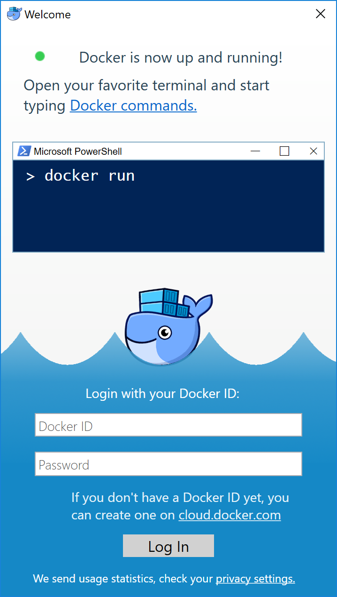

Docker for Windows is the
[Community Edition (CE)](https://www.docker.com/community-edition)
of Docker for Microsoft Windows. To download Docker for Windows, head to Docker
Store.

[Download from Docker Store](https://store.docker.com/editions/community/docker-ce-desktop-windows){: .button .outline-btn}

##  What to know before you install

If your system does not meet the requirements to run Docker for Windows, you can install
[Docker Toolbox](/toolbox/overview.md), which uses Oracle Virtual Box instead of
Hyper-V.

* **README FIRST for Docker Toolbox and Docker Machine users**: Docker for Windows requires Microsoft Hyper-V to run.  The Docker for Windows installer enables Hyper-V for you, if needed, and restart your machine. After Hyper-V is
enabled, VirtualBox no longer works, but any VirtualBox VM images
remain. VirtualBox VMs created with `docker-machine` (including the `default`
one typically created during Toolbox install) no longer start. These VMs
cannot be used side-by-side with Docker for Windows. However, you can still use
`docker-machine` to manage remote VMs.
* Virtualization must be enabled in BIOS and CPU SLAT-capable. Typically, virtualization is enabled by default. This is different from having Hyper-V enabled. For more
detail see [Virtualization must be
enabled](troubleshoot.md#virtualization-must-be-enabled) in Troubleshooting.
* The current version of Docker for Windows runs on 64bit Windows 10 Pro, Enterprise and Education (1607 Anniversary Update, Build 14393 or later).
* Containers and images created with Docker for Windows are shared between all user accounts on machines where it is installed. This is because all
Windows accounts use the same VM to build and run containers.
* Nested virtualization scenarios, such as running Docker for Windows
on a VMWare or Parallels instance, might work, but come with no
guarantees. For more information, see
[Running Docker for Windows in nested virtualization scenarios](troubleshoot.md#running-docker-for-windows-in-nested-virtualization-scenarios)
* **What the Docker for Windows install includes**: The installation provides [Docker Engine](/engine/userguide/), Docker CLI client, [Docker Compose](/compose/overview.md), [Docker Machine](/machine/overview.md), and [Kitematic](/kitematic/userguide.md).

### About Windows containers

Looking for information on using Windows containers?

* [Switch between Windows and Linux containers](index.md#switch-between-windows-and-linux-containers) describes the Linux / Windows containers toggle in Docker for Windows and points you to the tutorial mentioned above.
* [Getting Started with Windows Containers (Lab)](https://github.com/docker/labs/blob/master/windows/windows-containers/README.md)
provides a tutorial on how to set up and run Windows containers on Windows 10 or
with Windows Server 2016. It shows you how to use a MusicStore application with
Windows containers.
* Docker Container Platform for Windows Server 2016 [articles and blog posts](https://www.docker.com/microsoft/) on the Docker website

## Install Docker for Windows desktop app

1. Double-click **Docker for Windows Installer.exe** to run the installer.

    If you haven't already downloaded the installer (`Docker for Windows Installer.exe`), you can get it from
    [**download.docker.com**](https://download.docker.com/win/stable/Docker%20for%20Windows%20Installer.exe).
    It typically downloads to your `Downloads folder`, or you can run it from the recent downloads bar at the
    bottom of your web browser.

2. Follow the install wizard to accept the license, authorize the installer, and proceed with the install.

    You are asked to authorize `Docker.app` with your system password during the install process.
    Privileged access is needed to install networking components, links to the Docker apps, and manage the
    Hyper-V VMs.

3. Click **Finish** on the setup complete dialog to launch Docker.

## Start Docker for Windows

Docker does not start automatically after installation. To start it, search for
Docker, select **Docker for Windows** in the search results, and click it (or
hit Enter).

{:width="400px"}

When the whale in the status bar stays steady, Docker is up-and-running, and
accessible from any terminal window.

If the whale is hidden in the Notifications area, click the up arrow on the
taskbar to show it. To learn more, see [Docker Settings](index.md#docker-settings).

If you just installed the app, you also get a popup success message with
suggested next steps, and a link to this documentation.

{:width="400px"}

When initialization is complete, select **About Docker** from the notification
area icon to verify that you have the latest version.

Congratulations! You are up and running with Docker for Windows.

## Where to go next

* [Getting started](index.md) introduces Docker for Windows.
* [Get started with Docker](/get-started/) is a tutorial that teaches you how to deploy a multi-service stack.
* [Troubleshooting](troubleshoot.md) describes common problems, workarounds, and how to get support.
* [FAQs](faqs.md) provides answers to frequently asked questions.
* [Stable Release Notes](release-notes.md) or [Edge Release Notes](edge-release-notes.md).
