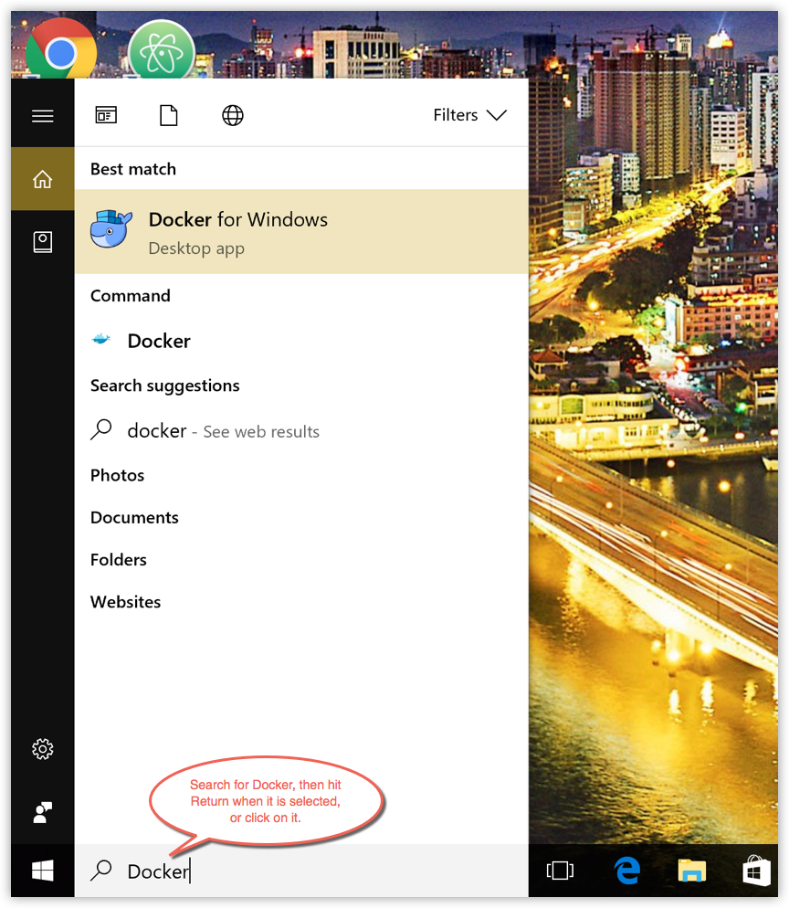
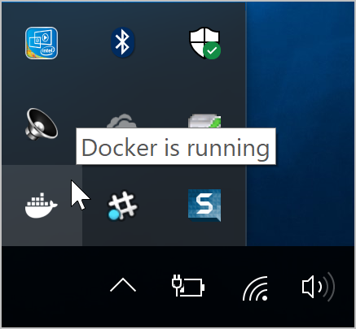
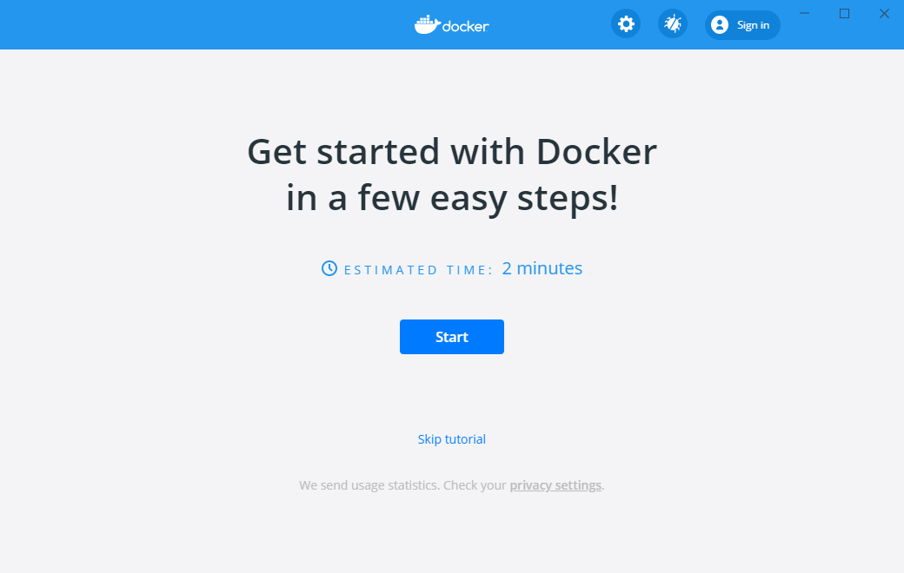

Docker Desktop for Windows is the [Community](https://www.docker.com/community-edition) version of Docker for Microsoft Windows.
You can download Docker Desktop for Windows from Docker Hub.

This page contains information on installing Docker Desktop on Windows 10 Pro, Enterprise, and Education. If you are looking for information about installing Docker Desktop on Windows 10 Home, see [Install Docker Desktop on Windows Home](/install-windows-home.md).

[Download from Docker
Hub](https://hub.docker.com/editions/community/docker-ce-desktop-windows/){:
.button .outline-btn}

By downloading Docker Desktop, you agree to the terms of the [Docker Software End User License Agreement](https://www.docker.com/legal/docker-software-end-user-license-agreement){: target="_blank" class="_"} and the [Docker Data Processing Agreement](https://www.docker.com/legal/data-processing-agreement){: target="_blank" class="_"}.

## What to know before you install

### System Requirements

  - Windows 10 64-bit: Pro, Enterprise, or Education (Build 16299 or later).
  
    For Windows 10 Home, see [Install Docker Desktop on Windows Home](install-windows-home.md).
  - Hyper-V and Containers Windows features must be enabled.
  - The following hardware prerequisites are required to successfully run Client
Hyper-V on Windows 10:

     - 64 bit processor with [Second Level Address Translation (SLAT)](http://en.wikipedia.org/wiki/Second_Level_Address_Translation)
     - 4GB system RAM
    - BIOS-level hardware virtualization support must be enabled in the
    BIOS settings.  For more information, see
    [Virtualization](troubleshoot.md#virtualization-must-be-enabled).

> **Note:** Docker supports Docker Desktop on Windows based on Microsoft’s support lifecycle for Windows 10 operating system. For more information, see the [Windows lifecycle fact sheet](https://support.microsoft.com/en-us/help/13853/windows-lifecycle-fact-sheet).

### What's included in the installer

The Docker Desktop installation includes [Docker Engine](../engine/index.md),
Docker CLI client, [Docker Compose](../compose/index.md),
[Notary](../notary/getting_started.md),
[Kubernetes](https://github.com/kubernetes/kubernetes/),
and [Credential Helper](https://github.com/docker/docker-credential-helpers/).

Containers and images created with Docker Desktop are shared between all
user accounts on machines where it is installed. This is because all Windows
accounts use the same VM to build and run containers. Note that it is not possible to share containers and images between user accounts when using the Docker Desktop WSL 2 backend.

Nested virtualization scenarios, such as running Docker Desktop on a
VMWare or Parallels instance might work, but there are no guarantees. For
more information, see [Running Docker Desktop in nested virtualization scenarios](troubleshoot.md#running-docker-desktop-for-windows-in-nested-virtualization-scenarios).

### About Windows containers

Looking for information on using Windows containers?

* [Switch between Windows and Linux containers](index.md#switch-between-windows-and-linux-containers)
  describes how you can toggle between Linux and Windows containers in Docker Desktop and points you to the tutorial mentioned above.
* [Getting Started with Windows Containers (Lab)](https://github.com/docker/labs/blob/master/windows/windows-containers/README.md)
  provides a tutorial on how to set up and run Windows containers on Windows 10, Windows Server 2016 and Windows Server 2019. It shows you how to use a MusicStore application
  with Windows containers.
* Docker Container Platform for Windows [articles and blog
  posts](https://www.docker.com/microsoft/) on the Docker website.

## Install Docker Desktop on Windows

1. Double-click **Docker Desktop Installer.exe** to run the installer.

    If you haven't already downloaded the installer (`Docker Desktop Installer.exe`), you can get it from
    [**Docker Hub**](https://hub.docker.com/editions/community/docker-ce-desktop-windows/).
    It typically downloads to your `Downloads` folder, or you can run it from
    the recent downloads bar at the bottom of your web browser.

2. When prompted, ensure the **Enable Hyper-V Windows Features** option is selected on the Configuration page.

3. Follow the instructions on the installation wizard to authorize the installer and proceed with the install.

4. When the installation is successful, click **Close** to complete the installation process.

5. If your admin account is different to your user account, you must add the user to 
the **docker-users** group. Run **Computer Management** as an administrator and navigate to 
**Local Users and Groups** > **Groups** > **docker-users**. Right-click to add the user to the group.
Log out and log back in for the changes to take effect.

## Start Docker Desktop

Docker Desktop does not start automatically after installation. To start Docker Desktop, search for Docker, and select **Docker Desktop** in the search results.

{:width="300px"}

When the whale icon in the status bar stays steady, Docker Desktop is up-and-running, and is accessible from any terminal window.

If the whale icon is hidden in the Notifications area, click the up arrow on the
taskbar to show it. To learn more, see [Docker Settings](index.md#docker-settings-dialog).

When the initialization is complete, Docker Desktop launches the onboarding tutorial. The tutorial includes a simple exercise to build an example Docker image, run it as a container, push and save the image to Docker Hub.

{:width="450px"}

Congratulations! You are now successfully running Docker Desktop on Windows.

If you would like to rerun the tutorial, go to the Docker Desktop menu 
and select **Learn**.

## Uninstall Docker Desktop

To uninstall Docker Desktop from your Windows machine:

1. From the Windows **Start** menu, select **Settings** > **Apps** > **Apps & features**.
2. Select **Docker Desktop** from the **Apps & features** list and then select **Uninstall**.
3. Click **Uninstall** to confirm your selection.

> **Note:** Uninstalling Docker Desktop will destroy Docker containers and images local to the machine and remove the files generated by the application.

## Switch between Stable and Edge versions

Docker Desktop allows you to switch between Stable and Edge releases. However, **you can only have one version of Docker Desktop installed at a time**. Switching between Stable and Edge versions can destabilize your development environment, particularly in cases where you switch from a newer (Edge) channel to an older (Stable) channel.

For example, containers created with a newer Edge version of Docker Desktop may
not work after you switch back to Stable because they may have been created
using Edge features that aren't in Stable yet. Keep this in mind as
you create and work with Edge containers, perhaps in the spirit of a playground
space where you are prepared to troubleshoot or start over.

Experimental features are turned on by default on Edge releases. However, when you switch from a Stable to an Edge release, you must turn on the experimental features flag to access experimental features. From the Docker Desktop menu, click **Settings** > **Command Line** and then turn on the **Enable experimental features** toggle. Click **Apply & Restart** for the changes to take effect.

To safely switch between Edge and Stable versions, ensure you save images and export the containers you need, then uninstall the current version before installing another. For more information, see the section _Save and Restore data_ below.

### Save and restore data

You can use the following procedure to save and restore images and container data. For example, if you want to switch between Edge and Stable, or to reset your VM disk:

1. Use `docker save -o images.tar image1 [image2 ...]` to save any images you
    want to keep. See [save](/engine/reference/commandline/save) in the Docker
    Engine command line reference.

2. Use `docker export -o myContainner1.tar container1` to export containers you
    want to keep. See [export](/engine/reference/commandline/export) in the
    Docker Engine command line reference.

3. Uninstall the current version of Docker Desktop and install a different version (Stable or Edge), or reset your VM disk.

4. Use `docker load -i images.tar` to reload previously saved images. See
    [load](/engine/reference/commandline/load) in the Docker Engine.

5. Use `docker import -i myContainer1.tar` to create a file system image
    corresponding to the previously exported containers. See
    [import](/engine/reference/commandline/import) in the Docker Engine.

For information on how to back up and restore data volumes, see [Backup, restore, or migrate data volumes](/storage/volumes/#backup-restore-or-migrate-data-volumes).

## Where to go next

* [Getting started](index.md) introduces Docker Desktop for Windows.
* [Get started with Docker](/get-started/) is a tutorial that teaches you how to
  deploy a multi-service stack.
* [Troubleshooting](troubleshoot.md) describes common problems, workarounds, and
  how to get support.
* [FAQs](faqs.md) provides answers to frequently asked questions.
* [Stable Release Notes](release-notes.md) or [Edge Release Notes](edge-release-notes.md).
