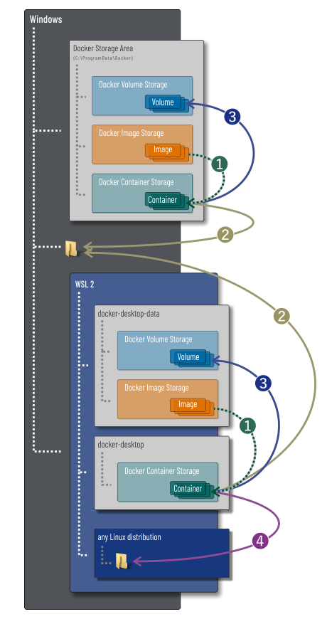

A Docker container's runtime data is either held in RAM or on the container's file system. By default all files created inside a container are stored in the writable layer of the container. This means that the data doesn’t persist when the container no longer exists, and it can be difficult to get the data out of the container if another process needs it.

Docker has two options for containers to store their files at locations outside the container, so that the files are persisted even after the container stops: **Bind mounts** and **Volumes**.

## Prerequisites

In order to use Bind mounts and Volumes, the file or directory to mount must be present in the container's docker image, and it must be advertised using the Dockerfile's **VOLUME** command.

Here is an example of a Dockerfile creating an empty directory and advertising that directory to be used as a Bind mount or Volume in the resulting image:

```dockerfile
# escape=`
FROM mcr.microsoft.com/windows/nanoserver
RUN MKDIR C:\Temp   # Create empty directory
VOLUME C:\Temp      # Advertise directory for future Bind mount or Volume
```

If from an image advertising a volume a container is created _without_ specifying a matching Bind mount or Volume, the corresponding file or directory will be accessed at runtime as locally stored file or directory in the container's runtime storage space, i.e. the writable container layer. So, the container will then behave as if no volume had been declared.

## Two kinds of mount options

Two different mount options exist to add Bind mounts and Volumes to a container:

- `--mount`
- `--volume`, or `-v`

The `--mount` option syntax is extensible and, thus, more flexible, while the `--volume` option provides a concise syntax for standard mounts.

### `--mount` syntax

The `--mount` syntax comprises of multiple `<key>=<value>` pairs, separated by commas. The list of keys may be augmented by external volume providers, so the `--mount` option provides greater flexibility than the abridged `--volume` syntax.

These are the standard keys available in Docker for Windows:

| keyword | description |
|-|-|
| `type` | Mount type. Can be `bind`, `volume` or `npipe`. |
| `source` | Mount source. May be specified as `source` or `src`. For details see subsequent sections. |
| `destination` | Mount destination. The absolute path where the file or directory is mounted in the container. Can be specified as `destination`, `dst`, or `target`. |
| `readonly` | If present, causes the Bind mount or Volume to be mounted into the container as read-only. |

### `--volume` syntax

The `--volume` syntax is more concise. It determines the mount type automatically and doesn't support volume drivers. It comprises of a triplet of three values, separated by a colon:

| part | description |
|-|-|
| `source` | Volume name or path to mount the Bind mount to. For anonymous Volumes, this field is omitted. |
| `destination` | The absolute path where the file or directory is mounted in the container. |
| `ro` | If present, causes the Bind mount or Volume to be mounted into the container as read-only. |

## Storage Locations

In Docker for Windows, containers may store runtime data in up to four different locations:

1. [The container's runtime storage space itself](#store-runtime-data-in-the-container-s-file-system-storage-area)
2. [The Microsoft Windows host file system](#bind-mount--store-runtime-data-in-the-windows-host-file-system)
3. [A special *Managed Volume* storage area](#volume--store-runtime-data-in-a-special--managed-volume--storage-area)
4. If the Docker client is running on WSL 2: [Another WSL 2 Linux distribution's file system](#bind-mount-and-volumes-handling-in-wsl-2)



## Store runtime data in the container's file system storage area

Any write access to a Docker container's virtual hard drive that won't be redirected by any of the subsequent techniques is performed in the container's storage space, thereby increasing the container's writable layer.

The data stored in the container's file system storage area is accessible by and visible to the container itself only.

Container instances are stateless. If the container is restarted, crashes, or stops, all of its state is lost. This includes runtime data stored in the container's file system, which is then deleted, too. To persist state beyond the lifetime of the container, you must use a Bind mount or a Volume, as described below.

## Bind mount: Store runtime data in the Windows host file system

A Docker container's read/write access to an [advertised file or directory](#prerequisites) can be redirected to a directory in the Docker client's host file system. This type of redirection is called a **Bind mount**.

Bind-mounted runtime data is persisted beyond the lifetime of a Docker container instance.

A Bind mount is specified by three parameters:

1. The absolute path to the directory in the host file system
2. The advertised absolute directory in the Docker container
3. Optionally, a file access flag for read-only access

Bind mount examples:

<ul class="nav nav-tabs">
 <li class="active"><a data-toggle="tab" data-group="mount" data-target="#mount-w-bm-1"><code>--mount</code></a></li>
 <li><a data-toggle="tab" data-group="volume" data-target="#v-w-bm-1"><code>--volume</code></a></li>
</ul>
<div class="tab-content">
 <div id="mount-w-bm-1" class="tab-pane fade in active" markdown="1">

```ps
docker create --mount type=bind,src=D:\Data,dst=C:\Temp <IMAGE>
```

 </div><!--mount-->
 <div id="v-w-bm-1" class="tab-pane fade" markdown="1">

```ps
docker create -v D:\Data:C:\Temp <IMAGE>
```

 </div><!--volume-->
</div><!--tab-content-->

<ul class="nav nav-tabs">
 <li class="active"><a data-toggle="tab" data-group="mount" data-target="#mount-w-bm-2"><code>--mount</code></a></li>
 <li><a data-toggle="tab" data-group="volume" data-target="#v-w-bm-2"><code>--volume</code></a></li>
</ul>
<div class="tab-content">
 <div id="mount-w-bm-2" class="tab-pane fade in active" markdown="1">

```ps
docker create --mount type=bind,src=D:\Data,dst=C:\Temp,readonly <IMAGE>
```

 </div><!--mount-->
 <div id="v-w-bm-2" class="tab-pane fade" markdown="1">

```ps
docker create -v D:\Data:C:\Temp:ro <IMAGE>
```

 </div><!--volume-->
</div><!--tab-content-->

### Bind-mount into a non-empty directory on the container

If you Bind-mount into a non-empty directory on the container, the directory's existing contents are obscured by the Bind mount. This can be beneficial, such as when you want to test a new version of your application without building a new image. This behavior differs from that of a Volume.

## Volume: Store runtime data in a special *Managed Volume* storage area

A Volume is a file or directory provided by the Docker client. On local Docker for Windows installations, the Volume storage area is located in the Windows host's `C:\ProgramData\Docker\volumes\` directory by default.

Runtime data stored in a Volume is persisted beyond the lifetime of a Docker container instance.

Docker Volumes can be created and given a name. So, they may be accessed and shared by different Docker containers. Alternatively, anonymous Docker Volumes can be created on-the-fly when creating the container. These anonymous Volumes can only be accessed by their corresponding container.

**The `--mount` syntax for Volumes accepts two additional `<key>=<value>` pairs:**

| keyword | description |
|-|-|
| `volume-driver` | If present, specifies the storage driver to use for the volume. Defaults to `local`. |
| `volume-opt` | Applies to Volumes only. Can be specified more than once. Takes a key-value pair consisting of the option name and its value. |

> Escape values from outer CSV parser
>
> If your volume driver accepts a comma-separated list as an option,
> you must escape the value from the outer CSV parser. To escape a `volume-opt`,
> surround it with double quotes (`"`) and surround the entire mount parameter
> with single quotes (`'`):
>
>     docker service create `
>       --mount 'type=volume,src=<VOLUME_NAME>,dst=<CONTAINER_PATH>,volume-driver=<SOME_DRIVER>,volume-opt=type=<SOME_TYPE>,"volume-opt=params=a=x,b=y,c=z"'`
>       --name myservice `
>       <IMAGE>
> {: .warning}

**The `--volume` syntax for Volumes is specified by these parameters:**

1. The volume name. May be omitted if the volume is to be created on-the-fly for a single container.
2. The advertised absolute directory in the Docker container.
3. Optionally, a file access flag: `ro`, for read-only access.

When using Volumes with services, only `--mount` is supported.

**Volume examples:**

### Creating and using a named volume:

<ul class="nav nav-tabs">
 <li class="active"><a data-toggle="tab" data-group="mount" data-target="#mount-v-1"><code>--mount</code></a></li>
 <li><a data-toggle="tab" data-group="volume" data-target="#v-v-1"><code>--volume</code></a></li>
</ul>
<div class="tab-content">
 <div id="mount-v-1" class="tab-pane fade in active" markdown="1">

```ps
docker volume create myvolume
docker create --mount type=volume,src=myvolume,dst=C:\Temp --name c1 <IMAGE_1>
docker create --mount type=volume,src=myvolume,dst=C:\Temp --name c2 <IMAGE_2>
```

 </div><!--mount-->
 <div id="v-v-1" class="tab-pane fade" markdown="1">

```ps
docker volume create myvolume
docker create --volume myvolume:dst=C:\Temp --name c1 <IMAGE_1>
docker create --volume myvolume:dst=C:\Temp --name c2 <IMAGE_2>
```

 </div><!--volume-->
</div><!--tab-content-->

### Creating and using anonymous volumes:

<ul class="nav nav-tabs">
 <li class="active"><a data-toggle="tab" data-group="mount" data-target="#mount-v-2"><code>--mount</code></a></li>
 <li><a data-toggle="tab" data-group="volume" data-target="#v-v-2"><code>--volume</code></a></li>
</ul>
<div class="tab-content">
 <div id="mount-v-2" class="tab-pane fade in active" markdown="1">

```ps
docker create --mount type=volume,dst=C:\Temp <IMAGE>
```

 </div><!--mount-->
 <div id="v-v-2" class="tab-pane fade" markdown="1">

```ps
docker create -v C:\Temp <IMAGE>
```

 </div><!--volume-->
</div><!--tab-content-->

### Mount more than a single volume on a container

You can mount more than one volume on a container, provided these volumes are all advertised in the image, like in this example:

```dockerfile
# escape=`
FROM mcr.microsoft.com/windows/nanoserver
RUN MKDIR C:\Temp              # Create empty directory
VOLUME C:\Temp                 # Advertise created directory for future Bind mount or Volume
VOLUME C:\inetpub\wwwroot      # Advertise existing directory for future Bind mount or Volume
```

<ul class="nav nav-tabs">
 <li class="active"><a data-toggle="tab" data-group="mount" data-target="#mount-v-3"><code>--mount</code></a></li>
 <li><a data-toggle="tab" data-group="volume" data-target="#v-v-3"><code>--volume</code></a></li>
</ul>
<div class="tab-content">
 <div id="mount-v-3" class="tab-pane fade in active" markdown="1">

```ps
docker create --mount type=volume,dst=C:\Temp --mount type=volume,dst=C:\inetpub\wwwroot,readonly <IMAGE>
```

 </div><!--mount-->
 <div id="v-v-3" class="tab-pane fade" markdown="1">

```ps
docker create -v C:\Temp -v C:\inetpub\wwwroot:ro <IMAGE>
```

 </div><!--volume-->
</div><!--tab-content-->

### Mount a Volume into a non-empty directory on the container

If you mount a Volume into a non-empty directory on the container, the directory's existing contents are copied to the Volume share on the host. The container then mounts and uses the volume, and other containers which use the volume also have access to the pre-populated content.

### Remove unused volumes

There are two types of volumes to consider:

- **Named Volumes**

   Named Volumes persist until they get manually deleted.

- **Anonymous Volumes**

   Anonymous Volumes persist until the corresponding container instance gets removed.


To remove an unused Named Volume from the Managed Volumes storage area, call `docker container rm <VOLUME_NAME>`, e.g.

```ps
docker volume rm myvolume
```

To remove an anonymous volume, remove the corresponding Docker container instance.

To remove all unused Named Volumes not referenced by any containers from the Managed Volumes storage area, call

```ps
docker volume prune
```

## Bind mount and Volumes handling in WSL 2

While Windows containers run in the host Windows OS, Linux containers run in a [dedicated Linux distribution within the WSL 2 VM](https://www.docker.com/blog/new-docker-desktop-wsl2-backend/). So, additional considerations must be taken into account for Linux images in regard to Bind mounts and Volumes:

Docker for Windows installs two Linux distros in the WSL 2 engine: `docker-desktop` and `docker-desktop-data`.

- `docker-desktop` hosts and runs the Docker Linux containers
- `docker-desktop-data` hosts the Docker Linux images and Volume storage spaces.

Both WSL 2 instances can be displayed using the `wsl -l -v` command.

The Docker WSL 2 instances get started when Docker for Windows is switched to using Linux containers. So, Linux containers are not available until you switch to using Linux containers first.

Here is an example of a Dockerfile creating a Linux image with an empty directory therein and advertising that directory to be used as a Bind mount or Volume in the resulting image:

```dockerfile
FROM busybox
RUN mkdir /test   # Create empty directory
VOLUME /test      # Advertise directory for future Bind mount or Volume
```


During the runtime of each WSL 2 instance, the Linux file system is automatically mapped to a hidden file share in the Windows host OS, named after the WSL 2 instance name: `\\WSL$\<WSL_INSTANCE_NAME>`. Vice versa, the Windows file system is mapped into a WSL 2 Linux file system at `/mnt`. (The `docker-desktop` mount point differs here, for this instance the Windows host OS file system is mounted to `/mnt/host`.)

## Bind mount handling

A Linux container's read/write access to an [advertised file or directory](#prerequisites) can be redirected to two different destinations by using Bind mounts:

1. a file or directory in the Windows host file system
1. a file or directory in another WSL 2 Linux instance

### Bind-mounting to Windows host file system

Redirecting Linux container volumes to the Windows host file system comes with a severe performance penalty. When a Linux container is started using a Windows host Bind mount, Docker for Windows will chime a Windows notification informing the user about the performance ramifications that come with using Windows host file system Bind mounts.

Here is an example of Bind-mounting a Linux container to a directory in the Windows host file system:

<ul class="nav nav-tabs">
 <li class="active"><a data-toggle="tab" data-group="mount" data-target="#mount-lw-bm-1"><code>--mount</code></a></li>
 <li><a data-toggle="tab" data-group="volume" data-target="#v-lw-bm-1"><code>--volume</code></a></li>
</ul>
<div class="tab-content">
 <div id="mount-lw-bm-1" class="tab-pane fade in active" markdown="1">

```ps
docker run -it --rm type=bind,src=C:\Temp,dst=/test volumetest
```

 </div><!--mount-->
 <div id="v-lw-bm-1" class="tab-pane fade" markdown="1">

```ps
docker run -it --rm -v C:\Temp:/test volumetest
```

 </div><!--volume-->
</div><!--tab-content-->

Remoting data this way from the Windows host file system to the Linux container instance comes with a performance penalty. We therefore recommend storing data that is supposed to be Bind-mounted into WSL 2 Linux instances first and then mount from these instances.

### Bind-mounting to another WSL 2 Linux instance

Before utilizing Bind-mounting to files or directories of a WSL 2 Linux instance, make sure [Docker integration is enabled](wsl.md) in the corresponding WSL 2 instance.

To gain the best experience and benefit from maximum performance when Bind-mounting another WSL 2 Linux distro, create the Linux container from within the other WSL 2 Linux distro.

<ul class="nav nav-tabs">
 <li class="active"><a data-toggle="tab" data-group="mount" data-target="#mount-ll-bm-1"><code>--mount</code></a></li>
 <li><a data-toggle="tab" data-group="volume" data-target="#v-ll-bm-1"><code>--volume</code></a></li>
</ul>
<div class="tab-content">
 <div id="mount-ll-bm-1" class="tab-pane fade in active" markdown="1">

```bash
$ docker run -it --rm type=bind,src=~/test,dst=/test volumetest
```

 </div><!--mount-->
 <div id="v-ll-bm-1" class="tab-pane fade" markdown="1">

```bash
$ docker run -it --rm -v ~/test:/test volumetest
```

 </div><!--volume-->
</div><!--tab-content-->

Although files or directories in another WSL 2 Linux instance can be Bind-mounted by creating the Docker container in the Windows host OS using the hidden shared directory that is being created for each WSL 2 instance, this is strongly discouraged, as the file data gets remoted from Linux to Windows and back again to Linux in the other instance.

Only for the sake of completeness, the following example creates and uses `/test` in a "Ubuntu" WSL 2 distro (the most common WSL install) to store the Docker container's data using a hidden file share:

<ul class="nav nav-tabs">
 <li class="active"><a data-toggle="tab" data-group="mount" data-target="#mount-ll-bm-2"><code>--mount</code></a></li>
 <li><a data-toggle="tab" data-group="volume" data-target="#v-ll-bm-2"><code>--volume</code></a></li>
</ul>
<div class="tab-content">
 <div id="mount-ll-bm-2" class="tab-pane fade in active" markdown="1">

```ps
docker run -it --rm type=bind,src=\\wsl$\ubuntu\etc,dst=/test volumetest
```

 </div><!--mount-->
 <div id="v-ll-bm-2" class="tab-pane fade" markdown="1">

```ps
docker run -it --rm -v \\wsl$\ubuntu\etc:/test volumetest
```

 </div><!--volume-->
</div><!--tab-content-->

## Using Volumes

Using Linux containers in Docker for Windows, local container Volumes will be stored in the `docker-desktop-data` WSL 2 container instance. The presence of that instance can be displayed using the `wsl -l -v` command. It's a "black box" WSL instance which cannot be launched. It's simply used by the Docker Desktop back-end for storage of images and volumes (and likely other Docker artifacts).

NB: There is a way to inspect the contents of that WSL instance. See [this answer on SuperUser.com](https://superuser.com/a/1613591/1210833) for details.

For further details on Volumes in Docker for Windows to above section ["Volume: Store runtime data in a special *Managed Volume* storage area"](#Volume--Store-runtime-data-in-a-special--Managed-Volume--storage-area).