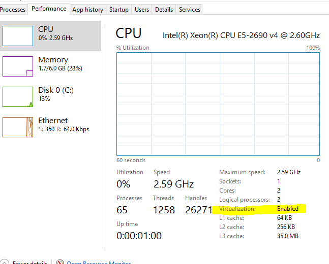

Here is information about how to diagnose and troubleshoot problems, send logs
and communicate with the Docker for Windows team, use our forums and Knowledge
Hub, browse and log issues on GitHub, and find workarounds for known problems.

## Docker Knowledge Hub

**Looking for help with Docker for Windows?** Check out the [Docker Knowledge
Hub](http://success.docker.com/) for knowledge base articles, FAQs, and
technical support for various subscription levels.

## Submitting diagnostics, feedback, and GitHub issues

If you encounter problems for which you do not find solutions in this
documentation, on [Docker for Windows issues on
GitHub](https://github.com/docker/for-win/issues), or the [Docker for Windows
forum](https://forums.docker.com/c/docker-for-windows), we can help you
troubleshoot the log data. See [Diagnose and
Feedback](index.md#diagnose-and-feedback) to learn about diagnostics and how to
create new issues on GitHub.

## Checking the Logs

In addition to using the diagnose and feedback option to submit logs, you can browse the logs yourself.

### Use the systray menu to view logs

To view Docker for Windows latest log, click on the `Diagnose & Feedback` menu
entry in the systray and then on the `Log file` link. You can see the full
history of logs in your `AppData\Local` folder.

### Use the systray menu to report and issue

If you encounter an issue and the suggested troubleshoot procedures outlined
below don't fix it you can generate a diagnostics report. Click on the `Diagnose &
Feedback` menu entry in the systray and then on the `Upload diagnostic...` link.
This will upload diagnostics to our server and provide you with a unique ID you
can use in email or the forum to reference the upload.

## Troubleshooting

### inotify on shared drives does not work

Currently, `inotify` does not work on Docker for Windows. This will become
evident, for example, when an application needs to read/write to a
container across a mounted drive. Instead of relying on filesystem inotify, we recommend using polling features for your framework or programming language.

* **Workaround for nodemon and Node.js** - If you are using [nodemon](https://github.com/remy/nodemon) with  `Node.js`, try the fallback
polling mode described here: [nodemon isn't restarting node
applications](https://github.com/remy/nodemon#application-isnt-restarting)

* **Docker for Windows issue on GitHub** - See the issue [Inotify on shared drives does not work](https://github.com/docker/for-win/issues/56#issuecomment-242135705)

### Volume mounting requires shared drives for Linux containers

If you are using mounted volumes and get runtime errors indicating an
application file is not found, a volume mount is denied, or a service cannot
start (e.g., with [Docker Compose](/compose/gettingstarted.md)), you might need
to enable [shared drives](index.md#shared-drives).

Volume mounting requires shared drives for Linux containers (not for Windows
containers). Go to  --> **Settings** --> **Shared
Drives** and share the drive that contains the Dockerfile and volume.

### Verify domain user has permissions for shared drives (volumes)

>**Tip:** Shared drives are only required for volume mounting [Linux
containers](index.md#switch-between-windows-and-linux-containers),
not Windows containers.

Permissions to access shared drives are tied to the username and password you
use to set up shared drives. (See [Shared Drives](index.md#shared-drives).) If
you run `docker` commands and tasks under a different username than the one used
to set up shared drives, your containers will not have permissions to access the
mounted volumes. The volumes will show as empty.

The solution to this is to switch to the domain user account and reset
credentials on shared drives.

Here is an example of how to de-bug this problem, given a scenario where you
shared the `C` drive as a local user instead of as the domain user. Assume the
local user is `samstevens` and the domain user is `merlin`.

1. Make sure you are logged in as the Windows domain user (for our example, `merlin`).

2. Run `net share c` to view user permissions for `<host>\<username>, FULL`.

		PS C:\Users\jdoe> net share c
		Share name        C
		Path              C:\
		Remark
		Maximum users     No limit
		Users             SAMSTEVENS
		Caching           Caching disabled
		Permission        windowsbox\samstevens, FULL

3. Run the following command to remove the share.

		net share c /delete

4. Re-share the drive via the [Shared Drives dialog](index.md#shared-drives), and provide the Windows domain user account credentials.

5. Re-run `net share c`.

		PS C:\Users\jdoe> net share c
		Share name        C
		Path              C:\
		Remark
		Maximum users     No limit
		Users             MERLIN
		Caching           Caching disabled
		Permission        windowsbox\merlin, FULL

See also, the related issue on GitHub, [Mounted volumes are empty in the container](https://github.com/docker/for-win/issues/25).

### Local security policies can block shared drives and cause login errors

You need permissions to mount shared drives in order to use the Docker for
Windows [shared drives](index.md#shared-drives) feature.

If local policy prevents this, you will get errors when you attempt to enable
shared drives on Docker. This is not something Docker can resolve, you do need
these permissions to use the feature.

Here are snip-its from example error messages:

```
Logon failure: the user has not been granted the requested logon type at
this computer.

[19:53:26.900][SambaShare     ][Error  ] Unable to mount C drive: mount
error(5): I/O error Refer to the mount.cifs(8) manual page (e.g. man mount.cifs)
mount: mounting //10.0.75.1/C on /c failed: Invalid argument
```

See also, <a href="https://github.com/docker/for-win/issues/98">Docker for Windows issue #98</a>.

### Understand symlinks limitations

Symlinks will work within and across containers. However, symlinks created outside of containers (for example, on the host) will not work. To learn more, see [Are symlinks supported?](faqs.md#are-symlinks-supported) in the FAQs.

### Avoid unexpected syntax errors, use Unix style line endings for files in containers

Any file destined to run inside a container must use Unix style `\n` line
endings. This includes files referenced at the command line for builds and in
RUN commands in Docker files.

Docker containers and `docker build` run in a Unix environment, so files in
containers must use Unix style line endings: `\n`, _not_ Windows style: `\r\n`.
Keep this in mind when authoring files such as shell scripts using Windows
tools, where the default is likely to be Windows style line endings.  These
commands ultimately get passed to Unix commands inside a Unix based container
(for example, a shell script passed to `/bin/sh`). If Windows style line endings
are used, `docker run` will fail with syntax errors.

For an example of this issue and the resolution, see this issue on GitHub: <a href="https://github.com/docker/docker/issues/24388">Docker RUN fails to execute shell script (https://github.com/docker/docker/issues/24388)</a>.

### Recreate or update your containers after Beta 18 upgrade

Docker 1.12.0 RC3 release introduces a backward incompatible change from RC2 to RC3. (For more information, see https://github.com/docker/docker/issues/24343#issuecomment-230623542.)

You may get the following error when you try to start a container created with pre-Beta 18 Docker for Windows applications.

    Error response from daemon: Unknown runtime specified default

You can fix this by either [recreating](troubleshoot.md#recreate-your-containers) or [updating](troubleshoot.md#update-your-containers) your containers.

If you get the error message shown above, we recommend recreating them.

#### Recreate your containers

To recreate your containers, use Docker Compose.

    docker-compose down && docker-compose up

#### Update your containers

To fix existing containers, follow these steps.

1.  Run this command.

    ```powershell
    PS C:\Users\jdoe> docker run --rm -v /var/lib/docker:/docker cpuguy83/docker112rc3-runtimefix:rc3

    Unable to find image 'cpuguy83/docker112rc3-runtimefix:rc3' locally
    rc3: Pulling from cpuguy83/docker112rc3-runtimefix
    91e7f9981d55: Pull complete
    Digest: sha256:96abed3f7a7a574774400ff20c6808aac37d37d787d1164d332675392675005c
    Status: Downloaded newer image for cpuguy83/docker112rc3-runtimefix:rc3
    proccessed 1648f773f92e8a4aad508a45088ca9137c3103457b48be1afb3fd8b4369e5140
    skipping container '433ba7ead89ba645efe9b5fff578e674aabba95d6dcb3910c9ad7f1a5c6b4538': already fixed
    proccessed 43df7f2ac8fc912046dfc48cf5d599018af8f60fee50eb7b09c1e10147758f06
    proccessed 65204cfa00b1b6679536c6ac72cdde1dbb43049af208973030b6d91356166958
    proccessed 66a72622e306450fd07f2b3a833355379884b7a6165b7527c10390c36536d82d
    proccessed 9d196e78390eeb44d3b354d24e25225d045f33f1666243466b3ed42fe670245c
    proccessed b9a0ecfe2ed9d561463251aa90fd1442299bcd9ea191a17055b01c6a00533b05
    proccessed c129a775c3fa3b6337e13b50aea84e4977c1774994be1f50ff13cbe60de9ac76
    proccessed dea73dc21126434f14c58b83140bf6470aa67e622daa85603a13bc48af7f8b04
    proccessed dfa8f9278642ab0f3e82ee8e4ad029587aafef9571ff50190e83757c03b4216c
    proccessed ee5bf706b6600a46e5d26327b13c3c1c5f7b261313438d47318702ff6ed8b30b
    ```

2. Quit Docker.

3. Start Docker.

	> **Note:**  Be sure to quit and then restart Docker for Windows before attempting to start containers.

4.  Try to start the container again:

    ```powershell
    PS C:\Users\jdoe> docker start old-container
    old-container
    ```

### Hyper-V

Docker for Windows requires a Hyper-V as well as the Hyper-V Module for Windows
Powershell to be installed and enabled. The Docker for Windows installer will
enable it for you.

See [these
instructions](https://msdn.microsoft.com/en-us/virtualization/hyperv_on_windows/quick_start/walkthrough_install)
to install Hyper-V manually. A reboot is *required*. If you install Hyper-V
without the reboot, Docker for Windows will not work correctly. On some systems,
Virtualization needs to be enabled in the BIOS. The steps to do so are Vendor
specific, but typically the BIOS option is called `Virtualization Technology
(VTx)` or similar.

### Virtualization must be enabled

In addition to [Hyper-V](#hyper-v), virtualization must be enabled.

If, at some point, if you manually uninstall Hyper-V or disable virtualization, Docker for Windows will not start.

Verify that virtualization is enabled on Task Manager.



See also, the user reported issue [Unable to run Docker for Windows on Windows
10 Enterprise](https://github.com/docker/for-win/issues/74)

### Windows containers and Windows Server 2016

If you have questions about how to set up and run Windows containers on Windows
Server 2016 or Windows 10, see [About Windows containers and Windows Server
2016](index.md#about-windows-containers-and-windows-server-2016).

A full tutorial is available in [docker/labs](https://github.com/docker/labs) at
[Getting Started with Windows
Containers](https://github.com/docker/labs/blob/master/windows/windows-containers/README.md).

You can install a native Windows binary which allows you to develop and run
Windows containers without Docker for Windows. However, if you install Docker
this way, you cannot develop or run Linux containers.  If you try to run a Linux
container on the native Docker daemon, an error occurs:

  ```no-highlight
  C:\Program Files\Docker\docker.exe:
   image operating system "linux" cannot be used on this platform.
   See 'C:\Program Files\Docker\docker.exe run --help'.
   ```

### Limitations of Windows containers for `localhost` and published ports

Docker for Windows provides the option to switch Windows and Linux containers.
If you are using Windows containers, keep in mind that there are some
limitations with regard to networking due to the current implementation of
Windows NAT (WinNAT). These limitations may potentially resolve as the Windows
containers project evolves.

One thing you may encounter rather immediately is that published ports on
Windows containers do not do loopback to the local host. Instead, container
endpoints are only reachable from the host using the container's IP and port.

So, in a scenario where you use Docker to pull an image and run a webserver with
a command like this:

```
docker run -d -p 80:80 --name webserver nginx  
```

Using `curl http://localhost`, or pointing your web browser at
`http://localhost` will not display the `nginx` web page (as it would do with
Linux containers).

In order to reach a Windows container from the local host, you need to specify
the IP address and port for the container that is running the service.

You can get the container IP address by using [`docker inspect`](/engine/reference/commandline/inspect.md) with some
`--format` options and the ID or name of the container. For the example above,
the command would look like this, using the name we gave to the container
(`webserver`) instead of the container ID:

```bash

$ docker inspect \
  --format='{{range .NetworkSettings.Networks}}{{.IPAddress}}{{end}}' \
  webserver

```

This will give you the IP address of the container, for example:

```bash

$ docker inspect \
  --format='{{range .NetworkSettings.Networks}}{{.IPAddress}}{{end}}' \
  webserver

172.17.0.2

```

Now you can connect to the webserver by using `http://172.17.0.2:80` (or simply
`http://172.17.0.2`, since port `80` is the default HTTP port.)

For more information, see:

* Docker for Windows issue on GitHub: [Port binding does not work for locahost](https://github.com/docker/for-win/issues/458)

* [Published Ports on Windows Containers Don't Do Loopback](https://blog.sixeyed.com/published-ports-on-windows-containers-dont-do-loopback/)

* [Windows NAT capabilities and limitations](https://blogs.technet.microsoft.com/virtualization/2016/05/25/windows-nat-winnat-capabilities-and-limitations/)


### Running Docker for Windows in nested virtualization scenarios

Docker for Windows can run inside a Windows 10 virtual machine (VM) running on
apps like Parallels or VMware Fusion on a Mac provided that the VM is properly
configured. However, problems and intermittent failures may still occur due to
the way these apps virtualize the hardware. For these reasons, _**Docker for
Windows is not supported for nested virtualization scenarios**_. It
might work in some cases, and not in others.

The better solution is to run Docker for Windows natively on a Windows system
(to work with Windows or Linux containers), or Docker for Mac on Mac
to work with Linux containers.

#### If you still want to use nested virtualization

* Make sure your VMWare or Parallels has nested virtualization support enabled.
The path in both apps should be similar, e.g., **Hardware -> CPU & Memory -> Advanced Options -> Enable nested virtualization**.

* Configure your VM with at least 2 CPUs and sufficient memory (e.g., 6GB).

* Make sure your system is more or less idle.

* Make sure your Windows OS is up-to-date. There have been several issues with some insider builds.

* The processor you have may also be relevant. For example, Westmere based
Mac Pros have some additional hardware virtualization features over
Nehalem based Mac Pros and so do newer generations of Intel processors.

#### Typical failures we see with nested virtualization

* Slow boot time of the Linux VM. If you look in the logs, you'll see
some entries prefixed with `Moby`. On real hardware, it takes 5-10 seconds  to
boot the Linux VM; roughly the time between the `Connected` log entry and the `*
Starting Docker ... [ ok ]` log entry. If you boot the Linux VM inside a Window
VM, this may take considerably longer. We have a timeout of 60s or so. If the VM
hasn't started by that time, we retry. If the retry fails we print an error. You
may be able to work around this by providing more resources to the Windows VM.

* Sometimes the VM fails to boot when Linux tries to calibrate the
time stamp counter (TSC). This process is quite timing sensitive and may fail
when executed inside a VM which itself runs inside a VM. CPU utilization is also
likely to be higher.

#### Related issues

Discussion thread on GitHub at [Docker for Windows issue 267](https://github.com/docker/for-win/issues/267)

### Networking issues

Some users have reported problems connecting to Docker Hub on the Docker for Windows stable version. (See GitHub issue [22567](https://github.com/docker/docker/issues/22567).)

Here is an example command and error message:

	PS C:\Users\jdoe> docker run hello-world
	Unable to find image 'hello-world:latest' locally
	Pulling repository docker.io/library/hello-world
	C:\Program Files\Docker\Docker\Resources\bin\docker.exe: Error while pulling image: Get https://index.docker.io/v1/repositories/library/hello-world/images: dial tcp: lookup index.docker.io on 10.0.75.1:53: no such host.
	See 'C:\Program Files\Docker\Docker\Resources\bin\docker.exe run --help'.

As an immediate workaround to this problem, reset the DNS server to use the Google DNS fixed address: `8.8.8.8`. You can configure this via the **Settings** -> **Network** dialog, as described in the topic [Network](index.md#network). Docker will automatically restart when you apply this setting, which could take some time.

We are currently investigating this issue.

#### Networking issues on pre Beta 10 versions
Docker for Windows Beta 10 and later fixed a number of issues around the
networking setup.  If you still experience networking issue, this may be related
to previous Docker for Windows installations.  In this case, please quit Docker
for Windows and perform the following steps:

##### 1. Remove multiple `DockerNAT` VMswitches
You might have multiple Internal VMSwitches called `DockerNAT`. You can view all
VMSwitches either via the `Hyper-V Manager` sub-menu `Virtual Switch Manager` or
from an elevated Powershell (run as Administrator) prompt by typing
`Get-VMSwitch`. Simply delete all VMSwitches with `DockerNAT` in the name,
either via the `Virtual Switch Manager` or by using `Remove-VMSwitch` powershell
cmdlet.

##### 2. Remove lingering IP addresses

You might have lingering IP addresses on the system. They are supposed to get
removed when you remove the associated VMSwitches, but sometimes this fails.
Using `Remove-NetIPAddress 10.0.75.1` in an elevated Powershell prompt should
remove them.

##### 3. Remove stale NAT configurations

You might have stale NAT configurations on the system. You should remove them with `Remove-NetNat DockerNAT` on an elevated Powershell prompt.

##### 4. Remove stale network adapters

You might have stale Network Adapters on the system. You should remove them with the following commands on an elevated Powershell prompt:

```
    PS C:\Users\jdoe> vmNetAdapter = Get-VMNetworkAdapter -ManagementOS -SwitchName DockerNAT
    Get-NetAdapter "vEthernet (DockerNAT)" | ? { $_.DeviceID -ne $vmNetAdapter.DeviceID } | Disable-NetAdapter -Confirm:$False -PassThru | Rename-NetAdapter -NewName "Broken Docker Adapter"
```

Then you can remove them manually via the `devmgmt.msc` (aka Device Manager).
You should see them as disabled Hyper-V Virtual Ethernet Adapter under the
Network Adapter section. A right-click and selecting **uninstall** should remove
the adapter.

### NAT/IP configuration

By default, Docker for Windows uses an internal network prefix of
`10.0.75.0/24`. Should this clash with your normal network setup, you can change
the prefix from the **Settings** menu. See the [Network](index.md#network) topic
under [Settings](index.md#docker-settings).

#### NAT/IP configuration issues on pre Beta 15 versions

As of Beta 15, Docker for Windows is no longer using a switch with a NAT
configuration. The notes below are left here only for older Beta versions.

As of Beta14, networking for Docker for Windows is configurable through the UI.
See the [Network](index.md#network) topic under
[Settings](index.md#docker-settings).

By default, Docker for Windows uses an internal Hyper-V switch with a NAT
configuration with a `10.0.75.0/24` prefix. You can change the prefix used (as
well as the DNS server) via the **Settings** menu as described in the
[Network](index.md#network) topic.

If you have additional Hyper-V VMs and they are attached to their own NAT
prefixes, the prefixes need to be managed carefully, due to limitation of the
Windows NAT implementation. Specifically, Windows currently only allows a single
internal NAT prefix. If you need additional prefixes for your other VMs, you can
create a larger NAT prefix.

To create a larger NAT prefix, do the following.

1. Stop Docker for Windows and remove all NAT prefixes with `Remove-NetNAT`.

2. Create a new shorter NAT prefix which covers the Docker for Windows NAT prefix but allows room for additional NAT prefixes. For example:

        New-NetNat -Name DockerNAT -InternalIPInterfaceAddressPrefix 10.0.0.0/16

  The next time Docker for Windows starts, it will use the new, wider prefix.

Alternatively, you can use a different NAT name and NAT prefix and adjust the NAT prefix Docker for Windows uses accordingly via the `Settings` panel.

>**Note**: You also need to adjust your existing VMs to use IP addresses from within the new NAT prefix.

## Workarounds

### `inotify` currently does not work on Docker for Windows

If you are using `Node.js` with `nodemon`, a temporary workaround is to try the fallback polling mode described here: [nodemon isn't restarting node applications](https://github.com/remy/nodemon#application-isnt-restarting). See also this issue on GitHub [Inotify on shared drives does not work](https://github.com/docker/for-win/issues/56#issuecomment-242135705).

### Reboot

Restart your PC to stop / discard any vestige of the daemon running from the previously installed version.

### Unset `DOCKER_HOST`

You do not need `DOCKER_HOST` set, so unset as it may be pointing at
another Docker (e.g. VirtualBox). If you use bash, `unset ${!DOCKER_*}`
will unset existing `DOCKER` environment variables you have set. For other shells, unset each environment variable individually.

### Make sure Docker is running for webserver examples

For the `hello-world-nginx` example and others, Docker for Windows must be running in order to get to the webserver on `http://localhost/`. Make sure that the Docker whale is showing in the menu bar, and that you run the Docker commands in a shell that is connected to the Docker for Windows Engine (not Engine from Toolbox). Otherwise, you might start the webserver container but get a "web page not available" error when you go to `docker`.

### How to solve `port already allocated` errors

If you see errors like `Bind for 0.0.0.0:8080 failed: port is already allocated` or
  `listen tcp:0.0.0.0:8080: bind: address is already in use` ...

These errors are often caused by some other software on Windows using those
ports. To discover the identity of this software, either use the `resmon.exe`
GUI and click  "Network" and then "Listening Ports" or in a powershell use
`netstat -aon | find /i "listening "` to discover the PID of the process
currently using the port (the PID is the number in the rightmost column). Decide
whether to shut the other process down, or to use a different port in your
docker app.

### Docker fails to start when firewall or anti-virus software is installed

**Some firewalls and anti-virus software might be incompatible with  Microsoft Windows 10 buids** (e.g., Windows 10 Anniversary Update). The conflict typically occurs after a Windows update or new install of the firewall, and manifests as an error response from the Docker daemon and a **Docker for Windows start failure**. The Comodo Firewall was one example of this problem, but users report that software has since been updated to work with these Windows 10 builds.

See the Comodo forums topics [Comodo Firewall conflict with
Hyper-V](https://forums.comodo.com/bug-reports-cis/comodo-firewall-began-conflict-with-hyperv-t116351.0.html)
and [Windows 10 Anniversary build doesn't allow Comodo drivers to be
installed](https://forums.comodo.com/install-setup-configuration-help-cis/windows-10-aniversary-build-doesnt-allow-comodo-drivers-to-be-installed-t116322.0.html).
A Docker for Windows user-created issue describes the problem specifically as it
relates to Docker: [Docker fails to start on Windows
10](https://github.com/docker/for-win/issues/27).

For a temporary workaround, uninstall the firewall or anti-virus software, or explore other
workarounds suggested on the forum.
