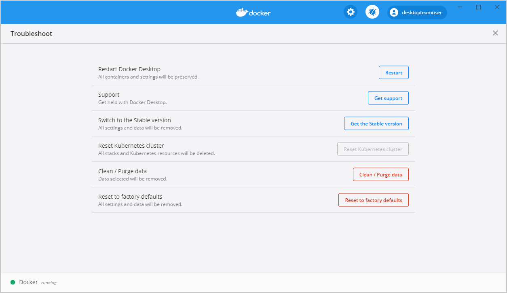
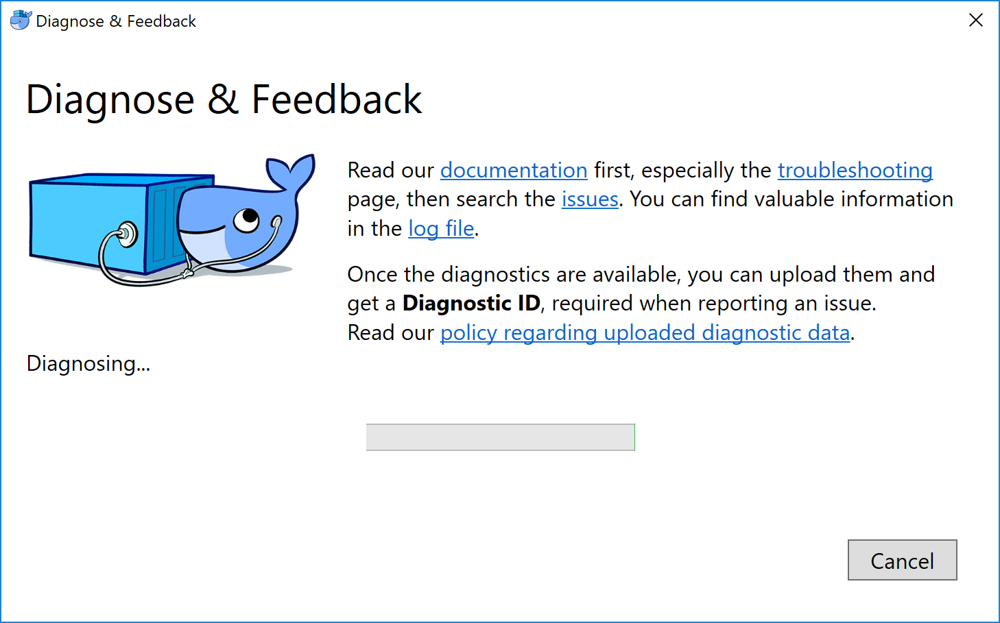
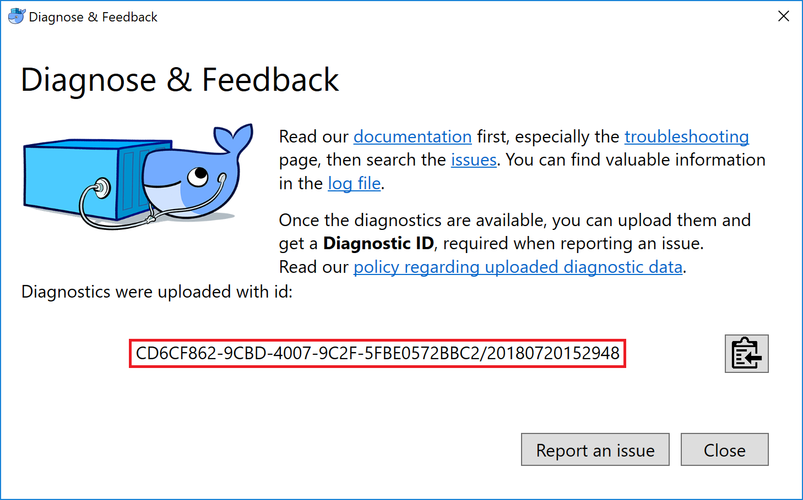
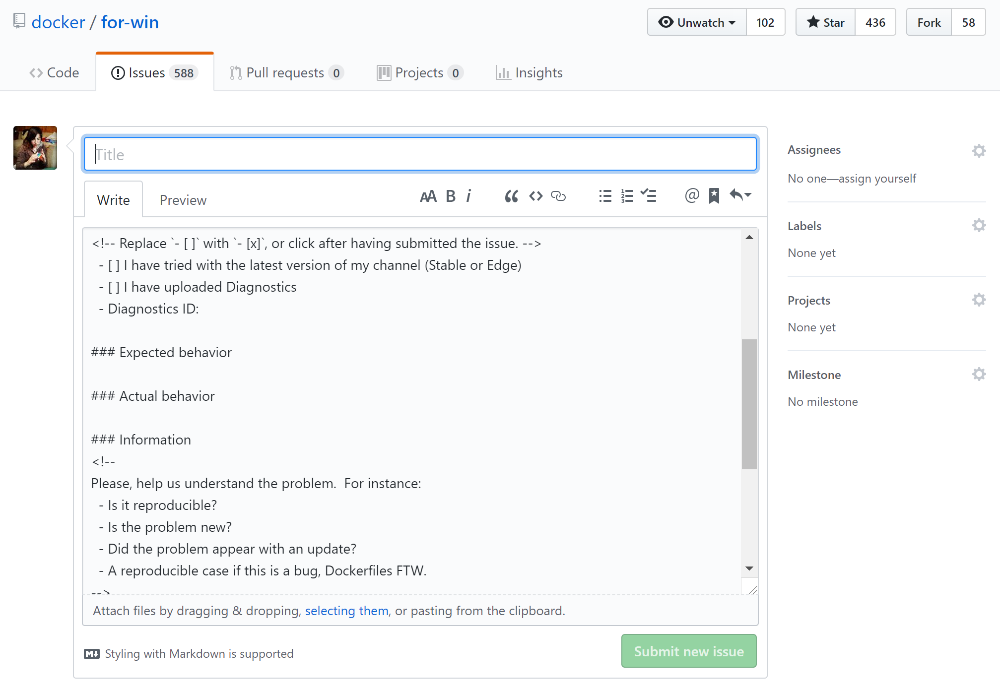
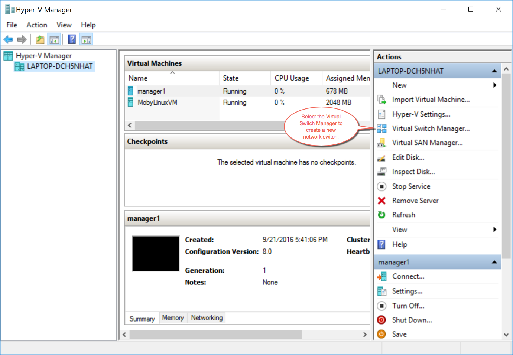

This page contains information on how to diagnose and troubleshoot problems, send logs and communicate with the Docker Desktop team, use our forums and Knowledge Hub, browse and log issues on GitHub, and find workarounds for known problems.

## Troubleshoot

Choose {: .inline} > **Troubleshoot**
from the menu bar to see the troubleshoot options.

{:width="750px"}

The Troubleshoot page contains the following options:

* **Restart Docker Desktop**: Select to restart Docker Desktop.

* **Run Diagnostics**: Select this option to diagnose any issues on Docker Desktop. For detailed information about diagnostics, see [Diagnose problems, send feedback, and create GitHub issues](#diagnose-problems-send-feedback-and-create-github-issues).

* **Clean / Purge data**: Select this option to delete container and image data. Choose whether you'd like to delete data from Hyper-V, WSL 2, or Windows Containers and then click **Delete** to confirm.

* **Reset Kubernetes cluster**: Select this option to delete all stacks and Kubernetes resources. For more information, see [Kubernetes](index.md#kubernetes).

* **Reset to factory defaults**: Choose this option to reset all options on
Docker Desktop to their initial state, the same as when Docker Desktop was first installed.

## Diagnose problems, send feedback, and create GitHub issues

### In-app diagnostics

If you experience issues for which you do not find solutions in this
documentation, on [Docker Desktop for Windows issues on
GitHub](https://github.com/docker/for-win/issues), or the [Docker Desktop for Windows
forum](https://forums.docker.com/c/docker-for-windows), we can help you
troubleshoot the log data.

Choose {: .inline} > **Troubleshoot**
from the menu.

{:width="600px"}

When the **Diagnose & Feedback** window initiated, it starts collecting diagnostics. When the diagnostics are available, you can upload them and obtain a **Diagnostic ID**, which must be provided when communicating with the Docker
team. For more information on our policy regarding personal data, see
[how is personal data handled in Docker
Desktop](https://docs.docker.com/docker-for-mac/faqs/#how-is-personal-data-handled-in-docker-desktop).

{:width="600px"}

If you click on **Report an issue**, it opens [Docker Desktop for Windows issues on
GitHub](https://github.com/docker/for-win/issues/) in your web browser in a
"New issue" template, to be completed before submission. Do not forget to
include your diagnostic ID.

{:width="600px"}

### Diagnosing from the terminal

On occasions it is useful to run the diagnostics yourself, for instance if
Docker Desktop for Windows cannot start.

First locate the `com.docker.diagnose`, that should be in `C:\Program
Files\Docker\Docker\resources\com.docker.diagnose.exe`.

To create *and upload*  diagnostics in Powershell, run:

```powershell
  PS C:\> & "C:\Program Files\Docker\Docker\resources\com.docker.diagnose.exe" gather -upload
```

After the diagnostics have finished, you should have the following output,
containing your diagnostic ID:

```sh
Diagnostics Bundle: C:\Users\User\AppData\Local\Temp\CD6CF862-9CBD-4007-9C2F-5FBE0572BBC2\20180720152545.zip
Diagnostics ID:     CD6CF862-9CBD-4007-9C2F-5FBE0572BBC2/20180720152545 (uploaded)
```

## Troubleshooting topics

### Make sure certificates are set up correctly

Docker Desktop ignores certificates listed under insecure registries, and
does not send client certificates to them. Commands like `docker run` that
attempt to pull from the registry produces error messages on the command line,
like this:

```
Error response from daemon: Get http://192.168.203.139:5858/v2/: malformed HTTP response "\x15\x03\x01\x00\x02\x02"
```

As well as on the registry. For example:

```
2017/06/20 18:15:30 http: TLS handshake error from 192.168.203.139:52882: tls: client didn't provide a certificate
2017/06/20 18:15:30 http: TLS handshake error from 192.168.203.139:52883: tls: first record does not look like a TLS handshake
```

For more about using client and server side certificates, see
[How do I add custom CA certificates?](index.md#how-do-i-add-custom-ca-certificates)
and [How do I add client certificates?](index.md#how-do-i-add-client-certificates) in the
Getting Started topic.

### Volumes

#### Permissions errors on data directories for shared volumes

Docker Desktop sets permissions on [shared volumes](index.md#file-sharing)
to a default value of [0777](http://permissions-calculator.org/decode/0777/)
(`read`, `write`, `execute` permissions for `user` and for `group`).

The default permissions on shared volumes are not configurable. If you are
working with applications that require permissions different from the shared
volume defaults at container runtime, you need to either use non-host-mounted
volumes or find a way to make the applications work with the default file
permissions.

See also,
[Can I change permissions on shared volumes for container-specific deployment requirements?](faqs.md#can-i-change-permissions-on-shared-volumes-for-container-specific-deployment-requirements)
in the FAQs.

#### Volume mounting requires shared folders for Linux containers

If you are using mounted volumes and get runtime errors indicating an
application file is not found, access is denied to a volume mount, or a service
cannot start, such as when using [Docker Compose](../compose/gettingstarted.md),
you might need to enable [shared folders](index.md#file-sharing).

Volume mounting requires shared folders for Linux containers (not for Windows
containers). Click {: .inline}
 and then **Settings** > **Shared Folders** and share the folder that contains the
Dockerfile and volume.

#### Support for symlinks

Symlinks work within and across containers. To learn more, see [How do symlinks work on Windows?](faqs.md#how-do-symlinks-work-on-windows) in the FAQs.

#### Avoid unexpected syntax errors, use Unix style line endings for files in containers

Any file destined to run inside a container must use Unix style `\n` line
endings. This includes files referenced at the command line for builds and in
RUN commands in Docker files.

Docker containers and `docker build` run in a Unix environment, so files in
containers must use Unix style line endings: `\n`, _not_ Windows style: `\r\n`.
Keep this in mind when authoring files such as shell scripts using Windows
tools, where the default is likely to be Windows style line endings. These
commands ultimately get passed to Unix commands inside a Unix based container
(for example, a shell script passed to `/bin/sh`). If Windows style line endings
are used, `docker run` fails with syntax errors.

For an example of this issue and the resolution, see this issue on GitHub:
[Docker RUN fails to execute shell
script](https://github.com/moby/moby/issues/24388).

### Virtualization

 Your machine must have the following features for Docker Desktop to function correctly:

1. [Hyper-V](https://docs.microsoft.com/en-us/windows-server/virtualization/hyper-v/hyper-v-technology-overview)
   installed and working

2. Virtualization enabled in the BIOS

#### Hyper-V

Docker Desktop requires Hyper-V as well as the Hyper-V Module for Windows
Powershell to be installed and enabled. The Docker Desktop installer enables
it for you.

Docker Desktop also needs two CPU hardware features to use Hyper-V: Virtualization and Second Level Address Translation (SLAT), which is also called Rapid Virtualization Indexing (RVI). On some systems, Virtualization must be enabled in the BIOS. The steps required are vendor-specific, but typically the BIOS option is called `Virtualization Technology (VTx)` or something similar. Run the command `systeminfo` to check all required Hyper-V features. See [Pre-requisites for Hyper-V on Windows 10](https://docs.microsoft.com/en-us/virtualization/hyper-v-on-windows/reference/hyper-v-requirements) for more details.

To install Hyper-V manually, see [Install Hyper-V on Windows 10](https://msdn.microsoft.com/en-us/virtualization/hyperv_on_windows/quick_start/walkthrough_install). A reboot is *required* after installation. If you install Hyper-V without rebooting, Docker Desktop does not work correctly.

From the start menu, type **Turn Windows features on or off** and press enter.
In the subsequent screen, verify that Hyper-V is enabled:

{:width="600px"}

#### Hyper-V driver for Docker Machine

The Docker Desktop installation includes the legacy tool Docker Machine which uses the old
[`boot2docker.iso`](https://github.com/boot2docker/boot2docker){:target="_blank" class="_"},
and the [Microsoft Hyper-V driver](../machine/drivers/hyper-v.md) to create local
virtual machines. _This is tangential to using Docker Desktop_, but if you want to use Docker Machine
to create multiple local Virtual Machines (VMs), or to provision remote machines, see the
[Docker Machine](../machine/index.md) topics. This is documented only for users looking for information about Docker Machine on Windows, which requires that Hyper-V is enabled, an external network switch is active, and referenced in the flags for the `docker-machine create` command
as described in the [Docker Machine driver example](../machine/drivers/hyper-v.md#example).

#### Virtualization must be enabled

In addition to [Hyper-V](#hyper-v) or [WSL 2](wsl.md), virtualization must be enabled. Check the
Performance tab on the Task Manager:

{:width="700px"}

If you manually uninstall Hyper-V, WSL 2 or disable virtualization,
Docker Desktop cannot start. See [Unable to run Docker for Windows on
Windows 10 Enterprise](https://github.com/docker/for-win/issues/74).

### Networking and WiFi problems upon Docker Desktop for Windows install

Some users may experience networking issues during install and startup of
Docker Desktop. For example, upon install or auto-reboot, network adapters
and/or WiFi may get disabled. In some scenarios, problems are due to having
VirtualBox or its network adapters still installed, but in other scenarios this
is not the case. See the GitHub issue [Enabling
Hyper-V feature turns my wi-fi
off](https://github.com/docker/for-win/issues/139).

Here are some steps to take if you experience similar problems:

1.  Ensure **virtualization** is enabled, as described above in [Virtualization
    must be enabled](#virtualization-must-be-enabled).

2.  Ensure **Hyper-V** is installed and enabled, as described above in [Hyper-V
    must be enabled](#hyper-v-must-be-enabled).

3.  Ensure **DockerNAT** is enabled by checking the **Virtual Switch Manager**
    on the Actions tab on the right side of the **Hyper-V Manager**.

    

4.  Set up an external network switch. If you plan at any point to use
    [Docker Machine](../machine/overview.md) to set up multiple local VMs, you
    need this anyway, as described in the topic on the
    [Hyper-V driver for Docker Machine](../machine/drivers/hyper-v.md#example).
    You can replace `DockerNAT` with this switch.

5.  If previous steps fail to solve the problems, follow steps on the
    [Cleanup README](https://github.com/Microsoft/Virtualization-Documentation/blob/master/windows-server-container-tools/CleanupContainerHostNetworking/README.md).

    > Read the full description before you run the Windows cleanup script.
    >
    >The cleanup command has two flags, `-Cleanup` and
    >`-ForceDeleteAllSwitches`. Read the whole page before running any scripts,
    >especially warnings about `-ForceDeleteAllSwitches`. {: .warning}

### Windows containers and Windows Server

Docker Desktop is not supported on Windows Server. If you have questions about how to run Windows containers on Windows 10, see
[Switch between Windows and Linux containers](index.md#switch-between-windows-and-linux-containers).

A full tutorial is available in [docker/labs](https://github.com/docker/labs) on
[Getting Started with Windows Containers](https://github.com/docker/labs/blob/master/windows/windows-containers/README.md).

You can install a native Windows binary which allows you to develop and run
Windows containers without Docker Desktop. However, if you install Docker this way, you cannot develop or run Linux containers. If you try to run a Linux container on the native Docker daemon, an error occurs:

```none
C:\Program Files\Docker\docker.exe:
 image operating system "linux" cannot be used on this platform.
 See 'C:\Program Files\Docker\docker.exe run --help'.
```

### Limitations of Windows containers for `localhost` and published ports

Docker Desktop for Windows provides the option to switch Windows and Linux containers.
If you are using Windows containers, keep in mind that there are some
limitations with regard to networking due to the current implementation of
Windows NAT (WinNAT). These limitations may potentially resolve as the Windows
containers project evolves.

Windows containers work with published ports on localhost beginning with Windows 10 1809 using Docker Desktop for Windows as well as Windows Server 2019 / 1809 using Docker EE.

If you are working with a version prior to `Windows 10 18.09`, published ports on Windows containers have an issue with loopback to the localhost. You can only reach container endpoints from the host using the container's IP and port. With `Windows 10 18.09`, containers work with published ports on localhost.

So, in a scenario where you use Docker to pull an image and run a webserver with
a command like this:

```shell
> docker run -d -p 80:80 --name webserver nginx
```

Using `curl http://localhost`, or pointing your web browser at
`http://localhost` does not display the `nginx` web page (as it would do with
Linux containers).

To reach a Windows container from the local host, you need to specify the IP
address and port for the container that is running the service.

You can get the container IP address by using [`docker inspect`](../engine/reference/commandline/inspect.md) with some `--format` options
and the ID or name of the container. For the example above, the command would
look like this, using the name we gave to the container (`webserver`) instead of
the container ID:


```bash
$ docker inspect \
  --format='{{range .NetworkSettings.Networks}}{{.IPAddress}}{{end}}' \
  webserver
```


This gives you the IP address of the container, for example:


```bash
$ docker inspect \
  --format='{{range .NetworkSettings.Networks}}{{.IPAddress}}{{end}}' \
  webserver

172.17.0.2
```


Now you can connect to the webserver by using `http://172.17.0.2:80` (or simply
`http://172.17.0.2`, since port `80` is the default HTTP port.)

For more information, see:

* Docker Desktop for Windows issue on GitHub: [Port binding does not work for
  locahost](https://github.com/docker/for-win/issues/458)

* [Published Ports on Windows Containers Don't Do
  Loopback](https://blog.sixeyed.com/published-ports-on-windows-containers-dont-do-loopback/)

* [Windows NAT capabilities and
  limitations](https://blogs.technet.microsoft.com/virtualization/2016/05/25/windows-nat-winnat-capabilities-and-limitations/)

### Running Docker Desktop in nested virtualization scenarios

Docker Desktop can run inside a Windows 10 VM running on apps like Parallels or VMware Fusion on a Mac provided that the VM is properly configured. However, problems and intermittent failures may still occur due to the way these apps virtualize the hardware. For these reasons, _**Docker Desktop is not supported in nested virtualization scenarios**_. It might work
in some cases, and not in others.

For best results, we recommend you run Docker Desktop natively on a Windows system (to work with Windows or Linux containers), or on Mac to work with Linux containers.

#### If you still want to use nested virtualization

* Make sure nested virtualization support is enabled in VMWare or Parallels.
  Check the settings in **Hardware > CPU & Memory > Advanced Options > Enable
  nested virtualization** (the exact menu sequence might vary slightly).

* Configure your VM with at least 2 CPUs and sufficient memory to run your
  workloads.

* Make sure your system is more or less idle.

* Make sure your Windows OS is up-to-date. There have been several issues with
  some insider builds.

* The processor you have may also be relevant. For example, Westmere based Mac
  Pros have some additional hardware virtualization features over Nehalem based
  Mac Pros and so do newer generations of Intel processors.

#### Typical failures we see with nested virtualization

* Slow boot time of the Linux VM. If you look in the logs and find some entries
  prefixed with `Moby`. On real hardware, it takes 5-10 seconds to boot the
  Linux VM; roughly the time between the `Connected` log entry and the `*
  Starting Docker ... [ ok ]` log entry. If you boot the Linux VM inside a
  Windows VM, this may take considerably longer. We have a timeout of 60s or so.
  If the VM hasn't started by that time, we retry. If the retry fails we print
  an error. You can sometimes work around this by providing more resources to
  the Windows VM.

* Sometimes the VM fails to boot when Linux tries to calibrate the time stamp
  counter (TSC). This process is quite timing sensitive and may fail when
  executed inside a VM which itself runs inside a VM. CPU utilization is also
  likely to be higher.

* Ensure "PMU Virtualization" is turned off in Parallels on Macs. Check the
  settings in **Hardware > CPU & Memory > Advanced Settings > PMU
  Virtualization**.

#### Related issues

Discussion thread on GitHub at [Docker for Windows issue
267](https://github.com/docker/for-win/issues/267).

### Networking issues

IPv6 is not (yet) supported on Docker Desktop.

Some users have reported problems connecting to Docker Hub on the Docker Desktop stable version. (See GitHub issue
[22567](https://github.com/moby/moby/issues/22567).)

Here is an example command and error message:

```shell
> docker run hello-world

Unable to find image 'hello-world:latest' locally
Pulling repository docker.io/library/hello-world
C:\Program Files\Docker\Docker\Resources\bin\docker.exe: Error while pulling image: Get https://index.docker.io/v1/repositories/library/hello-world/images: dial tcp: lookup index.docker.io on 10.0.75.1:53: no such host.
See 'C:\Program Files\Docker\Docker\Resources\bin\docker.exe run --help'.
```

As an immediate workaround to this problem, reset the DNS server to use the
Google DNS fixed address: `8.8.8.8`. You can configure this through the **Settings**
> **Network** dialog, as described in the topic [Network](index.md#network).
Docker automatically restarts when you apply this setting, which could take some
time.

### NAT/IP configuration

By default, Docker Desktop uses an internal network prefix of
`10.0.75.0/24`. Should this clash with your normal network setup, you can change
the prefix from the **Settings** menu. See the [Network](index.md#network) topic
under [Settings](index.md#docker-settings).

## Workarounds

### Reboot

Restart your PC to stop / discard any vestige of the daemon running from the
previously installed version.

### Unset `DOCKER_HOST`

The `DOCKER_HOST` environmental variable does not need to be set.  If you use
bash, use the command `unset ${!DOCKER_*}` to unset it.  For other shells,
consult the shell's documentation.

### Make sure Docker is running for webserver examples

For the `hello-world-nginx` example and others, Docker Desktop must be
running to get to the webserver on `http://localhost/`. Make sure that the
Docker whale is showing in the menu bar, and that you run the Docker commands in
a shell that is connected to the Docker Desktop Engine (not Engine from Toolbox). Otherwise, you might start the webserver container but get a "web page
not available" error when you go to `docker`.

### How to solve `port already allocated` errors

If you see errors like `Bind for 0.0.0.0:8080 failed: port is already allocated`
or `listen tcp:0.0.0.0:8080: bind: address is already in use` ...

These errors are often caused by some other software on Windows using those
ports. To discover the identity of this software, either use the `resmon.exe`
GUI and click "Network" and then "Listening Ports" or in a Powershell use
`netstat -aon | find /i "listening "` to discover the PID of the process
currently using the port (the PID is the number in the rightmost column). Decide
whether to shut the other process down, or to use a different port in your
docker app.

### Docker Desktop fails to start when anti-virus software is installed

Some anti-virus software may be incompatible with Hyper-V and Microsoft
Windows 10 builds. The conflict
typically occurs after a Windows update and
manifests as an error response from the Docker daemon and a Docker Desktop start failure.

For a temporary workaround, uninstall the anti-virus software, or
explore other workarounds suggested on Docker Desktop forums.
