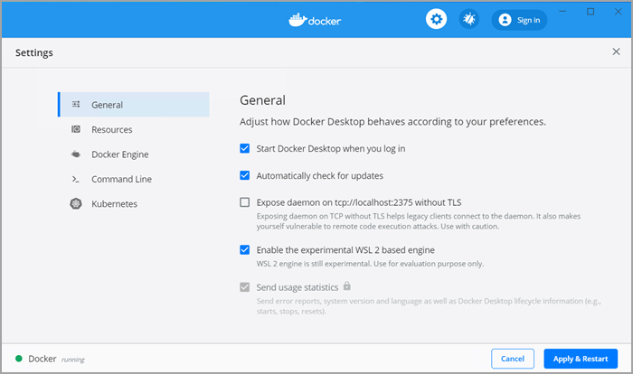
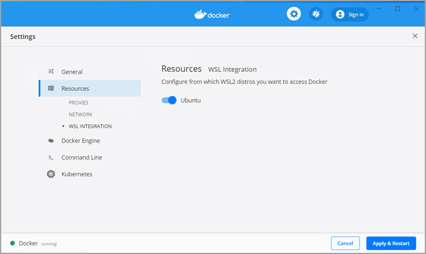

Windows Subsystem for Linux (WSL) 2 introduces a significant architectural change as it is a full Linux kernel built by Microsoft, allowing Linux containers to run natively without emulation. With Docker Desktop running on WSL 2, users can leverage Linux workspaces and avoid having to maintain both Linux and Windows build scripts. In addition, WSL 2 provides improvements to file system sharing, boot time, and allows access to some cool new features for Docker Desktop users.

Docker Desktop uses the dynamic memory allocation feature in WSL 2 to greatly improve the resource consumption. This means, Docker Desktop only uses the required amount of CPU and memory resources it needs, while enabling CPU and memory-intensive tasks such as building a container to run much faster.

Additionally, with WSL 2, the time required to start a Docker daemon after a cold start is significantly faster. It takes less than 10 seconds to start the Docker daemon when compared to almost a minute in the previous version of Docker Desktop.

## Prerequisites

Before you install the Docker Desktop WSL 2 backend, you must complete the following steps:

1. Install Windows 10, version 2004 or higher.
2. Enable WSL 2 feature on Windows. For detailed instructions, refer to the [Microsoft documentation](https://docs.microsoft.com/en-us/windows/wsl/install-win10).
3. Download and install the [Linux kernel update package](https://docs.microsoft.com/windows/wsl/wsl2-kernel).

## Download

Download [Docker Desktop Stable 2.3.0.2](https://hub.docker.com/editions/community/docker-ce-desktop-windows/) or a later release.

## Install

Ensure you have completed the steps described in the Prerequisites section **before** installing the Docker Desktop Stable 2.3.0.2 release.

1. Follow the usual installation instructions to install Docker Desktop. If you are running a supported system, Docker Desktop prompts you to enable WSL 2 during installation. Read the information displayed on the screen and enable WSL 2 to continue.
2. Start Docker Desktop from the Windows Start menu.
3. From the Docker menu, select **Settings** > **General**.

    {:width="750px"}

4. Select the **Use WSL 2 based engine** check box.

    If you have installed Docker Desktop on a system that supports WSL 2, this option will be enabled by default.
5. Click **Apply & Restart**.
6. Ensure the distribution runs in WSL 2 mode. WSL can run distributions in both v1 or v2 mode.

    To check the WSL mode, run

     `wsl -l -v`

    To upgrade your existing Linux distro to v2, run:

    `wsl --set-version (distro name) 2`

    To set v2 as the default version for future installations, run:

    `wsl --set-default-version 2`

7. When Docker Desktop restarts, go to **Settings** > **Resources** > **WSL Integration**.

    WSL Integration will be enabled on your default WSL distribution. To change your default WSL distro, run `wsl --set-default <distro name>`.

    For example, to set Ubuntu as your default WSL distro, run `wsl --set-default ubuntu`.

    Optionally, select any additional distributions you would like to enable WSL 2 on.

    

8. Click **Apply & Restart**.

## Develop with Docker and WSL 2

The following section describes how to start developing your applications using Docker and WSL 2. We recommend that you have your code in your default Linux distribution for the best development experience using Docker and WSL 2. After you have enabled WSL 2 on Docker Desktop, you can start working with your code inside the Linux distro and ideally with your IDE still in Windows. This workflow can be pretty straightforward if you are using [VSCode](https://code.visualstudio.com/download).

1. Open VSCode and install the [Remote - WSL](https://marketplace.visualstudio.com/items?itemName=ms-vscode-remote.remote-wsl) extension. This extension allows you to work with a remote server in the Linux distro and your IDE client still on Windows.
2. Now, you can start working in VSCode remotely. To do this, open your terminal and type:

    `wsl`

    `code .`

    This opens a new VSCode connected remotely to your default Linux distro which you can check in the bottom corner of the screen.

    Alternatively, you can type the name of your default Linux distro in your Start menu, open it, and then run `code` .
3. When you are in VSCode, you can use the terminal in VSCode to pull your code and start working natively from your Windows machine.

## Best practices

- To get the best out of the file system performance when bind-mounting files:
    - Store source code and other data that is bind-mounted into Linux containers
      (i.e., with `docker run -v <host-path>:<container-path>`) in the Linux
      filesystem, rather than the Windows filesystem.
    - Linux containers only receive file change events ("inotify events") if the
      original files are stored in the Linux filesystem.
    - Performance is much higher when files are bind-mounted from the Linux
      filesystem, rather than remoted from the Windows host. Therefore avoid
      `docker run -v /mnt/c/users:/users` (where `/mnt/c` is mounted from Windows).
    - Instead, from a Linux shell use a command like `docker run -v ~/my-project:/sources <my-image>`
      where `~` is expanded by the Linux shell to `$HOME`.
- If you have concerns about the size of the docker-desktop-data VHDX, or need to change it, take a look at the [WSL tooling built into Windows](https://docs.microsoft.com/en-us/windows/wsl/wsl2-ux-changes#understanding-wsl-2-uses-a-vhd-and-what-to-do-if-you-reach-its-max-size).
- If you have concerns about CPU or memory usage, you can configure limits on the memory, CPU, Swap size allocated to the [WSL 2 utility VM](https://docs.microsoft.com/en-us/windows/wsl/release-notes#build-18945).
- To avoid any potential conflicts with using WSL 2 on Docker Desktop, you must [uninstall any previous versions of Docker Engine](https://docs.docker.com/install/linux/docker-ce/ubuntu/#uninstall-docker-engine---community) and CLI installed directly through Linux distributions before installing Docker Desktop.

## Feedback

Your feedback is very important to us. Please let us know your feedback by creating an issue in the [Docker Desktop for Windows GitHub](https://github.com/docker/for-win/issues) repository and adding the **WSL 2** label.
