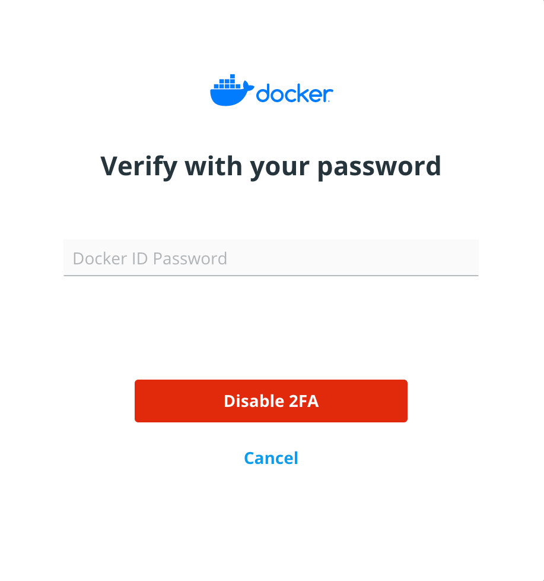

> **Note:**
> Disabling two-factor authentication will result in decreased security for your
> Docker Hub account.
{: .warning }

## Prerequisites
Two-factor authentication is enabled on your Docker Hub account.

## Disable two-factor authentication
To disable two-factor authentication, log in to your Docker Hub account. Click
on your username and select **Account Settings**. Go to Security and click on
**Disable 2FA**.

You will be prompted to input your Docker ID password. Enter your password and
click **Disable 2FA**.

{:width="250px"}

You have successfully disabled two-factor authentication.
