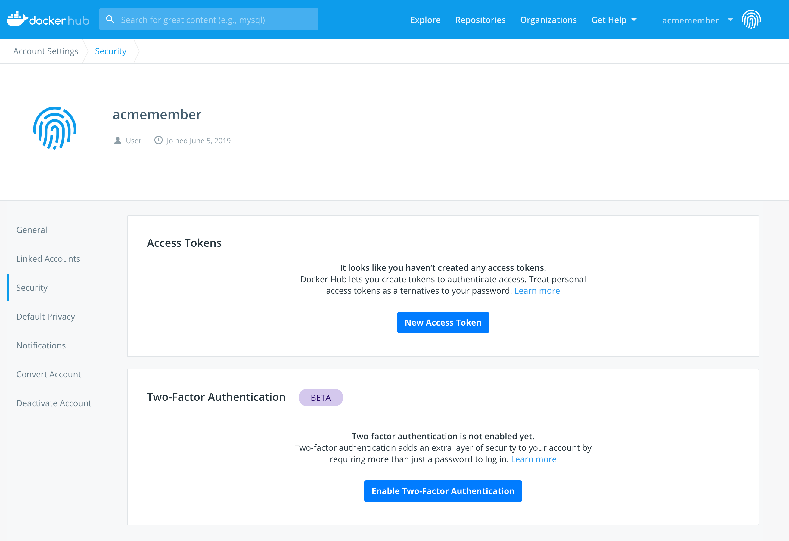
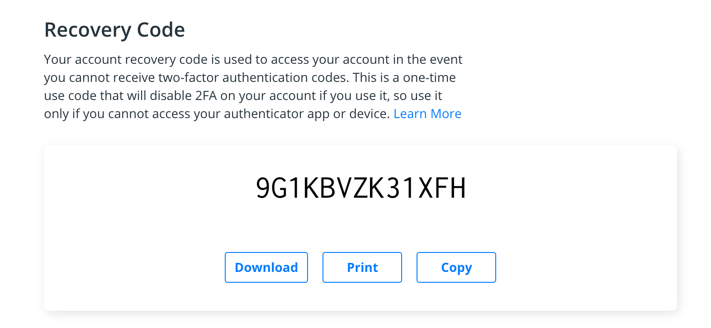
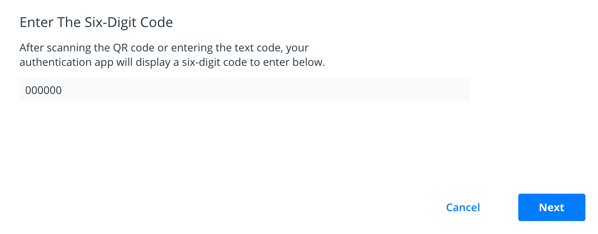

## About two-factor authentication
Two-factor authentication adds an extra layer of security to your Docker Hub
account by requiring a unique security code when you log into your account. The
security code will be required in addition to your password.

When you enable two-factor authentication, you will also be provided a recovery
code. Each recovery code is unique and specific to your account. You can use
this code to recover your account in case you lose access to your authenticator
app. See [Recover your Docker Hub account](recover-hub-account/).

## Prerequisites

You need a mobile phone with a time-based one-time password authenticator
application installed. Common examples include Google Authenticator or Yubico
Authenticator with a registered YubiKey.

> **Note:**
> Two-factor authentication is currently in beta. Feel free to provide feedback
> at the [Docker Hub feedback repo](https://github.com/docker/hub-feedback/issues).
{: .important}

## Enable two-factor authentication

To enable two-factor authentication, log in to your Docker Hub account. Click
on your username and select **Account Settings**. Go to Security and click
**Enable Two-Factor Authentication**.

The next page will remind you to download an authenticator app. Click **Set up**
**using an app**. You will receive your unique recovery code.

> **Save your recovery code and store it somewhere safe.**
>
> Your recovery code can be used to recover your account in the event you lose
> access to your authenticator app.
{: .important }

After you have saved your code, click **Next**.

Open your authenticator app. You can choose between scanning the QR code or
entering a text code into your authenticator app. Once you have linked your
authenticator app, it will give you a six-digit code to enter in text field.
Click **Next**.

You have successfully enabled two-factor authentication. The next time you log
in to your Docker Hub account, you will be asked for a security code.

> **Note:**
> Now that you have two-factor authentication enabled on your account, you must
> create at least one personal access token. Otherwise, you will be unable to
> log in to your account from the Docker CLI. See [Managing access tokens](../access-tokens)
> for more information.
{: .important }
