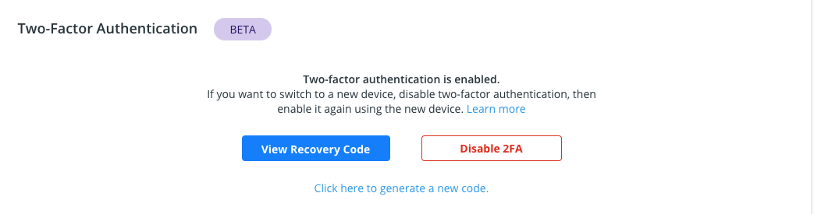
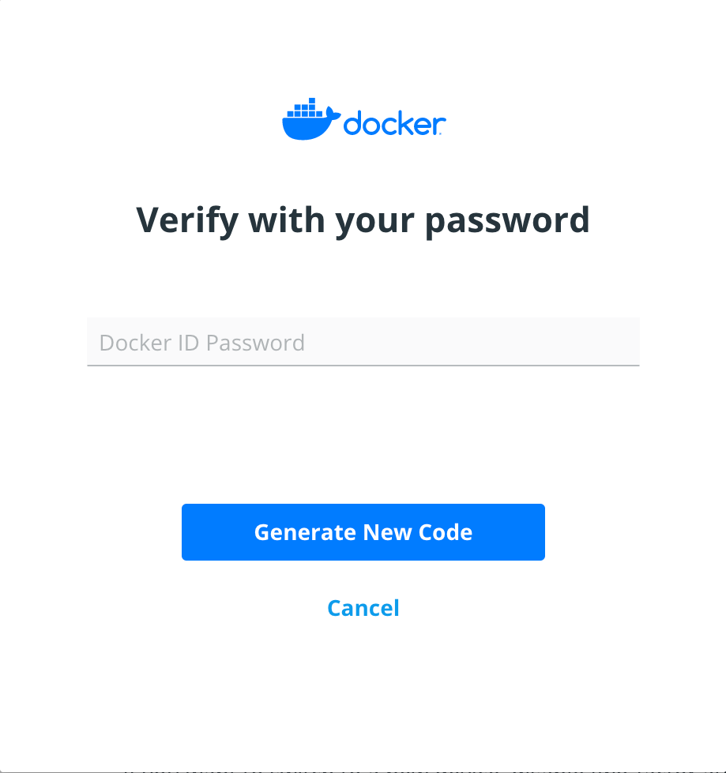

If you have lost your two-factor authentication recovery code and still have
access to your Docker Hub account, you can generate a new recovery code.

## Prerequisites

Two-factor authentication is enabled on your Docker Hub account.

## Generate a new recovery code

To disable two-factor authentication, log in to your Docker Hub account. Click
on your username and select **Account Settings**.  Go to **Security** and click
on **Click here to generate a new code**.

Enter your password.

{:width="250px"}

Your new recovery code will be displayed. Remember to save your recovery code
and store it somewhere safe.
