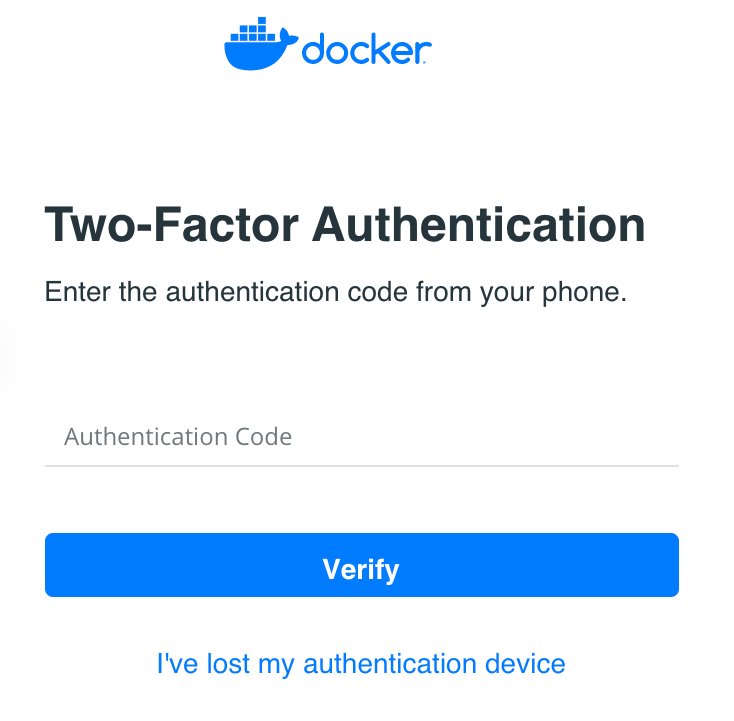
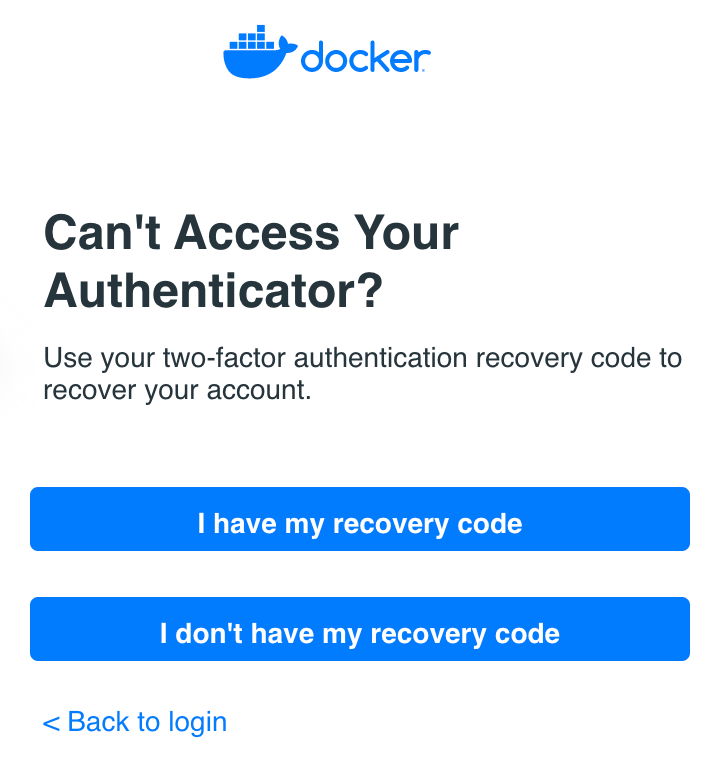
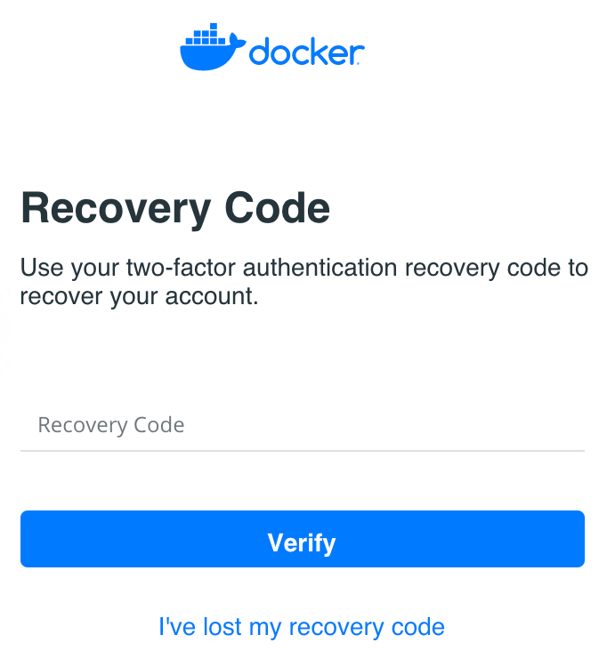

If you have lost your two-factor authentication device and need to access your
Docker Hub account, you can gain access to your account using your two-factor
authentication recovery code.

## Prerequisites

Two-factor authentication is enabled on your Docker Hub account and you have
your two-factor authentication recovery code.

> If you lose both your 2FA authentication device and recovery code, you may
> not be able to recover your account.
{: .important }

## Recover your Docker Hub account with a recovery code

Go through the login process on Docker Hub. When you're asked to enter your
two-factor authentication code, click **I've lost my authentication device**.

{:width="250px"}

On the next screen, click "I have my recovery code".

{:width="250px"}

Enter your recovery code.

{:width="250px"}

Once you have used your recovery code, you will have to re-enable two-factor
authentication. See [Enabling two-factor authentication on Docker Hub](/docker-hub/2fa).

## Alternative recovery methods

If you have lost access to both your two-factor authentication application and
your recovery code, send an email to [Docker Hub Support](mailto:hub-support@docker.com) from the primary email associated with your Docker ID for recovery instructions.
