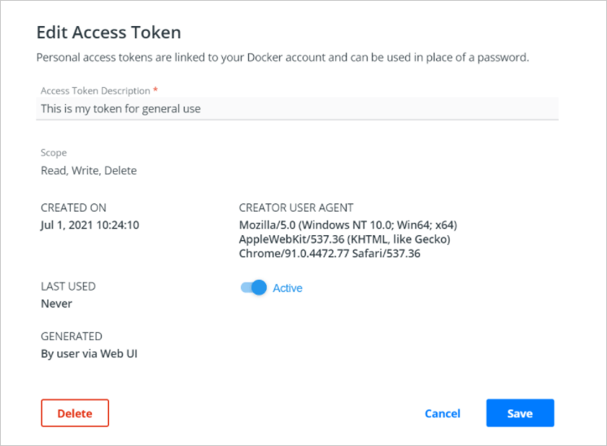

Docker Hub lets you create personal access tokens as alternatives to
your password. Access tokens are linked to a particular user account and
duplicate any permissions that account has. If the account changes
permissions, so will the token.

Access tokens are useful in cases such as building integrations since
you can issue multiple tokens &ndash; one for each integration &ndash;
and revoke them at any time.

## Create an access token

You can create as many tokens as you need.

1. Log in to [hub.docker.com](https://hub.docker.com).

2. Click on your username in the top right corner and select **Account
Settings**.

3. Select **Security > New Access Token**.

      

4. Add a description for your token. Use something that indicates where
the token is going to be used, or set a purpose for the token.

5. Copy the token that appears on the screen. Make sure you do this now:
once you close this prompt, Docker will never show the token again.

      

      Treat access tokens like your password and keep them secret. Store your tokens securely (for example, in a credential manager).

## Modify existing tokens

You can rename, deactivate, or delete a token as needed.

1. Access your tokens under **Account Settings > Security**.

2. Select a token and click **Delete** or **Edit**, or use the menu on
the far right of a token row to bring up the edit screen. You can also
select multiple tokens to delete them all once.

      

## Use an access token

You can use an access token anywhere that requires your Docker Hub
password.

For example, when logging in from your Docker CLI client (`docker login --username <username>`), omit the password in the login command. When you're prompted for a password, enter your token instead. 
