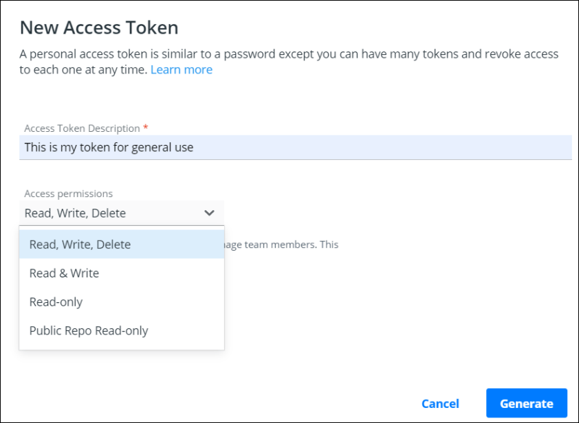
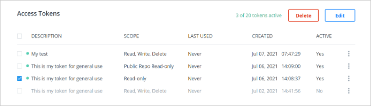

Docker Hub lets you create personal access tokens as alternatives to your password. You can use tokens to access Hub images from the Docker CLI.

Using personal access tokens provides some advantages over a password:

* You can investigate the last usage of the access token and disable or delete
  it if you find any suspicious activity.
* When using an access token, you can't perform any admin activity on the account, including changing the password. It protects your account if your computer is compromised.
  
Docker provides a [Docker Hub CLI](https://github.com/docker/hub-tool#readme){: target="_blank" rel="noopener" class="_"}
tool (currently experimental) and an API that allows you to interact with Docker Hub. Browse through the [Docker Hub API](/docker-hub/api/latest/){: target="_blank" rel="noopener" class="_"} documentation to explore the supported endpoints.

> **Important**
>
> Treat access tokens like your password and keep them secret. Store your
> tokens securely (for example, in a credential manager).
{: .important}

Access tokens are valuable for building integrations, as you can issue
multiple tokens &ndash; one for each integration &ndash; and revoke them at
any time.

   > **Note**
   >
   > If you have [two-factor authentication (2FA)](2fa/index.md) enabled on
   > your account, you must create at least one personal access token. Otherwise,
   > you will be unable to log in to your account from the Docker CLI.

## Create an access token

The following video walks you through the process of managing access tokens.

<iframe width="560" height="315" src="https://www.youtube-nocookie.com/embed/Qs5xGj85Aek" frameborder="0" allow="accelerometer; autoplay; clipboard-write; encrypted-media; gyroscope; picture-in-picture" allowfullscreen></iframe>

To create your access token:

1. Log in to [hub.docker.com](https://hub.docker.com){: target="_blank" rel="noopener" class="_"}.

2. Click on your username in the top right corner and select **[Account Settings](https://hub.docker.com/settings/general)**.

3. Select **[Security](https://hub.docker.com/settings/security) > New Access Token**.

4. Add a description for your token. Use something that indicates where the token
   will be used, or set a purpose for the token. You can view the following access
   permissions from the drop-down:

      {:width="700px"}

   The access permissions are scopes that set restrictions in your
   repositories. For example, for Read & Write permissions, an automation
   pipeline can build an image and then push it to a repository. However, it
   can not delete the repository.

5. Copy the token that appears on the screen and save it. You will not be able
   to retrieve the token once you close this prompt.

      {:width="700px"}

## Use an access token

You can use an access token anywhere that requires your Docker Hub
password.

When logging in from your Docker CLI client (`docker login --username <username>`),
omit the password in the login command. Instead, enter your token when asked for
a password.

> **Note**
>
> If you have [two-factor authentication (2FA)](2fa/index.md) enabled, you must
> use a personal access token when logging in from the Docker CLI. 2FA is an
> optional, but more secure method of authentication.

## Modify existing tokens

You can rename, activate, deactivate, or delete a token as needed.

1. Access your tokens under **[Account Settings > Security](https://hub.docker.com/settings/security){: target="_blank" rel="noopener" class="_"}**.
   This page shows an overview of all your tokens. You can also view the number
   of tokens that are activated and deactivated in the toolbar.

   {:width="700px"}

2. Select a token and click **Delete** or **Edit**, or use the menu on
   the far right of a token row to bring up the edit screen. You can also
   select multiple tokens to delete at once.

      {:width="700px"}

3. After modifying the token, click the **Save** button to save your changes.
