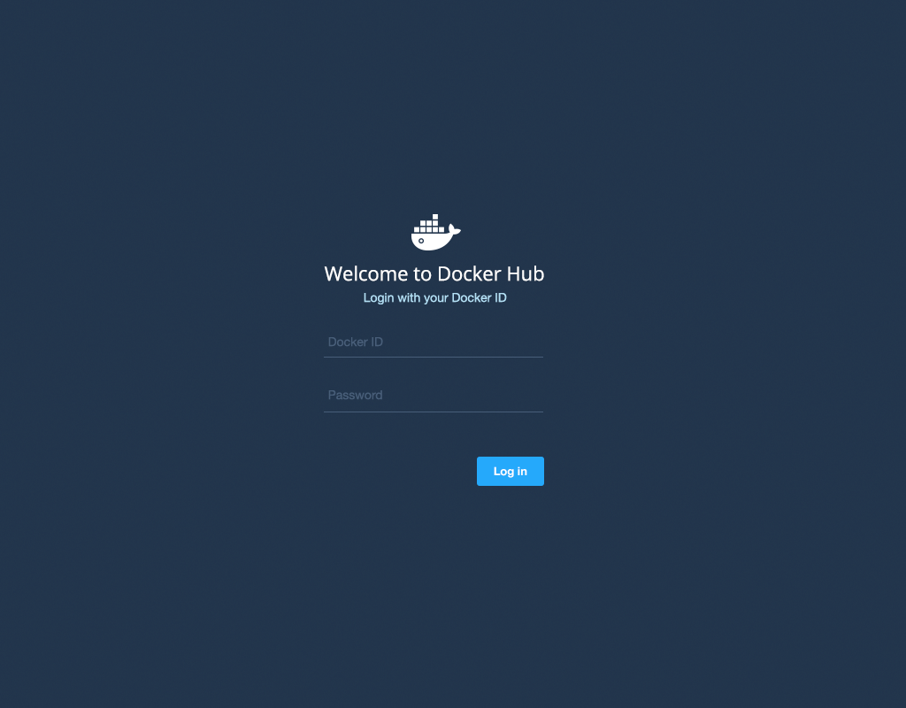

# Your Docker ID

You can `search` for Docker images and `pull` them from [Docker
Hub](https://hub.docker.com) without signing in or even having an
account. However, to `push` images, leave comments, or to *star*
a repository, you need a free [Docker ID](https://hub.docker.com) to log in to Docker Hub.

Once you have a personal Docker ID, you can also create or join
Docker Hub [Organizations and Teams](orgs.md).

## Register for a Docker ID

If you're not already logged in, go to [Docker Hub](https://hub.docker.com)
to use the sign up page.
A valid email address is required to register. A verification email is sent to this address to activate your account.

You cannot log in to your Docker ID until you verify the email address.

#### Confirm your email

Once you've filled in the registration form, check your email for a welcome message asking for
confirmation so we can activate your account.

## Login

After you complete the account creation process, you can log in any time using the web console with your Docker ID:

Or via the command line with the `docker login` command:

    $ docker login

Your Docker ID is now active and ready to use.

> **Note:**
> Your authentication credentials will be stored in the `.dockercfg`
> authentication file in your home directory.

### Upgrading your account

Free Hub accounts include one private registry. If you need more private registries, you can [upgrade your account](https://hub.docker.com/account/billing-plans/) to a paid plan directly from the Hub.

## Password reset process

If you can't access your account for some reason, you can reset your password
from the [*Password Reset*](https://hub.docker.com/reset-password/)
page.
