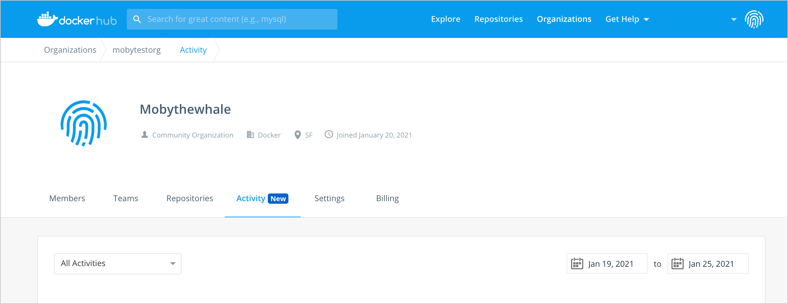
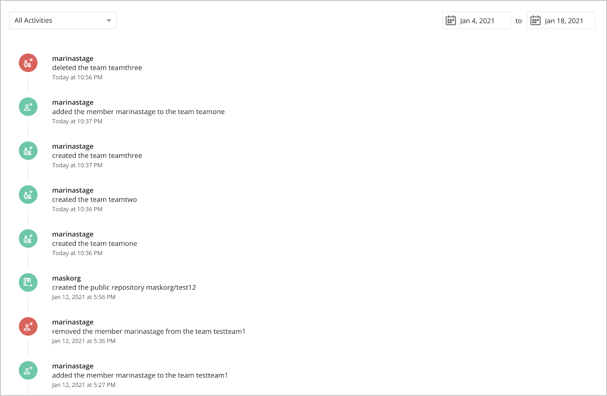
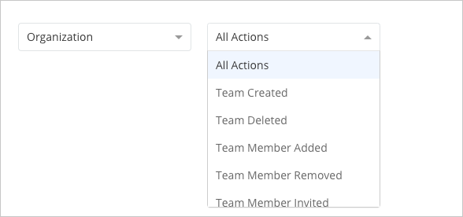

> The Audit log feature is available for users subscribed to a Team plan. [Upgrade](https://www.docker.com/pricing){: target="_blank" rel="noopener" class="_"} your existing account to a Team account to start using the Audit log feature.

Audit log displays a chronological list of activities that occur at organization and repository levels. It provides owners of Docker Team accounts a report of all their team member activities. This allows the team owners to view and track what changes were made, the date when a change was made, and who initiated the change. For example, the Audit log displays activities such as the date when a repository was created or deleted, the team member who created the repository, the name of the repository, and when there was a change to the privacy settings.

Team owners can also see the Audit log for their repository if the repository is part of the organization subscribed to a Docker Team plan.

## View the Audit log

To view the Audit log:

1. Sign into an owner account for the organization in Docker Hub.
2. Select your organization from the list and then click on the **Activity** tab.

    {:width="700px"}

The Audit log begins tracking activities from the date the feature is live, that is from **25 January 2021**. Activities that took place before this date are not captured.

> **Note**
>
> Docker will retain the Audit log activity data for a period of six months.

## Customize the Audit log

By default, all activities that occur at organization and repository levels are displayed on the **Activity** tab. Use the calendar option to select a date range and customize your results. After you have selected a date range, the **Activity** tab displays the Audit log of all the activities that occurred during that period.

{:width="600px"}

 

> **Note**
>
> Activities created by the Docker Support team as part of resolving customer issues appear in the Audit log as **dockersupport**.

 

Click the **All Activities** drop-down list to view activities that are specific to an organization or a repository. After choosing **Organization** or **Repository**, you can further refine the results using the **All Actions** drop-down list. If you select the **Activities** tab from the **Repository** view, you can only filter repository-level activities.

{:width="600px"}

## Audit log event definitions

Refer to the following section for a list of events and their descriptions:

### Organization events

| Event                                                          | Description                                   |
|:------------------------------------------------------------------|:------------------------------------------------|
| Team Created | Activities related to the creation of a team     |
| Team Deleted | Activities related to the deletion of a team |
| Team Member Added | Details of the member added to your team |
| Team Member Removed | Details of the member removed from your team |
| Team Member Invited | Details of the member invited to your team |
| Organization Member Removed | Details about member removed from your organization |
|  Organization Created| Activities related to the creation of a new organization |

### Repository events

| Event                                                          | Description                                   |
|:------------------------------------------------------------------|:------------------------------------------------|
| Repository Created | Activities related to the creation of a new repository |
| Repository Deleted | Activities related to the deletion of a repository |
| Privacy Changed | Details related to the privacy policies that were updated |
| Tag Pushed | Activities related to the tags pushed |
| Tag Deleted | Activities related to the tags deleted |
