You can build your images automatically from a build context stored in a
repository. A *build context* is a Dockerfile and any files at a specific
location. For an automated build, the build context is a repository containing a
Dockerfile.

Automated Builds have several advantages:

 * Images built in this way are built exactly as specified.
 * The `Dockerfile` is available to anyone with access to your Docker Hub repository.
 * Your repository is kept up-to-date with code changes automatically.

Automated Builds are supported for both public and private repositories on both
[GitHub](http://github.com) and [Bitbucket](https://bitbucket.org/). This
document guides you through the process of working with automated builds.

## Prerequisites

To use automated builds, you must have an [account on Docker Hub](accounts.md)
and on the hosted repository provider (GitHub or Bitbucket). If you have
previously linked your Github or Bitbucket account, you must have chosen the
Public and Private connection type.

To view your current connection settings, log in to Docker Hub and choose
**Profile > Settings > Linked Accounts & Services**.

## Limitations

- Currently Docker Hub does not support Git LFS (Large File Storage). If you have
  binaries in your build context that are managed by Git LFS, only the pointer
  file is present in the clone made during the automated build, which is not
  what you want.

  Subscribe to the [GitHub issue](https://github.com/docker/hub-feedback/issues/500)
  tracking this limitation.

- Building Windows containers is not supported.

## Link to a hosted repository service

1. Log into Docker Hub.

2. Navigate to **Profile &gt; Settings &gt; Linked Accounts & Services**.

3. Click the service you want to link.

    The system prompts you to choose between Public and Private and Limited Access. The Public and Private connection type is required if you want to use the Automated Builds.

4. Press **Select** under Public and Private connection type.

    The system prompts you to enter your service credentials (Bitbucket or GitHub) to login. For example, Bitbucket's prompt looks like this:

    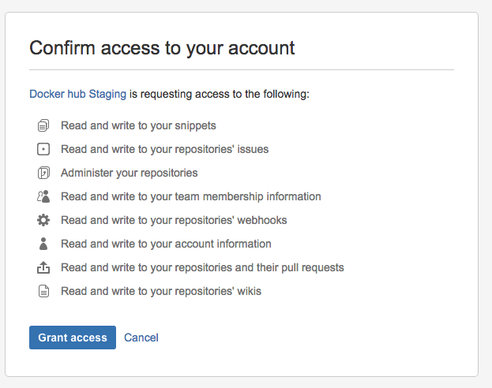

    After you grant access to your code repository, the system returns you to Docker Hub and the link is complete.

    

## Create an automated build

Automated build repositories rely on the integration with your code repository
To build. However, you can also push already-built images to these
repositories using the `docker push` command.

1. Select **Create** > **Create Automated Build** (from the drop down, upper right) on [Docker Hub](https://hub.docker.com/).

    The system prompts you with a list of User/Organizations and code repositories.

2. Select from the User/Organizations.

3. Optionally, type to filter the repository list.

4. Pick the project to build.

    The system displays the **Create Automated Build** dialog.

    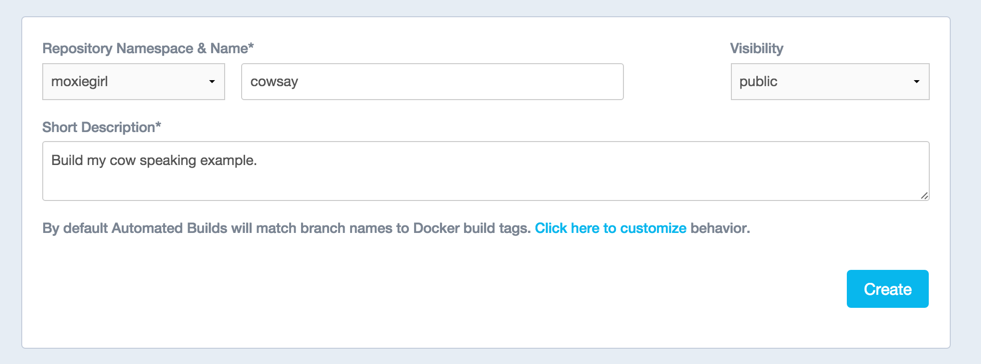

    The dialog assumes some defaults which you can customize. By default, Docker
    builds images for each branch in your repository. It assumes the Dockerfile
    lives at the root of your source. When it builds an image, Docker tags it with
    the branch name.

6. Customize the automated build by pressing the **Click here to customize** this behavior link.

    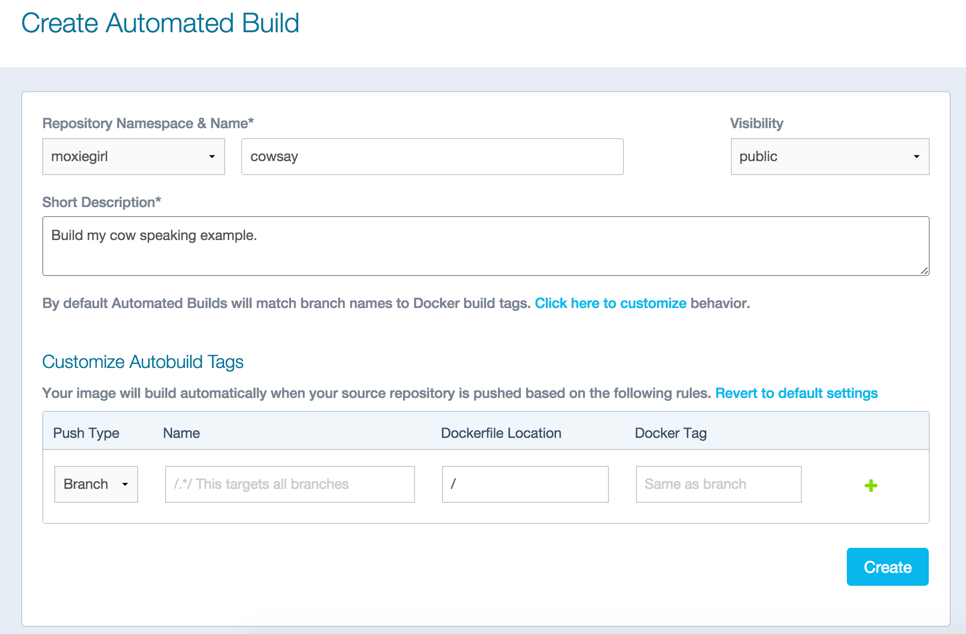

    Specify which code branches or tags to build from. You can add new
    configurations by clicking the + (plus sign). The dialog accepts regular
    expressions.

    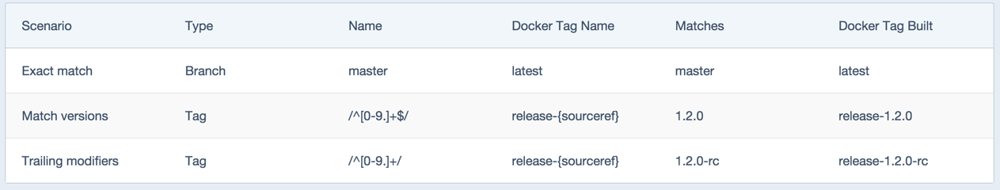

9. Click **Create**.

    The system displays the home page for your AUTOMATED BUILD.

    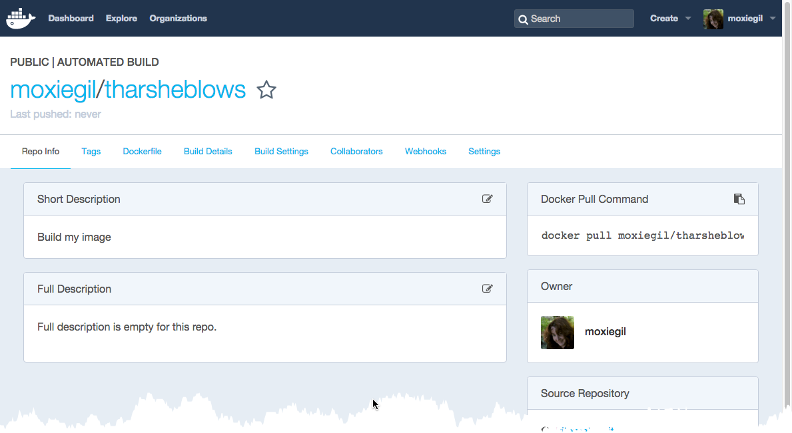

    Within GitHub, a Docker integration appears in your repositories Settings > Webhooks & services page.

    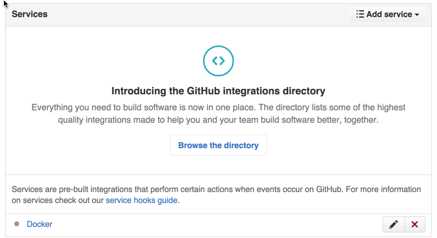

    A similar page appears in Bitbucket if you use that code repository. Be
    careful to leave the Docker integration in place. Removing it causes your
    automated builds to stop.

### Understand the build process

The first time you create a new automated build, Docker Hub builds your image.
In a few minutes, you should see your new build on the image dashboard. The
Build Details page shows a log of your build systems:

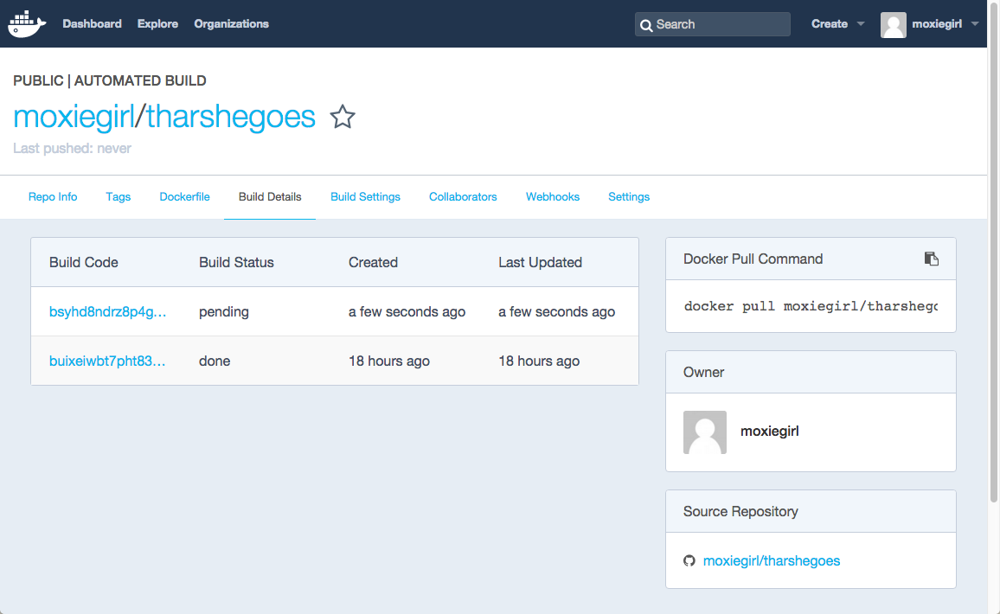

During the build process, Docker copies the contents of your `Dockerfile` to
Docker Hub. The Docker community (for public repositories) or approved team
members/orgs (for private repositories) can then view the Dockerfile on your
repository page.

The build process looks for a `README.md` in the same directory as your
`Dockerfile`. If you have a `README.md` file in your repository, it is used in
the repository as the full description. If you change the full description after
a build, it's overwritten the next time the Automated Build runs. To make
changes, modify the `README.md` in your Git repository.

You can only trigger one build at a time and no more than one every five
minutes. If you already have a build pending, or if you recently submitted a
build request, Docker ignores new requests.

### Build statuses explained

You can view the status of the builds for a specific repository by looking at
the Build Details screen. If you have builds that are queued or in progress, you
can click **Cancel** to end them.

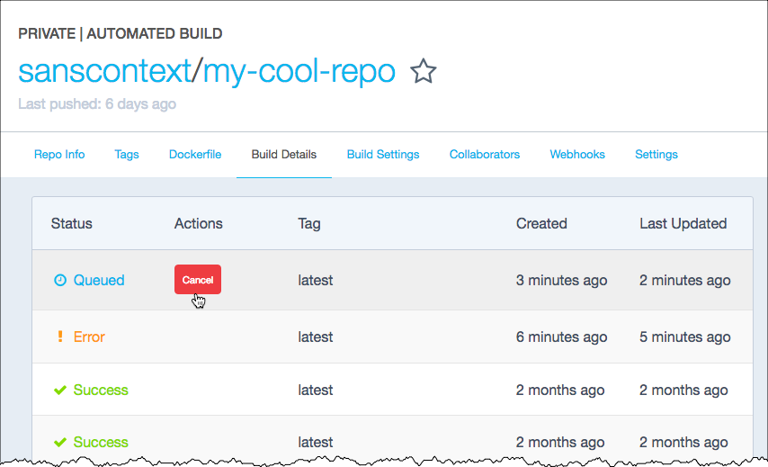

The statuses are:

* **Queued**: You're in line for your image to be built. Queue time varies depending on number of concurrent builds available to you.
* **Building**: The image is building.
* **Success**: The image has been built with no issues.
* **Error**: There was an issue with your image. Click the row to go to the Builds Details screen. The banner at the top of the page displays the last sentence of the log file, which indicates what the error was. If you need more information, scroll to the bottom of the screen to the logs section.

## Use the Build Settings page

The Build Settings page allows you to manage your existing automated build
configurations and add new ones. By default, when new code is merged into your
source repository, it triggers a build of your DockerHub image.

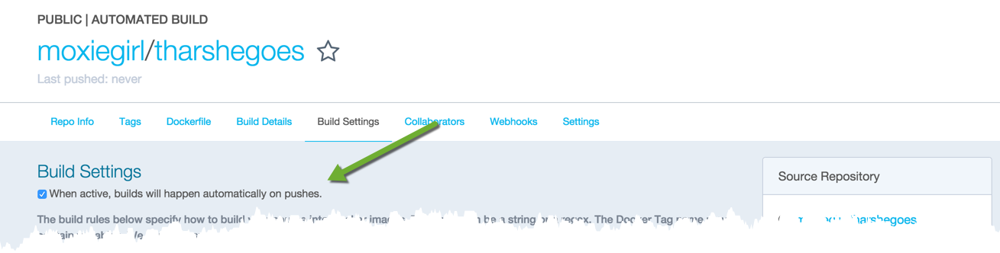

Clear the checkbox to turn this behavior off. You can use the other settings on
the page to configure and build images.

## Add and run a new build

At the top of the Build Dialog is a list of configured builds. You can build
from a code branch or by build tag.


Docker builds everything listed whenever a push is made to the code repository.
If you specify a branch or tag, you can manually build that image by
pressing the Trigger. If you use a regular expression syntax (regex) to define
your build branch or tag, Docker does not give you the option to manually build.
To add a new build:

1. Press the + (plus sign).

2. Choose the Type.

    You can build by a code branch or by an image tag.

3. Enter the Name of the branch or tag.

    You can enter a specific value or use a regex to select multiple values. To
    see examples of regex, press the Show More link on the right of the page.

    

4. Enter a Dockerfile location.

5. Specify a Tag Name.

6. Press **Save Changes**.

If you make a mistake or want to delete a build, press the - (minus sign) and then **Save Changes**.

## Repository links

Repository links let you link one Automated Build with another. If one Automated
Build gets updated, Docker triggers a build of the other. This makes it easy to
ensure that related images are kept in sync. You can link more than one image
repository. You only need to link one side of two related builds. Linking both
sides causes an endless build loop.

To add a link:

1. Go to the Build Settings for an automated build repository.

2. In the Repository Links section, enter an image repository name.

    A remote repository name should be either an official repository name such as `ubuntu` or a public repository name `namespace/repoName`.

3. Press **Add**.

    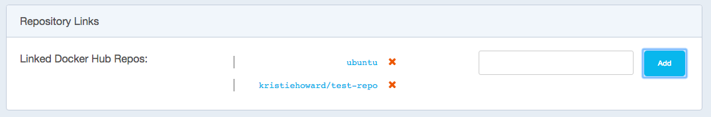


## Remote Build triggers

To trigger Automated Builds programmatically, you can set up a remote build
trigger in another application such as GitHub or Bitbucket. When you Activate
the build trigger for an Automated Build, it supplies you with a Token and a
URL.

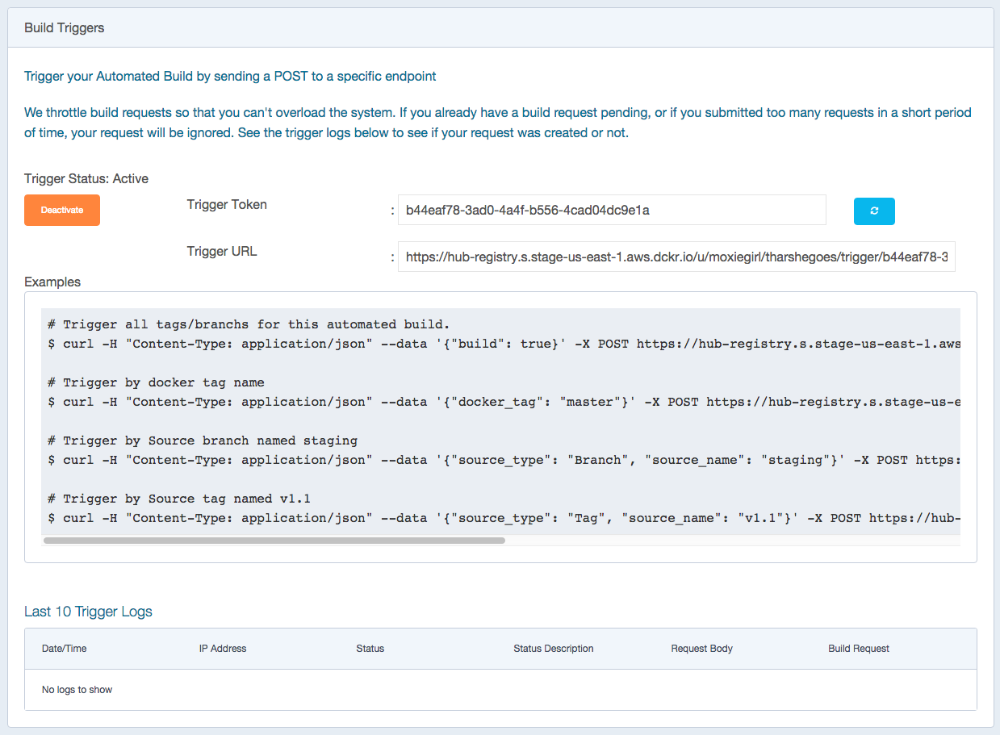

You can use `curl` to trigger a build:

```bash
$ curl --data build=true -X POST https://registry.hub.docker.com/u/svendowideit/testhook/trigger/be579c
82-7c0e-11e4-81c4-0242ac110020/
OK
```

To verify everything is working correctly, check the **Last 10 Trigger Logs** on
the page.
