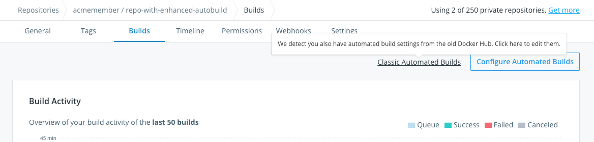
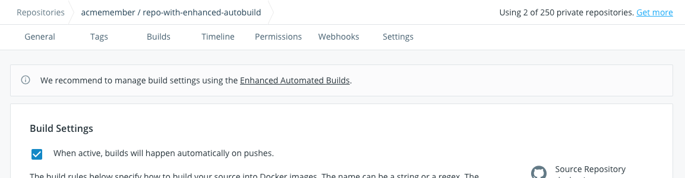

With the launch of the new Docker Hub, we are introducing an improved Automated Build experience.

Automated Builds created using an older version of Docker Hub are now labelled "Classic".
If you were using Docker Cloud to manage builds, your builds are already the latest version of Automated Builds.

All automated builds created going forward will get the new experience. If you are creating a new
Automated Build for the first time, see [docs](index.md#configure-automated-build-settings).

In the coming months, we will gradually convert Classic Automated Builds into new Automated Builds. This should
be a seamless process for most users.

## Managing Classic Automated Builds

You can manage both Classic and new Automated Builds from the **Builds** tab

Repository with Classic Automated Build:

 Build settings can be configured similarly to those on the old Docker Hub.

If you have previously created an automated build in both the old Docker Hub and Docker Cloud, you can switch between
Classic and new Automated Builds.

New Automated Build is displayed by default. You can switch to Classic Automated Build by clicking on this link at the top

Likewise, you can switch back to new Automated Build by clicking on this link at the top

## Frequently Asked Questions

**Q: I've previously linked my GitHub/Bitbucket account in the old Docker Hub. Why do I need to re-link it?**

A: The new Docker Hub uses a different permissions model. [Linking is only a few clicks by going to account settings](link-source.md).
with the new Docker Hub.

  > **Note**: If you are linking a source code provider to create autobuilds for a team, follow the instructions to [create a service account](index.md#service-users-for-team-autobuilds) for the team before linking the account as described below.

**Q: What happens to automated builds I created in the old Docker Hub?**

A: They are now Classic Automated Builds. There are no functional differences with the old automated builds and everything
(build triggers, existing build rules) should continue to work seamlessly.

**Q: Is it possible to convert an existing Classic Automated Build?**

A: This is currently unsupported. However, we are working to transition all builds into new experience in
the coming months.
