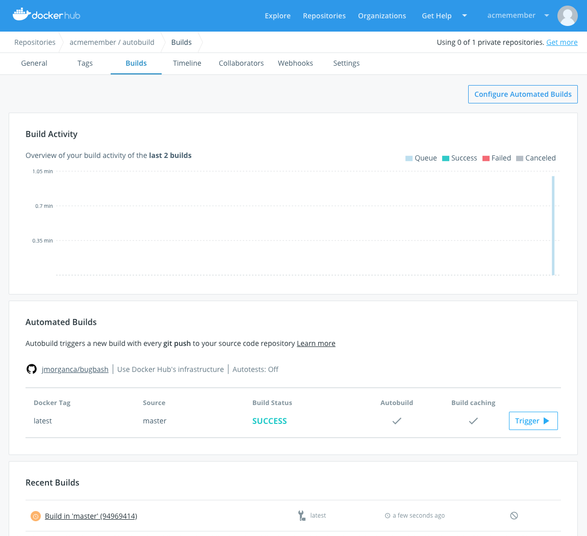
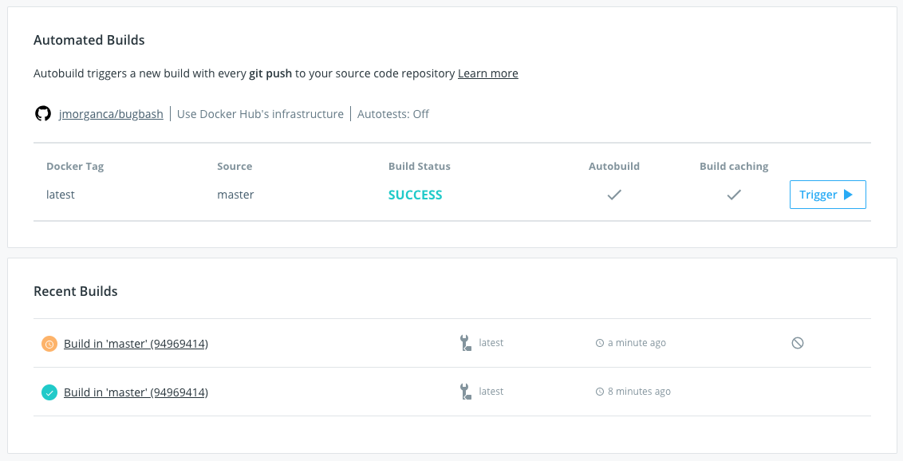
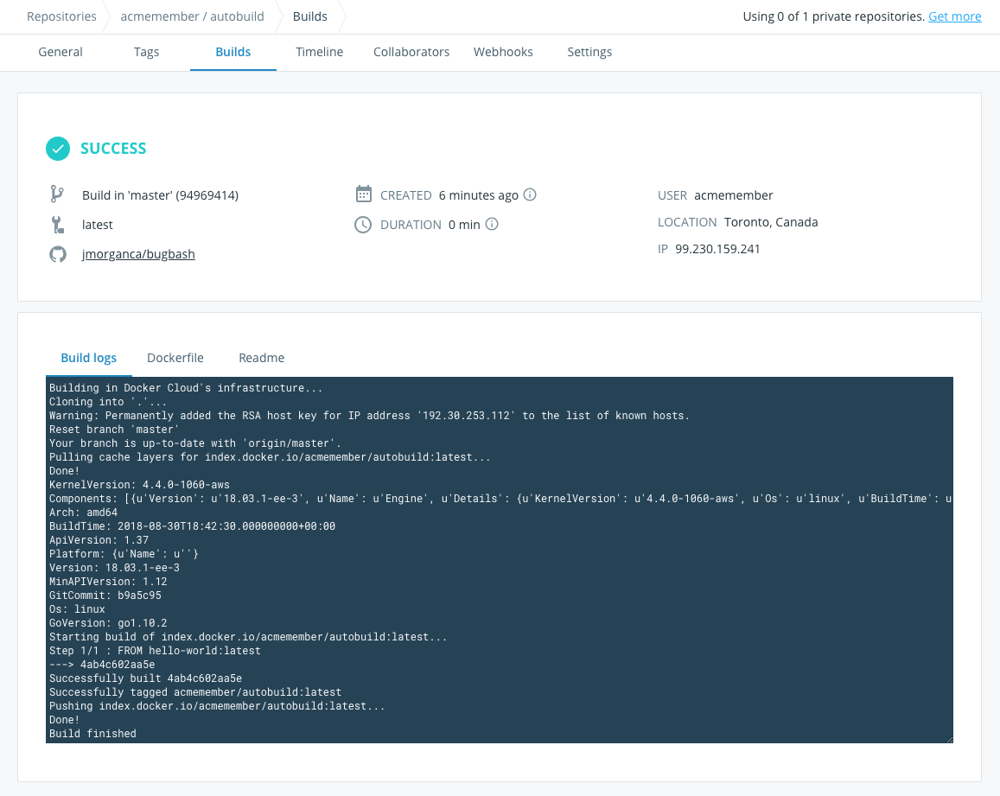

## How Automated Builds work

Docker Hub can automatically build images from source code in an external
repository and automatically push the built image to your Docker
repositories.

When you set up automated builds (also called autobuilds), you create a list of
branches and tags that you want to build into Docker images. When you push code
to a source code branch (for example in GitHub) for one of those listed image
tags, the push uses a webhook to trigger a new build, which produces a Docker
image. The built image is then pushed to the Docker Hub registry.

> **Note**: You can still use `docker push` to push pre-built images to
repositories with Automated Builds configured.

If you have automated tests configured, these run after building but before
pushing to the registry. You can use these tests to create a continuous
integration workflow where a build that fails its tests does not push the built
image. Automated tests do not push images to the registry on their own. [Learn more about automated image testing here.](automated-testing.md)

## Configure automated build settings

You can configure repositories in Docker Hub so that they automatically
build an image each time you push new code to your source provider. If you have
[automated tests](automated-testing.md) configured, the new image is only pushed
when the tests succeed.

Builds can be added to existing repositories, or added when you create a repository.

1. From the **Repositories** section, click into a repository to view its details.

2. Click the **Builds** tab.

3. If you are setting up automated builds for the first time, select
the code repository service (GitHub or Bitbucket) where the image's source code is stored.
You might redirected to the settings page to [link](link-source.md) the code repository service.

    Otherwise, if you are editing the build settings for an existing automated
    build, click **Configure automated builds**.

4. Select the **source repository** to build the Docker images from.

    You might need to specify an organization or user (the _namespace_) from the
    source code provider. Once you select a namespace, its source code
    repositories appear in the **Select repository** dropdown list.

5.  Optionally, enable [autotests](automated-testing.md#enable-automated-tests-on-a-repository).

6.  Review the default **Build Rules**, and optionally click the
**plus sign** to add and configure more build rules.

    _Build rules_ control what Docker Hub builds into images from the contents
    of the source code repository, and how the resulting images are tagged
    within the Docker repository.

    A default build rule is set up for you, which you can edit or delete. This
    default set builds from the `Branch` in your source code repository called
    `master`, and creates a Docker image tagged with `latest`.

7.  For each branch or tag, enable or disable the **Autobuild** toggle.

    Only branches or tags with autobuild enabled are built, tested, *and* have
    the resulting image pushed to the repository. Branches with autobuild
    disabled are built for test purposes (if enabled at the repository
    level), but the built Docker image is not pushed to the repository.

8. For each branch or tag, enable or disable the **Build Caching** toggle.

    [Build caching](../../develop/develop-images/dockerfile_best-practices.md#leverage-build-cache) can save time if you are building a large image frequently or have
    many dependencies. You might want to leave build caching disabled to
    make sure all of your dependencies are resolved at build time, or if
    you have a large layer that is quicker to build locally.

9. Click **Save** to save the settings, or click **Save and build** to save and
run an initial test.

    A webhook is automatically added to your source code repository to notify
    Docker Hub on every push. Only pushes to branches that are listed as the
    source for one or more tags trigger a build.

### Set up build rules

By default when you set up automated builds, a basic build rule is created for you.
This default rule watches for changes to the `master` branch in your source code
repository, and builds the `master` branch into a Docker image tagged with
`latest`.

In the **Build Rules** section, enter one or more sources to build.

For each source:

* Select the **Source type** to build either a **tag** or a
    **branch**. This tells the build system what to look for in the source code
    repository.

* Enter the name of the **Source** branch or tag you want to build.

  The first time you configure automated builds, a default build rule is set up
  for you. This default set builds from the `Branch` in your source code called
  `master`, and creates a Docker image tagged with `latest`.

  You can also use a regex to select which source branches or tags to build.
  To learn more, see
  [regexes](index.md#regexes-and-automated-builds).

* Enter the tag to apply to Docker images built from this source.

  If you configured a regex to select the source, you can reference the
  capture groups and use its result as part of the tag. To learn more, see
  [regexes](index.md#regexes-and-automated-builds).

* Specify the **Dockerfile location** as a path relative to the root of the source code repository. (If the Dockerfile is at the repository root, leave this path set to `/`.)

> **Note**: When Docker Hub pulls a branch from a source code repository, it performs
> a shallow clone (only the tip of the specified branch).  Refer to [Advanced options for Autobuild and Autotest](advanced.md)
> for more information.

### Environment variables for builds

You can set the values for environment variables used in your build processes
when you configure an automated build. Add your build environment variables by
clicking the plus sign next to the **Build environment variables** section, and
then entering a variable name and the value.

When you set variable values from the Docker Hub UI, they can be used by the
commands you set in `hooks` files, but they are stored so that only users who
have `admin` access to the Docker Hub repository can see their values. This
means you can use them to safely store access tokens or other information that
should remain secret.

> **Note**: The variables set on the build configuration screen are used during
the build processes _only_ and should not be confused with the environment
values used by your service (for example to create service links).

## Check your active builds

A summary of a repository's builds appears both on the repository **General**
tab, and in the **Builds** tab. The **Builds** tab also displays a color coded
bar chart of the build queue times and durations. Both views display the
pending, in progress, successful, and failed builds for any tag of the
repository.

From either location, you can click a build job to view its build report. The
build report shows information about the build job including the source
repository and branch (or tag), the build duration, creation time and location,
and the user namespace the build occurred in.

## Cancel or retry a build

While a build is queued or running, a **Cancel** icon appears next to its build
report link on the General tab and on the Builds tab. You can also click the
**Cancel** button from the build report page, or from the Timeline tab's logs
display for the build.

If a build fails, a **Retry** icon appears next to the build report line on the
General and Builds tabs, and the build report page and Timeline logs also
display a **Retry** button.

> **Note**: If you are viewing the build details for a repository that belongs
to an Organization, the Cancel and Retry buttons only appear if you have `Read & Write` access to the repository.

## Disable an automated build

Automated builds are enabled per branch or tag, and can be disabled and
re-enabled easily. You might do this when you want to only build manually for
a while, for example when you are doing major refactoring in your code. Disabling
autobuilds does not disable [autotests](automated-testing.md).

To disable an automated build:

1. From the **Repositories** page, click into a repository, and click the **Builds** tab.

2. Click **Configure automated builds** to edit the repository's build settings.

3. In the **Build Rules** section, locate the branch or tag you no longer want
to automatically build.

4. Click the **autobuild** toggle next to the configuration line.

    The toggle turns gray when disabled.

5. Click **Save** to save your changes.

## Advanced automated build options

At the minimum you need a build rule composed of a source branch (or tag) and
destination Docker tag to set up an automated build. You can also change where
the build looks for the Dockerfile, set a path to the files the build use
(the build context), set up multiple static tags or branches to build from, and
use regular expressions (regexes) to dynamically select source code to build and
create dynamic tags.

All of these options are available from the **Build configuration** screen for
each repository. Click **Repositories** from the left navigation, click the name
of the repository you want to edit, click the **Builds** tab, and click
**Configure Automated builds**.

### Tag and Branch builds

You can configure your automated builds so that pushes to specific branches or tags triggers a build.

1. In the **Build Rules** section, click the plus sign to add more sources to build.

2.  Select the **Source type** to build: either a **tag** or a **branch**.

    This tells the build system what type of source to look for in the code
    repository.

3. Enter the name of the **Source** branch or tag you want to build.

    You can enter a name, or use a regex to match which source branch or tag
    names to build. To learn more, see
    [regexes](index.md#regexes-and-automated-builds).

4. Enter the tag to apply to Docker images built from this source.

    If you configured a regex to select the source, you can reference the
    capture groups and use its result as part of the tag. To learn more, see
    [regexes](index.md#regexes-and-automated-builds).

5. Repeat steps 2 through 4 for each new build rule you set up.

### Set the build context and Dockerfile location

Depending on how the files are arranged in your source code repository, the
files required to build your images may not be at the repository root. If that's
the case, you can specify a path where the build looks for the files.

The _build context_ is the path to the files needed for the build, relative to the root of the repository. Enter the path to these files in the **Build context** field. Enter `/` to set the build context as the root of the source code repository.

> **Note**: If you delete the default path `/` from the **Build context** field and leave it blank, the build system uses the path to the Dockerfile as the build context. However, to avoid confusion we recommend that you specify the complete path.

You can specify the **Dockerfile location** as a path relative to the build
context. If the Dockerfile is at the root of the build context path, leave the
Dockerfile path set to `/`. (If the build context field is blank, set the path
to the Dockerfile from the root of the source repository.)

### Regexes and automated builds

You can specify a regular expression (regex) so that only matching branches or
tags are built. You can also use the results of the regex to create the Docker
tag that is applied to the built image.

You can use up to nine regular expression capture groups
(expressions enclosed in parentheses) to select a source to build, and reference
these in the **Docker Tag** field using `{\1}` through `{\9}`.

<!-- Capture groups Not a priority
#### Regex example: build from version number branch and tag with version number

You could also use capture groups to build and label images that come from various sources. For example, you might have

`/(alice|bob)-v([0-9.]+)/` -->

### Build images with BuildKit

You can enable the BuildKit builder by setting the `DOCKER_BUILDKIT=1`
[environment variable](#environment-variables-for-builds) in the
[Configure automated build settings](#configure-automated-build-settings) section.
Refer to the [build images with BuildKit](../../develop/develop-images/build_enhancements.md)
page for more information on BuildKit.

## Build repositories with linked private submodules

Docker Hub sets up a deploy key in your source code repository that allows it
to clone the repository and build it; however this key only works for a single,
specific code repository. If your source code repository uses private Git
submodules (or requires that you clone other private repositories to build),
Docker Hub cannot access these additional repos, your build cannot complete,
and an error is logged in your build timeline.

To work around this, you can set up your automated build using the `SSH_PRIVATE` environment variable to override the deployment key and grant Docker Hub's build system access to the repositories.

> **Note**: If you are using autobuild for teams, use [the process below](index.md#service-users-for-team-autobuilds) instead, and configure a service user for your source code provider. You can also do this for an individual account to limit Docker Hub's access to your source repositories.

1. Generate a SSH keypair that you use for builds only, and add the public key to your source code provider account.

    This step is optional, but allows you to revoke the build-only keypair without removing other access.

2. Copy the private half of the keypair to your clipboard.
3. In Docker Hub, navigate to the build page for the repository that has linked private submodules. (If necessary, follow the steps [here](index.md#configure-automated-build-settings) to configure the automated build.)
4. At the bottom of the screen, click the plus sign ( **+** ) next to **Build Environment variables**.
5. Enter `SSH_PRIVATE` as the name for the new environment variable.
6. Paste the private half of the keypair into the **Value** field.
7. Click **Save**, or **Save and Build** to validate that the build now completes.

> **Note**: You must configure your private git submodules using git clone over SSH (`git@submodule.tld:some-submodule.git`) rather than HTTPS.

## Autobuild for Teams

When you create an automated build repository in your own account namespace, you can start, cancel, and retry builds, and edit and delete your own repositories.

These same actions are also available for team repositories from Docker Hub if
you are a member of the Organization's `Owners` team. If you are a member of a
team with `write` permissions you can start, cancel, and retry builds in your
team's repositories, but you cannot edit the team repository settings or delete
the team repositories. If your user account has `read` permission, or if you're
a member of a team with `read` permission, you can view the build configuration
including any testing settings.

| Action/Permission     | read | write | admin | owner |
| --------------------- | ---- | ----- | ----- | ----- |
| view build details    |  x   |   x   |   x   |   x   |
| start, cancel, retry  |      |   x   |   x   |   x   |
| edit build settings   |      |       |   x   |   x   |
| delete build          |      |       |       |   x   |

### Service users for team autobuilds

> **Note**: Only members of the `Owners` team can set up automated builds for teams.

When you set up automated builds for teams, you grant Docker Hub access to
your source code repositories using OAuth tied to a specific user account. This
means that Docker Hub has access to everything that the linked source provider
account can access.

For organizations and teams, we recommend creating a dedicated service account
(or "machine user") to grant access to the source provider. This ensures that no
builds break as individual users' access permissions change, and that an
individual user's personal projects are not exposed to an entire organization.

This service account should have access to any repositories to be built,
and must have administrative access to the source code repositories so it can
manage deploy keys. If needed, you can limit this account to only a specific
set of repositories required for a specific build.

If you are building repositories with linked private submodules (private
dependencies), you also need to add an override `SSH_PRIVATE` environment
variable to automated builds associated with the account.

1. Create a service user account on your source provider, and generate SSH keys for it.
2. Create a "build" team in your organization.
3. Ensure that the new "build" team has access to each repository and submodule you need to build.

    Go to the repository's **Settings** page. On GitHub, add the new "build" team to the list of **Collaborators and Teams**. On Bitbucket, add the "build" team to the list of approved users on the **Access management** screen.

4. Add the service user to the "build" team on the source provider.

5. Log in to Docker Hub as a member of the `Owners` team, switch to the organization, and follow the instructions to [link to source code repository](link-source.md) using the service account.

    > **Note**: You may need to log out of your individual account on the source code provider to create the link to the service account.

6. Optionally, use the SSH keys you generated to set up any builds with private submodules, using the service account and [the instructions above](index.md#build-repositories-with-linked-private-submodules).

## What's Next?

### Customize your build process

Additional advanced options are available for customizing your automated builds,
including utility environment variables, hooks, and build phase overrides. To
learn more see [Advanced options for Autobuild and Autotest](advanced.md).

### Add automated tests

To test your code before the image is pushed, you can use
Docker Hub's [Autotest](automated-testing.md) feature which
integrates seamlessly with autobuild and autoredeploy.

> **Note**: While the Autotest feature builds an image for testing purposes, it
does not push the resulting image to Docker Hub.
