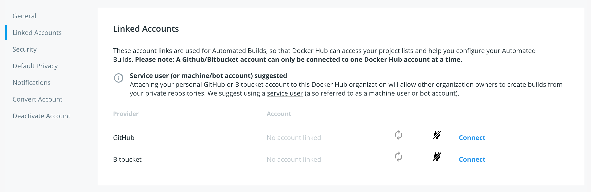
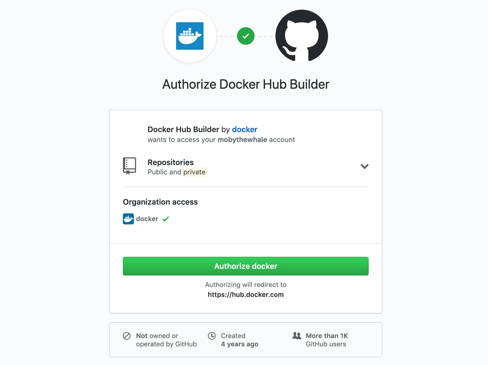
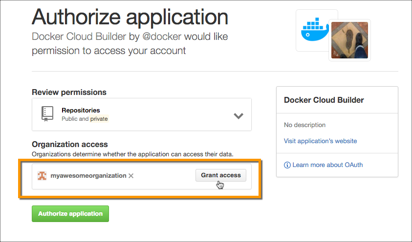

To automate building and testing of your images, you link to your hosted source
code service to Docker Hub so that it can access your source code
repositories. You can configure this link for user accounts or
organizations.

> **Note**: If you are linking a source code provider to create autobuilds for a team, follow the instructions to [create a service account](index.md#service-users-for-team-autobuilds) for the team before linking the account as described below.

## Link to a GitHub user account

1. Log in to Docker Hub using your Docker ID.

2. Click **Account Settings** in the top-right dropdown navigation, then open **Linked Accounts**.

3. Click **Connect** for the source provider you want to link.

    

4. Review the settings for the **Docker Hub Builder** OAuth application.

    

    >**Note**: If you are the owner of any GitHub organizations, you might see
    options to grant Docker Hub access to them from this screen. You can also
    individually edit an organization's third-party access settings to grant or
    revoke Docker Hub's access. See
    [Grant access to a GitHub organization](link-source.md#grant-access-to-a-github-organization)
    to learn more.

5. Click **Authorize docker** to save the link.

## Link to a Bitbucket user account

1. Log in to Docker Hub using your Docker ID.

2. Click **Account Settings** in the top-right dropdown navigation, then open
the **Linked Accounts** section.

3. Click **Connect** for the source provider you want to link.

    

4. If necessary, log in to Bitbucket.

5. On the page that appears, click **Grant access**.

### Unlink a GitHub user account

To revoke Docker Hub's access to your GitHub account, you must unlink it both
from Docker Hub, *and* from your GitHub account.

1. Click **Account Settings** in the top-right dropdown navigation, then open
the **Linked Accounts** section.

2. Click the plug icon next to the source provider you want to remove.

3. Go to your GitHub account's **Settings** page.

4. Click **Applications** in the left navigation bar.

5. Click the `...` menu to the right of the Docker Hub Builder application and select **Revoke**.

> **Note**: Each repository that is configured as an automated build source
contains a webhook that notifies Docker Hub of changes in the repository.
This webhook is not automatically removed when you revoke access to a source
code provider.

## Grant access to a GitHub organization

If you are the owner of a GitHub organization, you can grant or revoke Docker
Hub's access to the organization's repositories. Depending on the GitHub
organization's settings, you may need to be an organization owner.

If the organization has not had specific access granted or revoked before, you
can often grant access at the same time as you link your user account. In this
case, a **Grant access** button appears next to the organization name in the
link accounts screen, as shown below.  If this button does not appear, you must
manually grant the application's access.

To manually grant Docker Hub access to a GitHub organization:

1. Link your user account using the instructions above.

2. From your GitHub Account settings, locate the **Organization settings**
section at the lower left.

3. Click the organization you want to give Docker Hub access to.

4. From the Organization Profile menu, click **Third-party access**.

    The page displays a list of third party applications and their access
    status.

5. Click the pencil icon next to Docker Hub Builder.

6. Click **Grant access** next to the organization.

    

### Revoke access to a GitHub organization

To revoke Docker Hub's access to an organization's GitHub repositories:

1. From your GitHub Account settings, locate the **Organization settings** section at the lower left.

2. Click the organization you want to revoke Docker Hub's access to.

3. From the Organization Profile menu, click **Third-party access**.
    The page displays a list of third party applications and their access status.

4. Click the pencil icon next to Docker Hub Builder.

5. On the next page, click **Deny access**.

### Unlink a Bitbucket user account

To permanently revoke Docker Hub's access to your Bitbucket account, you must
unlink it both from Docker Hub, *and* from your Bitbucket account.

1. Log in to Docker Hub using your Docker ID.

2. Click **Account Settings** in the top-right dropdown navigation, then open
the **Linked Accounts** section.

3. Click the plug icon next to the source provider you want to remove.

4. Go to your Bitbucket account and click the user menu icon in the top-right corner.

5. Click **Bitbucket settings**.

6. On the page that appears, click **OAuth**.

7. Click **Revoke** next to the Docker Hub line.

> **Note**: Each repository that is configured as an automated build source
contains a webhook that notifies Docker Hub of changes in the repository. This
webhook is not automatically removed when you revoke access to a source code
provider.
