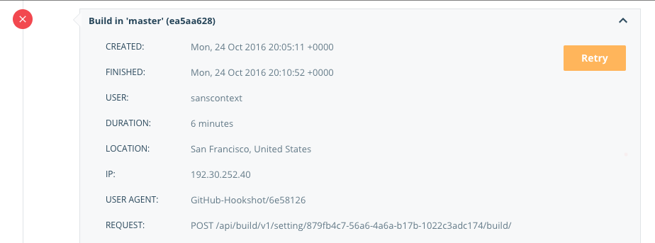

> **Note**
>
> Automated builds require a
> [Docker Pro, Team, or Business subscription](../../subscription/index.md).

## Failing builds

If a build fails, a **Retry** icon appears next to the build report line on the
**General** and **Builds** tabs. The **Build report** page and **Timeline logs** also display a **Retry** button.



> **Note**
>
> If you are viewing the build details for a repository that belongs to an
> organization, the **Cancel** and **Retry** buttons only appear if you have `Read & Write` access to the repository.

Automated builds have a 4-hour execution time limit. If a build reaches this time limit, it's
automatically cancelled, and the build logs display the following message:

```text
2022-11-02T17:42:27Z The build was cancelled or exceeded the maximum execution time.
```

This log message is the same as when you actively cancel a build. To identify
whether a build was automatically cancelled, check the build duration.


## Build repositories with linked private submodules

Docker Hub sets up a deploy key in your source code repository that allows it
to clone the repository and build it. This key only works for a single,
specific code repository. If your source code repository uses private Git
submodules, or requires that you clone other private repositories to build,
Docker Hub cannot access these additional repositories, your build cannot complete,
and an error is logged in your build timeline.

To work around this, you can set up your automated build using the `SSH_PRIVATE`
environment variable to override the deployment key and grant Docker Hub's build
system access to the repositories.

> **Note**
>
> If you are using autobuild for teams, use the process below
> instead, and configure a service user for your source code provider. You can
> also do this for an individual account to limit Docker Hub's access to your
> source repositories.

1. Generate a SSH keypair that you use for builds only, and add the public key to your source code provider account.

    This step is optional, but allows you to revoke the build-only keypair without removing other access.

2. Copy the private half of the keypair to your clipboard.
3. In Docker Hub, navigate to the build page for the repository that has linked private submodules. (If necessary, follow the steps [here](index.md#configure-automated-builds) to configure the automated build.)
4. At the bottom of the screen, select the **plus** icon next to **Build Environment variables**.
5. Enter `SSH_PRIVATE` as the name for the new environment variable.
6. Paste the private half of the keypair into the **Value** field.
7. Select **Save**, or **Save and Build** to validate that the build now completes.

> **Note**
>
> You must configure your private git submodules using git clone over SSH
> (`git@submodule.tld:some-submodule.git`) rather than HTTPS.