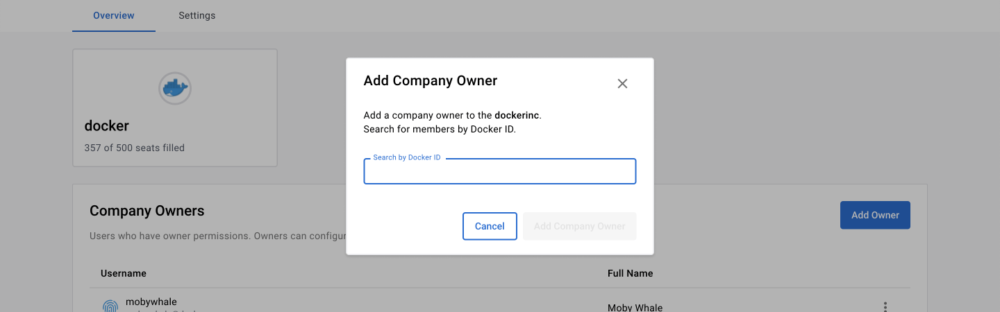

> **Note**
>
> The following features are only available to [Early Access](../release-lifecycle.md/#early-access-ea) participants.

To navigate to the company page:

1. Sign in to [Docker Hub](https://hub.docker.com/){: target="_blank" rel="noopener" class="_"} to view your company and organizations.
2. On the **Organizations** page, select your company to access the **Overview** tab. For example, the company listed below is **dockerinc** and the organization is **docker**.

    {: width="700px" }

## Manage company owners

As a company owner, you can configure [Single Sign-on (SSO)](../single-sign-on/configure/index.md) and [System for Cross-domain Identity Management (SCIM)](../docker-hub/scim.md) for all organizations under the company. This is only visible if your organization has a Docker Business subscription. If you want to upgrade your subscription to include the organization under the company, see [upgrade your subscription](../subscription/upgrade.md).

The SSO configuration updates all domain mappings for your organizations to a single domain so you can manage multiple organizations using one domain for your company. Group management is also available if your IdP supports group assignment.

### Add a company owner

1. Sign in to [Docker Hub](https://hub.docker.com/){: target="_blank" rel="noopener" class="_"}, navigate to the **Organizations** page, and select your company.
2. In the **Overview** tab, select **Add owner** and enter their Docker ID or email address.
3. Once you've selected **Add Owner**, you can view the user in the **Company Owners** table.

    {: width="700px" }

    {: width="700px" }

### Remove a company owner

1. Sign in to [Docker Hub](https://hub.docker.com/){: target="_blank" rel="noopener" class="_"}, navigate to the **Organizations** page, and select your company.
2. In the **Overview** tab, find the **Company Owner** you want to remove.
3. Select the **Action** icon and remove the owner.

    {: width="700px" }
