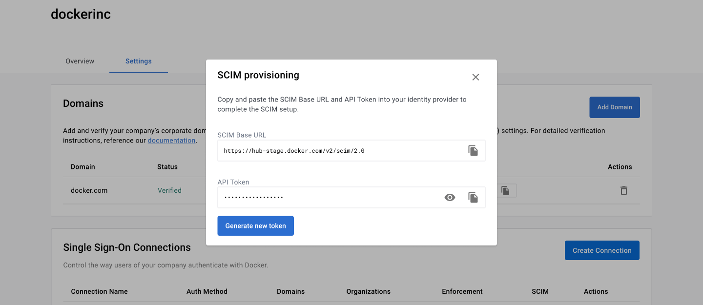
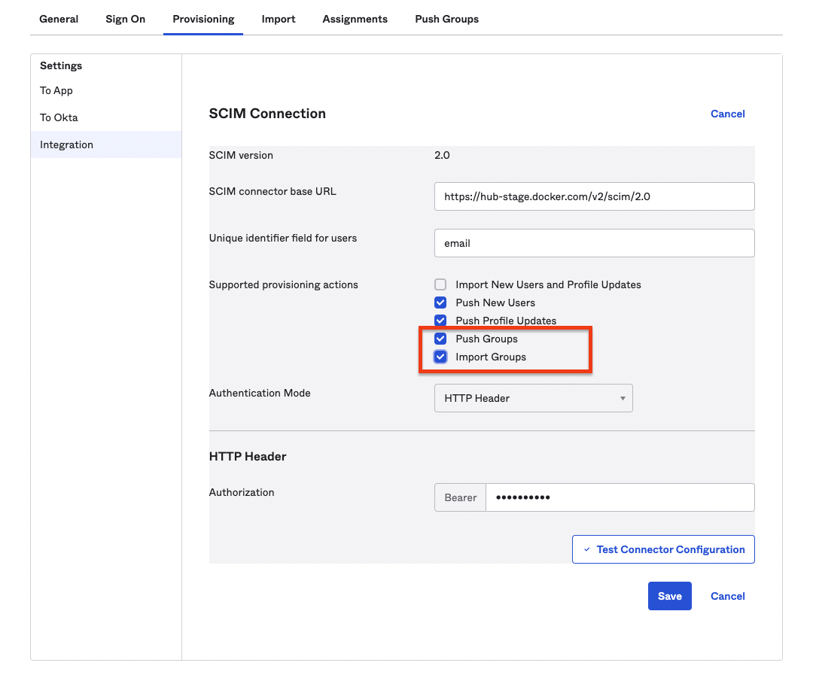
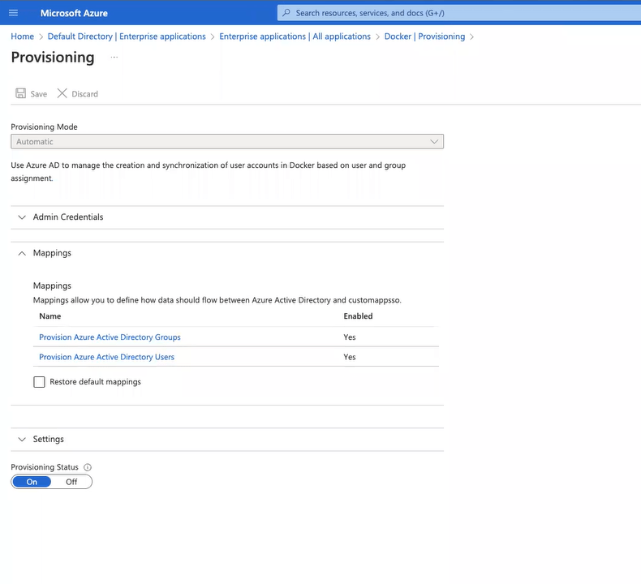

> **Note**
>
> The following features are only available to [Early Access](../release-lifecycle.md/#early-access-ea) participants.

SCIM is a provisioning system that lets you manage users within your identity provider (IdP). You can enable SCIM on organizations that are part of the Docker Business subscription.

### Enable SCIM

1. In the **Single Sign-On Connections**, select the **Actions** icon and **Setup SCIM**.

    > **Note**
    >
    > Establishing the SSO connection lets you set up SCIM. However, this doesn’t enforce SSO. To continue, see [Enforcing SSO](../docker-hub/enforcing-sso.md).

2. Copy the **SCIM Base URL** and **API Token** and paste the values into your IdP.

    {: width="700px" }

3. Continue to configure SCIM for Okta, Azure AD, or Onelogin.

### Enable SCIM group mapping

#### Okta

If users are signing in via SSO and SCIM, they’re also provisioned via SCIM.

1. Navigate to Okta, select the **Provisioning** tab in the Docker application.
2. In **Settings**, select **Integration**, and **Edit**.
3. Enable **Push Groups**, and select **Save**.

    > **Note**
    >
    > You can also enable **Import Groups** as an option if you want to import all Docker Hub teams into Okta groups.

    {: width="700px" }

#### Azure AD 

1. Navigate to Azure AD and select your Docker application.
2. Select the **Provisioning** tab and **Edit provisioning**.
3. In **Mappings**, select **Provision Azure Active Directory Groups**, and select **Yes** to enable your mapping.
4. In the **Target Object Actions**, select **Create, **Update, and Delete***.
5. In the **Attribute Mappings**, confirm that the **displayName**, **objectid**, and **members** are added.

    {: width="700px" }

6. Select **Save** and continue with the on-screen instructions.

    > **Note**
    >
    > You can view **Mappings** to see that provisioning is enabled.