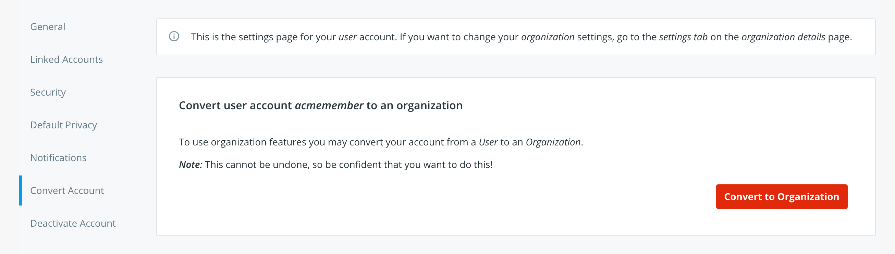

Besides directly [creating an organization from scratch](orgs/#create-an-organization), you can also convert an existing user account.

You might want to do this if you need multiple users to access your account and the repositories that it's connected to. Converting it to an organization would give you better control over permissions for these users through teams.

> Note: Once you convert your account, you can't revert it back, so make sure
> you really want to do this!
{: .warning }

1. Remove the user account from all teams and organizations: go to **Organizations**, open an organization, then click the arrow next to your username in the members list.

2. Click on your account name in the top navigation bar, then go to your **Account Settings**.

3. Under the **Convert Account** tab, click **Convert to Organization**.

    

4. Read the information carefully, as this cannot be undone and will have considerable implications for your assets and the account.

5. As part of the conversion, you must set an organization owner. This is the user account that will manage the organization, and the *only* way to access the organization settings after conversion.

    > **Note:** You cannot log into an organization directly. You must access
    > it through an [owner or member account](orgs/#access-an-organization).

6. Click **Convert**. You will get a success message with the new owner of the organization. Use that owner account to log into your new organization.
