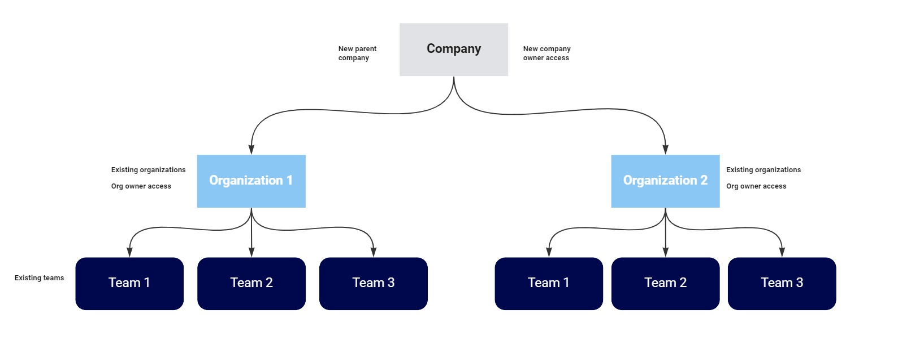
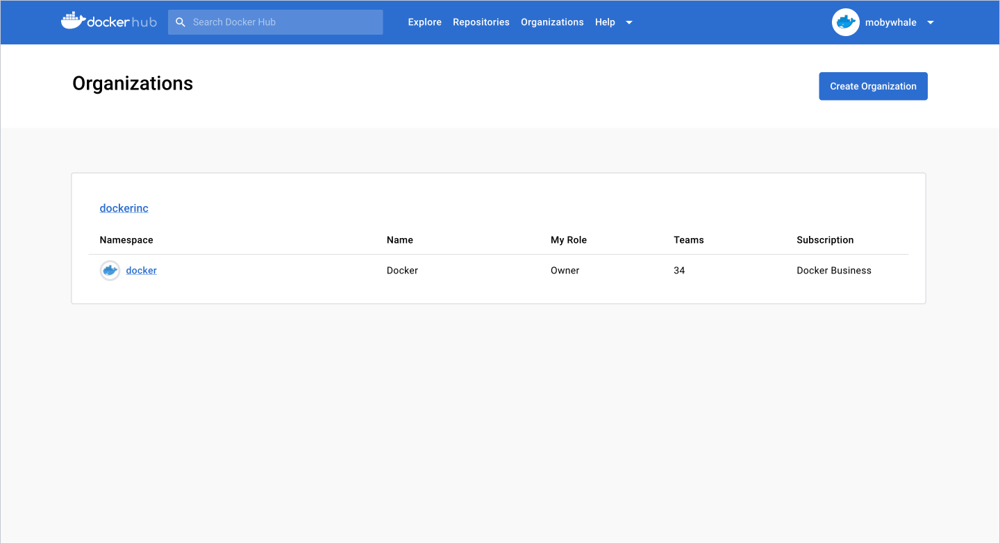

> **Note**
>
> The company layer is in [early access](../release-lifecycle.md#early-access-ea)
> and requires a Docker Team or Business subscription.

A company provides a single point of visibility across multiple organizations. Docker introduced this new view to simplify the management of Docker organizations and settings. It's available to Docker Business subscribers. 

The following diagram depicts the set up of a company and how it relates to associated organizations. 

{: width="700px" }

## Key features

With a company, administrators can:

- View and manage all nested organizations and configure settings centrally. 
- Carefully control access to the company and company settings. 
- Have up to ten unique users assigned the company owner role without occupying a purchased seat.
- Configure SSO and SCIM for all nested organizations.
- Enforce SSO log-in for all users in the company.

## Get started

Docker will work with your current Docker organization owners to create the company, associate your organizations, and identify your company owner(s). 

You’ll need to submit a [support ticket](https://hub.docker.com/support/contact/) with the following information:

- The name of your company. This cannot be the same as any of the associated organizations. 
- The organization(s) that you want to associate with the new company.
- The Docker ID of the person that will be the company owner.

Once created, users with a company owner role can navigate to the **Overview** page in Docker Hub that displays the company name and organizations associated with the company.

{: width="700px" }

## What's next?

- [Configure SSO](../single-sign-on/configure/index.md)
- [Manage SSO](../single-sign-on/manage/index.md)
- [Manage company owners](company-owner.md)
- [Explore FAQs](company-faqs.md)