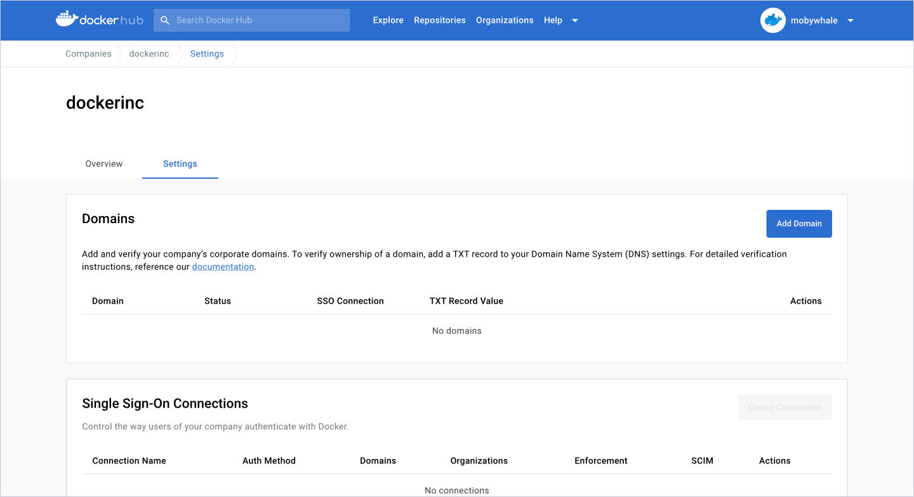
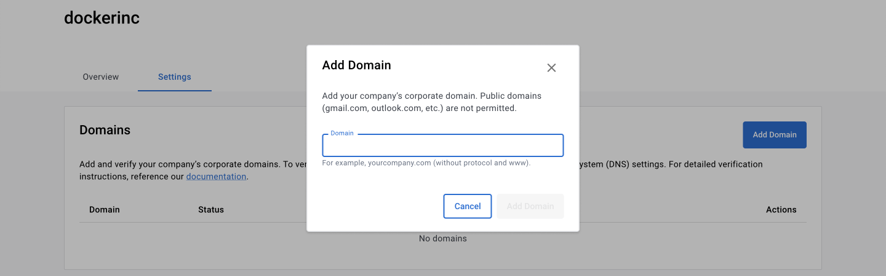
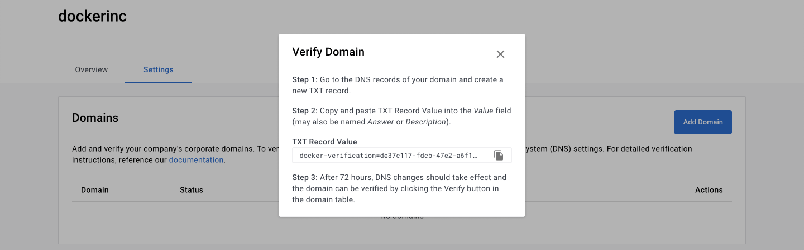

> **Note**
>
> The following features are only available to [Early Access](../release-lifecycle.md/#early-access-ea) participants.

## Add a domain

1. Sign in to [Docker Hub](https://hub.docker.com/){: target="_blank" rel="noopener" class="_"}, navigate to the **Organization** page and select your company.
2. Select **Settings** to access the **Domain** and **SSO Connections**.

    {: width="700px" }

3. Select **Add Domain** and continue with the on-screen instructions to add the **TXT Record Value** to your domain name system (DNS).

    >**Note**
    >
    > Format your domains without protocol or www information, for example, yourcompany.com. This should include all email domains and subdomains users will use to access Docker. Public domains such as gmail.com, outlook.com, etc aren’t permitted. Also, the email domain should be set as the primary email.

    {: width="700px" }

## Verify a domain

You must wait up to 72 hours for the TXT Record verification. 

1. Sign in to [Docker Hub](https://hub.docker.com/){: target="_blank" rel="noopener" class="_"} and navigate to the **Organization** page and select your company.
2. Select **Settings** to access the **Domain** and **SSO Connections**.

3. Select **Verify** next to the domain in the domain table. 

    {: width="700px" }

## Delete a domain

If a verified domain is already associated with an established [SSO connection](../docker-hub/sso-connection.md), you must remove the domain from the connection setting before you can delete the domain from the company.

If the domain isn't associated with an existing connection, follow these steps:

1. Navigate to the **Domain** section.
2. Select the **Action** icon for the domain.
3. Select **Delete** and **Delete Domain** to confirm.

    >**Note**
    >
    >If you want to add this domain again, a new TXT record value is assigned. You must complete the verification steps with the new TXT record value.