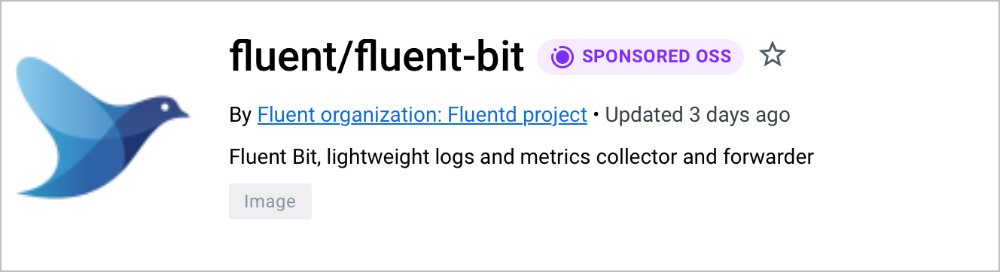
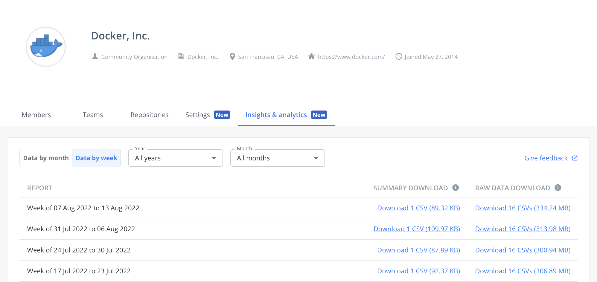

The Docker-Sponsored Open Source Program provides several features and benefits to non-commercial open source developers.

The program grants the following perks to eligible projects:

- Verified Docker-Sponsored Open Source badge
- Insights and analytics
- Vulnerability scanning
- Removal of rate limiting for developers
- Improved discoverability on Docker Hub

These benefits are valid for one year and can be renewed if your project still meets the program requirements. Program members, and all users pulling public images from your project namespace get access to unlimited pulls and unlimited egress.

## Verified Docker-Sponsored Open Source badge

Docker verifies that developers can trust images with this badge as an active open source project.

## Insights and analytics

The [insights and analytics](/docker-hub/publish/insights-analytics){:
target="blank" rel="noopener" class=""} service provides usage metrics for how
the community uses your Docker images, and grants you insight into your user's
behavior.

Select the time span you want to view analytics data, and export the data in
either a summary or raw format. The summary format shows you image pulls per
tag, and the raw format lists information about every image pull for the
selected time span. Data points include tag, type of pull, user geolocation,
client tool (user agent), and more.

## Vulnerability scanning

Automatic vulnerability scanning using [Docker Scout](/scout/) for images published to Docker Hub.
Scanning images ensures that the published content is secure, and underlines to
developers that they can trust it. You can enable scanning on a per-repository
basis, refer to [vulnerability scanning](/docker-hub/vulnerability-scanning/){:
target="blank" rel="noopener" class=""} for more information about how to use
it.

## Who's eligible for the Docker-Sponsored Open Source program?

To qualify for the program, your project namespace must be shared in public repositories, meet [the Open Source Initiative definition](https://opensource.org/docs/osd), and be in active development with no pathway to commercialization.

Find out more by heading to the
[Docker-Sponsored Open Source Program](https://www.docker.com/community/open-source/application/#){:target="_blank"
rel="noopener" class="_"} application page.
