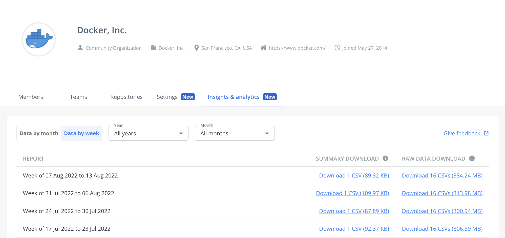

[The Docker Verified Publisher Program](https://hub.docker.com/search?q=&image_filter=store){:target="_blank" rel="noopener" class="_"} provides high-quality images from commercial publishers verified by Docker.

These images help development teams build secure software supply chains, minimizing exposure to malicious content early in the process to save time and money later.

Images that are part of this program have a special badge on Docker Hub making it easier for users to identify projects that Docker has verified as high-quality commercial publishers.

## For content publishers

The Docker Verified Publisher Program (DVP) provides several features and benefits to Docker
Hub publishers. The program grants the following perks based on participation tier:

- Repository logo
- Verified publisher badge
- Priority search ranking in Docker Hub
- Insights and analytics
- Vulnerability analysis
- Additional Docker Business seats
- Removal of rate limiting for developers
- Co-marketing opportunities

### Repository logo

DVP organizations can upload custom images for individual repositories on Docker Hub.
This lets you override the default organization-level logo on a per-repository basis.

Only a user with administrative access (owner or team member with administrator permission)
over the repository can change the repository logo.

#### Image requirements

- The supported filetypes for the logo image are JPEG and PNG.
- The minimum allowed image size in pixels is 120×120.
- The maximum allowed image size in pixels is 1000×1000.
- The maximum allowed image file size is 5MB.

#### Set the repository logo

1. Sign in to Docker Hub.
2. Go to the page of the repository that you want to change the logo for.
3. Select the upload logo button, represented by a camera icon
   ({: .inline height="22px" })
   overlaying the current repository logo.
4. In the dialog that opens, select the PNG image that you want to upload to
   set it as the logo for the repository.

#### Remove the logo

Remove a logo using the clear button ({: .inline width="20px" }).

Removing the logo makes the repository fallback to using the organization logo, if set, and the default logo if not.

{: width="50px" }

### Verified publisher badge

Images that are part of this program have a badge on Docker Hub making it easier for developers
to identify projects that Docker has verified as high quality publishers and with content they can trust.

### Insights and analytics

The [insights and analytics](/docker-hub/publish/insights-analytics){:
target="blank" rel="noopener" class=""} service provides usage metrics for how
the community uses Docker images, granting insight into user behavior.

The usage metrics show the number of image pulls by tag or by digest, and breakdowns by
geolocation, cloud provider, client, and more.

You can use the view to select the time span you want to view analytics data and export the data in
either a summary or raw format.

### Vulnerability analysis

[Docker Scout](/scout/){:
target="blank" rel="noopener" class=""} provides automatic vulnerability analysis
for DVP images published to Docker Hub.
Scanning images ensures that the published content is secure, and proves to
developers that they can trust the image.

Analysis is enabled on a per-repository
basis, refer to [vulnerability scanning](/docker-hub/vulnerability-scanning/){:
target="blank" rel="noopener" class=""} for more information about how to use
it.

### Who's eligible to become a verified publisher?

Any independent software vendor who distributes software on Docker Hub can join
the Verified Publisher Program. Find out more by heading to the
[Docker Verified Publisher Program](https://www.docker.com/partners/programs){:target="_blank"
rel="noopener" class="_"} page.
