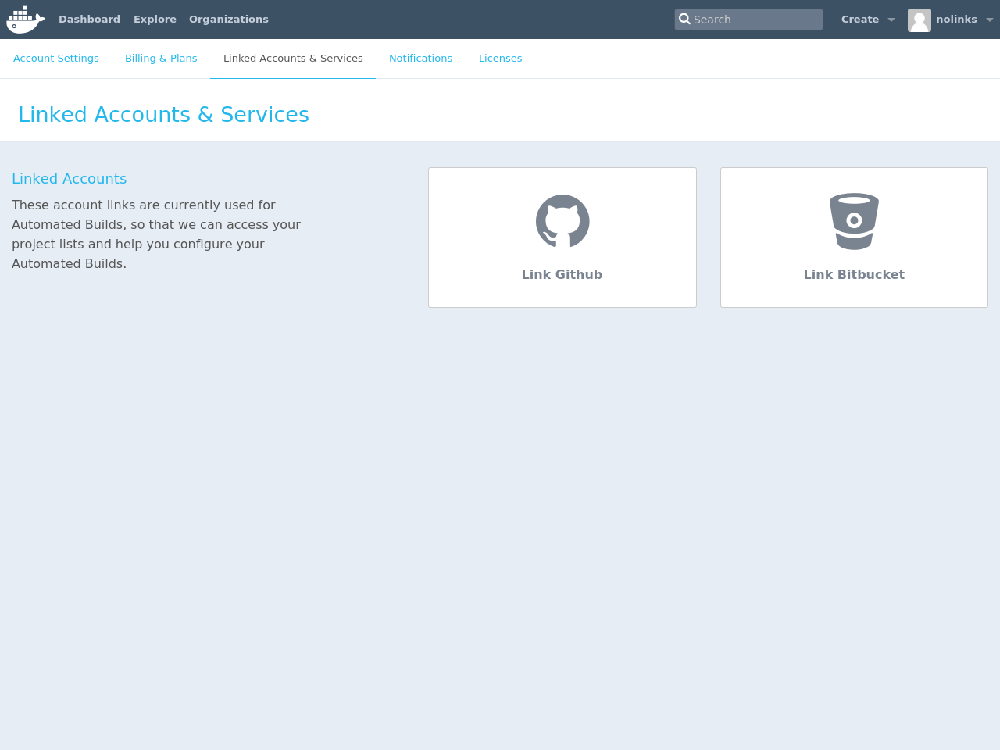
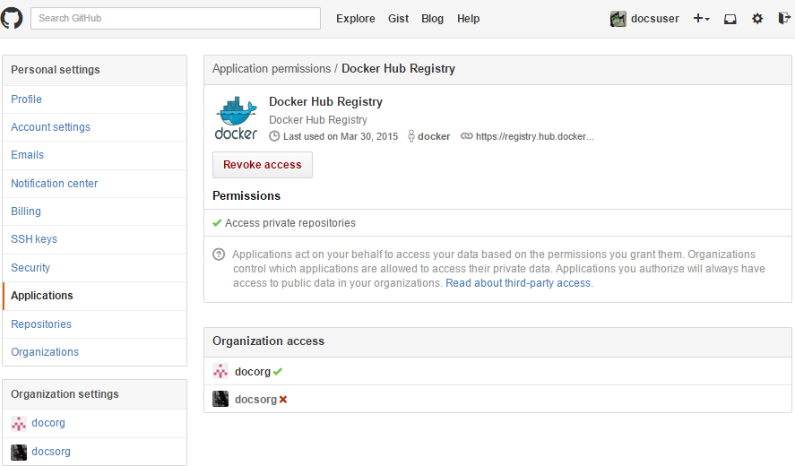
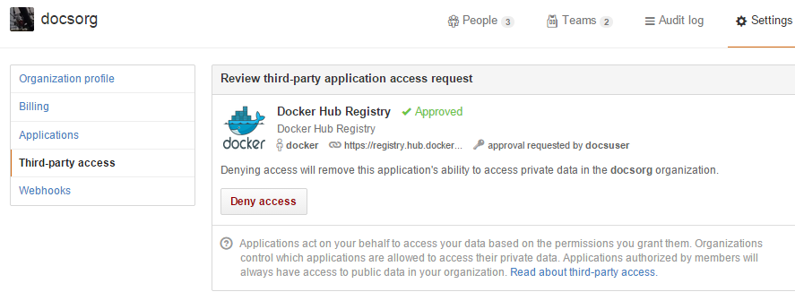
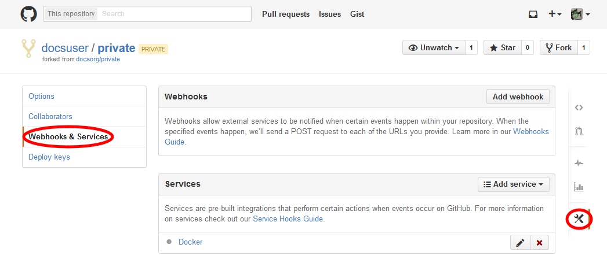

If you've previously linked Docker Hub to your GitHub account,
skip to [Creating an Automated Build](github.md#creating-an-automated-build).

## Linking Docker Hub to a GitHub account

> *Note:*
> Automated Builds currently require *read* and *write* access since
> [Docker Hub](https://hub.docker.com) needs to set up a GitHub service
> hook. We have no choice here, this is how GitHub manages permissions.
> We do guarantee nothing else is touched in your account.

To set up an Automated Build of a repository on GitHub, you need to
link [Docker Hub](https://hub.docker.com/account/authorized-services/) to your
GitHub account. This allows the registry to see your GitHub repositories.

To add, remove or view your linked account, go to the "Linked Accounts &
Services" section of your Hub profile "Settings".

When linking to GitHub, select either "Public and Private",
or "Limited Access" linking.

The "Public and Private" option is the easiest to use, as it grants the Docker
Hub full access to all of your repositories. GitHub also allows you to grant
access to repositories belonging to your GitHub organizations.

If you choose "Limited Access", Docker Hub only gets permission to access your
public data and public repositories.

Follow the onscreen instructions to authorize and link your GitHub account to
Docker Hub. Once it is linked, you can choose a source repository from
which to create the Automatic Build.

You can review and revoke Docker Hub's access by visiting the
[GitHub User's Applications settings](https://github.com/settings/applications).

> **Note**: If you delete the GitHub account linkage that is used for one of your
> automated build repositories, the previously built images are still available.
> If you re-link to that GitHub account later, the automated build can be started
> using the "Start Build" button on the Hub, or if the webhook on the GitHub repository
> still exists, it is triggered by any subsequent commits.

## Auto builds and limited linked GitHub accounts.

If you selected to link your GitHub account with only a "Limited Access" link,
then after creating your automated build, you need to either manually
trigger a Docker Hub build using the "Start a Build" button, or add the GitHub
webhook manually, as described in [GitHub Service
Hooks](github.md#github-service-hooks). This only works for repositories
under the user account, and adding an automated build to a public GitHub
organization using a "Limited Access" link is not possible.

## Changing the GitHub user link

If you want to remove, or change the level of linking between your GitHub
account and the Docker Hub, you need to do this in two places.

First, remove the "Linked Account" from your Docker Hub "Settings". Then go to
your GitHub account's Personal settings, and in the "Applications" section,
"Revoke access".

You can now re-link your account at any time.

## GitHub organizations

GitHub organizations and private repositories forked from organizations are
made available to auto build using the "Docker Hub Registry" application, which
needs to be added to the organization - and then applies to all users.

To check, or request access, go to your GitHub user's "Setting" page, select the
"Applications" section from the left side bar, then click the "View" button for
"Docker Hub Registry".

The organization's administrators may need to go to the Organization's "Third
party access" screen in "Settings" to grant or deny access to the Docker Hub
Registry application. This change applies to all organization members.

More detailed access controls to specific users and GitHub repositories can be
managed using the GitHub "People and Teams" interfaces.

## Creating an Automated Build

You can [create an Automated Build](
https://hub.docker.com/add/automated-build/github/) from any of your
public or private GitHub repositories that have a `Dockerfile`.

Once you've selected the source repository, you can then configure:

- The Hub user/org namespace the repository is built to - either your Docker ID name, or the name of any Hub organizations your account is in
- The Docker repository name the image is built to
- The description of the repository
- If the visibility of the Docker repository: "Public" or "Private"
  You can change the accessibility options after the repository has been created.
  If you add a Private repository to a Hub user namespace, then you can only add other users
  as collaborators, and those users can view and pull all images in that
  repository. To configure more granular access permissions, such as using teams of
  users or allow different users access to different image tags, then you need
  to add the Private repository to a Hub organization for which your user has Administrator
  privileges.
- Enable or disable rebuilding the Docker image when a commit is pushed to the
  GitHub repository.

You can also select one or more:
- The git branch/tag,
- A repository sub-directory to use as the context,
- The Docker image tag name

You can modify the description for the repository by clicking the "Description" section
of the repository view.
The "Full Description" is over-written by the README.md file when the
next build is triggered.

## GitHub private submodules

If your GitHub repository contains links to private submodules, your build fails.

Normally, the Docker Hub sets up a deploy key in your GitHub repository.
Unfortunately, GitHub only allows a repository deploy key to access a single
repository.

To work around this, you can create a dedicated user account in GitHub and
attach the automated build's deploy key that account. This dedicated build
account can be limited to read-only access to just the repositories required to
build.

<table class="table table-bordered">
  <thead>
    <tr>
      <th>Step</th>
      <th>Screenshot</th>
      <th>Description</th>
    </tr>
  </thead>
  <tbody>
    <tr>
      <td>1.</td>
      <td></td>
      <td>First, create the new account in GitHub. It should be given read-only
      access to the main repository and all submodules that are needed.</td>
    </tr>
    <tr>
      <td>2.</td>
      <td></td>
      <td>This can be accomplished by adding the account to a read-only team in
      the organization(s) where the main GitHub repository and all submodule
      repositories are kept.</td>
    </tr>
    <tr>
      <td>3.</td>
      <td></td>
      <td>Next, remove the deploy key from the main GitHub repository. This can be done in the GitHub repository's "Deploy keys" Settings section.</td>
    </tr>
    <tr>
      <td>4.</td>
      <td></td>
      <td>Your automated build's deploy key is in the "Build Details" menu
      under "Deploy keys".</td>
    </tr>
    <tr>
      <td>5.</td>
      <td></td>
      <td>In your dedicated GitHub User account, add the deploy key from your
      Docker Hub Automated Build.</td>
    </tr>
  </tbody>
</table>

## GitHub service hooks

A GitHub Service hook allows GitHub to notify the Docker Hub when something has
been committed to a given git repository.

When you create an Automated Build from a GitHub user that has full "Public and
Private" linking, a Service Hook should get automatically added to your GitHub
repository.

If your GitHub account link to the Docker Hub is "Limited Access", then you
need to add the Service Hook manually.

To add, confirm, or modify the service hook, log in to GitHub, then navigate to
the repository, click "Settings" (the gear), then select "Webhooks & Services".
You must have Administrator privileges on the repository to view or modify
this setting.

The image below shows the "Docker" Service Hook.

If you add the "Docker" service manually, make sure the "Active" checkbox is
selected and click the "Update service" button to save your changes.
