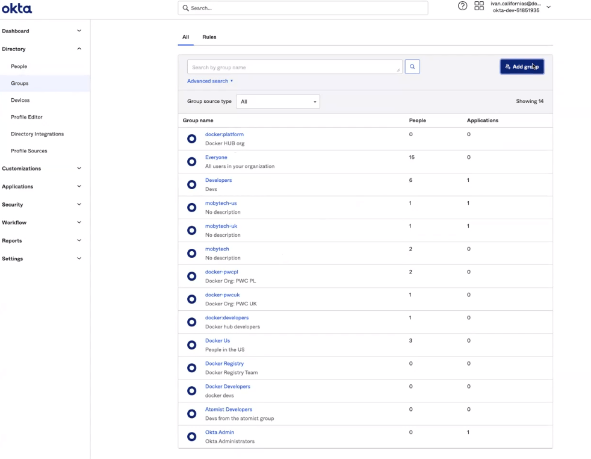
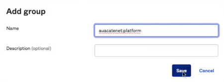
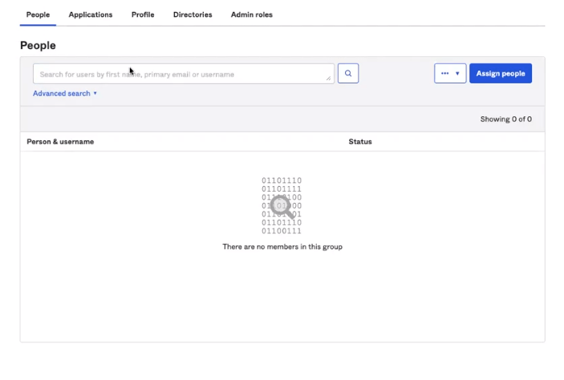
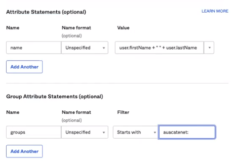
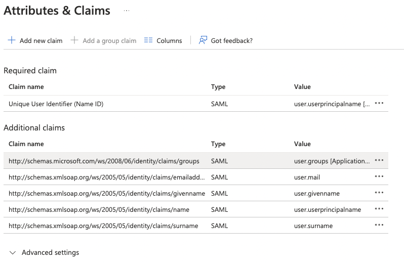

## Okta SSO group mapping

Use directory groups to team provisioning from your identity provider, and these updates will sync with your Docker organizations and teams.
To correctly assign your users to Docker teams, you must create groups in your IDP following the naming pattern <organization>:<team>. For example, if you want to manage provisioning for the team “developers” in Docker, and your organization name is “moby,” you must create a group in your IDP with the name “moby:developers”. Once you enable group mappings in your connection, users assigned to that group in your IDP will automatically be added to the team “developers” in Docker.

Users are added to Docker Hub once they sign in. If they're already signed in, they must sign out and sign back in to see the changes.

   > **Note**
   >
   > Use the same names for the Docker teams as your group names in the IdP to prevent further configuration. When you sync groups, a group is created if it doesn't already exist.

1. In **Okta**, navigate to the directory and select **Group**.
2. Select **Add Group**, and type the name of your organization and team.

    > **Note**
    >
    > For example, **auacatenet:platform** (your organization:your team). This connects all of your teams in Docker to your groups in Okta.

    {: width="700px" }

    {: width="500px" }

3. In your group, select **Assign people** to add your users to the group.

    {: width="700px" }

4. Navigate to **Applications**, configure your application and select **General**.
5. Select **Next**, update the value for **Group Attribute Statements** (optional) and filter for **Group Attribute Statements**. Note it's recommended to specify a filter, so the groups relevant to your Docker organization and teams are shared with the Docker app.

    {: width="700px" }

6. Select **Next** and **Finish** to complete the configuration.

    > **Note**
    >
    > Once completed, when your user signs in to Docker through SSO, the user is automatically added to the organizations and teams mapped in the group attributes.

## Azure AD SSO group mapping

1. Navigate to **Enterprise application**, and select your application.
2. Select **Single-sign on** and **Attributes and Claims**.
3. Select **Add a group claim** and select groups assigned to the application.
4. In the **Source attribute**, select **Cloud-only group display name (Preview)** and **Save**. Note, you can filter the groups you want to share with the application as an option.

    {: width="700px" }

## OneLogin SSO group mapping

1. In **OneLogin**, navigate to **Applications** and select **Add App**.
2. Search and select **SCIM Provisioner with SAML (SCIM v2 Enterprise, SCIM2 PATCH for Groups**.
3. Navigate to **Configuration** and update the **Display Name**. You can also add an icon. 
4. Navigate to **Configuration**, in the **Application details** field, paste the **SAML Audience URL** (Entity URL) and **SAML Consumer URL** (ACS URL).
5. In the **API Connection**, update the **SCIM Base URL** and **SCIM Bearer Token** (API Token).
6. Copy the **SCIM JSON Template** and paste it into the **Custom Header** field and select **Save**.
7. Navigate to **SSO** and copy the **SAML 2.0 Endpoint (HTTP)** and paste it into the **SAML Sign-on URL** field in your Docker Hub SSO connection. 
8. In OneLogin, copy the **X.509 Certificate** and paste it into your Docker Hub SSO connection.
9. Continue with the on-screen instructions and select **Update Connection**.
10. In OneLogin, navigate to **Configuration**, **API connection**, and select  **Enable**. This confirms that the parameters are correct when enabled.
11. Navigate to **Provisioning**, select **Enable provisioning**, and clear the other options.
12. Select **Suspend** when users are deleted in OneLogin or when user accounts are suspended and select **Save**.
13. Navigate to **Parameters**, select **Group** and select **Include in User Provisioning** and select **Save**. This enables SCIM provisioning for groups.

### Okta group mapping

1. Navigate to **Applications**, select **Add Application and SCIM v2 Core**.
2. In the **Display Name** type **Docker Hub**. Note, the field is case sensitive.
3. Navigate to **Parameters**, select **Add**, type **Groups** and update the **SAML assertion**, **Multi-value parameter**, and select **Save**.
4. In **Default**, select **User Roles** and **No transform (Single value output)**.
5. Select **Include in SAML assertion**, and select **Save**.

In OneLogin, the groups are assigned to roles. Note, you manage your teams and groups through the roles.
