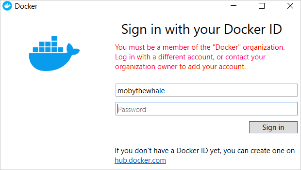

Image Access Management is a new feature that is a part of the Docker Business subscription. This feature allows Organization owners to control which types of images (Docker Official Images, Docker Verified Publisher Images, Community images) their developers can pull from Docker Hub.

For example, a developer, who is part of an organization, building a new containerized application could accidentally use an untrusted, community image as a component of their application. This image could be malicious and pose a security risk to the company. Using Image Access Management, the Organization owner could ensure that the developer can only access trusted content like Docker Official Images, Docker Verified Publisher Images, or the Organization’s own images, preventing such a risk.

## Configure Image Access Management permissions

The following video walks you through the process of configuring Image Access Management permissions.

<iframe width="560" height="315" src="https://www.youtube-nocookie.com/embed/phFp0iqzwRQ" frameborder="0" allow="accelerometer; autoplay; encrypted-media; gyroscope; picture-in-picture" allowfullscreen></iframe>

### Detailed instructions

To configure Image Access Management permissions, perform the following steps:

1. Log into your [Docker Hub](https://hub.docker.com){: target="_blank" rel="noopener" class="_"} account as an organization administrator.
2. Select an organization, and navigate to the **Settings** tab on the **Organizations** page and click Org Permissions.

    {:width="700px"}

3. Enable Image Access Management to set the permissions for the following categories of images you can manage:
- **Organization Images**: When Image Access Management is enabled, images from your organization are always allowed. These images can be public or private created by members within your organization.
- **Docker Official Images**: A curated set of Docker repositories hosted on Hub. They provide OS repositories, best practices for Dockerfiles, drop-in solutions, and applies security updates on time.
- **Docker Verified Publisher Images**: published by Docker partners that are part of the Verified Publisher program and are qualified to be included in the developer secure supply chain. You can set permissions to **Allowed** or **Restricted**.
- **Community Images**: Images are always disabled when Image Access Management is enabled. These images are not trusted because various Docker Hub users contribute them and pose security risks.

    > **Note**
    >
    > Image Access Management is set to Disabled by default. However, member(s) of the `owners` Team in your Organization have access to all images regardless of the settings.

4. Select the category restrictions for your images by clicking **Allowed**.
5. Once the restrictions are applied, your members can view the Org permissions page in a read-only format.

## Enforce authentication

To ensure that each org member uses images in a safe and secure environment, you
can perform the following steps below to enforce sign-in under your
organization. To do this:

1. Download the latest version of Docker Desktop, and then
2. Create a `registry.json` file.

Download Docker Desktop 4.0 or a later release.

- [Download and install for Windows](/desktop/install/windows-install)
- [Download and install for Mac](/desktop/install/mac-install/)
- [Download and install for Linux](/desktop/install/linux-install)



## Verify the restrictions

   To confirm that the restrictions are successful, have each org member pull an image onto their local computer after signing into Docker Desktop. If they are unable to sign in, they will receive an error message.

   For example, if you enable Image Access Management, your members can pull an Organization Image, Docker Official Image, or Verified Publisher Image onto their local machine. If you disable the restrictions, your members can pull any image, including Community Images.

   {:width="700px"}
