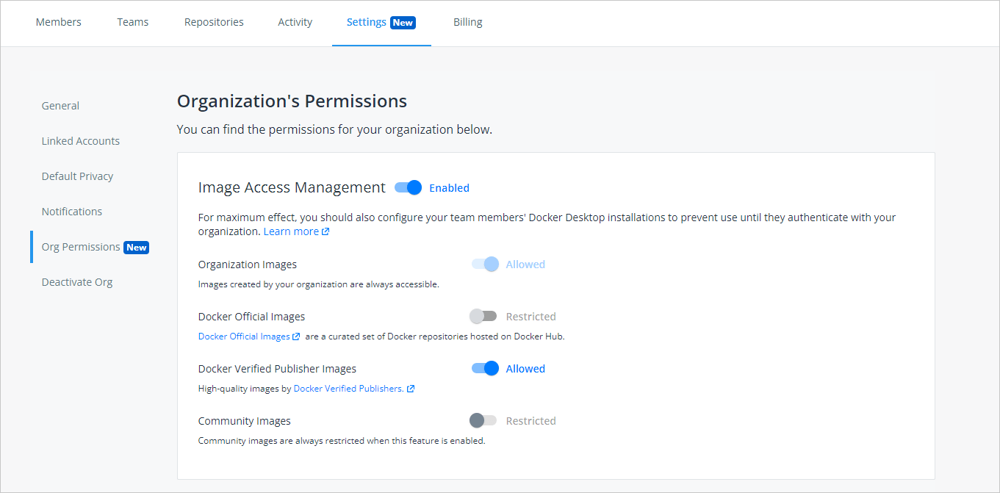

Image Access Management is a new feature that is a part of the Docker Business subscription. This feature allows Organization owners to control which types of images (Docker Official Images, Docker Verified Publisher Images, Community images) their developers can pull from Docker Hub.

For example, a developer, who is part of an organization, building a new containerized application could accidentally use an untrusted, community image as a component of their application. This image could be malicious and pose a security risk to the company. Using Image Access Management, the Organization owner could ensure that the developer can only access trusted content like Docker Official Images, Docker Verified Publisher Images, or the Organization’s own images, preventing such a risk.


## Configure Image Access Management permissions

1. Log into your [Docker Hub](https://hub.docker.com) account as an organization administrator.
2. Select an organization, and navigate to the **Settings** tab on the **Organizations** page and click Org Permissions.

    {:width="700px"}

3. Enable Image Access Management to set the permissions for the following categories of images you can manage:
- **Organization Images**: When Image Access Management is enabled, images from your organization are always allowed. These images can be public or private created by members within your organization.
- **Docker Official Images**: A curated set of Docker repositories hosted on Hub. They provide OS repositories, best practices for Dockerfiles, drop-in solutions, and applies security updates on time.
- **Docker Verified Publisher Images**: published by Docker partners that are part of the Verified Publisher program and are qualified to be included in the developer secure supply chain. You can set permissions to **Allowed** or **Restricted**.
- **Community Images**: Images are always disabled when Image Access Management is enabled. These images are not trusted because various Docker Hub users contribute them and pose security risks.

    > **Note**
    >
    > Image Access Management is set to Disabled by default. However, member(s) of the `owners` Team in your Organization have access to all images regardless of the settings.

4. Select the category restrictions for your images by clicking **Allowed**.
5. Once the restrictions are applied, your members can view the Org permissions page in a read-only format.

To ensure that each org member uses images in a safe and secure environment, you can  perform the following steps below to enforce sign-in under your organization.

1. Download Docker Desktop 4.0 or a later release.

    - [Download and install for Windows](/desktop/windows/install/)
    - [Download and install for Mac](/desktop/mac/install/)

    > **Note**
    >
    > There currently is no Docker Desktop for Linux. Linux users will have the same restrictions as Mac and Windows users while logged in, but there is currently no way to require them to log in.

2. Create a registry.json file on Windows or Mac.

    For **Windows**:

    Create a file `C:\ProgramData\DockerDesktop\registry.json` with file permissions that ensure that the developer using Docker Desktop cannot remove or edit the file (i.e., only the system administrator can write to the file). The file must be JSON and contain one or more organization names in the `allowedOrgs` key.

    To create your registry.json file:

    1. Open Windows Powershell and select Run as Administrator.
    2. Type the following command: `cd /ProgramData/DockerDesktop/`
    3. In Notepad, type `registry.json` and enter one or more organization names in the `allowedOrgs` key and click Save.

        Example:

        ```json
        {
         "allowedOrgs": ["mycompany"]
         }
        ```
    4. Navigate to Powershell and type ```start .```

        Congratulations, you have just created the registry.json file.

    For **macOS**:

    Create a file `/Library/Application Support/com.docker.docker/registry.json` with file permissions that ensure that the developer using Docker Desktop cannot remove or edit the file (i.e., only the system administrator can write to the file). The file must be JSON and contain one or more organization names in the `allowedOrgs` key. The user must sign in and be a member of at least one of the organizations before using Docker Desktop.

    To create your registry.json file:
    1. Navigate to VS Code or any text editor of your choice.
    2. Enter one or more organization names in the `allowedOrgs` key and save it in your Documents.

        Example:

       ```json
        {
          "allowedOrgs": ["mycompany"]
        }
        ```

    3. Open a new terminal and type the following command:

         `sudo mkdir -p /Library/Application\ Support/com.docker.docker`

        Note: if prompted, type your password associated with your local computer.

    4. Type the following command:

        `Documents/registry.json /Library/Application\ Support/com.docker.docker/registry.json`

        Congratulations, you have just created the registry.json file.

    5. Members of your organization are now required to log into Docker Desktop using their org credentials. To confirm that the restrictions are successful, enable the Image Access Management feature and verify with each org member on their local machine.

    > **Note**:
    >
    > Each member can test the restrictions by pulling an image from Hub
    onto their local machine. If you have enabled the restrictions in Hub, your
    member can pull the image. If you disable the restrictions in Hub,
    an error message will display, and your member is denied the pull access.