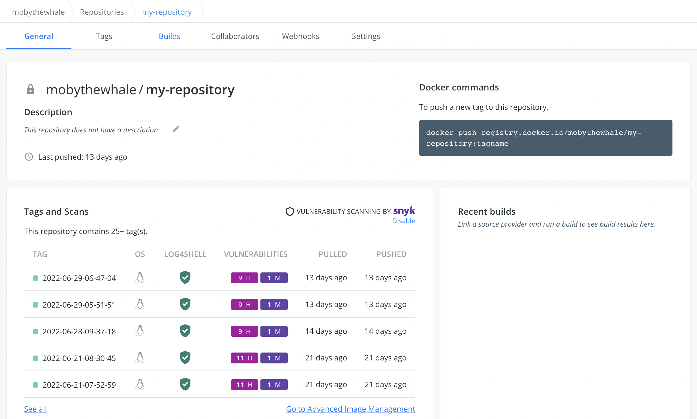
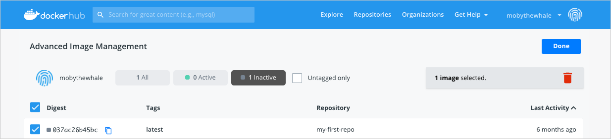

{% include upgrade-cta.html
  body="Docker Pro, Team, and Business users can now use Docker Hub's **Advanced Image Management** dashboard. The dashboard enables a new level of access to your content, allowing fine-grained pruning of old data and exploration of old versions of pushed images. Upgrade now to start using the Advanced Image Management dashboard."
  header-text="This feature requires a paid Docker subscription"
  target-url="https://www.docker.com/pricing?utm_source=docker&utm_medium=webreferral&utm_campaign=docs_driven_upgrade_image-mgmt"
%}

The **Advanced Image Management** dashboard allows you to manage Docker images across all repositories. [Upgrade](https://www.docker.com/pricing?utm_source=docker&utm_medium=webreferral&utm_campaign=docs_driven_upgrade){: target="_blank" rel="noopener" class="_"} your existing subscription to start using the Advanced Image Management dashboard.

The Advanced Image Management dashboard provides a snapshot of your existing images and allows you to view, sort, and filter images by tags, activity status, and date, and contains options to clean up your workspace by deleting images that are no longer required.

The dashboard provides visibility into the status of the images in your repository and allows you to reduce the number of images stored in Docker Hub by reviewing their active status. An image retains its 'active' status if it is pulled or pushed in the last month. If there isn’t any activity on the image in the last month, it is considered 'inactive'.

By displaying the activity status and tags, the dashboard makes it easier for you to review the existing images and take actions to delete images that are not needed anymore. This is particularly helpful when your repository contains a lot of images that you have pushed over time, and you are now trying to streamline storage in Docker Hub.

The dashboard also displays the old versions of images you have pushed. When you push an image to Docker Hub, you push a manifest, a list of all the layers of your image, and the layers themselves. When you update an existing tag, only the new layers are pushed, along with the new manifest which references these layers. This new manifest gets the tag you specify when you push the image, such as `myNamespace/mytag:latest`. This does not remove the old manifests or the unique layers referenced by them from Hub. You can still use and reference these using the digest of the manifest if you know the SHA.

With the new Advanced Image Management dashboard, all of this is now simpler and accessible for you to browse, use, and clean up.

To access the  Advanced Image Management dashboard:

1. Log in to [Docker Hub](https://hub.docker.com){: target="_blank" rel="noopener" class="_"}.
2. Click **Repositories** from the main menu and select a repository from the list.
3. Click **General** or **Tags**, and click **Go to Advanced Image Management**.

   {:width="700px"}

4. In the dashboard you can sort and filter by active, inactive and untagged images.

    > **Note**
    >
    > You must be logged in as a Docker Pro, Team, or a Business user to use the Advanced Image Management dashboard. Click [Upgrade](https://www.docker.com/pricing?utm_source=docker&utm_medium=webreferral&utm_campaign=docs_driven_upgrade){: target="_blank" rel="noopener"class="_"} to upgrade your existing subscription.

## View images

The Advanced Image Management dashboard provides a snapshot of your existing images and allows you to view images by tags, activity status and date, and also allows you to clean up your workspace by deleting images that are no longer required.

{:width="700px"}

## Delete images

You must be logged in as a Docker Pro, Team, or a Business user and have admin access to the repository to delete images. By default, the Advanced Image Management dashboard displays inactive images in the repository.

To delete an inactive image:

1. Log in to [Docker Hub](https://hub.docker.com){: target="_blank" rel="noopener" class="_"}.
2. Click **Repositories** from the main menu and select a repository from the list.
3. Click **General** or **Tags**, and click **Go to Advanced Image Management**.
4. Enable the **Inactive** filter to view your inactive tags.

    {:width="700px"}

5. Select the images that you want to delete from the repository and click the delete icon.

### Deleting a tagged image

A Docker image can contain multiple tags. A ‘tag’ refers to a combination of artifacts or labels associated with the image. When you attempt to delete a tagged image, it deletes the tag associated with the image. This means, if there are any untagged images in your repository that previously held the same tag, those images will also be deleted even if they are not inactive. Therefore, you must be careful when deleting tagged images.

For example, let's assume that Image-A is tagged as ‘latest’. You push another image, Image-B, and tag it as the new 'latest'. If you now delete Image-B, the 'latest' tag will be deleted, along with all images it previously referred to. However, if those images are tagged by another tag - in this case, if Image-B is also tagged with '1.5.0', for example, that tag would prevent its deletion.

## Advanced Image Management API

The Advanced Image Management API endpoints allow you to manage Docker images across all repositories. For more information, see [Advanced Image management API](../api/latest/).

## Feedback

Thank you for trying out the Advanced Image Management dashboard. Your feedback is very important to us. Let us know your feedback by creating an issue in the [hub-feedback](https://github.com/docker/hub-feedback/issues){: target="_blank" rel="noopener" class="_"} GitHub repository.
