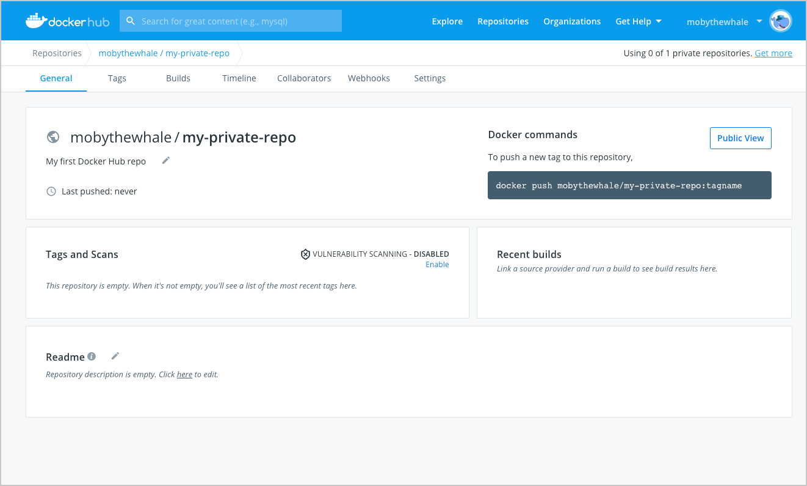
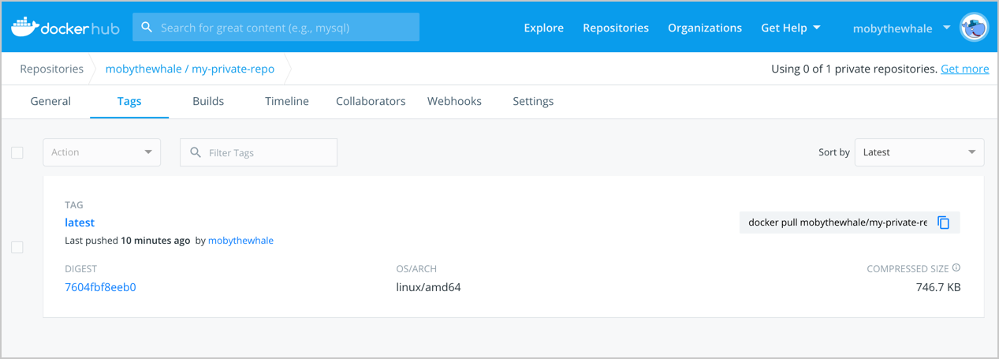

[Docker Hub](https://hub.docker.com) is a service provided by Docker for
finding and sharing container images with your team. It provides the following
major features:
* [Repositories](repos.md): Push and pull container images.
* [Teams & Organizations](orgs.md): Manage access to private
repositories of container images.
* [Official Images](official_images.md): Pull and use high-quality
container images provided by Docker.
* [Publisher Images](publish/customer_faq.md): Pull and use high-
quality container images provided by external vendors.
* [Builds](builds/index.md): Automatically build container images from
GitHub and Bitbucket and push them to Docker Hub.
* [Webhooks](webhooks.md): Trigger actions after a successful push
  to a repository to integrate Docker Hub with other services.


### Step 1: Sign up for Docker Hub

Start by [creating an account](https://hub.docker.com/signup).

### Step 2: Create your first repository

To create a repo:

1. Sign in to [Docker Hub](https://hub.docker.com).

2. Click on **Create a Repository** on the Docker Hub welcome page:

    

3. Name it **&lt;your-username&gt;/my-first-repo** as shown below. Select
   **Private**:

    

    You've created your first repo. You should see:

    

### Step 3: Download and install Docker Desktop

We'll need to download Docker Desktop to build and push a container image to
Docker Hub.

1. Download and install [Docker Desktop](https://docker.com/get-started). If on
Linux, download [Docker Engine - Community](https://hub.docker.com/search?type=edition&offering=community).

2. Open the terminal and sign in to Docker Hub on your computer by running
   `docker login`.

### Step 4: Build and push a container image to Docker Hub from your computer

1. Start by creating a [Dockerfile](https://docs.docker.com/engine/reference/builder/)
to specify your application as shown below:
```shell
cat > Dockerfile <<EOF
FROM busybox
CMD echo "Hello world! This is my first Docker image."
EOF
```

2. Run `docker build -t <your_username>/my-first-repo .` to build your Docker
   image.

3. Test your docker image locally by running `docker run <your_username>/my-first-repo`.

4. Run `docker push <your_username>/my-first-repo` to push your Docker image to
Docker Hub.

    You should see output similar to:

    

    And in Docker Hub, your repository should have a new `latest` tag available
    under **Tags**:

    

Congratulations! You've successfully:
- Signed up for Docker Hub
- Created your first repository
- Built a Docker container image on your computer
- Pushed it to Docker Hub

### Next steps

- Create an [organization](orgs.md) to use Docker Hub with your team.
- Automatically build container images from code through [builds](builds/index.md).
- [Explore](https://hub.docker.com/explore) official & publisher images.
- [Upgrade your plan](upgrade.md) to push additional private Docker images to
Docker Hub.
