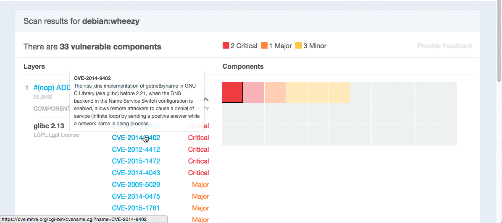

The Docker [Official Repositories](https://hub.docker.com/official/) are a
curated set of Docker repositories hosted on Docker Hub. They are
designed to:

* Provide essential base OS repositories (for example,
  [ubuntu](https://hub.docker.com/_/ubuntu/),
  [centos](https://hub.docker.com/_/centos/)) that serve as the
  starting point for the majority of users.

* Provide drop-in solutions for popular programming language runtimes, data
  stores, and other services, similar to what a Platform-as-a-Service (PAAS)
  would offer.

* Exemplify [`Dockerfile` best practices](/engine/userguide/eng-image/dockerfile_best-practices/)
  and provide clear documentation to serve as a reference for other `Dockerfile`
  authors.

* Ensure that security updates are applied in a timely manner. This is
  particularly important as many Official Repositories are some of the most
  popular on Docker Hub.

Docker, Inc. sponsors a dedicated team that is responsible for reviewing and
publishing all content in the official repositories. This team works in
collaboration with upstream software maintainers, security experts, and the
broader Docker community.

While it is preferable to have upstream software authors maintaining their
corresponding Official Repositories, this is not a strict requirement. Creating
and maintaining images for Official Repositories is a public process. It takes
place openly on GitHub where participation is encouraged. Anyone can provide
feedback, contribute code, suggest process changes, or even propose a new
Official Repository.

## Should I use Official Repositories?

New Docker users are encouraged to use the Official Repositories in their
projects. These repositories have clear documentation, promote best practices,
and are designed for the most common use cases. Advanced users are encouraged to
review the Official Repositories as part of their `Dockerfile` learning process.

A common rationale for diverging from Official Repositories is to optimize for
image size. For instance, many of the programming language stack images contain
a complete build toolchain to support installation of modules that depend on
optimized code. An advanced user could build a custom image with just the
necessary pre-compiled libraries to save space.

A number of language stacks such as
[python](https://hub.docker.com/_/python/) and
[ruby](https://hub.docker.com/_/ruby/) have `-slim` tag variants
designed to fill the need for optimization. Even when these "slim" variants are
insufficient, it is still recommended to inherit from an Official Repository
base OS image to leverage the ongoing maintenance work, rather than duplicating
these efforts.

## How do I know the Official Repositories are secure?

Each of the images in the Official Repositories is scanned using Docker Cloud's
[Security Scanning service](/docker-cloud/builds/image-scan/). The results of
these security scans provide valuable information about which images contain
security vulnerabilities, and allow you to choose images that align with your
security standards.

To view the Docker Security Scanning results:

1. Make sure you're logged in to Docker Hub.
    You can view Official Images even while logged out, however the scan results are only available once you log in.
2. Navigate to the official repository whose security scan you want to view.
3. Click the `Tags` tab to see a list of tags and their security scan summaries.
    

You can click into a tag's detail page to see more information about which
layers in the image and which components within the layer are vulnerable.
Details including a link to the official CVE report for the vulnerability appear
when you click an individual vulnerable component.

## How can I get involved?

All Official Repositories contain a **User Feedback** section in their
documentation which covers the details for that specific repository. In most
cases, the GitHub repository which contains the Dockerfiles for an Official
Repository also has an active issue tracker. General feedback and support
questions should be directed to `#docker-library` on Freenode IRC.

## How do I create a new Official Repository?

From a high level, an Official Repository starts out as a proposal in the form
of a set of GitHub pull requests. Detailed and objective proposal
requirements are documented in the following GitHub repositories:

* [docker-library/official-images](https://github.com/docker-library/official-images)

* [docker-library/docs](https://github.com/docker-library/docs)

The Official Repositories team, with help from community contributors, formally
review each proposal and provide feedback to the author. This initial review
process may require a bit of back and forth before the proposal is accepted.

There are also subjective considerations during the review process. These
subjective concerns boil down to the basic question: "is this image generally
useful?" For example, the [python](https://hub.docker.com/_/python/)
Official Repository is "generally useful" to the large Python developer
community, whereas an obscure text adventure game written in Python last week is
not.

Once a new proposal is accepted, the author is responsible for keeping
their images up-to-date and responding to user feedback. The Official
Repositories team becomes responsible for publishing the images and
documentation on Docker Hub. Updates to the Official Repository follow the same
pull request process, though with less review. The Official Repositories team
ultimately acts as a gatekeeper for all changes, which helps mitigate the risk
of quality and security issues from being introduced.
