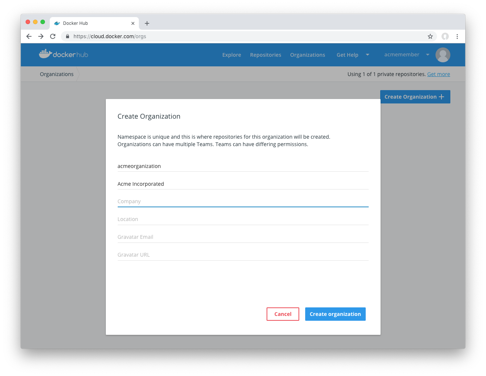
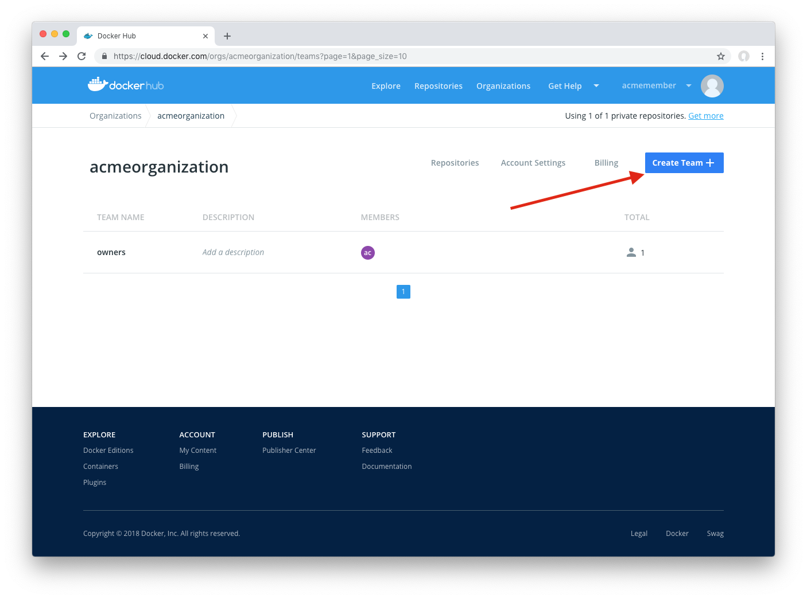
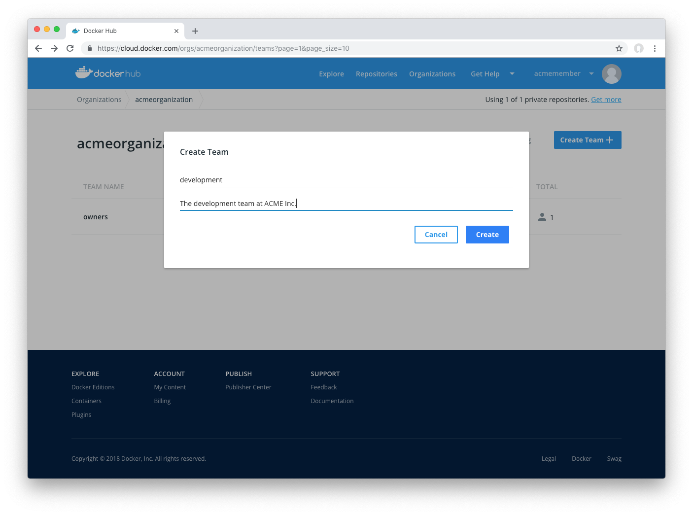
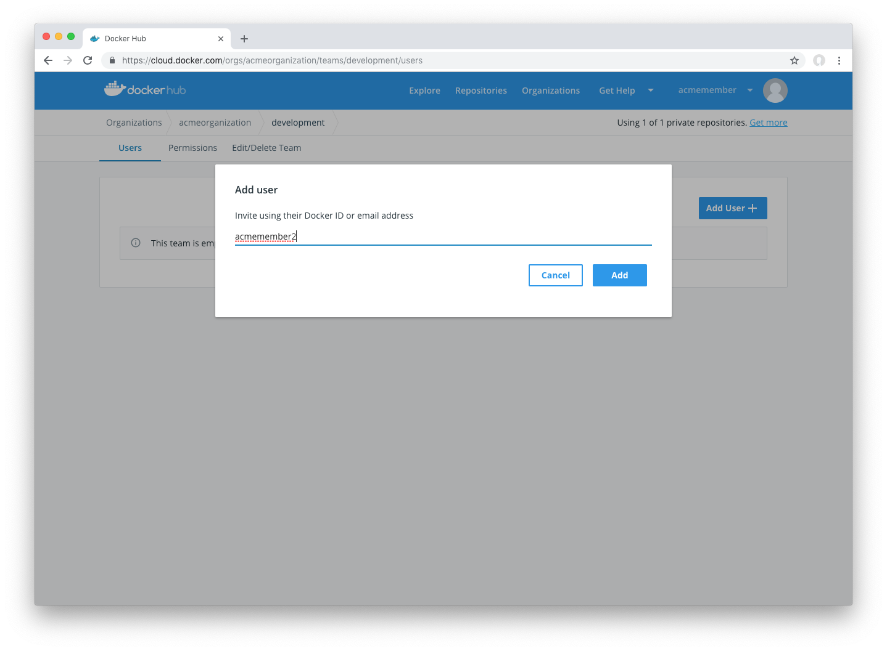
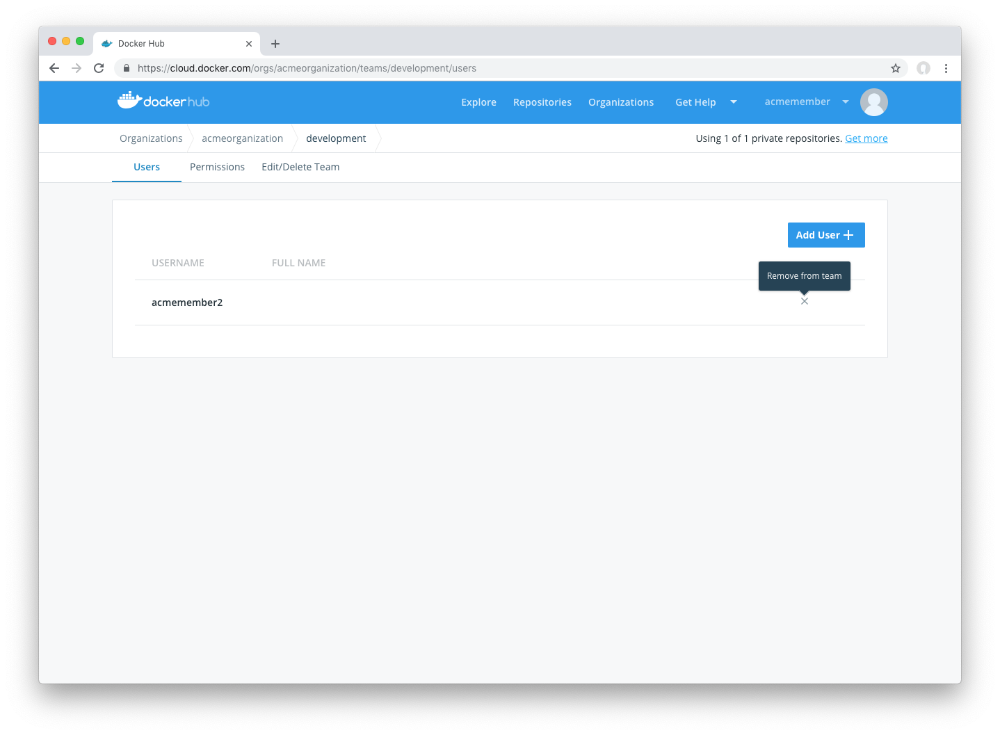
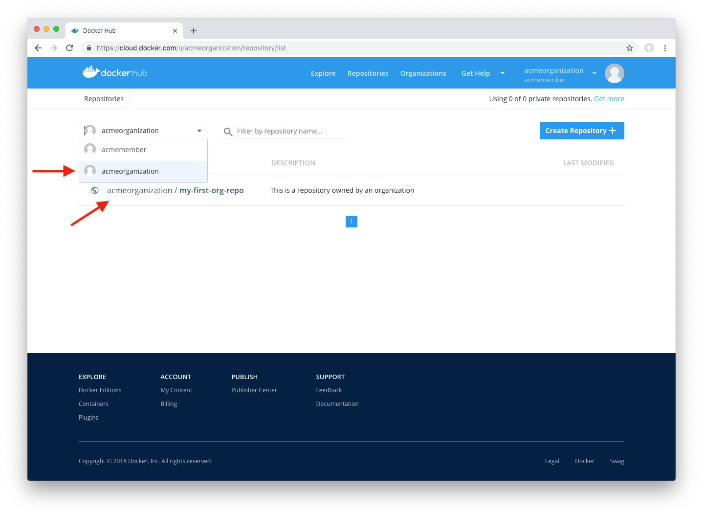
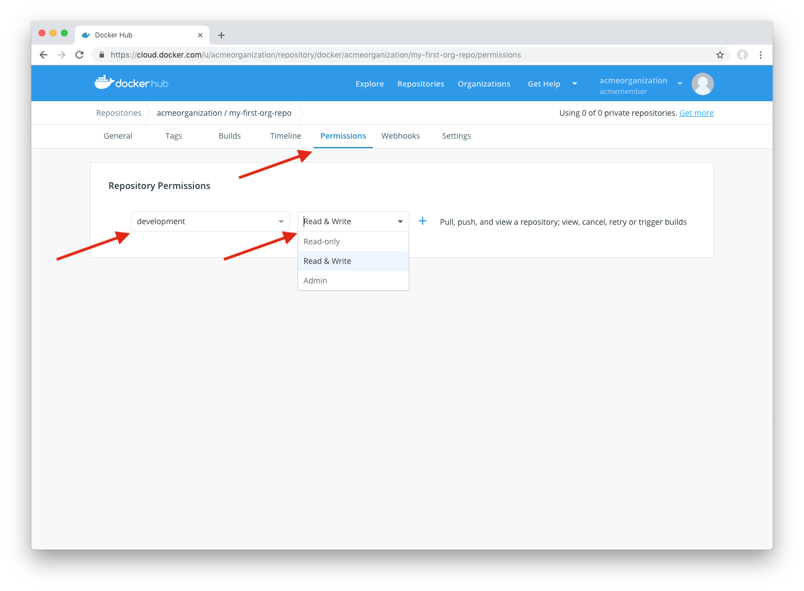
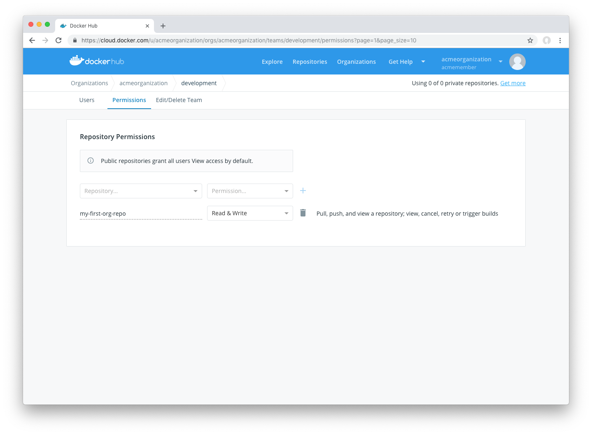

Docker Hub Organizations let you create teams so you can give your team access to shared image repositories.

### How Organizations & Teams Work

- **Organizations** are a collection of teams and repositories that can be managed together.
- **Teams** are groups of Docker Hub users that belong to your organization.

> **Note**: in Docker Hub, users cannot be associated directly to an organization. They belong only to teams within an organization.

### Creating an organization

1. Start by clicking on [Organizations](https://cloud.docker.com/orgs) in Docker Hub
2. Click on "Create Organization"
3. Provide information about your organization:

You've created an organization. You'll see you have a team, the **owners** team with a single member (you!)

### The owners team

The **owners** team is a special team that has full access to all repositories in the Organization.

Members of this team can:
- Manage Organization settings and billing
- Create a team and modify the membership of any team
- Access and modify any repository belonging to the Organization

### Creating a team

To create a team:

1. Go to your organization by clicking on **Organizations** in Docker Hub, and select your organization.
2. Click **Create Team** 
3. Fill out your team's information and click **Create** 

### Adding a member to a team

1. Visit your team's page in Docker Hub. Click on **Organizations** > **_Your Organization_** > **_Your Team Name_**
2. Click on **Add User**
3. Provide the user's Docker ID username _or_ email to add them to the team 

> **Note**: you are not automatically added to teams created by your organization.

### Removing team members

To remove a member from a team, click the **x** next to their name:

### Giving a team access to a repository

To provide a team access to a repository:

1. Visit the repository list on Docker Hub by clicking on **Repositories**
2. Select your organization in the namespace dropdown list
3. Click the repository you'd like to edit 
4. Click the **Permissions** tab
5. Select the team, permissions level (more on this below) and click **+**
6. Click the **+** button to add 

### Viewing a team's permissions for all repositories

To view a team's permissions over all repos:
1. Click on **Organizations**, then select your organization and team.
2. Click on the **Permissions** tab where you can view which repositories this team has access to 

### Permissions Reference

Permissions are cumulative. For example, if you have Write permissions, you
automatically have Read permissions:

- `Read` access allows users to view, search, and pull a private repository in the same way as they can a public repository.
- `Write` access allows users to push to repositories on Docker Hub.
- `Admin` access allows users to modify the repositories "Description", "Collaborators" rights, "Public/Private" visibility and "Delete".

> **Note**: A User who has not yet verified their email address only has
> `Read` access to the repository, regardless of the rights their team
> membership has given them.
