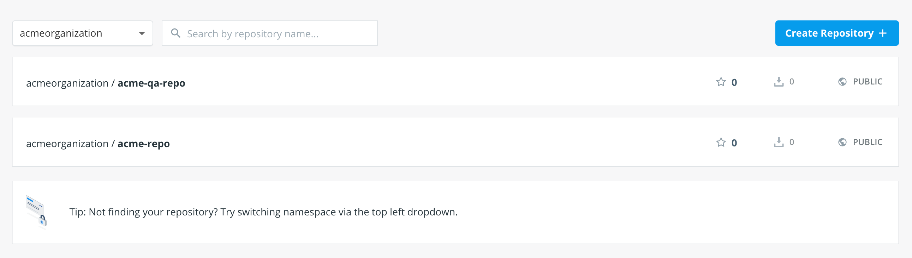
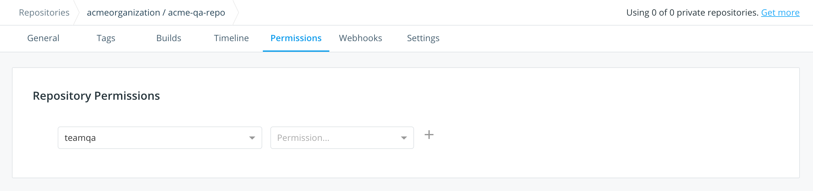
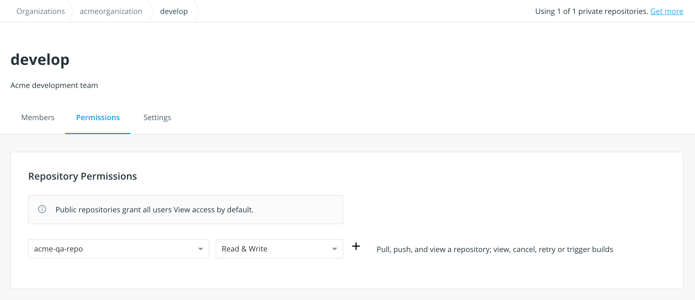

Docker Hub organizations let you create teams so you can give your team access
to shared image repositories.

- **Organizations** are collections of teams and repositories that can be managed together.
- **Teams** are groups of Docker Hub users that belong to an organization.

> **Note:** in Docker Hub, users cannot belong directly to an organization.
They belong only to teams within an organization.

<iframe width="560" height="315" src="https://www.youtube-nocookie.com/embed/G7lvSnAqed8" frameborder="0" allow="accelerometer; autoplay; encrypted-media; gyroscope; picture-in-picture" allowfullscreen></iframe>

## Working with organizations

### Create an organization

<iframe width="560" height="315" src="https://www.youtube-nocookie.com/embed/b0TKcIqa9Po" frameborder="0" allow="accelerometer; autoplay; encrypted-media; gyroscope; picture-in-picture" allowfullscreen></iframe>

1. Start by clicking on **[Organizations](https://hub.docker.com/orgs)** in
Docker Hub.

2. Click on **Create Organization**.

3. Provide information about your organization.

You've created an organization. You'll see you have a team, the **owners** team
with a single member (you!).

#### The owners team

The **owners** team is a special team that has full access to all repositories
in the organization.

Members of this team can:
- Manage organization settings and billing
- Create a team and modify the membership of any team
- Access and modify any repository belonging to the organization

### Access an organization

You can't _directly_ log into an organization. This is especially important to note if you create an organization by converting a user account, as conversion means you lose the ability to log into that "account", since it no longer exists.

To access an organization:

1. Log into Docker Hub with a user account that is a member of any team in the organization.

    > If you want access to organization settings, this account has to be part of the **owners** team.

2. Click **Organizations** in the top navigation bar, then choose your organization from the list.

If you don't see the organization, then you are neither a member or an owner of it. An organization administrator will need to add you as a member of the organization team.

## Working with teams and members

<iframe width="560" height="315" src="https://www.youtube-nocookie.com/embed/MROKmtmWCVI" frameborder="0" allow="accelerometer; autoplay; encrypted-media; gyroscope; picture-in-picture" allowfullscreen></iframe>

### Create a team

<iframe width="560" height="315" src="https://www.youtube-nocookie.com/embed/78wbbBoasIc" frameborder="0" allow="accelerometer; autoplay; encrypted-media; gyroscope; picture-in-picture" allowfullscreen></iframe>

1. Go to **Organizations** in Docker Hub, and select your organization.

2. Open the **Teams** tab and click **Create Team**.

3. Fill out your team's information and click **Create**.

### Add a member to a team

You can add a member to a team in one of two ways.

If the user isn't in your organization:

1. Go to **Organizations** in Docker Hub, and select your organization.

2. Click **Add Member**.

3. Enter the user's Docker ID or email, and select a team from the drop-down list.

4. Click **Add** to confirm.

If the user already belongs to another team in the organization:

1. Open the team's page in Docker Hub: **Organizations** > **_Your Organization_** > **Teams** > **_Your Team Name_**

2. Click **Add user**.

3. Enter the user's Docker ID or email to add them to the team.

      > **Note**: You are not automatically added to teams created by your organization.

### Remove team members

To remove a member from all teams in an organization:

1. Go to **Organizations** in Docker Hub, and select your organization. The Organizations page lists all team members.

2. Click the **x** next to a member’s name to remove them from all the teams in the organization.

3. When prompted, click **Remove** to confirm the removal.

To remove a member from a specific team:

1. Go to **Organizations** in Docker Hub, and select your organization.

2. Click on the **Teams** tab and select the team from the list.

3. Click the **x** next to the user's name to remove them from the team.

4. When prompted, click **Remove** to confirm the removal.
to confirm the removal.

### Give a team access to a repository

1. Visit the repository list on Docker Hub by clicking on **Repositories**.

2. Select your organization in the namespace dropdown list.

3. Click the repository you'd like to edit.

      

4. Click the **Permissions** tab.

5. Select the team, the [permissions level](#permissions-reference), and click **+** to save.

      

### View a team's permissions for all repositories

To view a team's permissions over all repos:

1. Open **Organizations** > **_Your Organization_** > **Teams** > **_Team Name_**.

2. Click on the **Permissions** tab, where you can view the repositories this team can access.

      

You can also edit repository permissions from this tab.

### Permissions reference

Permissions are cumulative. For example, if you have Write permissions, you
automatically have Read permissions:

- `Read` access allows users to view, search, and pull a private repository in the same way as they can a public repository.
- `Write` access allows users to push to repositories on Docker Hub.
- `Admin` access allows users to modify the repositories "Description", "Collaborators" rights, "Public/Private" visibility, and "Delete".

> **Note**: A User who has not yet verified their email address only has
> `Read` access to the repository, regardless of the rights their team
> membership has given them.
